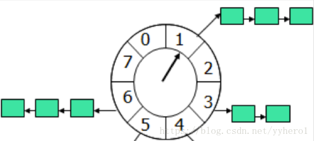
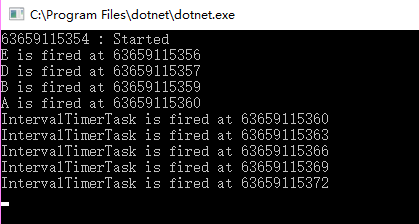

问题引入：在mmorpg游戏中，群战的时候，玩家释放技能，这时候会出现技能冷却时间，每一个技能都是一个定时器，或者在slg游戏中，玩家修建房屋，创建基地，都会产生一个延时操作，等到了指定时间后，完成房屋修建等任务！！！！！

轮询的尴尬：使用一个定时器，定时遍历多个链表，判定链表里面的任务是否到期！ 效率低下,每一次遍历都需要筛选定时器，时间复杂度O（n）.

多定时器的尴尬：同时创建多个定时器，每个定时器绑定到期任务，多定时器，会加大cpu的负荷，且任务的到期时间不同，必定会产生更多的定时器。

解决方案：时间轮的引入



如果所示：将同一时间的任务放在一起，组成一个链表，图中每个格子分别指向这样一个链表，定时器每到期一次，图中的指针移动一格，如此循环往复，当指针指向某个格子，代表这个链表里面的定时器可能到期（注意，这里是可能，因为时间轮是一个循环的圈，比如运行一圈需要时间50s,那么一个100s的定时器，虽然在槽位1的链表中，但是需要时间轮运行两圈，这个定时器才到期）

## A full example

```
/// <summary>
/// Task fired repeatedly
/// </summary>
class IntervalTimerTask : TimerTask
{
    public void Run(Timeout timeout)
    {
        Console.WriteLine($"IntervalTimerTask is fired at {DateTime.UtcNow.Ticks / 10000000L}");
        timeout.Timer.NewTimeout(this, TimeSpan.FromSeconds(2));
    }
}

/// <summary>
/// Task only be fired for one time
/// </summary>
class OneTimeTask : TimerTask
{
    readonly string _userData;
    public OneTimeTask(string data)
    {
        _userData = data;
    }

    public void Run(Timeout timeout)
    {
        Console.WriteLine($"{_userData} is fired at {DateTime.UtcNow.Ticks / 10000000L}");
    }
}


static void Main(string[] args)
{
    HashedWheelTimer timer = new HashedWheelTimer( tickDuration: TimeSpan.FromSeconds(1)
        , ticksPerWheel: 100000
        , maxPendingTimeouts: 0);

    timer.NewTimeout(new OneTimeTask("A"), TimeSpan.FromSeconds(5));
    timer.NewTimeout(new OneTimeTask("B"), TimeSpan.FromSeconds(4));
    var timeout = timer.NewTimeout(new OneTimeTask("C"), TimeSpan.FromSeconds(3));
    timer.NewTimeout(new OneTimeTask("D"), TimeSpan.FromSeconds(2));
    timer.NewTimeout(new OneTimeTask("E"), TimeSpan.FromSeconds(1));

    timeout.Cancel();

    timer.NewTimeout(new IntervalTimerTask(), TimeSpan.FromSeconds(5));
    Console.WriteLine($"{DateTime.UtcNow.Ticks / 10000000L} : Started");
    Console.ReadKey();
}
```

The output of the sample is something like



c# 的实现

-   <https://github.com/wangjia184/HashedWheelTimer>

-   <https://github.com/fanrice123/HashedWheelTimer.NET>
