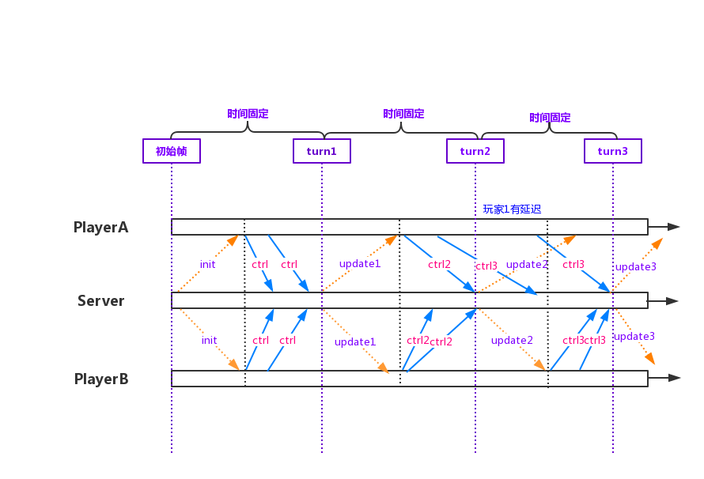
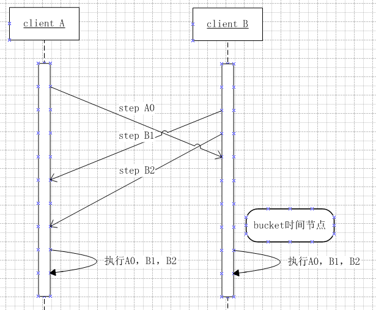
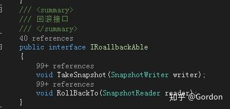
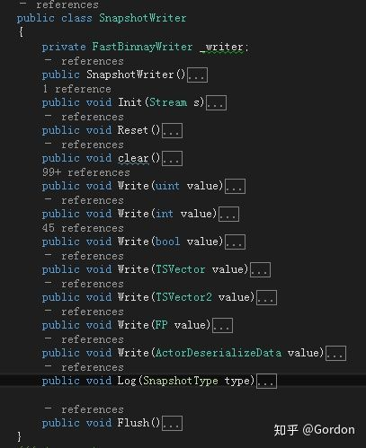
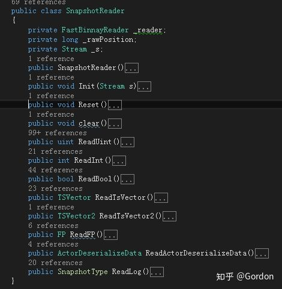
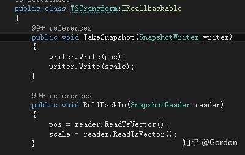
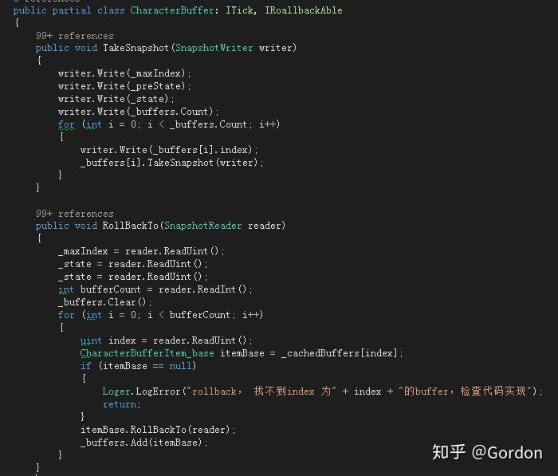
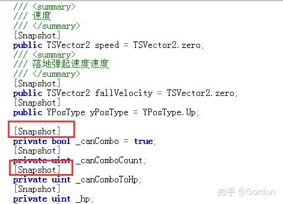
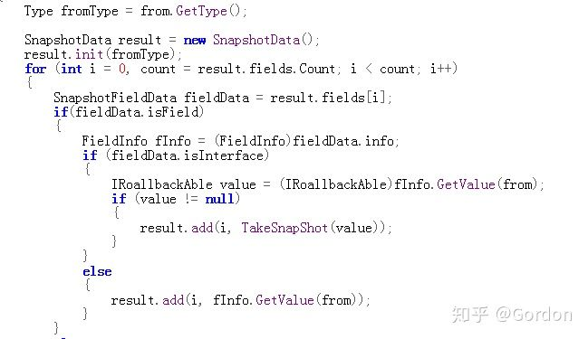

## Lock-Step

1.  我们把游戏的前进分为一帧帧，这里的帧和游戏的渲染帧率并不是一个，只是借鉴了帧的概念，自定义的帧，我们称为turn。游戏的过程就是每一个turn不断向前推进，每一个玩家的turn推进速度一致。

2.  每一帧只有当服务器集齐了所有玩家的操作指令，也就是输入确定了之后，才可以进行计算，进入下一个turn，否则就要等待最慢的玩家。之后再广播给所有的玩家。如此才能保证帧一致。

3.  Lockstep的游戏是严格按照turn向前推进的，如果有人延迟比较高，其他玩家必须等待该玩家跟上之后再继续计算，不存在某个玩家领先或落后其他玩家若干个turn的情况。使用Lockstep同步机制的游戏中，每个玩家的延迟都等于延迟最高的那个人。

4.  由于大家的turn一致，以及输入固定，所以每一步所有客户端的计算结果都一致的。

我们来看看具体的执行流程:

上图中我们可以明显看到，这种囚徒模式的帧同步，在第二帧的时候，因为玩家1有延迟，而导致第二帧的同步时间发生延迟，从而导致所有玩家都在等待，出现卡顿现象

## Bucket Synchronization(乐观锁)

囚徒模式的帧同步，有一个致命的缺陷就是，若联网的玩家有一个网速慢了，势必会影响其他玩家的体验，因为服务器要等待所有输入达到之后再同步到所有的c端。另外如果中途有人掉线了，游戏就会无法继续或者掉线玩家无法重连，因为在严格的帧同步的情况下，中途加入游戏是从技术上来讲是非常困难的。因为你重新进来之后，你的初始状态和大家不一致，而且你的状态信息都是丢失状态的，比如，你的等级，随机种子，角色的属性信息等。 比如玩过早期的冰封王座都知道，一旦掉线基本这局就废了，需要重开，至于为何没有卡顿的现象，因为那时都是解决方案都是采用局域网的方式，所以基本是没有延迟问题的。

后期为了解决这个问题，如今包括王者荣耀，服务器会保存玩家当场游戏的游戏指令以及状态信息，在玩家断线重连的时候，能够恢复到断线前的状态。不过这个还是无法解决帧同步的问题，因为严格的帧同步，是要等到所有玩家都输入之后，再去通知广播client更新，如果A服务器一直没有输入同步过来，大家是要等着的，那么如何解决这个问题？

采用“定时不等待”的乐观方式在每次Interval时钟发生时固定将操作广播给所有用户，不依赖具体每个玩家是否有操作更新。如此帧率的时钟在由服务器控制，当客户端有操作的时候及时的发送服务器，然后服务端每秒钟20-50次向所有客户端发送更新消息。如下图:

上图中，我们看到服务器不会再等到搜集完所有用户输入再进行下一帧，而是按照固定频率来同步玩家的输入信息到每一个c端，如果有玩家网络延迟，服务器的帧步进是不会等待的，比如上图中，在第二帧的时候，玩家A的网速慢，那么他这个时候，会被网速快的玩家给秒了（其他游戏也差不多）。但是网速慢的玩家不会卡到快的玩家，只会感觉自己操作延迟而已。

Bucket Synchronization 是 Lock-Step 的改良算法. 算法流程可以参考下图:

Bucket Synchronization 算法应用于网状网络, 网络中有一个 master 节点(也是 client).

master 在启动之初, 会对所有 client 做网络对时, 计算网络包的超时时间.

master 会设置一个 bucket 时间, 在每个 bucket 时间节点, master 执行收集到的所有 step 指令, 并将更新推送到所有的 client 上. (上图的例子是一个简化流程, 只有俩 client, 没有 master 推送)

master 对收集到的 step 包做超时校验机制, 如果收到的 step 指令包的时间戳, 延迟超过了预设的阈值, 就当作超时包丢弃.

与 Lock-Step 相比, Bucket Synchronization 改进的是: 设置了 bucket 的概念, 执行每一帧的时间是固定的 bucket 时间节点, 而不必等到收到所有的 client step 指令, 从而网络不再受最差的 client 限制.

## **TimeWrap Synchronization**

它是一个基于某些状态支持回滚(rollback)的同步算法。有点类似HL的做法。
简言之，就是对每个操作指令的执行后保存一个状态快照(snapshot)，
各个peer按照自己的预测先行显示，但在发生一致性冲突的情况下，
回滚到上一个状态，并重新将指令序列在基于回滚后的快照的基础上再
执行一次，以获得正确的当前状态。

## **Trailing State Synchronization**

对TimeWrap Synchronization的一种改进。TimeWrap方案中建立snapshot是
以指令数量(1或少量几个指令)间隔为单位；而TSS方案则以某种延迟值(100ms)
间隔为单位对游戏做snapshot(比如100ms前做一个，200ms前做一个...)。
当发生一致性冲突时，寻找最远需要开始计算的snapshot，并将该snapshot到
现在为止的时间内的指令重新执行，得到正确的最新状态。

## State Hash

在实现中客户端需要计算一些关键信息的hash值，提供给服务器以便发现游戏中的同步问题，例如玩家的位置信息，各个客户端计算结果是否一致等等。

客户端执行完每个逻辑帧后，会根据游戏的状态计算出一个Hash值，用其标定一个具体的游戏状态。不同客户端通过对比这个值，即可判断客户端之间是否保持同步，平常也可用于不同步Debug。

游戏外挂的种类有很多，这里所谈的外挂仅指会更改游戏逻辑执行或数值的外挂，应该也是题主最关心的类型。对于帧同步防外挂，因为游戏逻辑执行在本地，假如某个客户端使用了外挂的话，那么必然会导致其计算出的State Hash与其他客户端不一致。

1、 客户端自验证（PVP 3人及以上）

PVP3人及以上的战斗中，客户端上报服务器各自计算的State Hash，服务器可以通过对比State Hash判断具体哪一个客户端发生了不同步。当然，不同步也可能是客户端BUG，不同步也不一定就结算不一致。根绝不同的需求，你也可以在发现不同步后马上中断游戏。这个方法的缺点主要在于3人以下或者单机模式的话就没法使用了。

2、客户端分布式验证

假如客户端的核心逻辑写得足够干净和独立的话，服务器可以将某一场战斗的数据下发给一个空闲客户端，令其新起一个线程慢慢地计算验证，再将结果上报至服务器。能做到这一点的话，任何战斗模式都可以进行验证了。

3、服务器验证

与客户端分布式验证相同，客户端逻辑如果足够干净和独立，那么服务器也可以自己验算战斗结果。

4、服务器统计与运营策略

非单机模式下，服务器都根据客户端的State Hash对战斗的同步情况进行记录。将经常发生不同步的客户端标记出来，然后进一步处理。运营可以为玩家每日不同步可结算的次数设定一个阈值，超过则当日之后的战斗结算均无效。

1和4是任何帧同步游戏都可以做的，2与3对游戏的框架要求比较高。我们的游戏因为是从单机版改造过来的，所以也只做了1和4。

-   **游戏逻辑的回滚**

回滚逻辑，就是我们解决问题的方案。可以这样理解，客户端的时间，领先服务器，客户端不需要服务器确认帧返回才执行指令，而是玩家输入，立刻执行（其他玩家的输入，按照其最近一个输入做预测，或者其他更优化的预测方案），然后将指令发送给服务器，服务器收到后给客户端确认，客户端收到确认后，如果服务确认的操作，和之前执行的一样（自己和其他玩家预测的操作），将不做任何改变，如果不一样（预测错误），就会将游戏整体逻辑回滚到最后一次服务器确认的正确帧，然后再追上当前客户端的帧。

此处逻辑较为复杂，我尝试举个例子说明下。

当前客户端（A，B）执行到100帧，服务器执行到97帧。在100帧的时候，A执行了移动，B执行了攻击，A和B都通知服务器：我已经执行到100帧，我的操作是移动（A），攻击（B）。服务器在自己的98帧或99帧收到了A，B的消息，存在对应帧的操作数据中，等服务器执行到100帧的时候（或提前），将这个数据广播给AB。

然后A和B立刻开始执行100帧，A执行移动，预测B不执行操作。而B执行攻击，预测A执行攻击（可能A的99帧也是攻击），A和B各自预测对方的操作。

在A和B执行完100帧后，他们会各自保存100帧的状态快照，以及100帧各自的操作（包括预测的操作），以备万一预测错误，做逻辑回滚。

执行几帧后，A，B来到了103帧，服务器到了100帧，他开始广播数据给AB，在一定延迟后，AB收到了服务器确认的100帧的数据，这时候，AB可能已经执行到104了。A和B各自去核对服务器的数据和自己预测的数据是否相同。例如A核对后，100帧的操作，和自己预测的一样，A不做任何处理，继续往前。而B核对后，发现在100帧，B对A的预测，和服务器确认的A的操作，是不一样的（B预测的是攻击，而实际A的操作是移动），B就回滚到上一个确认一样的帧，即99帧，然后根据确认的100帧操作去执行100帧，然后快速执行101~~103的帧逻辑，之后继续执行104帧，其中（101~~104）还是预测的逻辑帧。

因为客户端对当前操作的立刻执行，这个操作手感，是完全和pve（不联网状态）是一样的，不存在任何delay。所以，能做到绝佳的操作手感。当预测不一样的时候，做逻辑回滚，快速追回当前操作。

这样，对于网络好的玩家，和网络不好的玩家，都不会互相影响，不会像lockstep一样，网络好的玩家，会被网络不好的玩家lock住。也不会被网络延迟lock住，客户端可以一直往前预测。

对于网络好的玩家（A），可以动态调整（根据动态的latency），让客户端领先服务器少一些，尽量减少预测量，就会尽量减少回滚，例如网络好的，可能客户端只领先2\~3帧。

对于网络不好的玩家（B），动态调整，领先服务器多一些，根据latency调整，例如领先5帧。

那么，A可能预测错的情况，只有2\~3帧，而网络不好的B，可能预测错误的帧有5帧。通过优化的预测技术，和消息通知的优化，可以进一步减少A和B的预测错误率。对于A而言，战斗是顺畅的，手感很好，少数情况的回滚，优化好了，并不会带来卡顿和延迟感。

重点优化的是B，即网络不好的玩家，他的操作体验。因为客户端不等待服务器确认，就执行操作，所以B的操作手感，和A是一致的，区别只在于，B因为延迟，预测了比较多的帧，可能导致预测错，回滚会多一些。比如按照B的预测，应该在100帧击中A，但是因为预测错误A的操作，回滚重新执行后，B可能在100帧不会击中A。这对于B来说，通过插值和一些平滑方式，B的感受是不会有太大区别的，因为B看自己，操作自己都是及时反馈的，他感觉自己是平滑的。

这种方式，保证了网络不好的B的操作手感，和A一致。回滚导致的一些轻微的抖动，都是B看A的抖动，通过优化（插值，平滑等），进一步减少这些后，B的感受是很好的。我们测试在200\~300毫秒随机延迟的情况下，B的操作手感良好。

这里，客户端提前服务器的方式，并且在延迟增大的情况下，客户端将加速，和[守望先锋的处理方式](https://link.zhihu.com/?target=https%3A//mp.weixin.qq.com/s/cOGn8-rHWLIxdDz-R3pXDg)是一样的。当然，他们肯定比我做得好很多。

希望我已经大致讲清楚了这个逻辑，大家参看几篇链接的文章，能体会更深。

这里，我要强调的一点是，我们这里的预测执行，是真实逻辑的预测，和很多介绍帧同步文章提到的预测是不同的。有些文章介绍的预测执行，只是view层面的预测，例如前摇动作和位移，但是逻辑是不会提前执行的，还是要等服务器的返回。这两种预测执行（View的预测执行，和真实逻辑的预测执行）是完全不是一个概念的，这里需要仔细地区分。

这里有很多的可以优化的点，我就不一一介绍了，以后可能零散地再谈。

-   **游戏逻辑的快照（snapshot）**

我们的逻辑之所以能回滚，都是基于对每一帧状态可以处理快照，存储下每一帧的状态，并可以回滚到任何一帧的状态。在[Understanding Fighting Game Networking](https://link.zhihu.com/?target=http%3A//mauve.mizuumi.net/2012/07/05/understanding-fighting-game-networking/) 文章和[守望先锋网络](https://link.zhihu.com/?target=https%3A//mp.weixin.qq.com/s/cOGn8-rHWLIxdDz-R3pXDg) 文章中，都一笔带过了快照的说明。他们说的快照，可能略有不同，但是思路，都是能保存下每一帧的状态。如果去处理快照（Understanding那篇文章做的是模拟器游戏，可以方便地以内存快照的方式来做），是一个难点，这也是我[前面文章](https://zhuanlan.zhihu.com/p/38280972)提到ECS在这个方式下的应用，云风的解释：

云风博客截图，地址<https://blog.codingnow.com/2017/06/overwatch_ecs.html>

ECS是一个好的处理方式，并且我找到[一篇文章](https://link.zhihu.com/?target=https%3A//www.kisence.com/2017/11/12/guan-yu-zheng-tong-bu-de-xie-xin-de/)，也这样做了（我看过他开源的demo，做得还不够好，应该还是demo阶段，不太像是一个成型的项目）。这篇文章的思路是很清晰的，并且也点到了一些实实在在的痛点，解决思路也基本是正确的，可以参看。

这块，我做得比较早了，当时守望先锋的文章还没出，我的战斗也没有基于ECS，所以，在处理快照上，只有自己理顺逻辑来做了。

我的思路是，通过一个回滚接口，需要数据回滚的部分，实现接口，各自处理自己的保存快照和回滚。就像我们序列化一个复杂的配置，每个配置各自序列化自己的部分，最终合并成一个序列化好的文件。

首先，定义接口，和快照数据的reader和writer

然后，就是每个模块，自己去处理自己的takeSnapshot和rollback，例如：

简单的数值回滚

复制的列表回滚和调用子模块回滚

思路理顺以后，就可以很方便地处理了，注意write和read的顺序，注意处理好list，就解决了大部分问题。当然，在实现逻辑的过程中，时刻要注意，一个模块如何回滚（例如获取随机数也需要回滚）。

有一个更简单的方式，就是给属性打Attribute，然后写通用的方法。例如，我早**期的实现方案**：

给属性打标签

根据标签，通用的读写方法，通过反射来读写，就不需要每个模块自己去实现自己的方法了：

部分代码

这种方法，能很好地解决大部分问题，甚至前面提到的[Truesync](https://link.zhihu.com/?target=https%3A//github.com/suzuke/TrueSync/tree/master/Assets/TrueSync/Engine/Math)，也是用的这种方式来做。

但是这种方法有个难以回避的问题，就是GC，因为基于反射，当我们调用field的GetValue和SetValue的时候，GC难以避免。并且，因为全自动，不方便处理一些特殊逻辑，调试优化也不方便，最后改成了现有的方式，虽然看起来笨重一些，但是可控性更强，我后续做的很多优化，都方便很多。

关于快照，也有很多可以优化的点，无论是GC内存上的，还是运行效率上的，都需要优化好，否则，可能带来性能问题。这块优化，有空另辟文章再细谈吧。

当我们有了快照，就可以支持回滚，甚至跳转。例如我们要看战斗录像，如果没有快照，我们要跳到1000帧，就需要从第一帧，根据保存的操作指令，一直快速执行到1000帧，而有了快照，可以直接跳到1000帧，不需要执行中间的过程，如果需要在不同的帧之间切换，只需要跳转即可，这将带来巨大的帮助。

参考文章：

-   Minimization of Latency in Cheat-Proof Real-Time Gaming by Trusting Time-Stamp Servers

-   End-to-end transmission control mechanisms for multiparty interactive applicatins on the Internet

-   Dead Reckoning: Latency Hiding for Networked Games

-   An Efficient Synchronization Mechanism for Mirrored Game Architectures

-   <https://gameinstitute.qq.com/community/detail/117819>

-   <https://zhuanlan.zhihu.com/p/38468615>
