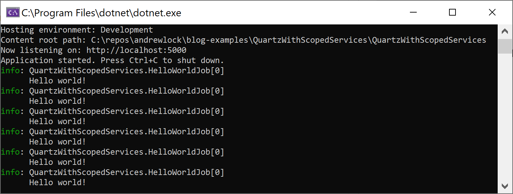

In this post I describe how to run Quartz.NET jobs using an [ASP.NET Core hosted service](https://docs.microsoft.com/en-us/aspnet/core/fundamentals/host/hosted-services?view=aspnetcore-2.2). I show how to create a simple `IJob`, a custom `IJobFactory`, and a `QuartzHostedService` that runs jobs while your application is running. I'll also touch on some of the issues to aware of, namely of using scoped services inside singleton classes.

## Introduction - what is Quartz.NET?[](https://andrewlock.net/creating-a-quartz-net-hosted-service-with-asp-net-core/#introduction-what-is-quartz-net-)

As per [their website](https://www.quartz-scheduler.net/):

> Quartz.NET is a full-featured, open source job scheduling system that can be used from smallest apps to large scale enterprise systems.

It's an old staple of many ASP.NET developers, used as a way of running background tasks on a timer, in a reliable, clustered, way. Using Quartz.NET with ASP.NET Core is pretty similar - Quartz.NET supports .NET Standard 2.0, so you can easily use it in your applications.

Quartz.NET has two main concepts:

- A **job**. This is the background tasks that you want to run on some sort of schedule.

- A **scheduler**. This is responsible for running jobs based on triggers, on a time-based schedule.

ASP.NET Core has good support for running "background tasks" via way of [hosted services](https://docs.microsoft.com/en-us/aspnet/core/fundamentals/host/hosted-services). Hosted services are started when your ASP.NET Core app starts, and run in the background for the lifetime of the application. By creating a Quartz.NET hosted service, you can use a standard ASP.NET Core application for running your tasks in the background.

> This sort of non-HTTP scenario is also possible with the "generic host", [but for various reasons](https://andrewlock.net/the-asp-net-core-generic-host-namespace-clashes-and-extension-methods/) I generally don't use those at the moment. This should hopefully improve in ASP.NET Core 3.0 with the extra investment going into these non-HTTP scenarios.

While it's possible to create [a "timed" background service](https://docs.microsoft.com/en-us/aspnet/core/fundamentals/host/hosted-services?view=aspnetcore-2.2#timed-background-tasks), (that runs a tasks every 10 minutes, for example), Quartz.NET provides a far more robust solution. You can ensure tasks only run at specific times of the day (e.g. 2:30am), or only on specific days, or any combination by using a [Cron trigger](https://www.quartz-scheduler.net/documentation/quartz-3.x/tutorial/crontriggers.html). It also allows you to run multiple instances of your application in a clustered fashion, so that only a single instance can run a given task at any one time.

In this post I'll show the basics of creating a Quartz.NET job and scheduling it to run on a timer in a hosted service.

## Installing Quartz.NET[](https://andrewlock.net/creating-a-quartz-net-hosted-service-with-asp-net-core/#installing-quartz-net)

Quartz.NET is a .NET Standard 2.0 NuGet package, so it should be easy to install in your application. For this test I created an ASP.NET Core project and chose the Empty template. You can install the Quartz.NET package using `dotnet add package Quartz`. If you view the *.csproj* for the project, it should look something like this:

```xml
<Project Sdk="Microsoft.NET.Sdk.Web">

  <PropertyGroup>
    <TargetFramework>netcoreapp2.2</TargetFramework>
    <AspNetCoreHostingModel>InProcess</AspNetCoreHostingModel>
  </PropertyGroup>

  <ItemGroup>
    <PackageReference Include="Microsoft.AspNetCore.App" />
    <PackageReference Include="Quartz" Version="3.0.7" />
  </ItemGroup>

</Project>
```

## Creating an IJob[](https://andrewlock.net/creating-a-quartz-net-hosted-service-with-asp-net-core/#creating-an-ijob)

For the actual background work we are scheduling, we're just going to use a "hello world" implementation that writes to an `ILogger<>` (and hence to the console). You should implement the Quartz interface `IJob` which contains a single asynchronous `Execute()` method. Note that we're using dependency injection here to inject the logger into the constructor.

```csharp
using Microsoft.Extensions.Logging;
using Quartz;
using System.Threading.Tasks;

[DisallowConcurrentExecution]
public class HelloWorldJob : IJob
{
    private readonly ILogger<HelloWorldJob> _logger;
    public HelloWorldJob(ILogger<HelloWorldJob> logger)
    {
        _logger = logger;
    }

    public Task Execute(IJobExecutionContext context)
    {
        _logger.LogInformation("Hello world!");
        return Task.CompletedTask;
    }
}
```

I also decorated the job with the `[DisallowConcurrentExecution]` attribute. This attribute [prevents Quartz.NET from trying to run the same job concurrently](https://www.quartz-scheduler.net/documentation/quartz-3.x/tutorial/more-about-jobs.html#job-state-and-concurrency).

## Creating an IJobFactory[](https://andrewlock.net/creating-a-quartz-net-hosted-service-with-asp-net-core/#creating-an-ijobfactory)

Next, we need to tell Quartz how it should create instances of `IJob`. By default, Quartz will try and "new-up" instances of the job using `Activator.CreateInstance`, effectively calling `new HelloWorldJob()`. Unfortunately, as we're using constructor injection, that won't work. Instead, we can provide a custom `IJobFactory` that hooks into the ASP.NET Core dependency injection container (`IServiceProvider`):

```csharp
using Microsoft.Extensions.DependencyInjection;
using Quartz;
using Quartz.Spi;
using System;

public class SingletonJobFactory : IJobFactory
{
    private readonly IServiceProvider _serviceProvider;
    public SingletonJobFactory(IServiceProvider serviceProvider)
    {
        _serviceProvider = serviceProvider;
    }

    public IJob NewJob(TriggerFiredBundle bundle, IScheduler scheduler)
    {
        return _serviceProvider.GetRequiredService(bundle.JobDetail.JobType) as IJob;
    }

    public void ReturnJob(IJob job) { }
}
```

This factory takes an `IServiceProvider` in the constructor, and implements the `IJobFactory` interface. The important method is the `NewJob()` method, in which the factory has to return the `IJob` requested by the Quartz scheduler. In this implementation we delegate directly to the `IServiceProvider`, and let the DI container find the required instance. The cast to `IJob` at the end is required because the non-generic version of `GetRequiredService` returns an `object`.

The `ReturnJob` method is where the scheduler tries to return (i.e. destroy) a job that was created by the factory. Unfortunately, there's no mechanism for doing so with the built-in `IServiceProvider`. We can't create a new `IScopeService` that fits into the required Quartz API, so we're stuck only being able to create singleton jobs.

> This is important. With the above implementation, it is only safe to create `IJob` implementations that are **Singletons** (or transient).

## Configuring the Job[](https://andrewlock.net/creating-a-quartz-net-hosted-service-with-asp-net-core/#configuring-the-job)

I'm only showing a single `IJob` implementation here, but we want the Quartz hosted service to be a generic implementation that works for any number of jobs. To help with that, we create a simple DTO called `JobSchedule` that we'll use to define the timer schedule for a given job type:

```csharp
using System;

public class JobSchedule
{
    public JobSchedule(Type jobType, string cronExpression)
    {
        JobType = jobType;
        CronExpression = cronExpression;
    }

    public Type JobType { get; }
    public string CronExpression { get; }
}
```

The `JobType` is the .NET type of the job (`HelloWorldJob` for our example), and `CronExpression` is a [Quartz.NET Cron expression](https://www.quartz-scheduler.net/documentation/quartz-3.x/tutorial/crontriggers.html). Cron expressions allow complex timer scheduling so you can set rules like "fire every half hour between the hours of 8 am and 10 am, on the 5th and 20th of every month". Just be sure to [check the documentation](https://www.quartz-scheduler.net/documentation/quartz-3.x/tutorial/crontriggers.html) for examples as not all Cron expressions used by different systems are interchangeable.

We'll add the job to DI and configure its schedule in `Startup.ConfigureServices()`:

```csharp
using Microsoft.AspNetCore.Builder;
using Microsoft.AspNetCore.Hosting;
using Microsoft.AspNetCore.Http;
using Microsoft.Extensions.DependencyInjection;
using Quartz;
using Quartz.Impl;
using Quartz.Spi;

public void ConfigureServices(IServiceCollection services)
{
    // Add Quartz services
    services.AddSingleton<IJobFactory, SingletonJobFactory>();
    services.AddSingleton<ISchedulerFactory, StdSchedulerFactory>();

    // Add our job
    services.AddSingleton<HelloWorldJob>();
    services.AddSingleton(new JobSchedule(
        jobType: typeof(HelloWorldJob),
        cronExpression: "0/5 * * * * ?")); // run every 5 seconds
}
```

This code adds four things as singletons to the DI container:

- The `SingletonJobFactory` shown earlier, used for creating the job instances.

- An implementation of `ISchedulerFactory`, the built-in `StdSchedulerFactory`, which handles scheduling and managing jobs

- The `HelloWorldJob` job itself

- An instance of `JobSchedule` for the `HelloWorldJob` with a Cron expression to run every 5 seconds.

There's only one piece missing now that brings them all together, the `QuartzHostedService`.

## Creating the QuartzHostedService[](https://andrewlock.net/creating-a-quartz-net-hosted-service-with-asp-net-core/#creating-the-quartzhostedservice)

The `QuartzHostedService` is an implementation of `IHostedService` that sets up the Quartz scheduler, and starts it running in the background. Due to the design of Quartz, we can implement `IHostedService` directly, instead of the [more common approach of deriving from the base ](https://docs.microsoft.com/en-us/dotnet/standard/microservices-architecture/multi-container-microservice-net-applications/background-tasks-with-ihostedservice)`BackgroundService` class. The full code for the service is listed below, and I'll discuss it afterwards.

```csharp
using System;
using System.Collections.Generic;
using System.Threading;
using System.Threading.Tasks;
using Microsoft.Extensions.Hosting;
using Quartz;
using Quartz.Spi;

public class QuartzHostedService : IHostedService
{
    private readonly ISchedulerFactory _schedulerFactory;
    private readonly IJobFactory _jobFactory;
    private readonly IEnumerable<JobSchedule> _jobSchedules;

    public QuartzHostedService(
        ISchedulerFactory schedulerFactory,
        IJobFactory jobFactory,
        IEnumerable<JobSchedule> jobSchedules)
    {
        _schedulerFactory = schedulerFactory;
        _jobSchedules = jobSchedules;
        _jobFactory = jobFactory;
    }
    public IScheduler Scheduler { get; set; }

    public async Task StartAsync(CancellationToken cancellationToken)
    {
        Scheduler = await _schedulerFactory.GetScheduler(cancellationToken);
        Scheduler.JobFactory = _jobFactory;

        foreach (var jobSchedule in _jobSchedules)
        {
            var job = CreateJob(jobSchedule);
            var trigger = CreateTrigger(jobSchedule);

            await Scheduler.ScheduleJob(job, trigger, cancellationToken);
        }

        await Scheduler.Start(cancellationToken);
    }

    public async Task StopAsync(CancellationToken cancellationToken)
    {
        await Scheduler?.Shutdown(cancellationToken);
    }

    private static IJobDetail CreateJob(JobSchedule schedule)
    {
        var jobType = schedule.JobType;
        return JobBuilder
            .Create(jobType)
            .WithIdentity(jobType.FullName)
            .WithDescription(jobType.Name)
            .Build();
    }

    private static ITrigger CreateTrigger(JobSchedule schedule)
    {
        return TriggerBuilder
            .Create()
            .WithIdentity($"{schedule.JobType.FullName}.trigger")
            .WithCronSchedule(schedule.CronExpression)
            .WithDescription(schedule.CronExpression)
            .Build();
    }
}
```

The `QuartzHostedService` has three dependencies: the `ISchedulerFactory` and `IJobFactory` we configured in `Startup`, and an `IEnumerable`. We only added a single `JobSchedule` to the DI container (for the `HelloWorldJob`), but if you register more job schedules with the DI container they'll all be injected here.

`StartAsync` is called when the application starts up and is where we configure Quartz. We start by creating an instance of `IScheduler`, assigning it to a property for use later, and setting the `JobFactory` for the scheduler to the injected instance:

```csharp
public async Task StartAsync(CancellationToken cancellationToken)
{
    Scheduler = await _schedulerFactory.GetScheduler(cancellationToken);
    Scheduler.JobFactory = _jobFactory;

    // ...
}
```

Next, we loop through the injected job schedules, and create a Quartz `IJobDetail` and `ITrigger` for each one using the `CreateJob` and `CreateTrigger` helper methods at the end of the class. If you don't like how this part works, or need more control over the configuration, you can easily customise it by extending the `JobSchedule` DTO as you see fit.

```csharp
public async Task StartAsync(CancellationToken cancellationToken)
{
    // ...
    foreach (var jobSchedule in _jobSchedules)
    {
        var job = CreateJob(jobSchedule);
        var trigger = CreateTrigger(jobSchedule);

        await Scheduler.ScheduleJob(job, trigger, cancellationToken);
    }
    // ...
}

private static IJobDetail CreateJob(JobSchedule schedule)
{
    var jobType = schedule.JobType;
    return JobBuilder
        .Create(jobType)
        .WithIdentity(jobType.FullName)
        .WithDescription(jobType.Name)
        .Build();
}

private static ITrigger CreateTrigger(JobSchedule schedule)
{
    return TriggerBuilder
        .Create()
        .WithIdentity($"{schedule.JobType.FullName}.trigger")
        .WithCronSchedule(schedule.CronExpression)
        .WithDescription(schedule.CronExpression)
        .Build();
}
```

Finally, once all the jobs are scheduled, you call `Scheduler.Start()` to actually start the Quartz.NET scheduler processing in the background. When the app shuts down, the framework will call `StopAsync()`, at which point you can call `Scheduler.Stop()` to safely shut down the scheduler process.

```csharp
public async Task StopAsync(CancellationToken cancellationToken)
{
    await Scheduler?.Shutdown(cancellationToken);
}
```

You can register the hosted service using the `AddHostedService()` extension method in `Startup.ConfigureServices`:

```csharp
public void ConfigureServices(IServiceCollection services)
{
    // ...
    services.AddHostedService<QuartzHostedService>();
}
```

If you run the application, you should see the background task running every 5 seconds and writing to the Console (or wherever you have logging configured)



## Using scoped services in jobs[](https://andrewlock.net/creating-a-quartz-net-hosted-service-with-asp-net-core/#using-scoped-services-in-jobs)

There's one big problem with the implementation as described in this post: you can only create Singleton or Transient jobs. That means you can't use any dependencies that are registered as Scoped services. For example, you can't inject an EF Core `DatabaseContext` into your `IJob` implementation, as you'll have a [captive dependency](http://blog.ploeh.dk/2014/06/02/captive-dependency/) problem.

Working around this isn't a big issue: you can inject an `IServiceProvider` and create your own scope, [similar to the solution for a similar problem in a previous post](https://andrewlock.net/the-dangers-and-gotchas-of-using-scoped-services-when-configuring-options-in-asp-net-core/#3-creating-a-new-scope-in-iconfigureoptions). For example, if you need to use a scoped service in your `HelloWorldJob`, you could use something like the following:

```csharp
public class HelloWorldJob : IJob
{
    // Inject the DI provider
    private readonly IServiceProvider _provider;
    public HelloWorldJob( IServiceProvider provider)
    {
        _provider = provider;
    }

    public Task Execute(IJobExecutionContext context)
    {
        // Create a new scope
        using(var scope = _provider.CreateScope())
        {
            // Resolve the Scoped service
            var service = scope.ServiceProvider.GetService<IScopedService>();
            _logger.LogInformation("Hello world!");
        }

        return Task.CompletedTask;
    }
}
```

This ensures a new scope is created every time the job runs, so you can retrieve (and dispose) scoped services inside the `IJob`. Unfortunately things do get a little messy. In the next post I'll show a variation on this approach that is a little cleaner.

## Summary[](https://andrewlock.net/creating-a-quartz-net-hosted-service-with-asp-net-core/#summary)

In this post I introduced Quartz.NET and showed how you could use it to schedule background jobs to run in ASP.NET Core using `IHostedService`. The example shown in this post is best for singleton or transient jobs, which isn't ideal, as consuming scoped services is clumsy. In the next post, I'll show a variation on this approach that makes using scoped services easier.

- [Example source code for this post](https://github.com/andrewlock/blog-examples/tree/master/QuartzHostedService)

- <https://github.com/HangfireIO/Cronos>

- <https://github.com/HangfireIO/Hangfire>

- <https://github.com/quartznet/quartznet>

### Hangfire 与quartz.net对比

在项目没有引入Hangfire之前，一直使用的是Quartz.net。个人认为Quartz.net在定时任务处理方面优势如下：

- 支持秒级单位的定时任务处理，但是Hangfire只能支持分钟及以上的定时任务处理

原因在于Hangfire用的是开源的[NCrontab](https://github.com/atifaziz/NCrontab)组件，跟linux上的crontab指令相似。

- 更加复杂的触发器，日历以及任务调度处理

- 可配置的定时任务

但是为什么要换Hangfire? 很大的原因在于项目需要一个后台可监控的应用，不用每次都要从服务器拉取日志查看，在没有ELK的时候相当不方便。Hangfire控制面板不仅提供监控，也可以手动的触发执行定时任务。如果在定时任务处理方面没有很高的要求，比如一定要5s定时执行，Hangfire值得拥有。抛开这些，Hangfire优势太明显了：

- 持久化保存任务、队列、统计信息

- 重试机制

- 多语言支持

- 支持任务取消

- 支持按指定`Job Queue`处理任务

- 服务器端工作线程可控，即job执行并发数控制

- 分布式部署，支持高可用

- 良好的扩展性，如支持IOC、Hangfire Dashboard授权控制、Asp.net Core、持久化存储等

说了这么多的优点，我们可以有个案例，例如秒杀场景：用户下单->订单生成->扣减库存，Hangfire对于这种分布式的应用处理也是适用的，最后会给出实现。