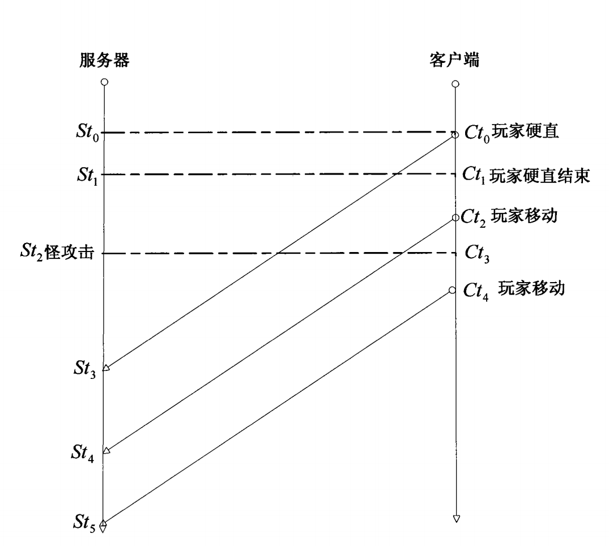

国内的网络游戏多是客户端/服务器方式，而对于游戏实时性要求比较高的网游，如 果采用客户端发送时间包给服务器，服务器校验后再下发给客户端表现的话，网络延时 和抖动都会恶化游戏体验。对于客户端和服务器的同步问题， 一般有两种算法解决：

① 、客户端和服务器之间进行对时后，客户端发送数据包给服务器，服务器根据收 到的客户端数据包先后进行排序，先到达的服务器端的事件包被判定为先发生，后到达 服务器的事件包被判定为后发生。在此情况下，往往网络延时较大的客户端先发送了游 戏事件包，但由于网络延时和抖动的影响，后到达服务器，而被判定为后发生时间，这 样对该客户端就不公平了。

② 、客户端和服务器进行对时后，客户端预测服务器收到客户端数据包的时间，并 把该时间写入数据包中发送给服务器，在网络抖动比较大的情况下，这种情况可以保证一定的公平性。但是还是出现了上述的情况，网络延时大的数据包预测的到达时间也就 更晚，依然会出现先发生的事件被服务器判定为后发生，同样不能保证游戏的公平性。

因此，在现有的解决网络实时性较差问题的技术方案中，当采用TimeWarp同步机制 时，则需要保存数量较多的快照，同时也会使回滚的次数较多，导致过多的消耗内存和 CPU资源，以及降低游戏体验；对于国内网络游戏采用的网络时间同步机制，无论服务器 根据客户端数据包到达的时间进行排序，或客户端预测服务器收到客户端数据包的时间 并把该时间写入数据包中发送给服务器，对于网络延时越大的玩家同样会降低游戏体 验。

## 网络对时

大部分的强交互网游会做对时, 使 client 和 server 保持时间基本一致.


1.  client 带上本地时间 t0 向 server 发送对时请求.

2.  server 回复当前自己的系统时间 t1.

3.  client ack 收到 server 回复时的本地时间 t2.

如果只有 client 关心对时结果, 这时可以优化到**只做1,2步甚至只做第2步**, 相当于 client 主动发起 ping;

同样, 如果只有 server 关心对时结果, sever 主动发起 ping (第2,3步)即可.

单次对时往往会受到网络波动的影响, 所以一般还需要做多次统计一个比较合理的时间偏移.

网络对时, 一般在进游戏之初做. 如果在游戏过程中发现有网络波动过大的情况(在下行协议包中带上 server 的时间, 很容易检查到提前或者滞后), 也需要重新发起对时.

考虑到反外挂(比如加速齿轮, 或者减速器)的因素, server 端需要对主动发起的client对时请求做一些安全校验, 例如时间递增, 是否满足阈值等等.

光从对时的角度来看, UDP 协议比 TCP 更合适一些, 不过取决于项目需要.

## 服务器和客户端时间差算法 **(st0+st2-2ct1)/2**


### 两种理解方式

#### 第一种方式

`ct1-st0 = &0 +(ct1-st1) `  延迟+ 时间差(同一时刻下客户端减去服务端的时间差)

`st2-ct1 = &1+(st2-ct2)`  延迟+ 时间差(同一时刻下服务端减去客户端的时间差)

我们需要的就是`st2-ct2` 由上可以转换为`-(ct1-st1) = st2-ct2`

现假设 `o = st2-ct2 `同时假设延迟相等 `p = &0 = &1`

```
ct1-st0 = p - o

st2-ct1 = p + o

ct1-st0-st2+ct1 = -2o

o =(st0+st2-2ct1)/2
```

#### 第二种方式

`&0 = &1 = (st2-st0)/2 `    我们知道`(st2-st0)/2`是单次延迟 即

`st2-ct1 = &1+(st2-ct2)`  延迟+ 时间差(同一时刻下服务端减去客户端的时间差)

```
 st2-ct1 = (st2-st0)/2 + o

 2st2-2ct1 = st2-st0 + 2o

 o = (st0+st2-2ct1)/2
```

<https://patents.google.com/patent/CN101577715A/zh>

服务器获得服务器与客户端的时间差值后，与服务器接收到来自客户端的数据包的时间做差值可以获得客户端在游 戏过程中实际向服务器发送数据包的时间，**并通过客户端在游戏过程 中实际向服务器发送数据包的时间来判定在游戏时间中事件发生的实际顺序**， 从而较好的保持了游戏的公平性，提高了游戏玩家的游戏体验。

#### 检查安全性

1.  第一次连接的对时..时差不该查过三分钟.

2.  校验包客户端有没有修改时间,能够求得发包的时间,对比服务器接收到包的时间以及延迟

## 移动的延迟补偿.

使用了客户端预测的话,客户端的移动位置要优先于服务端的,因为有来回两次延迟..

由于状态同步以服务端为准,使用服务器校对不会出什么问题.

所以这里的补偿是补偿从客户端到服务端这段延迟.

```
public class move
{
	DatetimeOffset clientTime
}
var o = xxx;//服务端和客户端的时间差
var startMoveTime =   move.clientTime+o;
var delay = DateTimeOffset.Now()-startMoveTime;//延迟时间

//todo:将延迟时间参与到pos的计算当中


```

如果使用了服务器校对不补偿也并没有什么太大的问题,因为最终仍然是以服务器为准的.

但是补偿了之后减少了延迟,会更平缓一点.

<https://patents.google.com/patent/CN102404279A/zh>

## boss攻击的延迟补偿.



玩家ct2的时候开始移动,但是服务器收到的时候已经是st4

而服务器st2的时候boss发动了攻击.这个时候.玩家在服务器的位置是在ct3

需要boss把攻击作为关键事件...直到客户端有ct4事件出来时再执行st2,

可以使用时间轮算法触发关键事件

## 玩家 的延迟补偿

这是由于客户端使用了插值算法造成的

比如fps游戏,玩家看到的敌人的位置永远是过去的,当你开枪的时候,那个人其实已不在那个位置

所以需要记录游戏的世界状态..找到子弹打出时那一刻的世界状态.然后判定

<https://patents.google.com/patent/CN102739608A/zh>

## 一些模拟恶劣网络环境工具

-   <http://jagt.github.io/clumsy/cn/index.html>
