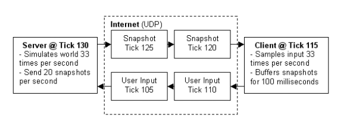
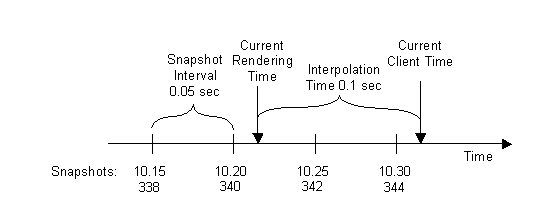
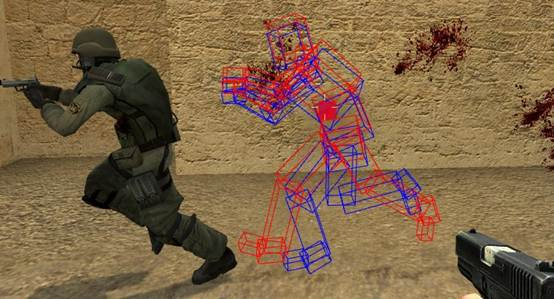
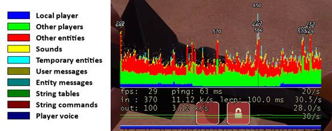

Source引擎的多人游戏使用基于UDP通信的C/S架构。游戏以服务器逻辑作为世界权威，客户端和服务器通过UDP协议(20~30packet/s）通信。客户端从服务器接收信息并基于当前世界状态渲染画面和输出音频。客户端以固定频率发送操作输入到服务器。客户端仅与游戏服务器，而不是彼此之间通信。多人游戏必须处理基于网络消息同步所带来的一系列问题。

网络的带宽是有限的，所以服务器不能为每一个世界的变化发送新的更新数据包发送到所有客户端。相反，服务器以固定的频率取当前世界状态的快照并广播这些快照到客户端。网络数据包需要一定的时间量的客户端和服务器（RTT的一半）来往。这意味着客户端时间相对服务器时间总是稍有滞后。此外，客户端输入数据包同步到服务器也有一定网络传输时间，所以服务器处理客户端输入也存在延迟的。不同的客户端因为网络带宽和通信线路不同也会存在不同的网络延时。随着服务器和客户端之间的这些网络延迟增大, 网络延迟可能会导致逻辑问题。比如在快节奏的动作游戏中，在几毫秒的延迟甚至就会导致游戏卡顿的感觉，玩家会觉得很难打到对方玩家或运动的物体。此外除了带宽限制和网络延迟还要考虑网络传输中会有消息丢失的情况。

为了解决网络通信引入的一系列问题，Source引擎在服务器同步时采用了数据压缩和延迟补偿的逻辑，客户端采用了预测运行和插值平滑处理等技术来获得更好的游戏体验。

 

### 基本网络模型

服务器以一个固定的时间间隔更新模拟游戏世界。默认情况下，时间步长为15ms，以66.66次每秒的频率更新模拟游戏世界，但不同游戏可以指定更新频率。在每个更新周期内服务器处理传入的用户命令，运行物理模拟步，检查游戏规则，并更新所有的对象状态。每一次模拟更新tick之后服务器会决定是否更新当前时间快照以及每个客户端当前是否需更新。较高的tickrate增加了模拟精度，需要服务器和客户端都有更多可用的CPU和带宽资源。客户通常只能提供有限的带宽。在最坏的情况下，玩家的调制解调器连接不能获得超过5-7KB /秒的流量。如果服务器的数据更新发送频率超过了客户端的带宽处理限制，丢包是不可避免的。因此客户端可以通过在控制台设置接受带宽限制，以告诉服务器其收到的带宽容量。这是客户最重要的网络参数，想要获得最佳的游戏体验的话必须正确的设置此参数。客户端可以通过设置cl_updaterate（默认20）来改变获得快照平的频率，但服务器永远不会发送比tickerate更多的更新或超过请求的客户端带宽限制。服务器管理员可以通过sv_minrate和sv_maxrate(byte/s)限制客户端的上行请求频率。当然快照更新同步频率都受到sv_minupdaterate和sv_maxupdaterate（快照/秒）的限制。

客户端使用与服务端tickrate一样的频率采样操作输入创建用户命令。用户命令基本上是当前的键盘和鼠标状态的快照。客户端不会把每个用户命令都立即发送到服务器而是以每秒（通常是30）的速率发送命令包。这意味着两个或更多个用户的命令在同一包内传输。客户可以增加与的cl_cmdrate命令速率。这可以提高响应速度，但需要更多的出口带宽。

游戏数据使用增量更新压缩来减少网络传输。服务器不会每次都发送一个完整的世界快照，而只会更新自上次确认更新(通过ACK确认)之后所发生的变化（增量快照)。客户端和服务器之间发送的每个包都会带有ACK序列号来跟踪网络数据流。当游戏开始时或客户端在发生非常严重的数据包丢失时, 客户可以要求全额快照同步。

用户操作的响应速度(操作到游戏世界中的可视反馈之间的时间)是由很多因素决定的，包括服务器/客户端的CPU负载，更新频率，网络速率和快照更新设置，但主要是由网络包的传输时间确定。从客户端发送命令到服务器响应, 再到客户端接收此命令对应的服务器响应被称为延迟或ping（或RTT）。低延迟在玩多人在线游戏时有显著的优势。客户端本地预测和服务器的延迟补偿技术可以尽量为网络较差的游戏玩家提供相对公平的体验。如果有良好的带宽和CPU可用，可以通过调整网络设置以获得更好的体验, 反之我们建议保持默认设置，因为不正确的更改可能导致负面影响大于实际效益。

 

### Enitiy插值平滑

通常情况下客户端接收每秒约20个快照更新。如果世界中的对象（实体）直接由服务器同步的位置呈现，物体移动和动画会看起来很诡异。网络通信的丢包也将导致明显的毛刺。解决这个问题的关键是要延迟渲染，玩家位置和动画可以在两个最近收到快照之间的连续插值。以每秒20快照为例，一个新的快照更新到达时大约每50毫秒。如果客户端渲染延迟50毫秒，客户端收到一个快照，并在此之前的快照之间内插(Source默认为100毫秒的插补周期)；这样一来，即使一个快照丢失，总是可以在两个有效快照之间进行平滑插值。如下图显示传入世界快照的到达时间：

在客户端接收到的最后一个快照是在tick 344或10.30秒。客户的时间将继续在此快照的基础上基于客户端的帧率增加。下一个视图帧渲染时间是当前客户端的时间10.32减去0.1秒的画面插值延迟10.20。在我们的例子下一个渲染帧的时间是10.22和所有实体及其动画都可以基于快照340和342做正确的插值处理。

既然我们有一个100毫秒的延迟插值，如果快照342由于丢包缺失，插值可以使用快照340和344来进行平滑处理。如果连续多个快照丢失，插值处理可能表现不会很好，因为插值是基于缓冲区的历史快照进行的。在这种情况下，渲染器会使用外推法（cl_extrapolate 1），并尝试基于其已知的历史，为实体做一个基于目前为止的一个简单线性外推。外推只会快照更新包连续丢失（cl_extrapolate_amount）0.25秒才会触发，因为该预测之后误差将变得太大。实体内会插导致100毫秒默认（cl_interp 0.1）的恒定视图“滞后”，就算你在listenserver（服务器和客户端在同一台机器上）上玩游戏。这并不是说你必须提前预判动画去瞄准射击，因为服务器端的滞后补偿知道客户端实体插值并纠正这个误差。

最近Source引擎的游戏有cl_interp_ratioCVaR的。有了这个，你可以轻松，安全地通过设置cl_interp为0，那么增加的cl_updaterate的值（这同时也会受限于服务器tickrate）来减少插补周期。你可以用net_graph 1检查您的最终线性插值。

如果打开sv_showhitboxes，你会看到在服务器时间绘制的玩家包围盒，这意味着他们在前进的线性插值时期所呈现的播放器模式。

 

### 输入预测

让我们假设一个玩家有150毫秒的网络延迟，并开始前进。前进键被按下的信息被存储在用户命令，并发送至服务器。用户命令是由移动代码逻辑处理，玩家的角色将在游戏世界中向前行走。这个世界状态的变化传送到所有客户端的下一个快照的更新。因此玩家看到自己开始行动的响应会有150毫秒延迟，这种延迟对于高频动作游戏(体育，设计类游戏)会有明显的延迟感。玩家输入和相应的视觉反馈之间的延迟会产生一种奇怪的，不自然的感觉，使得玩家很难移动或精确瞄准。客户端的输入预测（cl_predict 1）执行是一种消除这种延迟的方法，让玩家的行动感到更即时。与其等待服务器来更新自己的位置，在本地客户端只是预测自己的用户命令的结果。因此，客户端准确运行相同的代码和规则服务器将使用来处理用户命令。预测完成后，当地的玩家会移动到新位置，而服务器仍然可以看到他在老地方。150毫秒后，客户会收到包含基于他早期预测用户命令更改服务器的快照。客户端会将预测位置同服务器的位置对比。如果它们是不同的，则发生了预测误差。这表明，在客户端没有关于其他实体的正确信息和环境时，它处理用户命令。然后，客户端必须纠正自己的位置，因为服务器拥有客户端预测最终决定权。如果cl_showerror 1开启，客户端可以看到，当预测误差发生。预测误差校正可以是相当明显的，并且可能导致客户端的视图不规则跳动。通过在一定时间（cl_smoothtime）逐渐纠正这个错误，错误可以顺利解决。预测误差平滑处理可以通过设置cl_smooth 0来关闭。预测只对本地玩家以及那些只收它影响的实体有效，因为预测的工作原理是使用客户端的操作来预测的。对于其他玩家没法做有效预测, 因为没有办法立即从他们身上得到操作信息。

 

### 延迟补偿

​    比方说，一个玩家在10.5s的时刻射击了一个目标。射击信息被打包到用户命令，该命令通过网络的方式发送至服务器。服务器持续模拟游戏世界，目标可能已经移动到一个不同的位置。用户命令到达服务器时间10.6时服务器就无法检测到射击命中，即使玩家已经在目标准确瞄准。这个错误需要由服务器侧进行延迟补偿校正。延迟补偿系统使所有玩家最近位置的历史一秒。如果在执行用户的命令，服务器预计在命令创建什么时间如下：

命令执行时间=当前服务器时间 - 数据包延迟 - 客户端查看插值

然后服务器会将所有其他玩家回溯到命令执行时的位置，他们在命令执行时间。用户指令被执行，并正确地检测命中。用户命令处理完成后，玩家将会恢复到原来的位置。由于实体插值包含在公式中，可能会导致意外的结果。服务器端可以启用sv_showimpacts 1，显示服务器和客户端射击包围盒位置差异：

该画面在主机上设置延迟200毫秒(net_fakelag设置)时获取的，射击真实命中玩家。红色命中包围盒显示了客户端那里是100毫秒+插补周期前的目标位置。此后，目标继续向左移动，而用户命令被行进到服务器。用户命令到达后，服务器恢复基于所述估计的命令执行时间目标位置（蓝色击中盒）。服务器回溯演绎，并确认命中（客户端看到流血效果）。

因为在时间测量精度的误差客户端和服务器命中包围盒不完全匹配。对于快速移动的物体甚至几毫秒的误差也会导致几英寸的误差。多人游戏击中检测不是基于像素的完美匹配，此外基于tickrate模拟的运动物体的速度也有精度的限制。

既然击中检测服务器上的逻辑如此复杂为什么不把命中检查放在客户端呢？如果在客户端进行命中检查, 玩家位置和像素命中处理检测都可以精准的进行。客户端将只告诉服务器用“打”的消息一直打到什么样的玩家。因为游戏服务器不能信任客户端这种重要决定。因为即使客户端是“干净”的，并通过了Valve反作弊保护，但是报文可以被截获修改然后发送到游戏服务器。这些“作弊代理”可以注入“打”的消息到网络数据包而不被VAC被检测。

网络延迟和滞后补偿可能会引起真实的世界不可能的逻辑。例如，您可能被你看不到的目标所击中。服务器移到你的命中包围盒时光倒流，你仍然暴露给了攻击者。这种不一致问题不能通过一般化的防范解决，因为相对网络包传输的速度。在现实世界中，因为光传播如此之快，你，每个人都在你身边看到同一个世界，所以你才你没有注意到这个问题。

 

### 网络视图NET_Graph

Source引擎提供了一些工具来检查您的客户端连接速度和质量。使用net_graph 2可以启用相关的视图。下面的曲线图中，第一行显示每秒当前的渲染的帧，您的平均延迟时间，以及的cl_updaterate的当前值。第二行显示在最后进来的数据包（快照），平均传入带宽和每秒接收的数据包的字节大小。第三行显示刚刚传出的数据包（用户命令）相同的数据。

默认的网络设置是专门为通过互联网连接的游戏服务器设计的。可以适用大多数客户机/服务器的硬件和网络配置工作。对于网络游戏，应该在客户端上进行调整，唯一的控制台变量是“rate”，它定义客户端可用的字节/网络连接带宽。

 

在一个良好的网络环境中，服务器和所有客户端都具有必要的硬件资源可用，可以调整带宽和更新频率设置，来获得更多的游戏精度。增加tickrate通常可以提高运动和射击精度，但会消耗更多的服务器CPU资源。tickrate 100运行的服务器的负载大概是tickrate 66运行时的约1.5倍, 因此如果CPU性能不足可能会导致严重的计算滞后，尤其是在玩家数量比较多的时候。建议对具有更高tickrate超的游戏服务器预留必要的CPU资源。

 

如果游戏服务器使用较高tickrate运行时，客户端可以在带宽可用的情况下增加他们的快照更新率（的cl_updaterate）和用户命令速率（的cl_cmdrate）。快照更新速率由服务器tickrate限制，一台服务器无法发送每个时钟周期的一个以上的更新。因此，对于一个tickrate66服务器，为的cl_updaterate最高的客户价值，将是66。如果你增加快照率遇到，你必须再次打开它。与增加的cl_updaterate你也可以降低画面插值延迟（cl_interp）。默认的插值延迟为0.1秒(默认的cl_updaterate为20) 视图内插延迟会导致移动的玩家会比静止不动的玩家更早发现对方。这种效果是不可避免的，但可以通过减小视图内插值延迟来减小。如果双方玩家正在移动，画面滞后会延迟影响双方玩家,双方玩家都不能获利。快照速率和视图延迟插值之间的关系如下：

插补周期= MAX(cl_interp，cl_interp_ratio /cl_updaterate)

可以设置cl_interp为0，仍然有插值的安全量。也可以把cl_updaterate增加，进一步降低你的插补周期，但不会超过更新tickrate(66)或客户端的网络处理能力。

 

### Tips

不要瞎改终端配置除非你完全确定你在干嘛

​    如果客户端和服务器没有足够CPU和网络资源，绝大多数所所谓高性能优化都是起负面作用

不要关闭画面插值和延迟补偿

​    这样并不能代理移动和设计精准度提升

优化设置可能不会对每个客户端都有效

如果是你是在游戏里或者SourceTv里第一视角观看你看到的画面和玩家可能不一样

观战者的画面没有延迟补偿

https://developer.valvesoftware.com/wiki/Source_Multiplayer_Networking