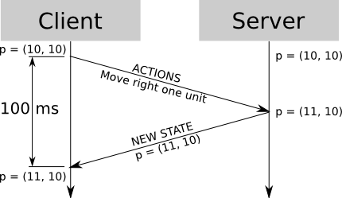
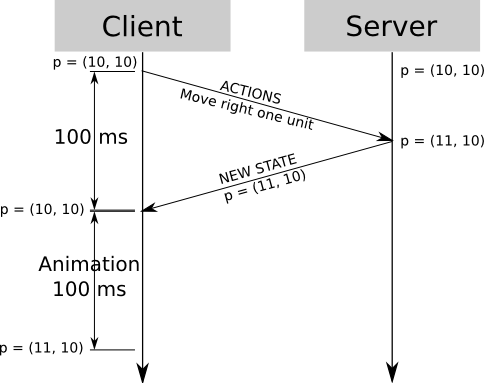
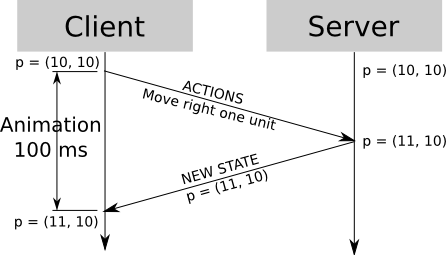
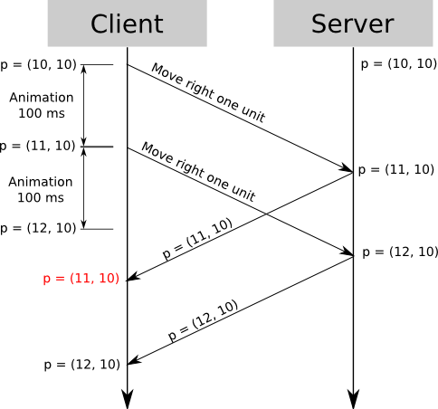
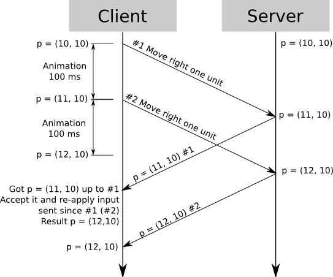

## PART 1 概述

在第一篇文章中，我们介绍了一种权威服务器的C-S模型，在这种模型中，客户端只将输入发送到服务器中，当收到来自服务器的游戏状态更新的时候再将结果渲染出来。

单纯地依赖这种模型会导致玩家输入命令和画面更新之间的延迟感，比如，当玩家按下向右的按钮，然后玩家等了半秒钟才开始移动，因为首先客户端需要把输入传给服务器，然后服务器处理了出入之后计算出新的游戏状态，然后再将新的游戏状态传回给客户端。

在实际的网络环境中，延迟可能会达到零点几秒，这时游戏就有点感觉延迟了，最坏的情况是直接没法玩了。在这篇文章中，我们将找到减小这种延迟感的方法，甚至能够消除这种延迟。

## PART 2 客户端预测

虽然存在着作弊的玩家，但是大部分时候服务器是处理有效访问的（来自非作弊玩家的），这也意味着服务器收到大部分的输入都是有效的，而且游戏状态的更新也是按照预期的，也即是说：如果你的角色在（10，10），然后方向键右被按下了，那么你的角色就会移动到（11，10）。

我们可以利用这一点，如果游戏世界的确定性足够（给定一个游戏状态和一些列的输入，得到的结果是完全可预测的）。

现在假设有100ms的延迟，角色移动一格需要花费100ms，使用之前说的实现方式，那么整个动作完成需要花费200ms:

因为游戏世界是确定的，我们假设传送到服务器的输入都能够成功执行。在这种假设下，客户端能够预测游戏世界在接受输入后的状态，并且绝大部分情况下，结果是正确的。

与之前说的将客户端的输入发送到客户端然后等待服务器的响应再在客户端做出反应，我们可以将两者同时进行，即当在发送输入信息的时候，就当作它们已经正确执行，通常服务器返回的结果和客户端的执行的结果是一致的:

现在玩家输入和运行结果之间就没有任何延迟存在了，同时服务器还是权威服务器。（如果有作弊的客户端发送无用的消息，他可以把角色放在他想要的任何地方，但这并不会影响到服务器，也就是其他玩家也不会受到他的影响）。

## PART 3 同步问题

在上面的例子里，我选用了一些比较特例的数字来让所有事情看起都很完美，现在假设另一种情况，假设现在服务器延时250ms，移动一格花费100ms，现在玩家按了两下方向键右，想要往右移动两格。

使用之前我们说的技术，情况如下图所示

于是我们在 **t = 250 ms** 的时候就会面临一个非常 interesting 的问题，当接收到新的游戏状态时，客户端预测的位置已经到达 **x = 12**，但是服务器认为最新的坐标是 **x = 11**，因为权威服务器的缘故，客户端必须将角色移回 **x = 11**，但是紧接着，新的 **x = 12** 的状态在 **t = 350** 的时间到达，因此角色的位置又顺移回去了。。

从玩家的角度来看，他按下两次向右按钮后，角色向右移动两格，原地停留50ms后，向左顺移一格，又原地停留100ms再向右顺移一格，很明显这种情况令人难以接受。

## PART 4 服务器校对

解决上面说的问题的办法就是你得意识到，客户端所看到的世界是当前的，但是因为延迟，客户端得到的游戏状态都是过去的，当服务器在发送更新的时候，它并没有把客户端发来的所有的命令都处理掉。

这并不是一个非常严重的问题，首先，客户端在每次请求的时候加上一个编号，在我们的例子中，第一次按键请求编号为 #1，第二次按键的请求编号为 #2。服务器回复的时候将其处理过最后一个请求的编号包含在消息中。

当t = 250的时候，服务器说“基于#1的输入请求，你的位置是11”.因为服务器是权威的，所以角色的位置是x=11， 现在假设客户端保存了一份发送到服务器的请求，基于新的游戏状态，它知道服务器已经处理了请求 #1，所以他将这个备份丢弃掉，但是客户端知道服务器还需要将#2请求的回复发过来，所以再一次进行客户端预测，客户端可以基于上次服务器发来的状态和#2输入来计算当前的状态。

所以当t=250ms的时候，客户端得到“经过#1的输入之后，x=11”，它将#1输入的拷贝丢弃掉，但是还有一份并没有得到服务器返回的#2的拷贝，客户端将内部游戏状态更新为服务器所发来的游戏状态，也就是x=11，然后将所有未收到回复但已经发送给服务器的输入用于预测，在上面的例子，输入就是向右移动，最终状态就是x=12，这是正确的。当t=350的时候，一个新的游戏状态从服务器获得；这种情况它说“基于#2输入，x=12”。在这是，客户端将#2请求之前的请求都丢弃，然后将游戏状态更新为x=12，没有需要预测的输入，所以不需要预测，现在得到的结果都是正确的。

客户端具体如何处理，这里有一个统一的处理方式：

- 根据server的new state更新#1里的缓存状态

- 回滚input到#1，将#1之后的所有缓存的操作都应用到#1的new state中进行计算，得到最新的结果

- 客户端根据最新的结果进行更新

- 将#1的状态和input 从缓存buffer里删除

## PART 5 误差

上面讨论的例子里只讨论了移动，但是这个方法在其他方面也可以使用。比如，在一个回合制的游戏里，当玩家攻击其他玩家的时候，你可以播放飙血的特效和伤害值，但是你不应该在收到服务器回复之前直接更新玩家的血量。

因为游戏状态的复杂性，它并不能保证是绝对可逆的，你也许希望只有再收到服务器确认的时候才将一个玩家杀死，即使这个玩家的血量降到负的了。（但假象一种情况，一个玩家实际上已经死了，但是在没有收到服务器确认之前他使用了药包，这个时候你该怎么处理？）

这又带来了一个有趣的问题，即使世界是绝对的确定的，并且没有玩家在作弊，还是有客户端的预测和服务器不吻合的情况。上面说的情况在单人游戏中不会出现，但是在多人接入同一个服务器的时候就会发生，这个问题会在下面的文章中进行讨论。

## PART 6 总结

当使用权威服务器的时候，你需要给玩家即时的响应，即使是当在等待服务器处理出入。为了达到这样的目的，客户端模拟出输入的结果，当收到服务器的回复时，客户端的游戏状态需要通过服务器的回复和还未处理的输入进行重新计算。

- <http://www.gabrielgambetta.com/client-side-prediction-server-reconciliation.html>