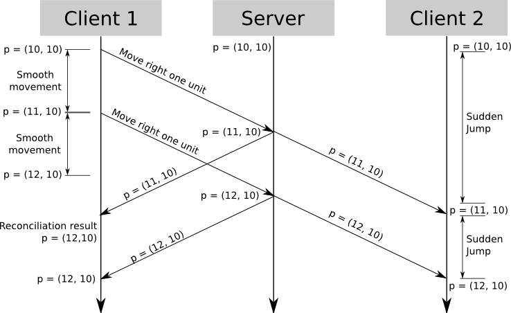
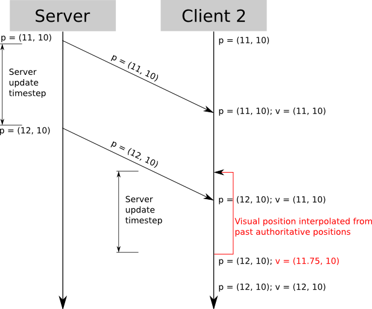

## PART 1 概述

在本系列的「第一篇文章」中，我们介绍了关于权威服务器及其反作弊特性，然而仅仅是最简单的实现可能会导致关于可玩性和响应速度的问题。在「第二篇文章」中，我们提出了「客户端预测」的方案来克服这个困难。

以上两篇文章事实上介绍的是一种在连接到有传输延迟的远程权威服务器的状况下，可以让玩家像单机游戏一样流畅的控制角色移动的一种概念和技术。

在本文中，我们将会讨论在在同一台服务器上有「其他玩家控制的角色」的情况。

## PART 2 服务器 time step

在之前的文章中，我们的服务器的实现非常简单，它负责处理客户端的输入并更新游戏状态，最后将结果发送回客户端。如果有多个玩家在一起玩，那服务端主循环的逻辑有所不同了。
在接下来的场景中，几个客户端玩家会同时发送数据，玩家发出操作指令会非常频繁（高APM的玩家，一秒钟可能发出10个以上的操作指令），如果服务端每收到某个玩家的一条指令，就去执行input逻辑，然后广播游戏状态，这样的性能是非常差的，会消耗很多的cpu和bandwidth。
一个更好的办法是，利用一个queue，将客户端的输入信息缓存起来，在服务端，游戏状态以一定的频率(例如100ms一次)进行更新，每次更新的时间间隔(100ms)，就被称之为time step。
在每个更新循环迭代中，服务端处理queue里面所有的input，然后逐个进行计算，将最后计算的结果更新到所有客户端。
总体来说，整个游戏世界的更新和客户端的输入频率、数量是相对独立的，它的更新频率也是可控的。

## PART 3 低频更新处理

从客户端来看，这个方法运行的很平滑，客户端的预测行为独立于服务端的更新，所以它依然可以使用预测技术。不过，由于真个游戏世界的状态以一个比较低的频率进行更新，那么本地客户端对其他玩家知道的信息就很少了，信息越少的话，其他玩家的行为动作要模拟的话，就不会很准确。
本地客户端收到其他玩家更新坐标的消息，如何进行处理呢，有一个最简单的办法就是，每次直接使用收到的坐标进行更新，但这样看起来会有抖动，每100ms更新一次坐标，就得抖动一次，如下图所示：

对Client2来说，Client1的位置最开始再p(10,10)，不一会直接跳到p(11,10)，100ms后又跳到(12,0)，这样的体验是很差的。那么，如何改善游戏体验呢？ 针对不同的游戏，有不同的处理方式，一般来说，客户端的行为越方便预测，就越容易做平滑处理。

## PART 4 航位推测法

假设你在玩赛车游戏。一辆速度非常快的汽车是可以预测的——例如，如果它以每秒100米的速度行驶，一秒钟后，它将比它开始行驶的地方提前大约100米。

为什么是大约呢？在那一秒内，汽车可能加速或减速了一点，或者向右或向左转了一点——这里的关键词是“一点”。汽车的机动性是这样的：在高速行驶时，无论玩家实际做什么，其在任何时间点的位置都高度依赖于其先前的位置、速度和方向。换句话说，赛车不能立即进行180度转弯。

对于每100毫秒发送一次更新的服务器，这是如何工作的？客户端接收到服务器发送来的每个其他车的速度和行驶方向；在接下来的100毫秒内，它不会接收到任何新信息，但仍需要显示它们的运行情况。要做的最简单的事情是假设汽车的航向和加速度在100毫秒内保持不变，并使用该参数在本地运行汽车物理。然后，100毫秒后，当服务器更新到达时，汽车的位置被修正。

根据许多因素，校正可以是大的或相对小的。如果玩家把车保持在直线上，并且不改变车速，那么预测的位置将与修正的位置完全相同。另一方面，如果玩家撞到什么东西，预测的位置将是非常错误的。

请注意，推算定位可以应用于低速情况，例如战列舰。实际上，“dead reckoning”一词起源于航海。

## PART 5 实体插值

有许多情况航位推是没法处理的 - 对于玩家的方向和速度可以瞬间改变的都不行，比如3D射击，玩家经常快速跑动，停下，快速转向等，在这种情况下，航位推算法就非常无力了。因为位置和速度和前面的数据无关。

你可以选择在接到服务器的请求的时候直接更新玩家的位置，而客户端看到的就是网上其他的玩家每100ms跳一下，感觉会非常奇怪。

你现在拥有的是每100ms由服务器传送过来的权威数据，现在要做的是如何在这100ms内让网络角色看起来非常自然，解决问题的关键就是将网络玩家显示在过去的某个时刻。

假设你在t=1000收到位置信息，你已经在t=900收到了一次位置信息，所以你知道玩家在t=900和t=1000的位置，所以在t=1000到t=1100之间，你只要显示玩家t=900到t=1000的位置。这种方法，你所显示的都是玩家的真实数据，只是有100ms的延迟。

用来插值的t=900和t=1000的数据依赖于游戏。插值通常都可以处理得很好。如果不是这种方法，你可能需要服务器发送更加详细的移动信息了 - 比如更多的位置采样点，或者每10ms发送一次(你不必发十倍的数据 - 因为你发的微小的位移数据，在这种情况下数据的格式可以很好的优化一下)。

当使用这种技术的时候，每一个玩家都和游戏世界有一点点不同步，因为每个玩家看到自己的世界是当前的，但是其他的玩家都是过去的。但即使是快速的游戏，这100ms的延迟都不是那么明显。

有一种情况除外 - 当你需要时间和空间的准确性的时候，比如一个玩家射击另一个玩家的时候，因为其他的玩家都是存在于过去的某个时候，你的瞄准其实是有100ms的延迟的 - 也就是说，你设计的目标是100ms的某个目标！ 这个问题我们下一篇会进行讨论。

## PART 6 总结

在权威服务器的环境中，有着不确定的服务器更新和网络延迟，在这种情况下你还要给玩家平滑的移动。在第二篇中，我们展示了一种客户端预测和服务器调和的技术，来实现实时的角色控制，这样的方案让玩家能够得到即时的反馈，移除了致命的延迟。

其他玩家的同步还是一个问题，但是，在这篇文章中，我们提出了两种解决方案。

第一种是航位推技术，这种模拟需要entity的位置能够通过前一个时候的位置，速度，加速度来推算出来，当不满足这种情况的时候，航位推就没用了。

第二种是插值技术，不预测将来的位置，只是使用服务器传来的数据，这种就会造成显示的entity总是过去的某个时刻。最后的结果就是玩家的角色总是当前时刻，而其他看到的entity都是过去的某个时刻，这种情况可以产生一种难以置信的无缝体验。

但是，当游戏需要高速离散的准确性的时候，比如射击或者移动物体，美景就破灭了：你看其他玩家的位置和服务器的位置不一致，别的玩家看你的位置也不是正确的，这样爆头就不可能发生了！很多游戏都有爆头这一说，我们将在下面的文章中来讨论这个问题。

- <http://www.gabrielgambetta.com/entity-interpolation.html>