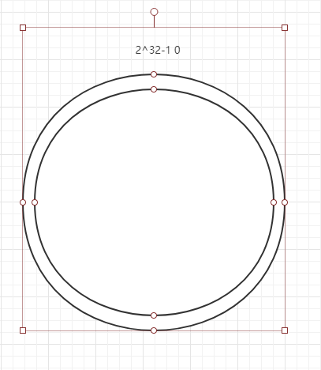
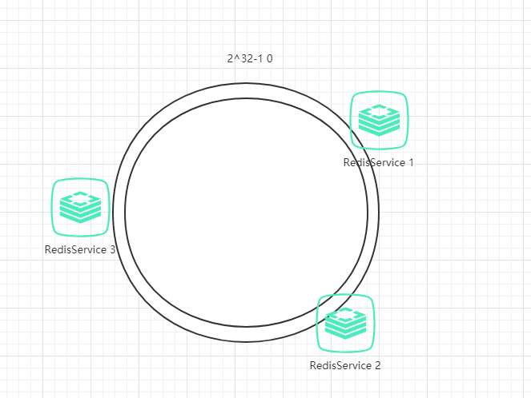
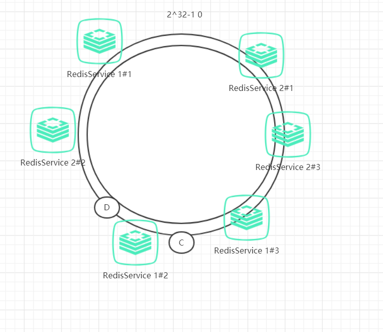

# 应用场景

`负载均衡`和`分布式场景`

随着业务的扩展，流量的剧增，单体项目逐渐划分为分布式系统。对于经常使用的数据，我们可以使用Redis作为缓存机制，减少数据层的压力。因此，重构后的系统架构如下图所示：

优化最简单的策略就是，把常用的数据保存到Redis中，为了实现高可用使用了3台Redis（没有设置集群，集群至少要6台）。每次Redis请求会随机发送到其中一台，但是这种策略会引发如下两个问题：

- 同一份数据可能在多个Redis数据库，造成数据冗余

- 某一份数据在其中一台Redis数据库已存在，但是再次访问Redis数据库，并没有命中数据已存在的库。无法保证对相同的key的所有访问都发送到相同的Redis中

要解决上述的问题，我们需要稍稍改变一些key存入Redis的规则：**使用hash算法**
例如，有三台Redis，对于每次的访问都可以通过计算hash来求得hash值。
如公式 h=hash(key)%3，我们把Redis编号设置成0,1,2来保存对应hash计算出来的值，h的值等于Redis对应的编号。
但是hash算法也会面临容错性和扩展性的问题。容错性是指当系统中的某个服务出现问题时，不能影响其他系统。扩展性是指当加入新的服务器后，整个系统能正确高效运行。

现假设有一台Redis服务器宕机了，那么为了填补空缺，要将宕机的服务器从编号列表中移除，后面的服务器按顺序前移一位并将其编号值减一，此时每个key就要按h = Hash(key) % 2重新计算。

同样，如果新增一台服务器，规则也同样需要重新计算，h = Hash(key) % 4。因此，系统中如果有服务器更变，会直接影响到Hash值，大量的key会重定向到其他服务器中，造成缓存命中率降低，而这种情况在分布式系统中是十分糟糕的。

一个设计良好的分布式哈希方案应该具有良好的单调性，即服务节点的变更不会造成大量的哈希重定位。一致性哈希算法由此而生\~

## 2 一致性哈希算法

> 一致哈希 是一种特殊的哈希算法。在使用一致哈希算法后，哈希表槽位数（大小）的改变平均只需要对 K/n 个关键字重新映射，其中K是关键字的数量， n是槽位数量。然而在传统的哈希表中，添加或删除一个槽位的几乎需要对所有关键字进行重新映射。

简单的说，一致性哈希是将整个哈希值空间组织成一个虚拟的圆环，如假设哈希函数H的值空间为0-2^32-1（哈希值是32位无符号整形），整个哈希空间环如下：

整个空间按顺时针方向组织，0和2^32-1在零点中方向重合。

接下来，把服务器按照IP或主机名作为关键字进行哈希，这样就能确定其在哈希环的位置。

然后，我们就可以使用哈希函数H计算值为key的数据在哈希环的具体位置h，根据h确定在环中的具体位置，从此位置沿顺时针滚动，遇到的第一台服务器就是其应该定位到的服务器。

例如我们有A、B、C、D四个数据对象，经过哈希计算后，在环空间上的位置如下：

根据一致性哈希算法，数据A会被定为到Server 1上，数据B被定为到Server 2上，而C、D被定为到Server 3上。

## 3 容错性和扩展性

那么使用一致性哈希算法的容错性和扩展性如何呢？

### 3\.1 容错性

假如RedisService2宕机了，那么会怎样呢？

那么，数据B对应的节点保存到RedisService3中。因此，其中一台宕机后，干扰的只有前面的数据（原数据被保存到顺时针的下一个服务器），而不会干扰到其他的数据。

### 3\.2 扩展性

下面考虑另一种情况，假如增加一台服务器Redis4，具体位置如下图所示：

原本数据C是保存到Redis3中，但由于增加了Redis4，数据C被保存到Redis4中。干扰的也只有Redis3而已，其他数据不会受到影响。

因此，一致性哈希算法对于节点的增减都只需重定位换空间的一小部分即可，具有较好的容错性和可扩展性

## 4 虚拟节点

前面部分都是讲述到Redis节点较多和节点分布较为均衡的情况，如果节点较少就会出现节点分布不均衡造成数据倾斜问题。

例如，我们的的系统有两台Redis，分布的环位置如下图所示：

这会产生一种情况，Redis4的hash范围比Redis3的hash范围大，导致数据大部分都存储在Redis4中，数据存储不平衡。

为了解决这种数据存储不平衡的问题，一致性哈希算法引入了**虚拟节点机制**，即对每个节点计算多个哈希值，每个计算结果位置都放置在对应节点中，这些节点**称为虚拟节点**。

具体做法可以在服务器IP或主机名的后面增加编号来实现，例如上面的情况，可以为每个服务节点增加三个虚拟节点，于是可以分为 RedisService1#1、 RedisService1#2、 RedisService1#3、 RedisService2#1、 RedisService2#2、 RedisService2#3，具体位置如下图所示：

对于数据定位的hash算法仍然不变，只是增加了虚拟节点到实际节点的映射。例如，数据C保存到虚拟节点Redis1#2，实际上数据保存到Redis1中。这样，就能解决服务节点少时数据不平均的问题。在实际应用中，通常将虚拟节点数设置为**32甚至更大**，因此即使**很少的服务节点**也能做到相对**均匀的数据分布**。

- <https://github.com/tg123/ConsistentSharp>

- <https://en.wikipedia.org/wiki/Consistent_hashing>