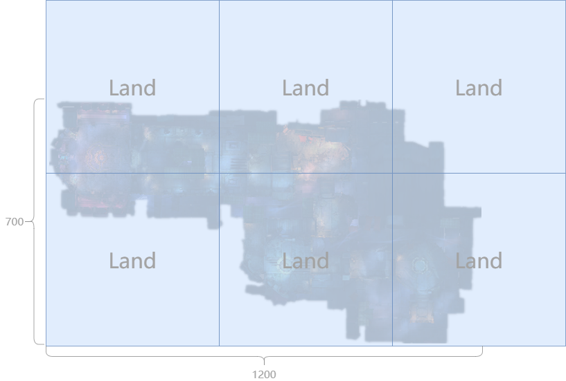
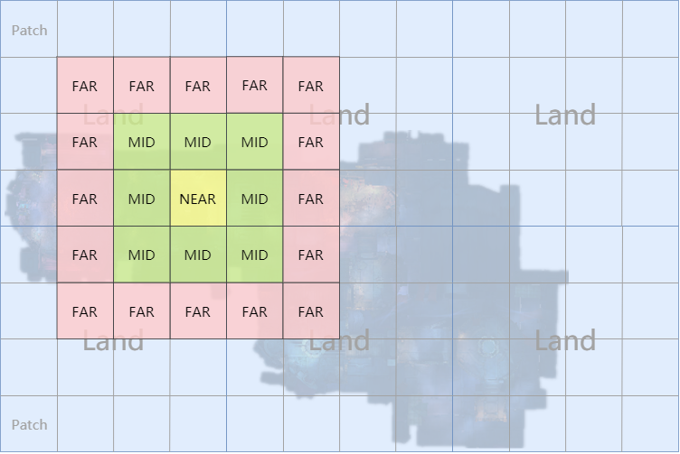

## 为什么要进行视野管理？

1\.如果不进行视野管理，流量上来看，假设平均每秒5个移动包（80字节），1个技能包（160字节），单人每秒多少？500kb。

2\.客户端表现来看，客户端受屏幕大小影响，离得远的玩家看不见，没有必要发给客户端。客户端性能所限，玩家多，放各种 技能，当然会看。

3\.从性能上考虑，服务端不用遍历全场景对象…也会大大减少性能消耗。

# 格子

## Land

IncServer将每个场景看做是由n个land（块）组成，每个land就是一个大小固定的正方形，默认512 \* 512。比如一个scene的尺寸为1200 \* 700：


则需要6个land来表示:



## Patch

Land进一步被划分为若干个Patch（格子）。以patch为单位，land的边长是2的整数次幂。


## 分块管理

World对游戏对象的管理以patch为单位，**每个patch都对应有一个对象链表**。

整个world中所有的对象链表的链表头可依次存储于一个一维数组中，这样根据对象的世界坐标，即可方便的计算出其所属的patch以及对应的对象链表。


假设对象的坐标为(x, z)，patch的边长为patch_size，land的边长为land_size，整个场景在x方向上有land_x个land，则对象所属的对象链表的索引计算方式为：

```
index = (z / patch_size) * (land_x * (land_size / patch_size)) + (x / patch_size);
```

### IncServer的AOI

与常见的九宫格不同，IncServer支持NEAR、MIDDLE、FAR、FULL四种视野范围：



- NEAR：当前对象所位于的patch

- MIDDLE：与NEAR相邻的patch

- FAR：与MID相邻的patch（NEAR除外）

- FULL：NEAR + MIDDILE + FAR

不过在实际开发中，所有对象的视野都是FULL，即每个对象都能看到以自己所在patch为中心前后左右各两个patch（总计25个patch）内的其他对象。之后的讨论均假设**所有游戏对象的视野范围均为FULL**。

如果对象B进入对象A的视野范围，则根据A对象类型，可能会触发不同的逻辑，比如：

- 对象A是玩家：将B对象**序列化**到对象A的客户端。

- 对象B是怪物：执行对象进入怪物视野的逻辑，比如激活AI等。

后文将以上情况称之为在对象A的视野中加载对象B，简称为**视野加载**。

### 九宫格

让我们首先绘制一个2D的地图

我们给这个地图定义一些数值：

**场景相关数值计算**

- 场景大小： 250\*250 ， w(x轴宽度) = 250，l(y轴长度) = 250

- x轴格子数量：nx = 5

- y轴格子数量：ny = 5

- 格子宽度: dx = w / nx = 250 / 5 = 50

- 格子长度: dy = l / ny = 250 / 5 = 50

- 格子的x轴坐标：idx

- 格子的y轴坐标：idy

- 格子编号：id = idy \*nx + idx (利用格子坐标得到格子编号)

- 格子坐标：idx = id % nx , idy = id / nx (利用格子id得到格子坐标)

- 格子的x轴坐标: idx = id % nx (利用格子id得到x轴坐标编号)

- 格子的y轴坐标: idy = id / nx (利用格子id得到y轴坐标编号)

以上几个数值，请参考图，简单过一下，就可以理解的，初中的几何计算而已。

九宫格也是打格子的方式之一，把地图划分为很多小格子，每个格子记录格子内的玩家，每个玩家的aoi范围是以自己为中心范围内的九个格子，九个格子的大小略大于屏幕大小，同样的有三个主要的操作：enter,move,leave

enter:根据玩家坐标，加入到所属的格子中，通过计算以这个格子的为中心的九个格子，这九个格子内的玩家就要被通知有新玩家初始化，同时这个新玩家初始化九个格子内的所有玩家。

move:根据移动前位置的格子，计算出移动前的oldaoi集合，根据当前位置的格子，计算出当前的curaoi集合，如果oldaoi, curaoi为同一个格子，则通知格子内的所有玩家该玩家在移动。如果oldaoi,curaoi不是同一个格子，即发生了跨格子的操作，那么要将该玩家从旧格子移除，同时加入新格子。同时分别遍历oldaoi,curaoi,计算出需要通知玩家消失的格子集合，通知玩家出生的格子集合，以及通知玩家移动的格子集合。

leave:玩家离开地图，将玩家从对应的格子里面删除，同时通知aoi集合有玩家离开。

服务器大格子的大小，以3\*3的格子要总比客户端显示范围要大一点为原则。比客户端大一点，是为了预留资源加载的时间。
　　如下图所示，绿色表示手机客户端的显示区域，当角色A在格子6中时，他可以看到1,2,3,5,6,7,9,10,11这9个格子里的内容，那么当他的状态发生变化时，就需要同步给在这9个格子里的所有玩家；同样，当这9个格子里的有玩家或者怪物的状态改变时，也需要都同步给角色A。


当角色A移动到角色B所在的格子(7)，则他将不再看到1,5,9这三个格子里的内容，同时他将新看到4,8,12这三个格子里的地图内容（玩家和怪物）。所以这个过程中，服务器要下发消息，删除角色A所在的客户端里的1,5,9这三个格子里的地图内容，同时下发消息新增4,8,12这三个格子里的地图内容（类型一）。
　　推荐大格子具体的大小，按客户端iPhone4S的960*640分辨来制定，取屏幕长宽的1/2大一些，可以定为640*360。

- <https://github.com/artasccope/GameFW.AOI>

- <https://www.bookstack.cn/read/zinx/78aa012966213643.md>

### 灯塔法

所谓灯塔法，即将大地图划分成有限的小格子，在每个小格子中间放一个灯塔，这个灯塔管理两个队列：一个是本格子内所有的对象集合，另一个是对本灯塔感兴趣的对象集合（简称观察者）。

而地图上的每个对象，维护一个视野队列：该队列为其视野范围内的所有对象，即自身感兴趣的所有对象。

一个对象在地图上面运动：分为三个操作：enter，move，leave.

enter:当对象进入地图的时候，根据对象的当前位置和对象的感知距离，可以获取到该对象能观察到的所有灯塔，遍历这些灯塔，将该对象添加为其观察者。同时将这些对象添加到自己的视野队列中。

move:当对象开始移动的时候，对象从一个点到另一个店，那么视野范围必然发生变化。此刻需要将对象从老的灯塔的观察者列表移除，同时将对象添加进新的灯塔的观察者列表。此外，还需要跟新玩家的视野队列，因为视野范围变化，视野内的对象也相应变化。

leave:当对象离开的时候，将自身从附近灯塔的观察者队列中移除。

通过灯塔法，每当物体发生变化，我们能马上根据其当前位置，定位到他的所在的灯塔，同时找到它视野范围内相关联的物体。这样避免了遍历地图上所有玩家进行处理的方式。

当然灯塔的格子大小划分要因地制宜，格子越小，消耗内存越大，同时计算量变大。

- <https://github.com/Bestpoker/AOI>

- <https://github.com/NetEase/pomelo-aoi>

- <https://github.com/ahuangege/tower-aoi>

前几天把pomelo中的tower aoi的js实现看了一遍，总结如下：

1. js代码写得不是很好，发现了几个小问题；

2. “对象(包括观察者)出现”“对象(包括观察者)消失”“对象(包括观察者)位置变化”“观察者位置变化”的回调通知(前三者通知对应灯塔区域的观察者，第四个通知观察者本身)没有可测试的样例，采用的话需要自己实现和测试；

3. 只考虑了起点和终点，移动路径上的玩家被忽视了，路径短的话也可能不是问题(长路径切分成多个短路径做位置更新)；

4. 观察者可能收到超出自己视野范围的消息；

5. 优点是可处理视野不同的观察者，相对于普通扫格子的实现在代码层面耦合度降低、效率提升不明显(把扫格子实现的地格看做一个灯塔区域，在地格上记录观察者就可以模拟这种灯塔模型，削去了遍历周边地格所有对象的逻辑)

6. 这里做的是四边形灯塔区域，云风提的那种六边形灯塔区域减少查询灯塔个数是特指视野半径<=六边形边长的一半这种情况

7. tower aoi其实就是处理地图视野的一个设计，类似于订阅-发布，我订阅某一块区域表示对这一块区域感兴趣，那么有对象在这一块区域出现消失移动你就通知我

# 十字链表法

这里以2d游戏为例，3d游戏顺势扩展即可。

所谓十字链表法，即维护两天链表，一条根据地图上所有物体的x坐标从小到大依次插入链表，一条根据地图上所有物体的y坐标从小到大依次插入链表，可以想象成一个十字架。这样便把地图上的所有对象按序分配到了x,y链表上。

这里的链表为双向链表，双向链表的好处是，获取到链表中的一个节点，便可以向前和向后遍历。这样，当我们拿到一个对象时，要获取该对象的视野范围就变得非常简单。避免了从头到尾遍历所有对象。

首先根据x坐标，在x链表上找到该节点，然后从该节点向前和向后遍历，根据x方向的视野范围找出需要识别的对象。

然后根据y坐标，在y链表上找到该节点，然后从该节点向前和向后遍历，根据y方向的视野范围找出需要识别的对象。

拿到x,y链表上需要关注的对象，然后取他们的交集，这便是玩家视野范围内的对象。

对于对象在地图上的enter,move,leave 。根据前面的思路就变得非常简单

- <https://github.com/zhepama/AOI>

#### **十字链表基本原理**

根据二维地图，将其分成x轴和y轴两个链表。如果是三维地图，则还需要维护多一个z轴的链表。将对象的坐标值按照从小到大相应的排列在相应的坐标轴上面。

- 添加到AOI（ADD）: 根据新增对象的X,Y坐标,依次遍历X,Y轴坐标链表,这里有两个目的,一个是获得这个新增对象的坐标在X,Y轴坐标的位置,另一方面获得该通知哪些结点.通知的范围,每个对象可以自己定制自己的通知范围。必须X,Y坐标同时都在通知范围内才可以进入通知集合，我们要按照从小到大进行插入。例如X轴坐标为:

`a->b->c->d->e->f->g->h`

假设新增一个对象z,它最终所在的位置是c和d之间,需要重新在链表的头部开始遍历寻找z的位置，比如z的X轴位置是5：

`a(0)->b(1)->c(2)->d(3)->e(4)-z(5)->f(6)->g(7)->h(8)`

但是这样会发现一个问题，如果需要管理的坐标少还可以。但如果有很多个坐标比如1W个坐标，那这个链表会很长，如果每次都需要从头部开始查找效率就很低。针对这样的插入方法目前大家常用的有快速排序、分治、按区域划分格子等方式。

#### **目前常用的排序算法**

- 快速排序（Quicksort）是对[冒泡排序](https://link.zhihu.com/?target=https%3A//baike.baidu.com/item/%E5%86%92%E6%B3%A1%E6%8E%92%E5%BA%8F/4602306)的一种改进。

快速排序由C. A. R. Hoare在1962年提出。它的基本思想是：通过一趟排序将要排序的数据分割成独立的两部分，其中一部分的所有数据都比另外一部分的所有数据都要小，然后再按此方法对这两部分数据分别进行快速排序，整个排序过程可以[递归](https://link.zhihu.com/?target=https%3A//baike.baidu.com/item/%E9%80%92%E5%BD%92/1740695)进行，以此达到整个数据变成有序[序列](https://link.zhihu.com/?target=https%3A//baike.baidu.com/item/%E5%BA%8F%E5%88%97/1302588)。

- 分治算法

分治算法的基本思想是将一个规模为N的问题分解为K个规模较小的子问题，这些子问题相互独立且与原问题性质相同。求出子问题的解，就可得到原问题的解。即一种分目标完成程序算法，简单问题可用二分法完成。

- 按区域划分格子

该方法是把区域划分成多个格子，比如X坐标1到X坐标4为一个格子我们（暂时称之为A格子），坐标5到X坐标9为一个格子（暂时称之为B格子）。这样做的好处是，当你插入的坐标是2的时候，我们只需要遍历A格子里面的数据找到自己位置就可以了。

综合以上三种方法，大家一眼就看出来了。是的，按区域划分格子的方式是目前最佳的方式。从时间复杂度等等所有方便都是这个最佳，但是这个方法也有一个很大的问题，用这样的方式插入是很快了，但查找范围内的坐标就变的很困难了。大家可以仔细考虑一下或者自己写一个DEMO。你马上会发现，当我知道我的位置的情况下，我该如何查找周围玩家呢，是的。这样的话十字链就没有什么用了。

当然会有人说我在每个格子之间用链表进行连接就可以了，那么问题又来了。该如何连接，肯定有很复杂的代码才可以完成这样逻辑。就算是你能完成这个链表的连接，但这些逻辑会提升了时间复杂度。

#### 快慢针

所谓快慢针就是，总有一个指针快于一个指针。

实现方式是，插入的时候把链表分成多份、比如链表长度为10，快的指针每次移动4个，然后对比当前节点如果位置小于的话，把慢指针指向快指针的位置，快指针继续向后面4个格子移动，直到找到大于的节点为止，这时候慢指针开始向前移动一个一个的对比位置就可以了。如果一直没有找到大于的节点，那就表示要插入的位置是当前链表最后的位置。

相信大家已经看明白了，是的。这样的情况下效率就很高了，唯一的问题就是这个时间复杂度不稳定。使用这个方式，查找周围玩家直接前后查找移动就可以了。效率也非常高。

快慢针实现：

```text
if (First == null)
{
      node.Link.YNode = AddFirst(AoiPool.Instance.Fetch<LinkedListNode<AoiNode>>(node).Value);
}
else
{
       var slowCursor = First;

       var skip = Convert.ToInt32(Math.Ceiling(Convert.ToDouble(Count) /
                     Convert.ToDouble(_skipCount)));

       if (Last.Value.Position.Y > node.Position.Y)
       {
            for (var i = 0; i < _skipCount; i++)
            {
                 // 移动快指针

                 var fastCursor = FastCursor(i * skip, skip);

                 // 如果快指针的值小于插入的值，把快指针赋给慢指针，当做当前指针。

                 if (fastCursor.Value.Position.Y <= node.Position.Y)
                 {
                       slowCursor = fastCursor;

                            continue;
                 }

                 // 慢指针移动到快指针位置

                 while (slowCursor != fastCursor)
                 {
                      if (slowCursor == null) break;

                      if (slowCursor.Value.Position.Y >= node.Position.Y)
                      {
                           node.Link.YNode = AddBefore(slowCursor,
                                    AoiPool.Instance.Fetch<LinkedListNode<AoiNode>>(node).Value);

                           return;
                        }

                       slowCursor = slowCursor.Next;

                        }
                    }
                }

if (node.Link.YNode == null)
{
       node.Link.YNode = AddLast(AoiPool.Instance.Fetch<LinkedListNode<AoiNode>>(node).Value);
}
```

#### **实现方式**

- Move（当角色移动后通知AOI）：

```text
#region 移动X轴

            if (Math.Abs(node.Position.X - x) > 0)
            {
                if (x > node.Position.X)
                {
                    var cur = node.Link.XNode.Next;

                    while (cur != null)
                    {
                        if (x < cur.Value.Position.X)
                        {
                            _xLinks.Remove(node.Link.XNode);

                            node.Position.X = x;
                            
                            node.Link.XNode = _xLinks.AddBefore(cur, node);

                            break;
                        }
                        else if (cur.Next == null)
                        {
                            _xLinks.Remove(node.Link.XNode);
                            
                            node.Position.X = x;
                            
                            node.Link.XNode = _xLinks.AddAfter(cur, node);

                            break;
                        }

                        cur = cur.Next;
                    }
                }
                else
                {
                    var cur = node.Link.XNode.Previous;

                    while (cur != null)
                    {
                        if (x > cur.Value.Position.X)
                        {
                            _xLinks.Remove(node.Link.XNode);
                            
                            node.Position.X = x;
                            
                            node.Link.XNode = _xLinks.AddBefore(cur, node);

                            break;
                        }
                        else if (cur.Previous == null)
                        {
                            _xLinks.Remove(node.Link.XNode);
                            
                            node.Position.X = x;
                            
                            node.Link.XNode = _xLinks.AddAfter(cur, node);

                            break;
                        }

                        cur = cur.Previous;
                    }
                }
            }

            #endregion

            #region 移动Y轴

            if (Math.Abs(node.Position.Y - y) > 0)
            {
                if (y > node.Position.Y)
                {
                    var cur = node.Link.YNode.Next;

                    while (cur != null)
                    {
                        if (y < cur.Value.Position.Y)
                        {
                            _yLinks.Remove(node.Link.YNode);
                            
                            node.Position.Y = y;
                            
                            node.Link.YNode = _yLinks.AddBefore(cur, node);

                            break;
                        }
                        else if (cur.Next == null)
                        {
                            _yLinks.Remove(node.Link.YNode);
                            
                            node.Position.Y = y;
                            
                            node.Link.YNode = _yLinks.AddAfter(cur, node);

                            break;
                        }

                        cur = cur.Next;
                    }
                }
                else
                {
                    var cur = node.Link.YNode.Previous;

                    while (cur != null)
                    {
                        if (y > cur.Value.Position.Y)
                        {
                            _yLinks.Remove(node.Link.YNode);
                            
                            node.Position.Y = y;
                            
                            node.Link.YNode = _yLinks.AddBefore(cur, node);

                            break;
                        }
                        else if (cur.Previous == null)
                        {
                            _yLinks.Remove(node.Link.YNode);
                            
                            node.Position.Y = y;
                            
                            node.Link.YNode = _yLinks.AddAfter(cur, node);

                            break;
                        }

                        cur = cur.Previous;
                    }
                }
            }

            
            #end-region
```

- 查找周围（按照指定的范围查找自己周围玩家）：

```text
for (var i = 0; i < 2; i++)
            {
                var cur = i == 0 ? node.Link.XNode.Next : node.Link.XNode.Previous;

                while (cur != null)
                {
                    if (Math.Abs(Math.Abs(cur.Value.Position.X) - Math.Abs(node.Position.X)) > area.X)
                    {
                        break;
                    }
                    else if (Math.Abs(Math.Abs(cur.Value.Position.Y) - Math.Abs(node.Position.Y)) <= area.Y)
                    {
                        if (Distance(node.Position, cur.Value.Position) <= area.X)
                        {
                            if (!node.AoiInfo.MovesSet.Contains(cur.Value.Id)) node.AoiInfo.MovesSet.Add(cur.Value.Id);
                        }
                    }

                    cur = i == 0 ? cur.Next : cur.Previous;
                }
            }

            for (var i = 0; i < 2; i++)
            {
               var cur = i == 0 ? node.Link.YNode.Next : node.Link.YNode.Previous;

                while (cur != null)
                {
                    if (Math.Abs(Math.Abs(cur.Value.Position.Y) - Math.Abs(node.Position.Y)) > area.Y)
                    {
                        break;
                    }
                    else if (Math.Abs(Math.Abs(cur.Value.Position.X) - Math.Abs(node.Position.X)) <= area.X)
                    {
                        if (Distance(node.Position, cur.Value.Position) <= area.Y)
                        {
                            if (!node.AoiInfo.MovesSet.Contains(cur.Value.Id)) node.AoiInfo.MovesSet.Add(cur.Value.Id);
                        }
                    }

                    cur = i == 0 ? cur.Next :cur.Previous;
                }
            }
```

## 优缺点

- 九宫格

  - 优点: cpu消耗小

  - 缺点: 内存开销大,内存消耗不仅和实体数有关,还和场景大小成正比

- 十字链表

  - 优点: 内存开销小,内存消耗仅和实体数有关,和场景大小无关

  - 缺点: cpu消耗高,每次移动都需要计算视野差,当实体在小区域堆积严重时效率更差