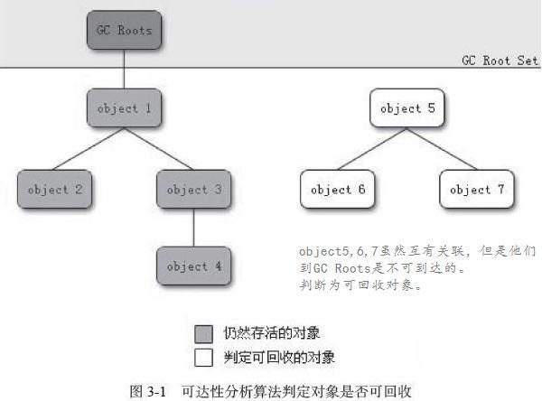
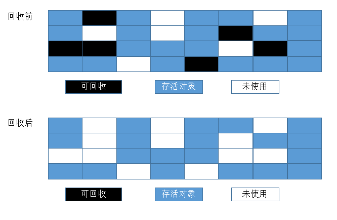
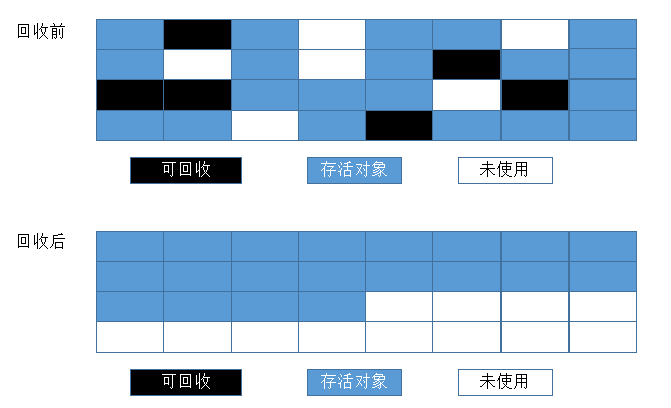
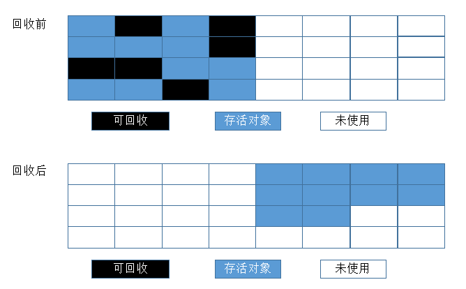
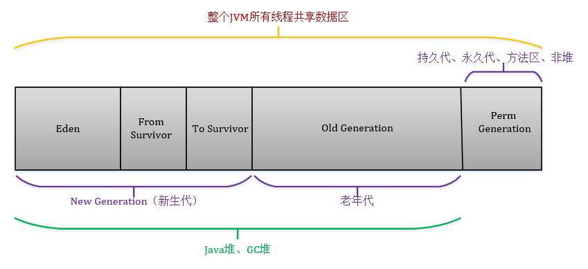
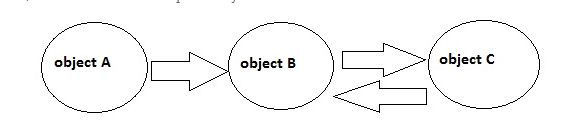

对于垃圾收集（GC）, 我们需要考虑三件事情：哪些内存需要回收？如何判断是垃圾对象？垃圾回收算法有哪些？

## 一、GC的工作区域

**1、不是GC的工作区域**

(1)程序计数器、虚拟机栈和本地方法栈三个区域是线程私有的，随线程生而生，随线程灭而灭；

(2)栈中的栈帧随着方法的进入和退出而进行入栈和出栈操作，每个栈帧中分配多少内存基本上是在类结构确定下来时就已知的，因此这几个区域的内存分配和回收都具有确定性。

在这几个区域不需要过多考虑回收的问题，因为方法结束或线程结束时，内存自然就跟随着回收了。

**2、GC的工作区域（哪些内存需要GC回收？）**

(1)垃圾回收重点关注的是堆和方法区部分的内存。

​    因为一个接口中的多个实现类需要的内存可能不一样，一个方法的多个分支需要的内存也可能不一样，我们只有在程序处于运行期间才能知道会创建哪些对象，这部分内存的分

配和回收都是动态的，所以垃圾回收器所关注的主要是这部分的内存。

## 二、垃圾对象的判定

Java堆中存放着几乎所有的对象实例，垃圾收集器对堆中的对象进行回收前，要先确定这些对象是否还有用，哪些还活着。对象死去的时候才需要回收。

#### 1、引用计数法

引用计数法的逻辑是：在堆中存储对象时，在对象头处维护一个counter计数器，如果一个对象增加了一个引用与之相连，则将counter++。

如果一个引用关系失效则counter–。如果一个对象的counter变为0，则说明该对象已经被废弃，不处于存活状态。

优点

1)可即刻回收垃圾，每个对象都知道自己的被引用数，当counter为0时，对象就会把自己作为空闲空间连接到空闲链表，也就是在对象变成垃圾的同时就会被回收.

2）最大暂停时间短，每次通过指向mutator生成垃圾时，这部分垃圾都会被回收，大幅削减了mutator的最大暂停时间。

缺点

1)引用和去引用伴随加法和减法，影响性能

2)很难处理循环引用

#### 2、可达性分析算法

这种算法的基本思路是通过一系列名为“GC Roots”的对象作为起始点，从这些节点开始向下搜索，搜索所走过的路径称为引用链，当一个对象到GC Roots没有任何引用链相连时，就证明此对象是不可用的。

Java语言是通过可达性分析算法来判断对象是否存活的。

C#与Java中，**GC采用的是GC Root 的链路可达性分析算法解决的GC标记问题**。原理就是一个对象只要有GC Root引用，就不会释放

**.NET中可以当作GC Root的对象有如下几种：**

1、全局变量

2、静态变量

3、栈上的所有局部变量(JIT)

4、栈上传入的参数变量

5、寄存器中的变量

**在Java中，可以当做GC Root的对象有以下几种：**

1、虚拟机（JVM）栈中的引用的对象

2、方法区中的类静态属性引用的对象

3、方法区中的常量引用的对象（主要指声明为final的常量值）

4、本地方法栈中JNI的引用的对象

## 三、垃圾回收算法

#### 1、标记-清除算法

简单来说有两个步骤：标记、清除。

(1). 标记阶段：找到所有可访问的对象，做个标记

(2). 清除阶段：遍历堆，把未被标记的对象回收

缺 点

(1)因为涉及大量的内存遍历工作，所以执行性能较低，这也会导致“stop the world”时间较长，java程序吞吐量降低；

(2)对象被清除之后，被清除的对象留下内存的空缺位置会造成内存不连续，空间浪费。

#### **2、标记整理(压缩)算法**

标记-整理算法适合用于存活对象较多的场合，如老年代。它在标记-清除算法的基础上做了一些优化。

(1)、标记阶段：它的第一个阶段与标记/清除算法是一模一样的。

(2)、整理阶段：移动所有存活的对象，且按照内存地址次序依次排列，然后将末端内存地址以后的内存全部回收。

​    上图中可以看到，标记的存活对象将会被整理，按照内存地址依次排列，而未被标记的内存会被清理掉。如此一来，当我们需要给新对象分配内存时，JVM只需要持有一个内存的起始地址即可，这比维护一个空闲

列表显然少了许多开销。

优点

标记/整理算法不仅可以弥补标记/清除算法当中，内存区域分散的缺点，也消除了复制算法当中，内存减半的高额代价。

缺点

标记/整理算法唯一的缺点就是效率也不高。不仅要标记所有存活对象，还要整理所有存活对象的引用地址。从效率上来说，标记/整理算法要低于复制算法。

#### 3、复制算法

复制算法简单来说就是把内存一分为二，但只使用其中一份，在垃圾回收时，将正在使用的那份内存中存活的对象复制到另一份空白的内存中，最后将正在使用的内存空间的对象清除，完成垃圾回收。

优点
复制算法使得每次都只对整个半区进行内存回收，内存分配时也就不用考虑内存碎片等复杂情况，只要移动堆顶指针，按顺序分配内存即可，实现简单，运行高效。
缺点
复制算法的代价是将内存缩小为原来的一半，这个太要命了。

注意（重要）

​    现在的虚拟机使用复制算法来进行新生代的内存回收。因为在新生代中绝大多数的对象都是“朝生夕亡”，所以不需要将整个内存分为两个部分，而是分为三个部分，一块为Eden（伊面区）和两块较小的

Survivor（幸存区）空间(默认比例->8:1:1)。每次使用Eden和其中的一块Survivor，垃圾回收时候将上述两块中存活的对象复制到另外一块Survivor上，同时清理上述Eden和Survivor。所以每次新生代就可以使用90%

的内存。只有10%的内存是浪费的。(不能保证每次新生代都少于10%的对象存活，当在垃圾回收复制时候如果一块Survivor不够时候，需要老年代来分担，大对象直接进入老年代)

总的来讲：复制算法不适用于存活对象较多的场合，如老年代（复制算法适合做新生代的GC）

#### 4、三种算法总结

相同点

(1)三个算法都基于根搜索算法去判断一个对象是否应该被回收，而支撑根搜索算法可以正常工作的理论依据，就是语法中变量作用域的相关内容。

(2)在GC线程开启时，或者说GC过程开始时，它们都要暂停应用程序（stop the world）。

区别

三种算法比较：

​    效率：复制算法>标记-整理算法>标记-清除算法；

​    内存整齐度：复制算法=标记-整理算法>标记-清除算法

​    内存利用率：标记-整理算法=标记-清除算法>复制算法

#### 5、分代收集算法

首先这不是一种新算法，它是一种思想。现在使用的Java虚拟机并不是只是使用一种内存回收机制，而是分代收集的算法。就是将内存根据对象存活的周期划分为几块。一般是把堆分为新生代、和老年代。短命对

象存放在新生代中，长命对象放在老年代中。

这个图是我拷贝来的，但要记住java8以后，已经没有永久区了，之前永久区存放的东西基本上放到了元空间中。

对于不同的代，采用不同的收集算法：

​    新生代：由于存活的对象相对比较少，因此可以采用复制算法该算法效率比较快。

​    老年代：由于存活的对象比较多哈，可以采用标记-清除算法或是标记-整理算法。

## 各平台GC算法

关于Mono和unity ，集成的是开源项目BOEHM ，BOEHM算法采用标记清除法,il2cpp也是实现了boehm算法

# 关于c#和java中的循环引用

循环引用指的是A引用了B，而B又引用了A。在写代码的时候，都难免会这样写：地图引用了战斗单位，战斗单位又引用了地图。。

如图：（来源于国外大神的解释）

当A没有再被其他类引用，则A，B，C都应该被垃圾回收。如果判断该对象是否需要被回收的依据是基于引用计数的，那上面代码就会是这样：B被C和A引了，引用计数为2，C被B引了，引用计数为1，这样内存就泄露了。

所以C#的GC并没有用引用计数。GC有一些“根”，对象都挂在上面。从“根”往其子结点进行遍历，就可以标注出哪些对象是被使用的。A对象没有被其他引用，A作为B，C的入口，所以A,B,C都变成了被回收的对象。

只要是涉及到的对象不能从GC Roots[强引用](https://droidyue.com/blog/2014/10/12/understanding-weakreference-in-java/)可到达，垃圾回收器都会进行清理来释放内存。

综上，C#在做循环引用的时候是不会出现垃圾回收问题的。