1.什么是CLR？

CLR（Common Language Runtime）即公共语言运行时，是一个由多种编程语言使用的“运行时”，我的理解是就是运行环境，类似于jvm虚拟机的东西，只不过CLR并不关心你用的语言是什么，无论你用的是C#，或者C++等，当通过编译器编译后，都会转换为CLR可以识别的中间语言IL

2.CLR的工作方式

CLR是不和模块工作的，它和程序集工作，如下

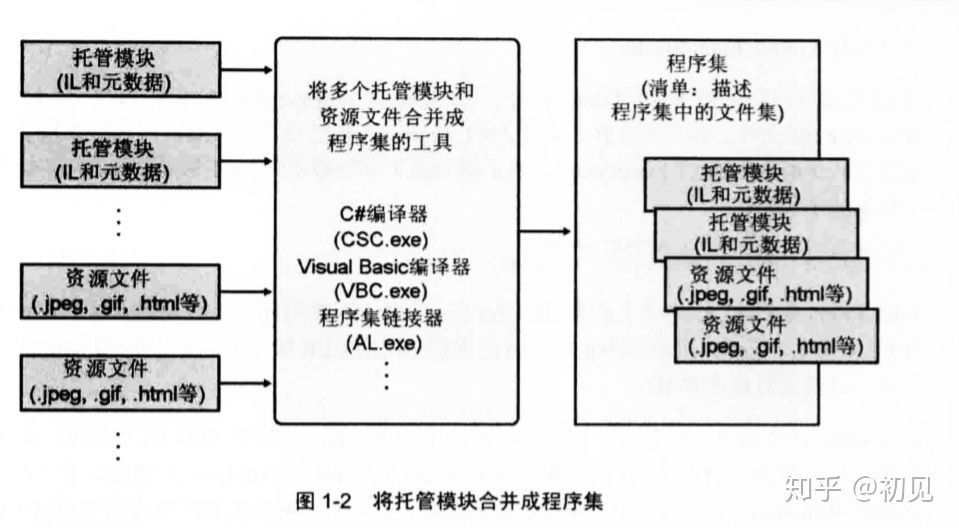

当加载了公共语言运行时时，电脑必须安装了.NET Framework,同时CLR会检测目标平台，如32位Windows，或64位windows，然后决定创建对应的进程；

如图1-2，托管程序集同时包含元数据和IL，当编译器把源代码转换为中间语言IL后，为了执行方法，CLR会把方法的IL转换为本机（native）CPU指令，即JIT（just in time“即时”）编译

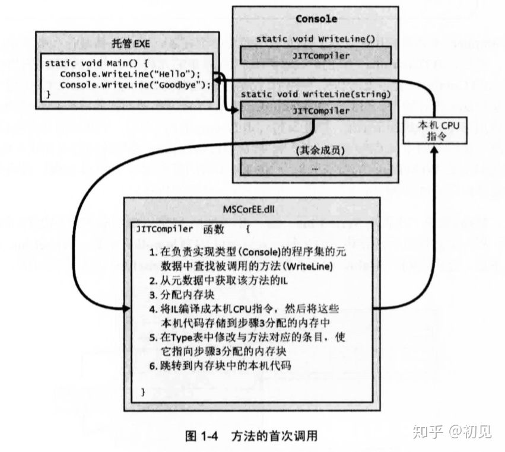

在方法执行前，CLR会检测代码引用的所有类型，然后分配一个内部数据结构来管理引用访问，在这个数据结构中每个方法会有一个对应的记录项，每个记录项都包含地址，根据地址找到函数的实现，CLR将每个记录项都设置成（指向）一个内部的未编档函数，即JITCompiler当方法首次调用WriteLine时，JITCompiler会被调用，将方法的IL代码编译为本机的CPU指令。当方法第一次被调用时，JIT编译器会验证IL代码，当第二次时，由于第一次已经完成了验证和编译，所以第二次会直接执行。

1.Mono

mono即基于.NET Framework 的开源实现，基于C#的ECMA标准，包含C#编译器和CLR。mono使C#拥有了跨平台的能力。

2.为什么Mono能跨平台？

因为它使用了CIL（Common Intermediate Language）的通用中间语言，也叫MSIL的指令集，CIL可以在任何支持CLI（Common Language Infrastructure）“通用语言基础结构”的环境下运行，由于CIL能运行在所有支持CLI的环境中，比如.net运行时或者mono运行时，也就是说和具体的平台或者CPU无关。

.net从一个抽象上来说其实是一个理念，即使得多种语言编写的程序能够通过一个通用的runtime运行在不同的操作系统以及硬件平台上。但光有理念不行，还需要实现，我们这里把对于.net里面的某个实现叫做.net platform（比如.net framework就是一个在windows上实现的.net platform，mono则是一个跨平台的.net platform）。一个.net platform想要达成.net的目标，就需要一些组件，比如上图中CLR通用语言运行时，比如FCL基础类库，比如各种语言的编译器，编译器编译出来的东西想要能在CLR中运行，那也需要遵循一定的标准，这就是CLI和CIL，CIL规定了编译输出的规则，而CLI规定了编译器输入语言的规则，只有符合这种标准的语言才能编译成CIL语言运行在CLR中。

好了现在有了CIL和CLR，程序员可以用符合CLI的语言比如C#编写程序了，然后将其编译成CIL，最后在CLR中运行。但是问题来了，程序员开发程序的时候需要用到一些功能以及数据结构，不可能所有的功能细节都自己实现，不然开发成本也太高了，所以就需要提供一些基础类库，方便程序员进行开发，那么需要提供哪些基础类库呢？这也需要一个标准，而.Net Standard就是用于这个目的，它规定了某个.net platform需要提供哪些API给开发者。这样的话加入一个开发者在.net platform A（比如.net framework）上开发了一个项目，然后想迁移到.net platform B（比如Mono）上，那么只要两个platform实现了同一个.net standard那么源代码就无需修改可以直接编译运行。

不过还有一个问题，假如我有一台机器，装了.net platform A（比如.net framework）和.net platform B（比如Mono），那么我在A上编译出来的一个.net程序放到B上可以运行么？理论上应该没问题，毕竟CIL是统一的，虽然一个是A的CLR一个是B的CLR，但是它们都是用来处理CIL程序，就像java代码编译出来既可以运行在JVM上也可以运行在delvik上一样。然而实际上不一定，因为CIL本身也不是一成不变的，它也有自己的版本，看下面这个文档：

<https://msdn.microsoft.com/en-us/library/bb822049.aspx>

里面的表格详细说明了.net framework和CLR版本之间的关系，从.net framework 2.0到3.5使用的是CLR 2.0，.net framework 4.0以后使用的是CLR 4.0，中间没有CLR 3.0版本。这也就意味着CIL语言本身也在发生变化，面向CLR 4.0编译出来的程序自然是不能运行在CLR 2.0上的。

说那到底什么是.net framework呢？个人理解从抽象角度说.net framework是对.net标准（这个标准具体包括CLI，CIL，.net standard等）在windows平台上的一套实现，具体上说.net framework包含一整套解决方案，包含许多字组件，比如编译器、CLR、FCL等等，其中每个组件都有自己的版本，比如编译器有自己的版本用于适应不同版本的语言，比如.net framework 3.5的编译器只支持到C# 3.0，最新已经到C# 7.0了；每个版本的.net framework提供的FCL也在不断丰富，比如System.LINQ到.net framework 3.5才有；CLR的版本也会不同，之前已经说过了。因此.net framework的版本其实就是其组件版本的一个集合，高版本的.net framework中的每个子组件都进行了一定的版本更新。

其实正常来说.net framework只是对.net标准的一套实现而已，其他的对于.net标准的实现完全可以将各种不同版本的组件组合起来用，比如我一套.net platform提供了.net framework 4.0的FCL和面向C# 6.0的编译器，但用的是CLR 2.0的运行时，这并没有什么问题，只要编译器和运行时匹配就行了（mono就是这么干的）。但是由于.net是微软提出来的而且.net framework是微软开发的，那别的.net platform实现自然就已.net framework为标杆，每个版本的.net framework都提供了一些新的features，支持.net framework x.x就是说这个.net platform实现了x.x版本.net framework的特性，比如下面是mono主页上的文档：

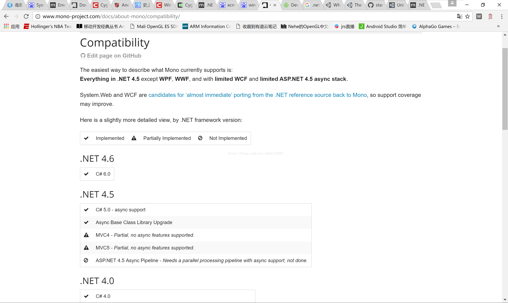 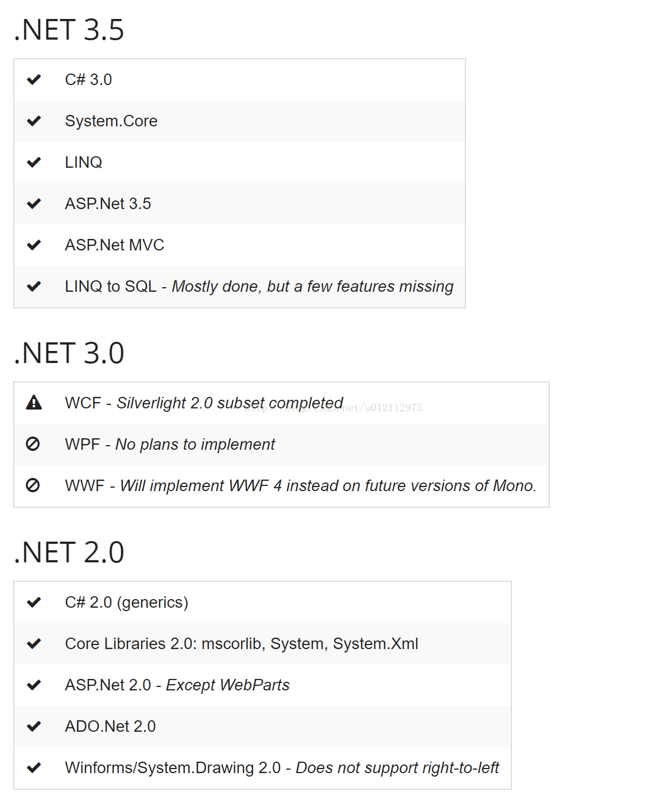

可以看到上面说的是.net 4.6 4.5，这里表示的其实是.net framework，这个图片的意思就是最新版本的mono已经实现了.net framework 4.6中支持C# 6的特性，以及此外还可以发现只有.net 3.5和2.0是mono完全实现了其所有特性。准确的说其实是mono实现了.net framework的大部分feature，并且还提供了一些mono自己的class library。Mono和.net framework大致有一个对应关系，如这篇文章所说：<http://www.cnblogs.com/zhaoqingqing/archive/2016/08/12/5762867.html>

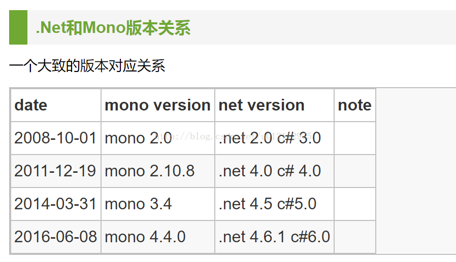

这个表似乎不完全正确，mono 2.0实现了System.LinQ组件，这个组件在.net 3.5中提供，所以mono 2.0对应的应该是.net 2.0/3.5，即两者之和。不过还是可以当做一个参考。所以说加入一个程序集是用.net framework 3.5构建的，引用了一些dll如system.core以及system.linq，那么要想把其导入mono项目中，就必须保证mono的版本高于2.0，不然会找不到相应的引用。

还有一点需要注意，网上很多讲.net版本的时候讲.net framework version和CLR version混为一谈，有些时候说的.net 2.0指的其实是CLR 2.0。另外有些人把System.Environment.Version误以为是.ne framework版本，其实不是，msdn上说的很明确，这个值指的是CLR的版本：

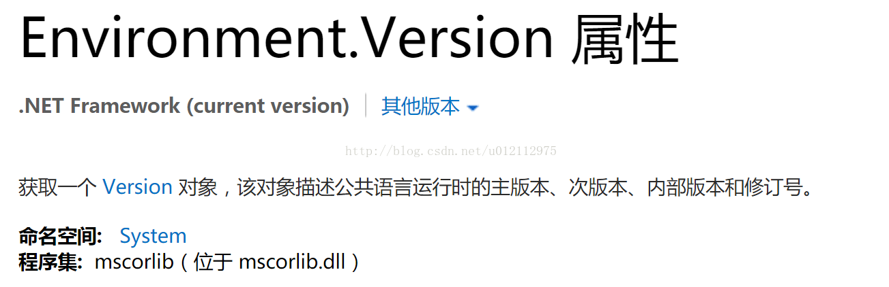

另外还有一点值得注意，在vs中构建一个.net framework 3.5的项目时是，引用的System.dll是在系统的.net v2.0目录下的，也就是说.net framework不是独立的，而是依赖于.net framework 2.0.不过.net 4.0以后的版本好像就不是这样了，每次新版本都是独立的。

最后谈一下Unity，Unity为了跨平台使用了Mono，其使用的Mono版本可以通过代码或者命令行方式获得，unity forum上已经有牛人说明了：

<http://answers.unity3d.com/questions/259448/how-to-determine-mono-version-of-unity-.html>

我自己的测试结果是mono 2.0

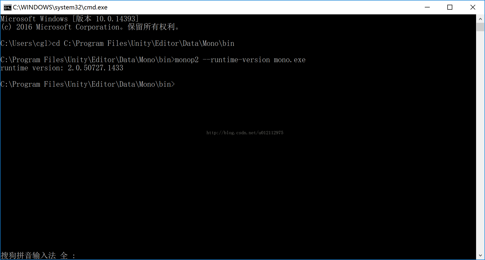

查了一下mono官网，mono 2.0是08年的老古董（Unity居然还在用，貌似是版权问题，没有深究），而用vs打开一下Unity中的脚本，查看一下项目构建文件.csproj：

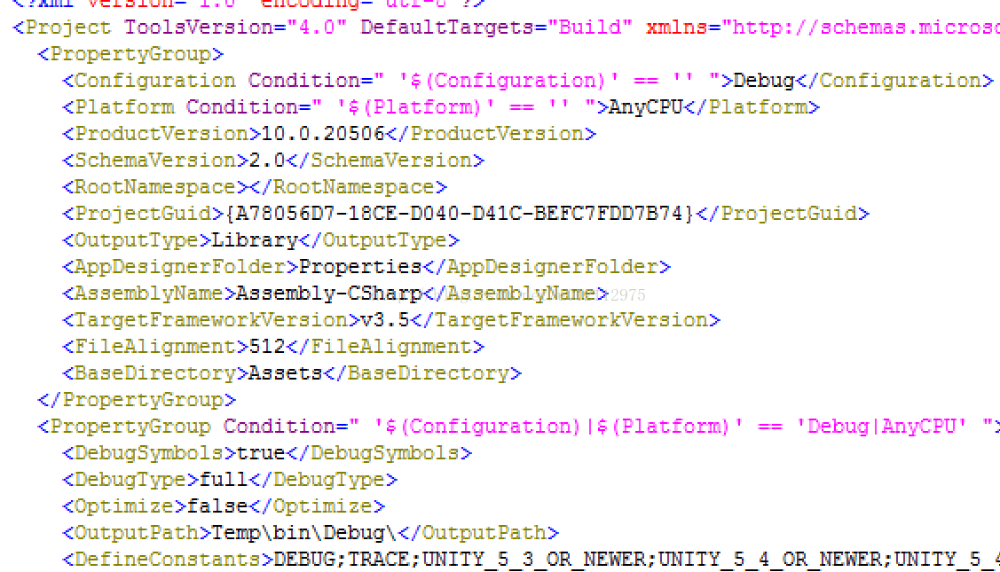

可以看到Unity用的是.net 3.5，所以难道Unity的脚本是用.net framework 3.5构建的？显然不是。

我们知道vs有一个东西叫VSTU，它最大的作用就是可以用vs的断点调试功能调试Unity Editor。Unity中的脚本在vs中打开的时候会构建一个VSTU项目。VSTU项目虽然跟普通VS项目看上去很像，但其实VSTU项目本质上并不是真正的vs项目，如果你右键项目->属性是没有反应的（VSTU 2.1以前有反应，之后就禁用了），而且右键项目中的引用也不会有添加引用选项，其实VSTU是把vs当做了一个功能强大的编辑器。

但VSTU不只是利用了VS进行语法检查这么简单，它的另一个作用就是断点调试。在没有断点调试的情况下，Unity使用自己的编译器进行编译，生成Assembly-CSharp.dll（在/Library/目录中），点击Play按钮的时候用的是这个dll，而用VS进行断点调试的时候则会用VS的编译器编译出Assembly-CSharp.dll以及pdb文件，在\Temp\UnityVS\_obj\Debug\目录中，此时点击Play用的就是这个dll。当然build出exe的时候用的还是自己的编译器。

VSTU对项目进行了限制，不能直接在VS中添加新的dll，但可以拷贝到Unity项目的Asset目录下，这样Unity会重新构建VSTU项目，把拷进去的dll显示在引用列表里面。

VSTU构建的项目是基于.net framework 3.5的。因为Unity用的是mono 2.0啊，mono 2.0实现的feature包括.net framework 2.0和3.5，而UnityEngine.dll引用了System.Core.dll，而这个dll在.net framework 3.5才有，如果是是基于.net framework 2.0构建，那么第一有些mono 2.0支持的feature在vs里面就会找不到，另外也无法断点调试，因为编译通不过。

其实也可以在Unity的安装目录中寻找一些端倪，在windows下为：

C:\Program Files\Unity\Editor\Data\Mono\lib\mono\2.0

这个目录2.0目测就是mono的版本，目录中有很多dll，比如System.\*.dll，这说明unity自带了mono项目，提供了mono 2.0中实现的基础类库。虽然Unity的脚本可以在像VS以及MonoDeveloper中打开，但是在build的时候用的还是Unity自带的Mono中的编译器，而Mono 2.0仅支持到C# 3.0，所以有些最新的语法在Unity里面是无法编译通过的（Unity 5.3.5 p8提供了一个新的编译器mono 4.4用于测试，但是似乎没有下文了）。

总结一下就是，Unity使用的是mono 2.0，支持C# 3.0，提供与.net framework 3.5/2.0 API兼容的类库（mono 2.0实现了.net framework 2.0 + 3.5的feature，但是没有实现.net framework 3.0的WPF的feature，所以官网的说法是\*\*.Net 2.0/3.5 framework profile\*\*），使用了与CLR 2.0兼容的mono runtime，因此用vs构建Unity的dll需要.net framework 3.5以下，不然runtime不兼容；如果要用到UnityEngine等Unity的功能必须用.net framework 3.5这个版本，不然vs项目找不到System.Core.dll，无法通过编译，如果只是一些工具类，不需要引用UnityEngine.dll，那么用.net framework 2.0构建是可以的。vs只是一个第三方构建工具，想要构建出Unity能用的dll就不能使用Unity（Mono 2.0）不支持的feature。

最后有一点之前一直在困扰我，但今天稍微有点想通了，就是Unity的Player Setting里面有个API compability Level：

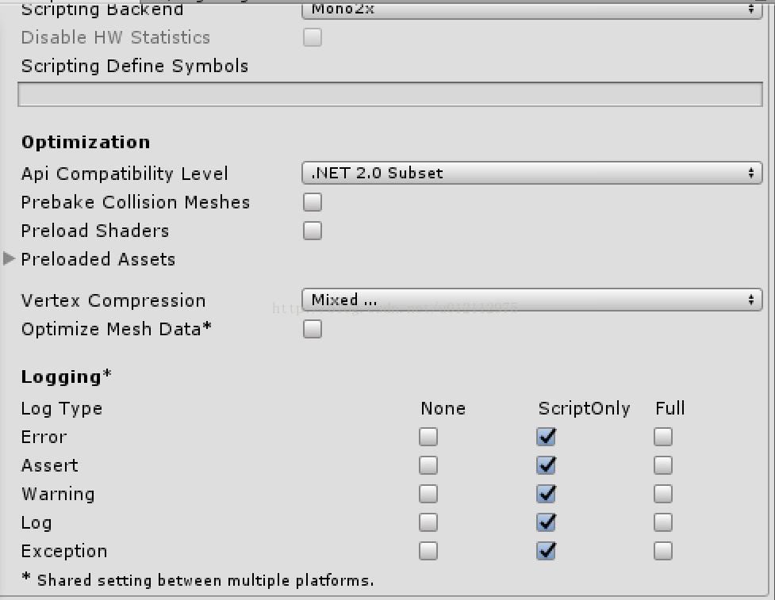

这个只有两个选项：.Net 2.0和.Net 2.0 Subnet，这个说实话让人很不解，从字面上讲是指API兼容，那兼容到.net 2.0难道是指兼容.net framework 2.0的FCL API？但Unity可以用到.net framework 3.5的一些库啊。网上找了一通以后发现了如下网址：

<https://docs.unity3d.com/412/Documentation/ScriptReference/MonoCompatibility.html>

以及这个Question：

<https://forum.unity3d.com/threads/unity-supports-c-3-5-or-2-0.111440/>

其中有一句话很关键：

**The 2.0 there is likely a good reflection of what you have at least**

所以梳理一下就是.Net 2.0和.Net 2.0 Subnet是指编写的C#代码能够引用的函数集合的不同，如果选择了subset那么dll就不会被导入到项目中来。比如同一个项目用.Net 2.0和.Net 2.0 Subnet构建出来的目录如下，可以很明显看到两者的差别。

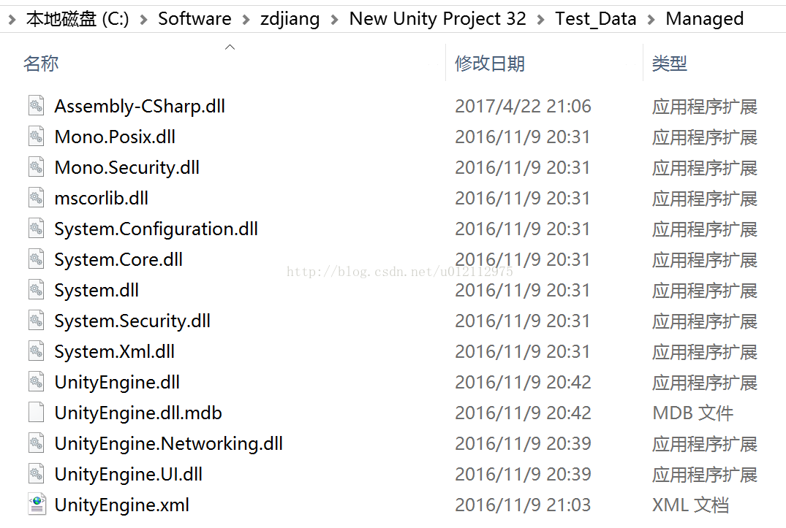  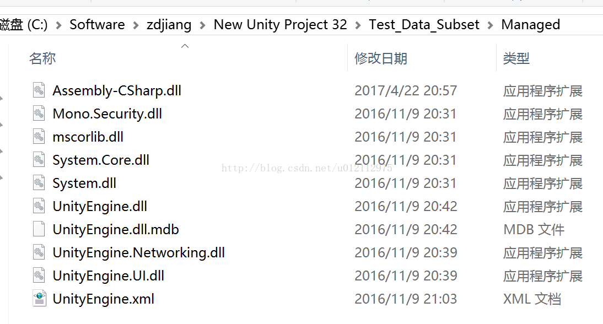

当新建一个Unity项目时，只会有一些核心的dll会被导入到项目中，其他的dll需要从外部拷贝到项目的Asset文件夹下，VSTU项目中是不能直接添加引用的，个人感觉VSTU对项目的限制有点多，像是把开发者当成傻子，因为你在用Unity那么这些功能就给你禁用掉，不过目测可以通过修改.sln或者.csproj文件来实现一些特殊需要。那.net framework 3.5呢？其实Unity支持的是.net framework 2.0 + 3.5，跳过了3.0，因为3.0是WPF的，Unity不需要，.net 2.0指的是你至少可以用哪些feature。

Unity最近因为加入了.Net基金会，出了几个用最新mono的测试版：

<https://forum.unity3d.com/threads/upgraded-mono-net-in-editor-on-5-5-0b4.433541/>

Unity 5.5.0 b4里面API compability Level增加了一个4.6选项，其实是把原来的mono 2.0换成mono 4.6进行测试，mono 4.6支持C# 6.0，并且开发者可以使用.net 4.6的API写程序，然而也不知道什么时候能有稳定版。而且mono都快要被淘汰了，以后目测都是IL2CPP了。

-   <https://www.cnblogs.com/w-wfy/p/7450167.html>

-   <https://blog.csdn.net/wzjssssssssss/article/details/80196314>
