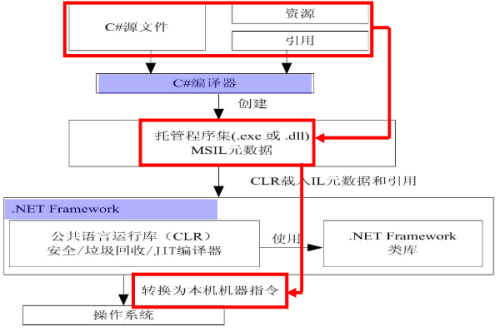
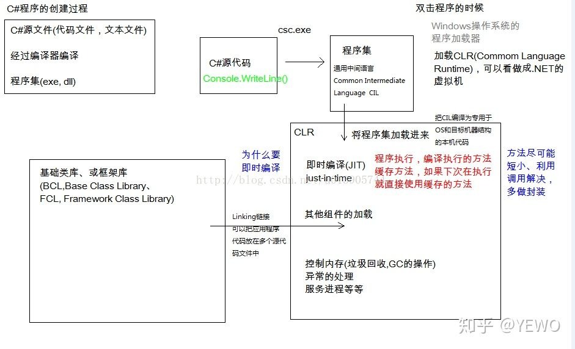
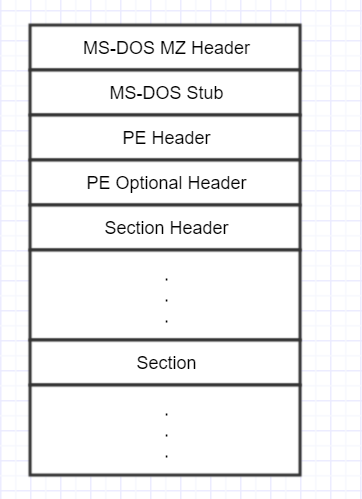
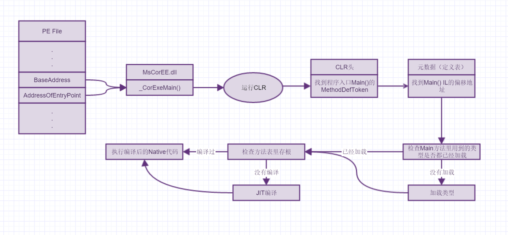
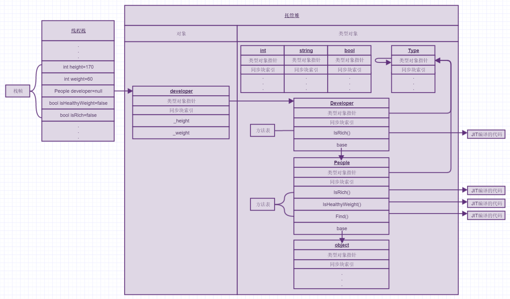

用C#编写的源代码被编译为一种符合CLI规范的中间语言（IL）。IL代码与资源（例如位图和字符串）一起作为一种称为程序集的可执行文件存储在磁盘上，通常具有的扩展名为.exe（应用程序）或.dll（库）。程序集包含清单，它提供有关程序集的类型、版本、区域性和安全要求等信息。

执行C#程序时，程序集将加载到CLR中，它可能会根据清单中的信息执行不同的操作。然后，如果符合安全要求，CLR就会执行实时（JIT）编译以将IL代码转换为本机机器指令。CLR还提供与自动垃圾回收、异常处理和资源管理有关的其他服务。由CLR执行的代码有时会称为“托管代码”。

\[\]



## 编译器

[CSC.exe](https://docs.microsoft.com/zh-cn/dotnet/csharp/language-reference/compiler-options/)是C＃编译器，可以编译您的C＃代码并生成可执行（.exe）文件，动态链接库（.dll）或代码模块（.netmodule）。

[MSBuild](https://docs.microsoft.com/zh-cn/visualstudio/msbuild/msbuild)是Microsoft Build Engine，可用于从Visual Studio生成[项目和解决方案](https://docs.microsoft.com/zh-cn/visualstudio/ide/solutions-and-projects-in-visual-studio) 。 此外，即使我编写了一些.cs文件和一个自定义项目文件（.xxproj）来构建它们，我们也可以使用msbuild.exe并使用`msbuild xxx.xxproj`类的命令来构建它们。 请参阅[本文档](https://docs.microsoft.com/zh-cn/visualstudio/msbuild/walkthrough-creating-an-msbuild-project-file-from-scratch) 。

**它们之间的关系：**

1. 如果我只有几个.cs文件，并且想要编译它们以输出.exe及其它内容，那么csc.exe就足够了。 [在命令行中](https://docs.microsoft.com/zh-cn/dotnet/csharp/language-reference/compiler-options/command-line-building-with-csc-exe) （ `by cmd.exe or other things` ） 使用它来编译代码。

2. 如果创建项目文件（.xxproj）以更好地控制资源，.cs文件和其他文件，则可以[在命令行中使用msbuild](https://docs.microsoft.com/zh-cn/visualstudio/msbuild/msbuild-command-line-reference)来构建它们以输出.exe或其他内容。 我们应该知道的一点是，msbuild.exe不仅可以构建C＃代码，而且还可以构建`VB.net, C++, F#` ...当我使用msbuild使用`msbuild xx.csproj`类的命令来构建C＃代码时，它将`call csc.exe to compile C# code and pass parameters read from the .csproj file to it` 。

3. 尽管msbuild是Visual Studio中的构建系统，但它并不依赖于Visual Studio。

您可能想知道msbuild传递给特定构建的csc的信息。 在这种情况下，只需使用msbuild的详细程度开关即可：

```
msbuild MyProject.csproj /target:rebuild /verbosity:diag
```

请参阅[使用MSBuild获取构建日志](https://docs.microsoft.com/zh-cn/visualstudio/msbuild/obtaining-build-logs-with-msbuild?view=vs-2015&redirectedfrom=MSDN) 。

### mono系列

Mono C＃编译器被认为是C＃1.0，C＃2.0，C＃3.0，C＃4.0，C＃5.0和C＃6.0（ECMA）的完整功能，并且部分支持C＃7。<https://www.mono-project.com/docs/about-mono/languages/csharp/>

从历史上看，存在相同编译器的各种版本。

- gmcs：编译器以2.0 mscorlib为目标。引用2.0概要文件库（在.NET 2.0和.NET 3.5中定义的API）并公开完整的C＃3.0语言。

- smcs：以2.1 mscorlib为目标的编译器，以构建Moonlight应用程序。 引用2.1概要文件库（为Silverlight定义的API）并公开完整的C＃3.0语言。这是用于创建Silverlight / Moonlight应用程序的编译器。

- dmcs：编译器针对4.0 mscorlib。引用4.0概要文件库（.NET 4.0中定义的API）并支持C＃4.0。

## 编译为 MSIL

编译为托管代码时，编译器将源代码转换为 Microsoft 中间语言 (MSIL)，这是一组独立于 CPU 且可以有效地转换为本机代码的说明。 MSIL 包括有关加载、存储、初始化和调用对象方法的说明，以及有关算术和逻辑运算、控制流、直接内存访问、异常处理和其他操作的说明。 代码可以运行之前，必须将 MSIL 转换为特定于 CPU 的代码，通常通过 [实时 (JIT) 编译器](https://docs.microsoft.com/zh-cn/dotnet/standard/managed-execution-process?redirectedfrom=MSDN#compiling_msil_to_native_code)实现。 由于公共语言运行时为其支持的每个计算机基础结构提供一个或多个 JIT 编译器，同一组的 MSIL 可以在任何受支持的基础结构上进行 JIT 编译和运行。

当编译器生成 MSIL 时，它还生成元数据。 元数据描述代码中的类型，包括每种类型的定义、每种类型的成员的签名、代码引用的成员以及运行时在执行时间使用的其他数据。 MSIL 和元数据包含在一个可移植的可执行 (PE) 文件中，该文件基于且扩展已发布的 Microsoft PE 和历来用于可执行内容的通用对象文件格式 (COFF)。 容纳 MSIL 或本机代码以及元数据的这种文件格式使操作系统能够识别公共语言运行时映像。 文件中元数据的存在以及 MSIL 使代码能够描述自身，这意味着将不需要类型库或接口定义语言 (IDL)。 运行时在执行期间会根据需要从文件中查找并提取元数据。

> **什么是非托管代码(unmanaged code)？**
>
> **非托管代码，直接编译成目标计算机码，在**[**公共语言运行库**](http://baike.baidu.com/view/159628.htm)**环境的外部，由操作系统直接执行的代码，代码必须自己提供垃圾回收，类型检查，安全支持等服务。如需要内存管理等服务，必须显示调用操作系统的接口，通常调用Windows SDK所提供的API来实现内存管理。**
>
> 当项目选择名字以MFC，ATL，Win32开头的项目类型，那么这个项目所产生的就是非托管程序。
>
> 非托管代码就是在Visual Studio .NET 2002发布之前所创建的代码。例如Visual Basic 6, Visual C++ 6, 最糟糕的是，连那些依然残存在你的硬盘中、拥有超过15年历史的陈旧C编译器所产生的代码都是非托管代码。托管代码直接编译成目标计算机的机械码，这些代码只能运行在编译出它们的计算机上，或者是其它相同处理器或者几乎一样处理器的计算机上。非托管代码不能享受一些运行库所提供的服务，例如安全和内存管理等。如果非托管代码需要进行内存管理等服务，就必须显式地调用操作系统的接口，通常来说，它们会调用Windows SDK所提供的API来实现。就最近的情况来看，非托管程序会通过COM接口来获取操作系统服务。
>
> 跟Visual Studio平台的其他编程语言不一样，Visual C++可以创建非托管程序。当你创建一个项目，并且选择名字以M FC，ATL或者Win32开头的项目类型，那么这个项目所产生的就是非托管程序。

## 将 MSIL 编译为本机代码

运行 Microsoft 中间语言 (MSIL) 前，必须根据CLR公共语言运行时将其编译为目标计算机基础结构的本机代码。 .NET Framework 提供两种方法来执行此转换：

- .NET Framework 实时 (JIT) 编译器。

- .NET Framework [Ngen.exe（本机映像生成器）](https://docs.microsoft.com/zh-cn/dotnet/framework/tools/ngen-exe-native-image-generator)。

### 由 JIT 编译器编译

在加载和执行程序集的内容时，JIT 编译在应用程序运行时按需将 MSIL 转换为本机代码。 由于公共语言运行时为每个受支持的 CPU 基础结构提供 JIT 编译器，开发人员可以构建一组 MSIL 程序集，这些程序集可以进行 JIT 编译并可在具有不同计算机基础结构的不同计算机上运行。 但是，如果你的托管代码调用特定于平台的本机 API 或特定于平台的类库，它将仅在该操作系统上运行。

JIT 编译将执行期间可能永远不会调用的某些代码的可能性考虑在内。 它根据需要在执行期间转换 MSIL，而不是使用时间和内存来将 PE 文件中所有 MSIL 转换为本机代码，并在内存中存储生成的本机代码，以便该进程上下文中的后续调用可以对其进行访问。 加载类型并将其初始化时，加载程序创建并将存根附加到类型中的每个方法。 第一次调用某个方法时，存根将控件传递给 JIT 编译器，后者将该方法的 MSIL 转换为本机代码，并将存根修改为直接指向生成的本机代码。 因此，对 JIT 编译的方法的后续调用会直接转到本机代码。

### 使用 NGen.exe 的安装时代码生成

由于在调用该程序集中定义的各个方法时，JIT 编译器将程序集的 MSIL 转换为本机代码，因此它在运行时中对性能产生负面影响。 在大多数情况下，这种性能降低的程度是可以接受的。 更为重要的是，由 JIT 编译器生成的代码会绑定到触发编译的进程上。 它无法在多个进程之间进行共享。 若要允许生成的代码跨应用程序的多个调用或跨共享一组程序集的多个进程进行共享，则公共语言运行时支持预编译模式。 这种预编译模式使用 [Ngen.exe（本机映像生成器）](https://docs.microsoft.com/zh-cn/dotnet/framework/tools/ngen-exe-native-image-generator)将 MSIL 程序集转换为本机代码，非常类似 JIT 编译器执行的操作。 但是，Ngen.exe 的操作在三个方面不同于 JIT 编译器的操作：

- 它在运行应用程序之前而非运行该应用程序时，将 MSIL 转换为本机代码。

- 它一次编译整个程序集，而不是一次编译一种方法。

- 它将本机映像缓存中生成的代码作为磁盘上的文件保存。

> 基本上每个人都知道的是，所有.Net语言都将被编译成为一个叫做IL汇编的中间语言。但是计算机是如何执行这个中间代码的，却是很多人不知道，甚至理解错误了的。JIT是.NET程序运行的重要部件之一，全称是即时编译器。很多人都以为JIT其实就是跟Java VM差不多的东西，是一个Interpreter，在运行时读取IL汇编代码，然后模拟成x86代码（也就是俗称的虚拟机）。但是事实上，.NET使用的是更为高级的技术。 .Net程序被加载入内存以后，当某段IL代码被第一次运行的时候，JIT编译器就会将这段IL代码，全部编译成本地代码，然后再执行。这也就是为什么.NET程序第一次运行都启动很慢的原因！ 随.NET库，微软还附带了一个工具，可以事先将.NET程序所有的IL代码都编译成本地代码并保存在缓存区中，这样一来，这个程序就跟c++编译的一模一样了，没有任何区别，运行时也可以脱离JIT了（这里不要混淆了，这里不是说可以脱离.NET库，而是说不需要在进行即时编译这个过程了）。所以，请不要将.NET和Java混为一谈，两个的运行效率根本不是一个等级的！
>
> JIT的优化指的是可以针对本地CPU，在编译时进行优化。传统程序在编译时，为了保证兼容性，通常使用最通用的指令集（比如古老的386指令集）来编译。而JIT知道CPU的具体类型，可以充分利用这些附加指令集进行编译，这样的性能提升是很可观的。

# 运行

PE（Portable Execute）文件是Windows下可执行文件的总称，常见的有DLL，EXE，OCX，SYS等，事实上，一个文件是否是PE文件与其扩展名无关，PE文件可以是任何扩展名。那Windows是怎么区分可执行文件和非可执行文件的呢？我们调用LoadLibrary传递了一个文件名，系统是如何判断这个文件是一个合法的动态库呢？这就涉及到PE文件结构了

C#生成的exe既然是window下可执行文件，那也就是标准的PE文件，和普通win32的exe文件格式一样。我们来看下exe文件的格式：

> dll文件本质上和exe一样，只是少了入口函数。



MS-DOC MZ Header和MS-DOS Stub是为了兼容DOS系统存在的，目的是使这个exe在DOS下执行时弹出一个提示"This program cannot be run in DOS mode"。

PE Header包含了这个文件的一些信息，如：文件创建日期，文件类型，Section的数量，Optional Header的大小等等。详细可以参考Winnt.h里的结构\_IMAGE_FILE_HEADER。

PE Optional Header则包含了文件的版本号以及重要的基地址和AddressOfEntryPoint（RVA-Relative Virtual Address)，这是程序执行的入口地址，双击exe后就从这里开始执行。对C#程序来说，这里指向的是.net的核心库MsCorEE.dll的\_CorExeMain()函数。当然这是针对XP系统的，XP以后的系统，OS Loader已经可以判断出这个PE是否包含CLR头来决定是否运行MsCorEE.dll的\_CorExeMain()函数。

Section有很多，包括代码节，数据节等，C#程序会把CLR头，元数据，IL放在这里面。

> CLR是什么呢，全称Common Language Runtime，公共语言运行时，CLR主要是管理程序集，托管堆内存，异常处理和线程同步等等。

CLR头具体可以参考CorHdr.h中的IMAGE_COR20_HEADER结构，如下：

```
typedef struct IMAGE_COR20_HEADER
    {
        // CLR版本信息
        ULONG cb;
        USHORT MajorRuntimeVersion;
        USHORT MinorRuntimeVersion;

        IMAGE_DATA_DIRECTORY MetaData; //元数据
        ULONG Flags;
        ULONG EntryPointToken;  //入口函数Main的标识


        IMAGE_DATA_DIRECTORY Resources;  //资源
        IMAGE_DATA_DIRECTORY StrongNameSignature;  //强名称标识


        // Regular fixup and binding information
        IMAGE_DATA_DIRECTORY CodeManagerTable;
        IMAGE_DATA_DIRECTORY VTableFixups;
        IMAGE_DATA_DIRECTORY ExportAddressTableJumps;

        // Precompiled image info (internal use only - set to zero)
        IMAGE_DATA_DIRECTORY ManagedNativeHeader;

    }
    IMAGE_COR20_HEADER;
```

元数据很重要，验证代码类型安全，GC的对象引用跟踪还有我们常用的反射都需要用到元数据。

元数据主要由定义表，引用表，清单表组成。

定义表包括应用所有的类型，方法，字段，属性，参数，事件的定义,代码里任何的定义项都可以在这个表里找到，反射就是靠这个表只要一个名字就能得到属性或函数。运行时的类型安全检查也离不开它。

引用表包括程序集，类型和成员的引用，我们知道GC在回收内存时先默认认为所有对象都是垃圾，然后通过线程栈上的根（cpu寄存器，局部变量，参数，静态变量）找引用的对象，能找到的说明还在使用就去掉垃圾标记，这个表可以让GC在回收内存时方便从根找到所有引用。

清单表主要是程序集，文件，资源的定义。

现在来看看双击后是怎样运行的：



双击文件后OS Loader加载PE文件并解析，在PE Optional Header里找到基地址和RVA，通过这两个确定了程序的入口地址，这个地址指向MsCorEE.dll的\_CorExeMain()，执行它。\_CorExeMain()开始执行，选择加载合适版本的CLR，CLR开始运行，CLR运行时会分配一个连续的地址空间用作托管堆，并用一个指针NextObjPtr指到开始位置，下次分配内存时就从指针指的位置开始。

CLR运行后从CLR头里找到应用程序入口标识，也就是Main()方法的MethodDefToken，通过这个标识在元数据表MethodDef里找到Main方法的偏移位置，这样就可以找到Main()的IL代码。

CLR检查Main方法里面是否有没加载的类型，没有的话就加载进来并在托管堆上建一个类型对象，类型对象包含静态字段，方法，基类的引用。然后给类型的方法表里每个方法一个存根，存根是用于标识是否被JIT编译过。

> JIT: just-in-time Compiler，即时编译器。

JIT编译之前CLR会对Main方法的代码进行验证，确保类型安全且元数据正确，一切没问题后先检查类型方法表里这个方法的存根，不为空的话表示已经编译过就不需要再次编译，没有的话JIT把这段IL代码编译成本地代码保存到内存中并方法表的存根做上标记，然后JIT返回编译前的位置并把原来CLR指向JIT的地址修改为指向本地代码的地址，这样函数的本地代码开始执行。程序执行到哪里就编译到哪里，没有执行到的就不会加载和编译，同样的代码再次执行的话就直接在内存里拿了，这也是为什么第一次运行C#时比较慢而后面就快的原因。这样就开始陆续执行所有的代码，程序也就跑起来了。

在内存上，运行线程会把函数的参数和局部变量压入线程栈上，栈上的空间默认是1M，方法的参数和局部变量都会压到函数的栈帧上，方法里的对象在托管堆NextObjPtr指向的位置分配内存并把内存地址存到栈上的局部变量里。CLR会给托管堆上的每个对象包括对象类型都添加两个字段，一个对象类型指针，一个同步块索引。

> 说起栈帧，大家在调试代码时应该都喜欢用CallStack吧，这可以通过看调用栈很方便来定位出问题的具体原因，这个CallStack也就是方法的栈帧的具体显示，一级一级的。

对象类型指针从字面上就很容易知道跟类型有关。CLR刚开始运行时就分配了一个Type的对象类型，他的对象类型指针指向自己，后面创建的对象类型的对象类型指针指针就指向这个Type，而new出来的对象的对象类型指针就指向它的类型，这样所有对象都能找到自己的类型使CLR在运行时能确保类型安全。

同步块索引的格式是前6个标志位加后面26位内容（32位系统），作用则有好几个。

\\1. 调用对象的gethashcode()后标志位改变一位，后26位会存储对象的hashcode，保证对象生命周期内hashcode的唯一；

\\2. lock时用到，CLR会维护一个同步块数组，每项由一个指向同步块的指针和对象指针组成，lock时同样改变标识位，然后去同步块数组找一个闲置项，后26则变成这项在数组中的索引，有人要问了，刚才hashcode不是用了这26位吗，现在变了，hashcode岂不是丢了。确实，hashcode在lock之后不能直接存到索引了，不过同步块中专门准备了一个字段用来存hashcode，所以可以转移到同步块中，这样设计是为了节省内存，因为大部分情况下是不用lock的，也就不需要增加多余的同步块。

另外为什么是索引而不是地址呢，因为同步块数组的大小不是固定的，随着对象的增多而变大，在内存上的位置可能会发生变化，所以用索引就不用管数组在哪个位置了。

当线程进入lock后检查同步块的m_motion，发现没有标识则进入lock区域并把标识改变，如果已经有同一个线程进去则把计数器加1，如果已经有其他线程则等待。

\\3. 垃圾回收时的标识，GC触发时首先认为所有的对象都是垃圾，由局部变量，寄存器，静态变量这些根向上找，凡是包含的对象都认为还有引用，在同步块索引上修改一位标识，当所有对象都遍历过后没有标识的对象就会被清掉，然后再是整理内存、修改引用地址等。

看个简单的例子，只用于演示，不考虑合理性：

```
using System;

namespace Test
{
    class Program
    {
        static void Main(string[] args)
        {
            int height = 170;
            int weight = 60;
            People.Find();
            People developer = new Developer()(height, weight);
            bool isHealthyWeight = developer.IsHealthyWeight();
            bool isRich = developer.IsRich();
        }
    }

    class People
    {
        int _height;
        int _weight;

        public People(int height, int weight)
        {
            _height = height;
            _weight = weight;
        }

        public virtual bool IsRich();

        public bool IsHealthyWeight()
        {
            var healthyWeight = (Height - 80) * 0.7;
            return Weight <= healthyWeight * 1.1 && Weight >= healthyWeight * 0.9;
        }

        public static string Find(string id) { return ""; }
    }

    class Developer : People
    {
        public Developer(int height, int weight) : base(height, weight)
        { }

        public override bool IsRich()
        {
            return false;
        }
    }
    
}
```



\**图片不清楚可以放大看*

首先判断类型是否都加载，用到了int，bool，string，这些是在mscorlib.dll程序集的system命名空间下，所以先加载mscorlib.dll程序集，再把int，bool，string加到类型对象里。另外还有我们自己定义的Developer和People，也把类型对象创建好，另外也别忘了基类object，也要加载进来。（实际上还有double啊，这里就没画了）另外继承类的类型对象里面都有个字段指向基类，所以才能往上执行到基类方法表里的方法。

局部变量都在线程栈上，Find()方法是静态方法，直接去People类型对象的方法表里去找，找到后看是否有存根标识，没有的话做JIT编译，有的话直接运行。

developer的实例化虽然是用People定义的，但实例还是Developer，所以developer的类型对象指针指向Developer，对象里除了类型对象指针还有实例字段，包括基类的。内存分配在托管堆上，并把地址给到线程栈上的变量中。

虚函数也一样，在运行时已经确定是Developer，所以会调用Developer方法表里的IsRich方法，一样先JIT，再运行。

以上就是一个简单的C#程序的运行过程和在内存上的表现，本篇主要内容来自CLR via C#这本书

- <https://www.cnblogs.com/brookshi/p/5273281.html>

- <https://docs.microsoft.com/zh-cn/dotnet/standard/managed-execution-process?redirectedfrom=MSDN#compiling_to_msil>

- <https://docs.microsoft.com/zh-cn/dotnet/standard/clr>

- <https://www.cnblogs.com/qtiger/p/11176575.html>