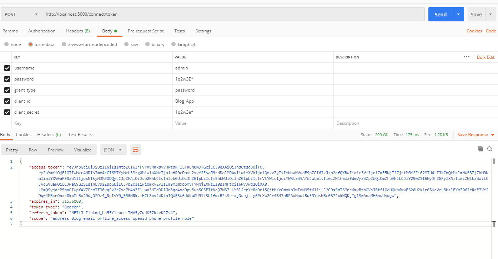
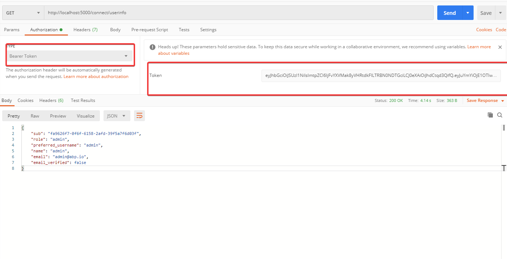

DotHass.Lobby.Domain\\IdentityServer\\IdentityServerDataSeedContributor.cs 中 CreateClientsAsync()

会在dataseed的时候生成默认数据

When I try to send a HTTPS POST request from a desktop (Servers are in production environment) the following message is displayed inside the console :

```
Error: unable to verify the first certificate
```

After: `Postman -> Preferences -> General -> SSL certificate validation -> OFF` **it works**

<https://localhost:5000/.well-known/openid-configuration>

1. <http://localhost:5000/connect/token>

   

2. <http://localhost:5000/connect/userinfo> 将type设置成bearer token,token填入上面获得的access_token



3\.注意发布release后.配置表中的  ..如果配置错误将会认证失败

appsettings.json

```
{
  "App": {
    "SelfUrl": "http://localhost:5000"
  },
  "ConnectionStrings": {
    "Default": "Server=localhost;User Id=root;Password=123456;Database=dothass.blog"
  },
  "AuthServer": {
    "Authority": "http://localhost:5000"
  },
  "IdentityServer": {
    "Clients": {
      "Blog_App": {
        "ClientId": "Blog_App"
      }
    }
  }
}
```

appsettings.Development.json

```
{
  "App": {
    "SelfUrl": "https://localhost:44377"
  },
  "AuthServer": {
    "Authority": "https://localhost:44377"
  }
}
```

还要注意请求的域名是否一样,127.0.0.1或者localhost...可能返回结果即使一样.但是不能授权.

使用[http://jwt.calebb.net/解析看下access_token](http://jwt.calebb.net/%E8%A7%A3%E6%9E%90%E7%9C%8B%E4%B8%8Baccess_token)

```
{
 alg: "RS256",
 kid: "1oauLjO2TtmvAH-4A7CCLg",
 typ: "at+jwt"
}.
{
 nbf: 1592054993,
 exp: 1623590993,
 iss: "http://127.0.0.1:5000",
 aud: "Blog",
 client_id: "Blog_App",
 sub: "fa9626f7-0f6f-6158-2afd-39f5a7f6d03f",
 auth_time: 1592054993,
 idp: "local",
 role: "admin",
 name: "admin",
 email: "admin@abp.io",
 email_verified: false,
 scope: [
  "address",
  "email",
  "openid",
  "phone",
  "profile",
  "role",
  "Blog",
  "offline_access"
 ],
 amr: [
  "pwd"
 ]
}.
```

```
	{
 alg: "RS256",
 kid: "1oauLjO2TtmvAH-4A7CCLg",
 typ: "at+jwt"
}.
{
 nbf: 1592055396,
 exp: 1623591396,
 iss: "http://localhost:5000",
 aud: "Blog",
 client_id: "Blog_App",
 sub: "fa9626f7-0f6f-6158-2afd-39f5a7f6d03f",
 auth_time: 1592055396,
 idp: "local",
 role: "admin",
 name: "admin",
 email: "admin@abp.io",
 email_verified: false,
 scope: [
  "address",
  "email",
  "openid",
  "phone",
  "profile",
  "role",
  "Blog",
  "offline_access"
 ],
 amr: [
  "pwd"
 ]
}.
```

# 错误

```
System.InvalidOperationException: IDX20803: Unable to obtain configuration from: '[PII is hidden. For more details, see https://aka.ms/IdentityModel/PII.]'.
 ---> System.IO.IOException: IDX20804: Unable to retrieve document from: '[PII is hidden. For more details, see https://aka.ms/IdentityModel/PII.]'.
 ---> System.Net.Http.HttpRequestException: The SSL connection could not be established, see inner exception.
 ---> System.Security.Authentication.AuthenticationException: The remote certificate is invalid according to the validation procedure.
   at System.Net.Security.SslStream.StartSendAuthResetSignal(ProtocolToken message, AsyncProtocolRequest asyncRequest, ExceptionDispatchInfo exception)
   at System.Net.Security.SslStream.CheckCompletionBeforeNextReceive(ProtocolToken message, AsyncProtocolRequest asyncRequest)
   at System.Net.Security.SslStream.StartSendBlob(Byte[] incoming, Int32 count, AsyncProtocolRequest asyncRequest)
   at System.Net.Security.SslStream.ProcessReceivedBlob(Byte[] buffer, Int32 count, AsyncProtocolRequest asyncRequest)
```

可以看出来这些问题是和SSL证书有关，经过排查，发现IdentityServer4配置中：使用了**IP**的形式配置的授权地址，但是SSL证书是以域名形式申请的，这就造成了SSL证书不能验证通过。

解决方法：**将授权地址配置为域名:端口的形式**，完美解决上述问题。注意域名为SSL证书申请时用到的域名。

localhost使用的是开发证书,也是类似域名,127.0.0.1也是有问题的