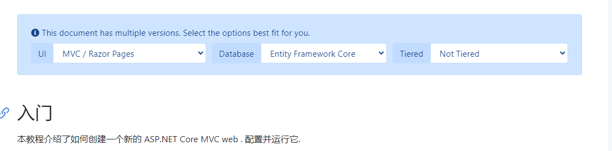
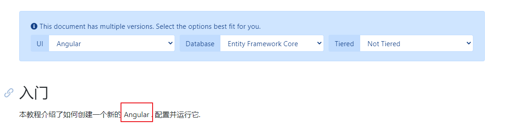

# 配置


# 原理

abp 使用拉的方式从github直接请求,然后存储到数据库作为缓存

注意开发环境下,他会从github直接拉取而不会经过数据库缓存,所以会很慢

# 关于版本

当你写完书的时候.打个tag,然后把tag的版本号填入上方的..最新版本的分支名称即可

# 关于多语言

注意多语言abp使用了缓存..所以如果你更改了docs-langs.json,需要重启服务器,或者清空缓存

```
{
    "Languages":[
      {
        "DisplayName" : "English",
        "Code" : "en",
        "IsDefault": false
      },
      {
        "DisplayName" : "简体中文",
        "Code" : "zh",
        "IsDefault": true
      }
    ]
  }
```

# 关于参数\[doc-params\]

abp使用了scriban文本模板语言引擎.

<https://github.com/lunet-io/scriban>

具体的示例参见:

- <https://docs.abp.io/zh-Hans/abp/latest/Getting-Started?UI=MVC&DB=EF&Tiered=No>

- <https://github.com/abpframework/abp/blob/master/docs/zh-Hans/Getting-Started.md>

```
{
  "parameters": [
    {
      "name": "UI",
      "displayName": "UI",
      "values": {
        "MVC": "MVC / Razor Pages",
        "NG": "Angular"
      }
    },
    {
      "name": "DB",
      "displayName": "Database",
      "values": {
        "EF": "Entity Framework Core",
        "Mongo": "MongoDB"
      }
    },
    {
      "name": "Tiered",
      "displayName": "Tiered",
      "values": {
        "No": "Not Tiered",
        "Yes": "Tiered"
      }
    }
  ]
}
```

markdow中使用

```
//[doc-params]
{
    "UI": ["MVC","NG"],
    "DB": ["EF", "Mongo"],
    "Tiered": ["Yes", "No"]
}
本教程介绍了如何创建一个新的{{if UI == "MVC"}} ASP.NET Core MVC web {{else if UI == "NG"}} Angular {{end}}. 配置并运行它.
```

生成的html



当切换ui的值后的显示,我们看到字符发生了改变



# 关于\[doc-template\]

还没看到如何用

# 404

因为访问github如果超时就会出现404.

所以建议控制台设置代理然后运行

```
$env:http_proxy="http://127.0.0.1:1080"
$env:https_proxy="http://127.0.0.1:1080"
dotnet run .\IG.Www.Web.csproj
```