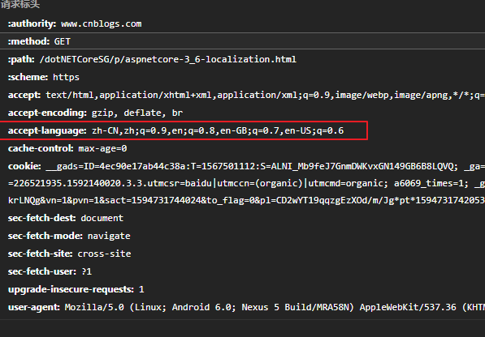
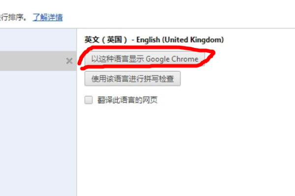

# abp默认语言规则

abp是依托与aspnetcore的.我们先来看看aspnetcore是怎么实现的

```

    services.Configure<RequestLocalizationOptions>(options =>
        {
            var supportedCultures = new List<CultureInfo>
            {
                new CultureInfo("en-US"),
                new CultureInfo("en"),
                new CultureInfo("fr-FR"),
                new CultureInfo("fr")
            };

            options.DefaultRequestCulture = new RequestCulture("en-US");
            options.SupportedCultures = supportedCultures;
            options.SupportedUICultures = supportedCultures;
        });
        
        
        //中间件
        app.UseRequestLocalization();
```

## 中间件request的语言判断

在每次请求里 [RequestLocalizationOptions](https://docs.asp.net/projects/api/en/latest/autoapi/Microsoft/AspNet/Localization/RequestLocalizationOptions/index.html) 的 [RequestCultureProvider](https://docs.asp.net/projects/api/en/latest/autoapi/Microsoft/AspNetCore/Localization/RequestCultureProvider/index.html) 列表会被遍历，第一个provider 会被使用来判断请求使用的文化。默认的 provider 来自`RequestLocalizationOptions` 类,如果没有非空的 provider，`DefaultRequestCulture` 被使用。所以如果发现语言不是按照逻辑顺序显示,先检查请求网址,再检查`cookie`(很难注意到),最后检查acceptlanguage

### [QueryStringRequestCultureProvider](https://docs.asp.net/projects/api/en/latest/autoapi/Microsoft/AspNetCore/Localization/QueryStringRequestCultureProvider/index.html)

下面的例子指定了具体的区域性（语言和区域）设置为西班牙语/墨西哥：

<http://localhost:5000/?culture=es-MX&ui-culture=es-MX>

如果你仅仅使用（culture 或者 ui-culture）中的一个参数进行传递，查询字符串 provider 将使用你传递一个值来设置这两个参数。例如，仅设置culture，将会同样设置 Culture 和 UICulture：

<http://localhost:5000/?culture=es-MX>

### [CookieRequestCultureProvider](https://docs.asp.net/projects/api/en/latest/autoapi/Microsoft/AspNetCore/Localization/CookieRequestCultureProvider/index.html)

CookieRequestCultureProvider 的 DefaultCookieName 返回用于跟踪用户的首选区域性信息默认的 Cookie 名称。默认的 Cookie 名称是 “.AspNetCore.Culture”。

cookie 的格式是 c=%LANGCODE%|uic=%LANGCODE%, c 为区域信息 和 uic 为 UI 区域信息，例如：

c=’en-UK’|uic=’en-US’

如果仅指定 culture 或 UI culture中的一个，指定的区域性信息将同时用于 culture和 UI culture。

### [AcceptLanguageHeaderRequestCultureProvider](https://docs.asp.net/projects/api/en/latest/autoapi/Microsoft/AspNetCore/Localization/AcceptLanguageHeaderRequestCultureProvider/index.html)

这个一般是根据浏览器的设置进行访问的

不同的浏览器默认语言不同,chrome浏览器可以再语言里设置



## Cultures

- `SupportedCultures` 的 [CultureInfo](https://msdn.microsoft.com/en-us/library/system.globalization.cultureinfo(v=vs.110).aspx) 对象决定了和文化相关的函数，如日期，时间，数字和货币格式的结果。同时决定了文字如何排序，大小写转换以及字符串比较。参考[CultureInfo.CurrentCulture](https://msdn.microsoft.com/en-us/library/system.globalization.cultureinfo.currentculture(v=vs.110).aspx) 获取更多关于服务器如何获取文化的信息。

- `SupportedUICultures` 决定如何通过 [ResourceManager](https://msdn.microsoft.com/en-us/library/system.resources.resourcemanager(v=vs.110).aspx) 查找翻译字符串（从 *.resx* 文件）。 *ResourceManager* 只是通过 CurrentUICulture 简单的查找指定文化的字符串。

.NET 的每个线程都会拥有 `CurrentCulture` 和`CurrentUICulture` 对象。当 ASP.NET Core 在渲染与文化相关的函数的时候会检视这些对象值。例如，如果当前线程的区域性设置为 “en-US” （英语、美国）， `DateTime.Now.ToLongDateString() "Thursday, February 18, 2016"` ，但如果 CurrentCulture 设置为 “es-ES”（西班牙语、西班牙），输出将会是 “jueves, 18 de febrero de 2016”。

## abp的实现

Volo.Abp.AspNetCore项目中DefaultAbpRequestLocalizationOptionsProvider.cs

```
#GetLocalizationOptionsAsync()
#根据设置获取默认语言,如果默认语言为en
var languages = await languageProvider.GetLanguagesAsync();
var defaultLanguage = await settingProvider.GetOrNullAsync(LocalizationSettingNames.DefaultLanguage);

var options = !languages.Any()
? new RequestLocalizationOptions()
: new RequestLocalizationOptions
{
DefaultRequestCulture = DefaultGetRequestCulture(defaultLanguage, languages),

SupportedCultures = languages
.Select(l => l.CultureName)
.Distinct()
.Select(c => new CultureInfo(c))
.ToArray(),

SupportedUICultures = languages
.Select(l => l.UiCultureName)
.Distinct()
.Select(c => new CultureInfo(c))
.ToArray()
};

#如果设置中的默认语言不存在,则选取第一个语言作为默认语言
private static RequestCulture DefaultGetRequestCulture(string defaultLanguage, IReadOnlyList<LanguageInfo> languages)
{
    if (defaultLanguage == null)
    {
    var firstLanguage = languages.First();
    return new RequestCulture(firstLanguage.CultureName, firstLanguage.UiCultureName);
    }

    var (cultureName, uiCultureName) = LocalizationSettingHelper.ParseLanguageSetting(defaultLanguage);
    return new RequestCulture(cultureName, uiCultureName);
}
```

然后中间件是

```
app.UseAbpRequestLocalization();
```

中间件使用的是AbpRequestLocalizationMiddleware,其实它只是对aspnetcore的RequestLocalizationMiddleware进行了一层包装

### 如何修改默认语言

首先注意浏览器发送的中文的`accept-language`的值与ABP值是不一样的:

- 浏览器(如Chrome)的值为`zh-CN`

- 而ABP的简体中文的值为`zh-Hans`

首先修改配置文件appsettings.json

```
"Settings": {
	"Abp.Localization.DefaultLanguage": "zh-Hans"
}
```

然后在中间件中删除AcceptLanguageHeaderRequestCultureProvider

```
app.UseAbpRequestLocalization(options =>
    {
        options.RequestCultureProviders.RemoveAll(provider => provider is AcceptLanguageHeaderRequestCultureProvider);
    }
);
```