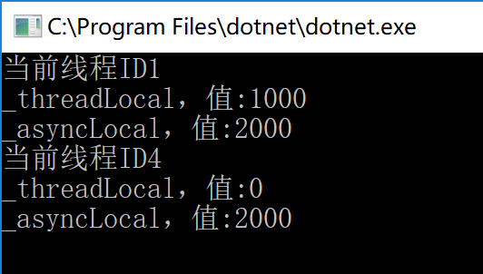

在 DotNetCore 当中不再像 MVC5 那样可以通过 `HttpContext.Current` 来获取到当前请求的上下文。

不过微软提供了一个 IHttpContextAccessor 来让我们访问当前请求的 Http 上下文，其定义
如下：

```
namespace Microsoft.AspNetCore.Http
{
	public interface IHttpContextAccessor
	{
	    HttpContext HttpContext { get; set; }
	}
}
```

需要使用的话需要将其添加到 Ioc 容器当中，在 Startup 类的 ConfigureService 我们可以将其默认实现注册到 Ioc 之中。

```
public void ConfigureService(IServiceCollection services) {
    services.TryAddSingleton<IHttpContextAccessor, HttpContextAccessor>();
}
```

那么我们可以来看看 `HttpContextAccessor` 的具体实现:

```
using System.Threading;

namespace Microsoft.AspNetCore.Http
{
    public class HttpContextAccessor : IHttpContextAccessor
    {
        private static AsyncLocal<HttpContext> _httpContextCurrent = new AsyncLocal<HttpContext>();

        public HttpContext HttpContext
        {
            get
            {
                return _httpContextCurrent.Value;
            }
            set
            {
                _httpContextCurrent.Value = value;
            }
        }
    }
}
```

在其内部主要是用了一个 `AsyncLocal<HttpContext>` 来保存一个 HttpContext 实例，那么 Accessor 是什么时候被赋值的呢？答案就是在每次 HTTP 请求的时候会将其赋值。

`AsyncLocal<T>` 是什么东西？
`AsyncLocal<T>` 是在 .Net 4.6 之后推出的一个对象，该对象接受一个泛型参数，其主要作用是保存异步等待上下文中共享某个变量的值。
而异步方法是基于 Task 的自动线程调度，在异步上下文切换的时候可能导致数据丢失。例如在 await 调用之前对某个变量进行了赋值，而这个变量是多个线程间共享的，当 await 调用返回之前的调用点的时候，可能调用点之后的代码还处在之前的线程上，也有可能被调度到其他线程上。

举个例子：

```
static async Task TestMethod() {
    Console.WriteLine($"当前线程ID{Thread.CurrentThread.ManagedThreadId}");
    await Task.Delay(100);
    Console.WriteLine($"当前线程ID{Thread.CurrentThread.ManagedThreadId}");
}
```

在 await 等待任务执行完成之后，后面的代码输出的 ID 与调用之前的 ID 不一样，说明发生了线程切换：

```

static void Main(string[] args) {
    Action @delegate = async () => await TestMethod();

    @delegate();
    Console.ReadKey();
}
```


从代码上看他们似乎在同一个线程，但是在执行的时候就已经发生了线程切换的操作了。
而我们在这里如果使用一个 `ThreadLocal<T>`变量来存储的话，会发生什么事情呢？

```
static ThreadLocal<int> _threadLocal = new ThreadLocal<int>();
static AsyncLocal<int> _asyncLocal = new AsyncLocal<int>();

static void Main(string[] args) {
    Action @delegate = async () => await TestMethod();

    @delegate();
    Console.ReadKey();
}

static async Task TestMethod() {
    _threadLocal.Value = 1000;
    _asyncLocal.Value = 2000;
    Console.WriteLine($"当前线程ID{Thread.CurrentThread.ManagedThreadId}");
    Console.WriteLine($"{nameof(_threadLocal)}，值:{_threadLocal.Value}");
    Console.WriteLine($"{nameof(_asyncLocal)}，值:{_asyncLocal.Value}");
    await Task.Delay(100);
    Console.WriteLine($"当前线程ID{Thread.CurrentThread.ManagedThreadId}");
    Console.WriteLine($"{nameof(_threadLocal)}，值:{_threadLocal.Value}");
    Console.WriteLine($"{nameof(_asyncLocal)}，值:{_asyncLocal.Value}");
}
```


SO，在这里解释一下， `ThreadLocal` 是用于为不同的线程保存不同的变量值的，即同一个变量在不同线程当中存储的值可以不一样。在这里使用是为了保证在 TestMethod 方法中变量的唯一性，这个在同步方法用是没问题的，但这里使用了 await 关键字导致等待异步调用结束后代码已经被调度到其他的线程了，所以这里没用。而 `AsyncLocal<T>` 正是为了这种情况而准备的。

这就解释了为什么是单例却在每个线程是不同的值.