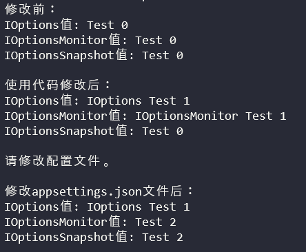

# 背景

ASP.NET Core引入了Options模式，使用类来表示相关的设置组。简单的来说，就是用强类型的类来表达配置项，这带来了很多好处。
初学者会发现这个框架有3个主要的面向消费者的接口：IOptions、IOptionsMonitor以及IOptionsSnapshot。
这三个接口初看起来很类似，所以很容易引起困惑，什么场景下该用哪个接口呢？

# 示例

我们先从一小段代码着手（TestOptions类只有一个字符串属性Name，代码略）：

```
class Program
{
    static void Main(string[] args)
    {
        var builder = new ConfigurationBuilder();
        builder.AddJsonFile("appsettings.json", optional: true, reloadOnChange: true); //注意最后一个参数值，true表示配置文件更改时会重新加载。
        var configuration = builder.Build();
        var services = new ServiceCollection();
        services.AddOptions();
        services.Configure<TestOptions>(configuration); //这里通过配置文件绑定TestOptions
        var provider = services.BuildServiceProvider();
        Console.WriteLine("修改前：");
        Print(provider);

        Change(provider); //使用代码修改Options值。
        Console.WriteLine("使用代码修改后：");
        Print(provider);

        Console.WriteLine("请修改配置文件。");
        Console.ReadLine(); //等待手动修改appsettings.json配置文件。
        Console.WriteLine("修改appsettings.json文件后：");
        Print(provider);
    }

    static void Print(IServiceProvider provider)
    {
        using(var scope = provider.CreateScope())
        {
            var sp = scope.ServiceProvider;
            var options1 = sp.GetRequiredService<IOptions<TestOptions>>();
            var options2 = sp.GetRequiredService<IOptionsMonitor<TestOptions>>();
            var options3 = sp.GetRequiredService<IOptionsSnapshot<TestOptions>>();
            Console.WriteLine("IOptions值: {0}", options1.Value.Name);
            Console.WriteLine("IOptionsMonitor值: {0}", options2.CurrentValue.Name);
            Console.WriteLine("IOptionsSnapshot值: {0}", options3.Value.Name);
            Console.WriteLine();
        }
    }

    static void Change(IServiceProvider provider)
    {
        using(var scope = provider.CreateScope())
        {
            var sp = scope.ServiceProvider;
            sp.GetRequiredService<IOptions<TestOptions>>().Value.Name = "IOptions Test 1";
            sp.GetRequiredService<IOptionsMonitor<TestOptions>>().CurrentValue.Name = "IOptionsMonitor Test 1";
            sp.GetRequiredService<IOptionsSnapshot<TestOptions>>().Value.Name = "IOptionsSnapshot Test 1";
        }
    }
}
```

appsettings.json文件：

```
{
    "Name": "Test 0"
}
```

上面的代码，首先从appsettings.json文件读取配置，然后向容器注册依赖配置文件的TestOptions，接着分别打印IOptions<>,IOptionsMonitor<>和IOptionsSnapshot<>的值。

接着通过代码来修改TestOptions的值，打印。
然后通过修改appsettings.json文件来修改TestOptions的值，打印。

注意，**我们仅注册了一次TestOptions，却可以分别通过IOptions<>,IOptionsMonitor<>和IOptionsSnapshot<>接口来获取TestOptions的值。**

如果我们把appsettings.json文件中Name的值修改为Test 2，那么上面这段代码的输出是这样的：



# 分析

我们可以看到第一次通过代码修改IOptions<>和IOptionsMonitor<>的值后，再次打印都被更新了，但是IOptionsSnapshot<>没有，为什么呢？
让我们从Options框架的源代码着手，理解为什么会这样。
当我们需要使用Options模式时，我们都会调用定义在OptionsServiceCollectionExtensions类上的扩展方法AddOptions(this IServiceCollection services)。

```
var services = new ServiceCollection();
services.AddOptions();
```

我们观察AddOptions方法的实现：

```
public static IServiceCollection AddOptions(this IServiceCollection services)
{
    if (services == null)
    {
        throw new ArgumentNullException(nameof(services));
    }

    services.TryAdd(ServiceDescriptor.Singleton(typeof(IOptions<>), typeof(OptionsManager<>)));
    services.TryAdd(ServiceDescriptor.Scoped(typeof(IOptionsSnapshot<>), typeof(OptionsManager<>)));
    services.TryAdd(ServiceDescriptor.Singleton(typeof(IOptionsMonitor<>), typeof(OptionsMonitor<>)));
    services.TryAdd(ServiceDescriptor.Transient(typeof(IOptionsFactory<>), typeof(OptionsFactory<>)));
    services.TryAdd(ServiceDescriptor.Singleton(typeof(IOptionsMonitorCache<>), typeof(OptionsCache<>)));
    return services;
}
```

从上面的代码我们可以得知，IOptions<>和IOptionsMonitor<>被注册为单例服务，而IOptionsSnapshot<>被注册为范围服务。
由于IOptions<>和IOptionsMonitor<>都被注册为单例服务，因此每次获取的都是同一个实例，所以更改了以后的值是保留的。
而IOptionsSnapshot<>被注册为范围服务，所以每次创建新范围时获取的都是一个新的值，外部的更改只对当次有效，不会保留到下次（不能跨范围，对于ASP.NET Core来说不能跨请求）。

我们继续看第二次修改，第二次修改配置文件后IOptionsMonitor<>和IOptionsSnapshot<>的值更新了，而IOptions<>的值没有更新。
IOptions<>好理解，它被注册为单例服务，第一次访问的时候生成实例并加载配置文件中的值，此后再也不会读取配置文件，所以它的值不会更新。
IOptionsSnapshot<>被注册为范围服务，每次重新生成一个新的范围时，它都会从配置文件中获取值，因此它的值会更新。
但是，IOptionsMonitor<>呢，它被注册为单例，为什么也会更新呢？
让我们回到AddOptions的源代码，我们留意到IOptionsMonitor<>的实现是OptionsManager<>。
当我们打开OptionsManager的源代码时，一切都很清楚了。
它的构造函数如下：

```
public OptionsMonitor(IOptionsFactory<TOptions> factory, IEnumerable<IOptionsChangeTokenSource<TOptions>> sources, IOptionsMonitorCache<TOptions> cache)
{
    _factory = factory;
    _sources = sources;
    _cache = cache;

    foreach (var source in _sources)
    {
        var registration = ChangeToken.OnChange(
                () => source.GetChangeToken(),
                (name) => InvokeChanged(name),
                source.Name);

        _registrations.Add(registration);
    }
}
```

原来OptionsMonitor的更新能力是从IOptionsChangeTokenSource而来，但是这个接口的实例又是谁呢？
我们回到最开始的代码的第10行：

```
services.Configure<TestOptions>(configuration);
```

这是一个定义在Microsoft.Extensions.Options.ConfigurationExtensions.dll的扩展方法，最后实际调用的是它的一个重载方法，代码如下：

```
public static IServiceCollection Configure<TOptions>(this IServiceCollection services, string name, IConfiguration config, Action<BinderOptions> configureBinder)
    where TOptions : class
{
    if (services == null)
    {
        throw new ArgumentNullException(nameof(services));
    }

    if (config == null)
    {
        throw new ArgumentNullException(nameof(config));
    }

    services.AddOptions();
    services.AddSingleton<IOptionsChangeTokenSource<TOptions>>(new ConfigurationChangeTokenSource<TOptions>(name, config));
    return services.AddSingleton<IConfigureOptions<TOptions>>(new NamedConfigureFromConfigurationOptions<TOptions>(name, config, configureBinder));
}
```

秘密就在上面的第15行，ConfigurationChangeTokenSource，它引用了代表配置文件的对象config，所以配置文件更新，IOptionsMonitor就会跟着更新。

# 结论

IOptions<>是单例，因此一旦生成了，除非通过代码的方式更改，它的值是不会更新的。
IOptionsMonitor<>也是单例，但是它通过IOptionsChangeTokenSource<> 能够和配置文件一起更新，也能通过代码的方式更改值。
IOptionsSnapshot<>是范围，所以在配置文件更新的下一次访问，它的值会更新，但是它不能跨范围通过代码的方式更改值，只能在当前范围（请求）内有效。

官方文档是这样介绍的：
IOptionsMonitor用于检索选项和管理TOptions实例的选项通知，它支持下面的场景：

-   实例更新通知。

-   命名实例。

-   重新加载配置。

-   选择性的让实例失效。

IOptionsSnapshot在需要对每个请求重新计算选项的场景中非常有用。
IOptions可以用来支持Options模式，但是它不支持前面两者所支持的场景，如果你不需要支持上面的场景，你可以继续使用IOptions。

所以你应该根据你的实际使用场景来选择到底是用这三者中的哪一个。
*一般来说，如果你依赖配置文件，那么首先考虑IOptionsMonitor<>，如果不合适接着考虑IOptionsSnapshot<>，最后考虑IOptions<>。\**
\*\*\*有一点需要注意，在ASP.NET Core应用中IOptionsMonitor可能会导致同一个请求中选项的值不一致——当你正在修改配置文件的时候——这可能会引发一些奇怪的bug。
如果这个对你很重要，请使用IOptionsSnapshot，它可以保证同一个请求中的一致性，但是它可能会带来轻微的性能上的损失。
如果你是在app启动的时候自己构造Options（比如在Startup类中）：

```
services.Configure<TestOptions>(opt => opt.Name = "Test 0");
```

IOptions<>最简单，也许是一个不错的选择，Configure扩展方法还有其他重载可以满足你的更多需求。
