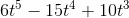

柏林噪声是一个非常强大算法，经常用于程序生成随机内容，在游戏和其他像电影等多媒体领域广泛应用。算法发明者Ken Perlin也因此算法获得[奥斯卡科技成果奖](http://mrl.nyu.edu/~perlin/doc/oscar.html)（靠算法拿奥斯卡也是没谁了666）。本文将剖析他于2002年发表的[改进版柏林噪声算法](http://mrl.nyu.edu/~perlin/noise/)。在游戏开发领域，柏林噪声可以用于生成波形，起伏不平的材质或者纹理。例如，它能用于程序生成地形（例如使用柏林噪声来生成我的世界（Minecraft）里的地形），火焰燃烧特效，水和云等等。柏林噪声绝大部分应用在2维，3维层面上，但某种意义上也能拓展到4维。柏林噪声在1维层面上可用于卷轴地形、模拟手绘线条等。
如果将柏林噪声拓展到4维层面，以第4维，即w轴代表时间，就能利用柏林噪声做动画。例如，2D柏林噪声可以通过插值生成地形，而3D柏林噪声则可以模拟海平面上起伏的波浪。下面是柏林噪声在不同维度的图像以及在游戏中的应用场景。

[](https://images2015.cnblogs.com/blog/608996/201707/608996-20170721155322355-1352334868.png)

正如图所示，柏林噪声算法可以用来模拟许多自然中的噪声现象。接下来让我们从数理上分析算法的实现原理。

***

# 基本原理#

> 注意：事先声明，本节内容大多源于[this wonderful article by Matt Zucker](http://webstaff.itn.liu.se/~stegu/TNM022-2005/perlinnoiselinks/perlin-noise-math-faq.html)，不过该篇文章内容也是建立在1980年所发明的柏林噪声算法基础上的。本文我将使用2002年发明的改进版柏林噪声算法。因此，我的算法版本跟Zucker的版本会有些不同。

让我们从最基本的柏林噪声函数看起：
`public double perlin(double x, double y, double z);`

函数接收`x,y,z`三个坐标分量作为输入，并返回0.0\~1.0的double值作为输出。那我们应该怎么处理输入值？首先，我们取3个输入值`x,y,z`的小数点部分，就可以表示为单元空间里的一个点了。为了方便讲解，我们将问题降维到2维空间来讨论（原理是一样的），下图是该点在2维空间上的表示：

[](https://upload-images.jianshu.io/upload_images/1797904-bfbbc85ed4afee99.png?imageMogr2/auto-orient/strip)
*图1：小蓝点代表输入值在单元正方形里的空间坐标，其他4个点则是单元正方形的各顶点*

接着，我们给4个顶点（在3维空间则是8个顶点）各自生成一个伪随机的梯度向量。梯度向量代表该顶点相对单元正方形内某点的影响是正向还是反向的（向量指向方向为正向，相反方向为反向）。而伪随机是指，对于任意组相同的输入，必定得到相同的输出。因此，虽然每个顶点生成的梯度向量看似随机，实际上并不是。这也保证了在梯度向量在生成函数不变的情况下，每个坐标的梯度向量都是确定不变的。

> 举个例子来理解伪随机，比如我们从圆周率π（3.14159...）的小数部分中随机抽取某一位数字，结果看似随机，但如果抽取小数点后1位，结果必定为1；抽取小数点后2位，结果必定为4。

[](https://upload-images.jianshu.io/upload_images/1797904-ad4b0120e857b5d3.png?imageMogr2/auto-orient/strip)
*图2：各顶点上的梯度向量随机选取结果*

请注意，上图所示的梯度向量并不是完全准确的。在本文所介绍的改进版柏林噪声中，这些梯度向量并不是完全随机的，而是由12条单位正方体（3维）的中心点到各条边中点的向量组成：
`(1,1,0),(-1,1,0),(1,-1,0),(-1,-1,0), (1,0,1),(-1,0,1),(1,0,-1),(-1,0,-1), (0,1,1),(0,-1,1),(0,1,-1),(0,-1,-1)`

采用这些特殊梯度向量的原因在[Ken Perlin's SIGGRAPH 2002 paper: Improving Noise](http://mrl.nyu.edu/~perlin/paper445.pdf)这篇文章里有具体讲解。

> 注意：许多介绍柏林噪声算法的文章都是根据最初版柏林噪声算法来讲解的，预定义的梯度表不是本文所说的这12个向量。如图2所示的梯度向量就是最初版算法所随机出来的梯度向量，不过这两种算法的原理都是一样的。

接着，我们需要求出另外4个向量（在3维空间则是8个），它们分别从各顶点指向输入点（蓝色点）。下面有个2维空间下的例子：

[](https://upload-images.jianshu.io/upload_images/1797904-6dde06b2b941253d.png?imageMogr2/auto-orient/strip)
*图3:各个距离向量*

接着，对每个顶点的梯度向量和距离向量做[点积](https://en.wikipedia.org/wiki/Dot_product)运算，我们就可以得出每个顶点的影响值：
`grad.x * dist.x + grad.y * dist.y + grad.z * dist.z`

这正是算法所需要的值，点积运算为两向量长度之积，再乘以两向量夹角余弦：

复制代码

```
dot(vec1,vec2) = cos(angle(vec1,vec2)) * vec1.length * vec2.length
```

换句话说，如果两向量指向同一方向，点积结果为：

复制代码

```
1 * vec1.length * vec2.length
```

如果两向量指向相反方向，则点积结果为：

复制代码

```
-1 * vec1.length * vec2.length
```

如果两向量互相垂直，则点积结果为0。

复制代码

```
0 * vec1.length * vec2.length
```

点积也可以理解为向量a在向量b上的投影，当距离向量在梯度向量上的投影为同方向，点积结果为正数；当距离向量在梯度向量上的投影为反方向，点积结果为负数。因此，通过两向量点积，我们就知道该顶点的影响值是正还是负的。不难看出，顶点的梯度向量直接决定了这一点。下面通过一副彩色图，直观地看下各顶点的影响值：

[](https://upload-images.jianshu.io/upload_images/1797904-0c7ca0db2126715a.png?imageMogr2/auto-orient/strip%7CimageView2/2/w/1240)
*图4：2D柏林噪声的影响值*

下一步，我们需要对4个顶点的影响值做插值，求得加权平均值（在3维空间则是8个）。算法非常简单（2维空间下的解法）：

复制代码

```
// Below are 4 influence values in the arrangement:
// [g1] | [g2]
// -----------
// [g3] | [g4]
int g1, g2, g3, g4;
int u, v;   // These coordinates are the location of the input coordinate in its unit square.  
            // For example a value of (0.5,0.5) is in the exact center of its unit square.

int x1 = lerp(g1,g2,u);
int x2 = lerp(g3,h4,u);

int average = lerp(x1,x2,v);
```

至此，整个柏林噪声算法还剩下最后一块拼图了：如果直接使用上述代码，由于是采用lerp线性插值计算得出的值，虽然运行效率高，但噪声效果不好，看起来会不自然。我们需要采用一种更为平滑，非线性的插值函数：**fade函数**，通常也被称为**ease curve**(也作为缓动函数在游戏中广泛使用)：

[](https://upload-images.jianshu.io/upload_images/1797904-27f5e6997742a89a.png?imageMogr2/auto-orient/strip)
*图5：ease curve*

ease curve的值会用来计算前面代码里的u和v，这样插值变化不再是单调的线性变化，而是这样一个过程：初始变化慢，中间变化快，结尾变化又慢下来（也就是在当数值趋近于整数时，变化变慢）。这个用于改善柏林噪声算法的fade函数可以表示为以下数学形式：

[](https://upload-images.jianshu.io/upload_images/1797904-05b271d52d2bee24.gif?imageMogr2/auto-orient/strip)

基本上，这就是整个柏林噪声算法的原理了！搞清了算法的各个实现关键步骤后，现在让我们着手把代码实现出来。

***

# 代码实现#

在本节开始前我需要重申一遍，代码实现是C#版本。相比[Ken Perlin的Java版本实现](http://mrl.nyu.edu/~perlin/noise/)做了小小的改动，主要是增加了代码的整洁性和可读性，支持噪声重复（瓦片重复）特性。代码完全开源，可免费使用（考虑到这毕竟不是我原创发明的算法 - Ken Perlin才是！）

## 准备工作##

第一步，我们需要先声明一个排列表（permutation table），或者直接缩写为`p[]`数组就行了。数组长度为256，分别随机、无重复地存放了0-255这些数值。为了避免缓存溢出，我们再重复填充一次数组的值，所以数组最终长度为512：

复制代码

```
private static readonly int[] permutation = { 151,160,137,91,90,15,                 // Hash lookup table as defined by Ken Perlin.  This is a randomly
    131,13,201,95,96,53,194,233,7,225,140,36,103,30,69,142,8,99,37,240,21,10,23,    // arranged array of all numbers from 0-255 inclusive.
    190, 6,148,247,120,234,75,0,26,197,62,94,252,219,203,117,35,11,32,57,177,33,
    88,237,149,56,87,174,20,125,136,171,168, 68,175,74,165,71,134,139,48,27,166,
    77,146,158,231,83,111,229,122,60,211,133,230,220,105,92,41,55,46,245,40,244,
    102,143,54, 65,25,63,161, 1,216,80,73,209,76,132,187,208, 89,18,169,200,196,
    135,130,116,188,159,86,164,100,109,198,173,186, 3,64,52,217,226,250,124,123,
    5,202,38,147,118,126,255,82,85,212,207,206,59,227,47,16,58,17,182,189,28,42,
    223,183,170,213,119,248,152, 2,44,154,163, 70,221,153,101,155,167, 43,172,9,
    129,22,39,253, 19,98,108,110,79,113,224,232,178,185, 112,104,218,246,97,228,
    251,34,242,193,238,210,144,12,191,179,162,241, 81,51,145,235,249,14,239,107,
    49,192,214, 31,181,199,106,157,184, 84,204,176,115,121,50,45,127, 4,150,254,
    138,236,205,93,222,114,67,29,24,72,243,141,128,195,78,66,215,61,156,180
};

private static readonly int[] p;                                                    // Doubled permutation to avoid overflow

static Perlin() {
    p = new int[512];
    for(int x=0;x<512;x++) {
        p[x] = permutation[x%256];
    }
}
```

`p[]`数组会在算法后续的哈希计算中使用到，用于确定一组输入最终挑选哪个梯度向量（从前面所列出的12个梯度向量中挑选）。后续代码会详细展示`p[]`数组的用法。

接着，我们开始编写柏林噪声函数：

复制代码

```
public double perlin(double x, double y, double z) {
    if(repeat > 0) {                                    // If we have any repeat on, change the coordinates to their "local" repetitions
        x = x%repeat;
        y = y%repeat;
        z = z%repeat;
    }
    
    int xi = (int)x & 255;                              // Calculate the "unit cube" that the point asked will be located in
    int yi = (int)y & 255;                              // The left bound is ( |_x_|,|_y_|,|_z_| ) and the right bound is that
    int zi = (int)z & 255;                              // plus 1.  Next we calculate the location (from 0.0 to 1.0) in that cube.
    double xf = x-(int)x;
    double yf = y-(int)y;
    double zf = z-(int)z;
    // ...
}
```

上面的代码很直观。首先，对输入坐标使用求余运算符%，求出\[0,repeat)范围内的余数。紧接着声明`xi, yi, zi`三个变量。它们代表了输入坐标落在了哪个单元正方形里。我们还要限制坐标在\[0,255\]这个范围内，避免访问数组`p[]`时，出现数组越界错误。这也产生了一个副作用：柏林噪声每隔256个整数就会再次重复。但这不是太大的问题，因为算法不仅能处理整数，还能处理小数。最后，我们通过`xf, yf, zf`三个变量（也就是`x,y,z`的小数部分值），确定了输入坐标在单元正方形里的空间位置（就是前面所示的小蓝点）。

## Fade函数##

现在我们需要用代码表示前面所提到的fade函数（图5）。正如上文所提，函数的数学表示：
[](https://upload-images.jianshu.io/upload_images/1797904-05b271d52d2bee24.gif?imageMogr2/auto-orient/strip)

代码实现如下：

复制代码

```
public static double fade(double t) {
                                                        // Fade function as defined by Ken Perlin.  This eases coordinate values
                                                        // so that they will ease towards integral values.  This ends up smoothing
                                                        // the final output.
    return t * t * t * (t * (t * 6 - 15) + 10);         // 6t^5 - 15t^4 + 10t^3
}

public double perlin(double x, double y, double z) {
    // ...

    double u = fade(xf);
    double v = fade(yf);
    double w = fade(zf);

    // ...
}
```

代码所计算得出的`u / v / w`变量将在后面的插值计算中使用到。

## 哈希函数##

柏林噪声哈希函数用于给每组输入计算返回一个唯一、确定值。哈希函数在维基百科的定义如下：

> 哈希函数是一种从任何一种数据中创建小的数字“指纹”的方法，输入数据有任何细微的不同，都会令输出结果完全不一样

下面代码就是柏林噪声算法所使用的哈希函数。它使用了早前我们声明的`p[]`数组：

复制代码

```
public double perlin(double x, double y, double z) {
    // ...

    int aaa, aba, aab, abb, baa, bba, bab, bbb;
    aaa = p[p[p[    xi ]+    yi ]+    zi ];
    aba = p[p[p[    xi ]+inc(yi)]+    zi ];
    aab = p[p[p[    xi ]+    yi ]+inc(zi)];
    abb = p[p[p[    xi ]+inc(yi)]+inc(zi)];
    baa = p[p[p[inc(xi)]+    yi ]+    zi ];
    bba = p[p[p[inc(xi)]+inc(yi)]+    zi ];
    bab = p[p[p[inc(xi)]+    yi ]+inc(zi)];
    bbb = p[p[p[inc(xi)]+inc(yi)]+inc(zi)];

    // ...
}

public int inc(int num) {
    num++;
    if (repeat > 0) num %= repeat;
    
    return num;
}
```

代码的哈希函数，对包围着输入坐标（小蓝点）的周围8个单元正方形的索引坐标进行了哈希计算。`inc()`函数用于将输入值增加1，同时保证范围在\[0,repeat)内。如果不需要噪声重复，`inc()`函数可以简化成单纯将输入值增加1。由于哈希结果值是从`p[]`数组中得到的，所以哈希函数的返回值范围限定在\[0,255\]内。

## 梯度函数##

我时常认为Ken Perlin的最初版算法里的`grad()`函数写法过于复杂，令人费解。我们只要明白`grad()`函数的作用在于计算随机选取的梯度向量以及顶点位置向量的点积。Ken Perlin巧妙地使用了位翻转(bit-flipping)技巧来实现：

复制代码

```
public static double grad(int hash, double x, double y, double z) {
    int h = hash & 15;                                    // Take the hashed value and take the first 4 bits of it (15 == 0b1111)
    double u = h < 8 /* 0b1000 */ ? x : y;                // If the most significant bit (MSB) of the hash is 0 then set u = x.  Otherwise y.
    
    double v;                                             // In Ken Perlin's original implementation this was another conditional operator (?:).  I
                                                          // expanded it for readability.
    
    if(h < 4 /* 0b0100 */)                                // If the first and second significant bits are 0 set v = y
        v = y;
    else if(h == 12 /* 0b1100 */ || h == 14 /* 0b1110*/)  // If the first and second significant bits are 1 set v = x
        v = x;
    else                                                  // If the first and second significant bits are not equal (0/1, 1/0) set v = z
        v = z;
    
    return ((h&1) == 0 ? u : -u)+((h&2) == 0 ? v : -v); // Use the last 2 bits to decide if u and v are positive or negative.  Then return their addition.
}
```

下面代码则是以另一种令人容易理解的方式完成了这个任务（而且在很多语言版本的运行效率都优于前面一种）：

复制代码

```
// Source: http://riven8192.blogspot.com/2010/08/calculate-perlinnoise-twice-as-fast.html
public static double grad(int hash, double x, double y, double z)
{
    switch(hash & 0xF)
    {
        case 0x0: return  x + y;
        case 0x1: return -x + y;
        case 0x2: return  x - y;
        case 0x3: return -x - y;
        case 0x4: return  x + z;
        case 0x5: return -x + z;
        case 0x6: return  x - z;
        case 0x7: return -x - z;
        case 0x8: return  y + z;
        case 0x9: return -y + z;
        case 0xA: return  y - z;
        case 0xB: return -y - z;
        case 0xC: return  y + x;
        case 0xD: return -y + z;
        case 0xE: return  y - x;
        case 0xF: return -y - z;
        default: return 0; // never happens
    }
}
```

以上的源码可以[点击这里](http://riven8192.blogspot.com/2010/08/calculate-perlinnoise-twice-as-fast.html)查看。无论如何，上面的两种实现并没有实质差别。他们都是从以下12个向量里随机挑选一个作为梯度向量：
`(1,1,0),(-1,1,0),(1,-1,0),(-1,-1,0), (1,0,1),(-1,0,1),(1,0,-1),(-1,0,-1), (0,1,1),(0,-1,1),(0,1,-1),(0,-1,-1)`

随机挑选结果其实取决于前一步所计算得出的哈希值（`grad()`函数的第一个参数）。后面3个参数则代表由输入点指向顶点的距离向量（最终拿来与梯度向量进行点积）。

## 插值整合##

经过前面的几步计算，我们得出了8个顶点的影响值，并将它们进行平滑插值，得出了最终结果：

复制代码

```
public double perlin(double x, double y, double z) {
    // ...

    double x1, x2, y1, y2;
    x1 = lerp(    grad (aaa, xf  , yf  , zf),           // The gradient function calculates the dot product between a pseudorandom
                grad (baa, xf-1, yf  , zf),             // gradient vector and the vector from the input coordinate to the 8
                u);                                     // surrounding points in its unit cube.
    x2 = lerp(    grad (aba, xf  , yf-1, zf),           // This is all then lerped together as a sort of weighted average based on the faded (u,v,w)
                grad (bba, xf-1, yf-1, zf),             // values we made earlier.
                  u);
    y1 = lerp(x1, x2, v);

    x1 = lerp(    grad (aab, xf  , yf  , zf-1),
                grad (bab, xf-1, yf  , zf-1),
                u);
    x2 = lerp(    grad (abb, xf  , yf-1, zf-1),
                  grad (bbb, xf-1, yf-1, zf-1),
                  u);
    y2 = lerp (x1, x2, v);
    
    return (lerp (y1, y2, w)+1)/2;                      // For convenience we bind the result to 0 - 1 (theoretical min/max before is [-1, 1])
}

// Linear Interpolate
public static double lerp(double a, double b, double x) {
    return a + x * (b - a);
}
```

***

# 利用倍频实现更自然的噪声#

最后让我们再思考下，除了前面所讲的计算，还有其他办法可以令噪声结果更加自然吗？虽然柏林噪声算法一定程度上模拟了自然噪声，但仍没有完全表现出自然噪声的不规律性。举个现实例子，现实地形会有大段连绵、高耸的山地，也会有丘陵和蚀坑，更小点的有大块岩石，甚至更小的鹅卵石块，这都属于地形的一部分。那如何让柏林噪声算法模拟出这样的自然噪声特性，解决方法也很简单：我们可以使用不同的频率（frequencies）和振幅（amplitudes）参数进行多几次柏林噪声计算，然后将结果叠加在一起。频率是指采样数据的间隔，振幅是指返回值的幅度范围。

[](https://upload-images.jianshu.io/upload_images/1797904-6f96e55ed8d87b04.png?imageMogr2/auto-orient/strip%7CimageView2/2/w/1240)
*图6：不同频率和振幅参数下的柏林噪声结果*

将所有结果叠加在一起，我们就能得到以下结果：

[](https://upload-images.jianshu.io/upload_images/1797904-c69b2bf9e253defb.png?imageMogr2/auto-orient/strip)
*图7：图6所有噪声的叠加结果*

很明显，这样的噪声结果更加令人信服。上面的6组噪声被称之为噪声的不同**倍频(Octave)**。随着倍频增大，噪声对于最终叠加噪声的影响程度变小。当然，倍频组数的增加，会线性地增加代码执行时间，在游戏运行时使用噪声算法，再好不要使用超过几组倍频（比如，当你想在60fps下模拟火焰特效时，最好不要这么干）。然而，做数据预处理时，就很适合使用多组倍频叠加来模拟更自然的噪声（比如用于提前生成游戏地形等）。

那我们应该分别挑选多大的频率和振幅来进行噪声计算呢？这个可以通过**persistence**参数确定。[Hugo Elias](http://freespace.virgin.net/hugo.elias/models/m_perlin.htm)对persistence的定义使用如下：

[](https://upload-images.jianshu.io/upload_images/1797904-b7093e0ea840d56c.png?imageMogr2/auto-orient/strip%7CimageView2/2/w/1240)

[](https://upload-images.jianshu.io/upload_images/1797904-006ffe9e12825253.png?imageMogr2/auto-orient/strip%7CimageView2/2/w/1240)

以上公式`i`的值取决于倍频数量，代码实现也很简单：

复制代码

```
public double OctavePerlin(double x, double y, double z, int octaves, double persistence) {
    double total = 0;
    double frequency = 1;
    double amplitude = 1;
    double maxValue = 0;  // Used for normalizing result to 0.0 - 1.0
    for(int i=0;i<octaves;i++) {
        total += perlin(x * frequency, y * frequency, z * frequency) * amplitude;
        
        maxValue += amplitude;
        
        amplitude *= persistence;
        frequency *= 2;
    }
    
    return total/maxValue;
}
```

***

# UNITY