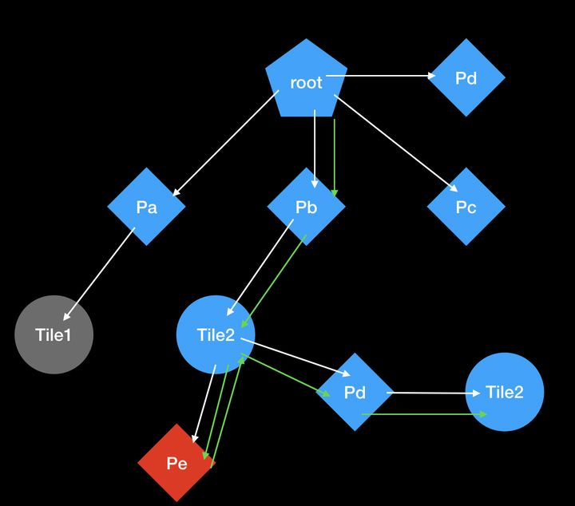

## 什么是“波函数坍塌”？

这个名字看起来是来自量子力学，意思应该是只有在真正观察时，粒子的状态才能被确定，要不然是不确定的，其实并不确定这个解释对不对，物理就够难了，更何况是量子力学。不过呢，很多事物都只是被赋予了高大上的名字，但是实际上根本没有看起来那么复杂。

这里所说的“波函数坍塌”实际上是一种贴图以及模型合成技术（texture synthesize or model synthesize），所谓贴图是指数字动画中被贴在物体表面的图片，模型则是这些物体的模型。在2d里，模型一般就是一个二维的封闭区域，3d则是一个有特定形状的物体。贴图模型合成技术的研究和应用已经有很多年的历史了，只是直到今天才有了一个比较霸气的名字而已。

开发这些模型或者贴图合成技术是为了能使用一块很小的由人工制作的贴图或者模型来生成大量相似的贴图或者模型。这样可以有效的减少人工作业，提升效率。当然可能有人会有这样的疑问，现在基于GAN的AI看起来能够生成又是动画又是图片的，还有这种技术存在的必要吗? 答案当然是有存在的必要，首先GAN需要海量的样本去训练，有生成这么多样本的劲，大概早就做完游戏了，其次是AI生成的不一定能满足业务需求，而且使用者并没有调教的可能性，而在做贴图或者模型合成时，实际上只需要一个样本就可以完成所有的工作了。接下来要简要介绍下基本的原理。

## 基本原理

“波函数坍塌“主要是依赖于样本相邻各点的布局结构，以这些结构作为特征，在一个更大的空间上生成满足样本结构约束的新数据。

以贴图合成为例，假设在输入贴图中有且仅有一点坐标是 x,y，颜色为![\[公式\]](../../public/images/2021-01-21-wave-collapse-function/6.svg) ，上下左右四个点的颜色分别是 ![\[公式\]](../../public/images/2021-01-21-wave-collapse-function/5.svg) 。那么在输出贴图中，如果存在一点颜色为 ![\[公式\]](../../public/images/2021-01-21-wave-collapse-function/6.svg) ，那么它的上下左右四个点的颜色必须是 ![\[公式\]](../../public/images/2021-01-21-wave-collapse-function/5.svg) 。

实际上我们可以建立更复杂的相邻布局约束，比如说以贴图中某个点周围的不仅上下左右，还有对角线上的4个点，总共八个点建立约束条件，甚至是上下左右四个点的上下左右总共12个点。不过本文只会探讨受上下左右四个点约束的情况。

所以我们的算法就是根据输入贴图提供的这种约束关系来生成输出贴图。这是一个搜索的过程，实际上是一个np hard问题，也就是说，只有当我们搜索了所有的可能性时，才一定能获得一个结果，当然这个结果可能是成功合成贴图，也可能是失败了，当对最终生成图片存在外界约束时，会有更大的可能性失败。

虽然以贴图为例来说明，但是本文的初衷是为了能够生2d游戏的地图，所以接下来将仅介绍2d下的离散模型合成技术。在2d游戏开发中，一般会用瓦片（tiles）贴图来构成地图，其中瓦片会有特定的几何形状，然后通过瓦片的放置来完成地图。本文以及提供的代码只会考虑正方形的瓦片，对于正方形瓦片来说就和上面的解释完全一致了。

最后不得不列一下我觉得还蛮重要的公式，该公式描述了上文中提及的一致性约束。

设输入模型为 E，输出模型为 M ，那么当 M与 E 一致时，则对于 M中任意一点 x ，存在 ![\[公式\]](../../public/images/2021-01-21-wave-collapse-function/8.svg) ，且 ![\[公式\]](../../public/images/2021-01-21-wave-collapse-function/8.svg) 属于 E ，满足：

![\[公式\]](../../public/images/2021-01-21-wave-collapse-function/7.svg)

其中， x 是 M中一点，而 ![\[公式\]](../../public/images/2021-01-21-wave-collapse-function/8.svg) 是 E中一点， ![\[公式\]](../../public/images/2021-01-21-wave-collapse-function/9.svg) 则是几何纬度上正负向的单位向量，3维下是 ![\[公式\]](../../public/images/2021-01-21-wave-collapse-function/4.svg) ，2维下则是 ![\[公式\]](../../public/images/2021-01-21-wave-collapse-function/3.svg) 。

接下来当然是要介绍具体的算法了。但是首先还是需要将问题重新描述一下。

## 描述问题

我们需要通过一个样例模型，然后给予一个种子来生成一个更大的模型。在2d情况下，模型会被描述为一个二维矩阵，矩阵中的每个点都是一个非负整数，不同的整数代表一个瓦片的种类，0表示空瓦片。我们需要设定输出模型的大小比如一个10\*10的矩阵，然后通过一个特定的种子来生成随机数，根据这个随机数去遍历所有的可能性并找到一个合适的解。

所以我们的程序至少需要做下面几件事：

1. 载入瓦片信息，种类编号和瓦片的图片。

2. 载入输入模型信息，即输入模型矩阵，矩阵的值为瓦片种类id，然后分析输入模型，得到约束条件矩阵。

3. 根据约束矩阵，以及随机数去搜索输出模型。

4. 输出（可视化）输出模型。

显然，第三步是最为麻烦的，也是最困难的，其次是第二步，我们需要得到一个约束矩阵，然后第一和第四步都是常规操作。

## 获得约束矩阵

约束矩阵描述了在输入模型中，相邻点的布局关系。当我们为输出模型布局时，我们可以在某一点填入一个特定的瓦片id，然后当填充这个瓦片相邻的四个瓦片时，通过查询约束矩阵，我们可以知道在当前瓦片id下，它上方的位置只能是特定的几个id。同理就可以推导出其他三个瓦片能够选择的id。

所以当生成一个2d模型时，需要4个约束矩阵，分别代表x轴正向，负向，和y轴正向，负向的约束。每个约束矩阵的长度为总的瓦片id数，宽度也是总的瓦片id数，其值为bool或者是0或1，用来表示当当前点上的瓦片id是某个值时，其相邻对应位置瓦片允许的值。

写个简单的例子，对于输入模型矩阵 ![\[公式\]](../../public/images/2021-01-21-wave-collapse-function/2.svg) 的正的右侧，也就是x轴正方向，可以得到如下的约束规则：0-1，1-2，2-3，2-1，1-0，0-0。整理成矩阵也就是 ![\[公式\]](../../public/images/2021-01-21-wave-collapse-function/1.svg) ，这个矩阵等于它的转置矩阵，然后我们会有4个类似这样的约束矩阵对应不同方向的邻居，我们使用当前的瓦片id去查询就可以得到相邻瓦片允许填入的瓦片id了。

## 搜索算法

搜索算法部分是最为困难的部分了。我们需要保存一个记录矩阵（catalog），该矩阵与最终输出模型大小相同，比如输出模型是10*10的这个记录矩阵也是10*10的。在这个记录矩阵中，每个元素会是一个集合，表示当前该点可以填入的瓦片id的集合，当该点可填入瓦片id集合为空集时，说明走了一条错误的路径，需要回退。然后我们的搜索算法会按照之前走过来的路径回退到上一个操作点，同时这个记录矩阵也需要回退相应的步数。

对于记录矩阵的回退，需要记录一个类似数据库的ahead log的东西，来记录所有对记录矩阵的操作，当产生回退时，只需要沿着这log向前恢复就可以。

对于搜索算法的前进和回退，在我参考的论文里没有提及具体的方式，经过一段时间的尝试，我建立了一颗树来记录搜索的路径，当产生回退时，树的当前节点会被标记为不可通行，便不会向这片树枝搜索了。

如上图所示，灰色的节点表示还没探索到，实际上还不在树里，红色的节点表示需要回退的节点。蓝色的节点表示已探索或者待探索的节点，绿色的箭头表示已经探索的路径。

五边形节点表示根节点，一旦在根节点发生回退说明，搜索失败，并没有找到合适的输出模型。正方形节点表示选择点操作，当游标在正方形节点上时，等于选取该节点记录的点为当前点。圆形节点则表示，为当前点选择了一个特定的瓦片，该瓦片的种类取决于记录矩阵在该点允许的选择，然后会根据约束矩阵，更新记录矩阵，当发现更新后记录矩阵存在空集便会回退。

最终会有如下的搜索过程：

1. 建立搜索树，找到所有的点，并将其放在根节点下边，随机选一个节点，将游标移动到该节点，设定该节点对应的点为当前节点，然后根据记录矩阵中的值，随机选择一个瓦片填入，并根据约束矩阵更新记录矩阵。

2. 找到剩余所有没有瓦片的点，将这些节点加入当前节点后面，然后将根据这些点与当前所选中的点的距离，计算一个权重，离得最近的会被最先搜索，如果没有新的节点可以选择，则生成成功。

3. 根据权重和生成的随机数以及选择一个节点，根据记录矩阵在该点的瓦片集合以及随机数为该节点选择一个瓦片，然后根据约束矩阵以及当前选择去更新记录矩阵中相邻点的记录：

4. 如果更新中发现某相邻点可选瓦片为空，则需要回退到上一个圆形节点，与此同时记录矩阵也要回退上一个圆形节点之后的操作，并将该节点标为禁止通行，并返回第2步，如果发现当前节点在根节点，则生成失败。

5. 如果不为空，则根据随机数选择一个瓦片填入，并根据约束矩阵更新记录矩阵，然后返回第2步。

## 链接

- [https://zhuanlan.zhihu.com/p/66416593?edition=yidianzixun&yidian\\\_docid=0M2y2bvM](https://zhuanlan.zhihu.com/p/66416593?edition=yidianzixun&yidian%5C_docid=0M2y2bvM)

- <https://zhuanlan.zhihu.com/p/65495333>

- <https://github.com/mxgmn/WaveFunctionCollapse>

- <https://github.com/BorisTheBrave/DeBroglie>