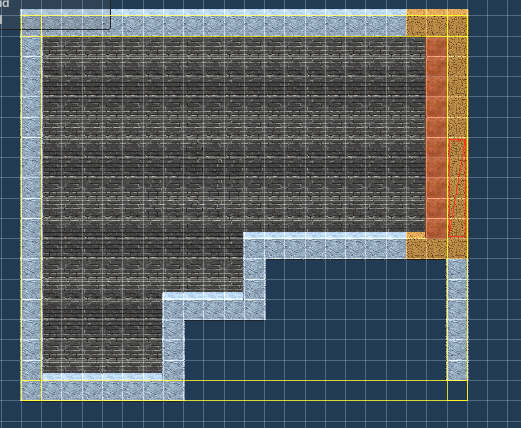
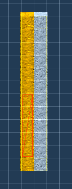
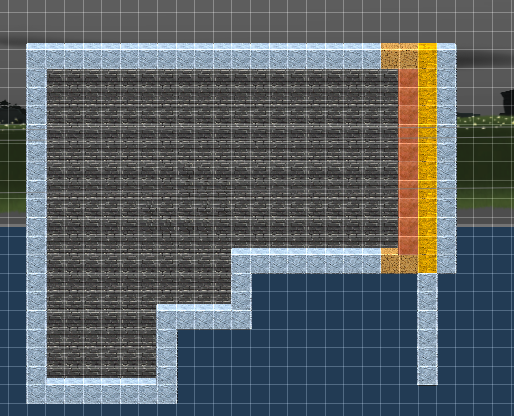

### 生成类

- `LevelGeneratorBase`  最基本的生成方法类包括`Generate`和`GenerateCoroutine`

- `DungeonGeneratorBase` 一般都会继承于该类

#### `Generate`流程

1. 创建playload,即IPipelineTask的上下文

2. 创建pipelineTask,包括三个`InputTask`,`GeneratorTask`,`PostProcessingTask`

3. PipelineRunner执行管道任务,将playload赋值给各个pipelineTask然后执行pipelinetask的`Process()`函数

#### pipelineTask

你可以继承`LevelGeneratorBase`  然后分别覆盖`GetInputTask()`和`GetGeneratorTask()`,还有`GetPostProcessingTask()`

- `InputTask`   一般来说是FixedLevelGraphInputTask,主要是用来设置Payload.LevelDescription

- `GeneratorTask`   主要是通过GraphBasedGeneratorGrid2D来设置Payload.GeneratedLevel 和 Payload.GeneratorStats,还有会实例化`Generated Level/Room template instances`以及下面的房间,参见`GeneratorUtils.TransformLayout`

- `PostProcessingTask`  主要是根据PriorityCallbacks按照优先顺序执行回调函数,默认的回调函数,通过配置有以下

  - InitializeSharedTilemaps 即实例化`GeneratedLevel/Tilemaps`

  - CopyTilesToSharedTilemaps 将rooms下的tile复制到SharedTilemaps 下

  - CenterGrid 将Generated Level下的子对象设置为0,0

  - DisableRoomTemplatesRenderers    禁用roomtemapltes下的显示

  - DisableRoomTemplatesColliders  禁用roomtemplates下的碰撞

  - 还可以通过继承DungeonGeneratorPostProcessBase写你自己的后处理函数

### Door sockets

门锁..就是走廊和房间选中同一个锁,就能匹配的上

## 对于连接处

他会按照顺序copy到sharedtilemaps.所以,位于连接处的tile,如果后面的会覆盖前面的

最终的合成则是下图

