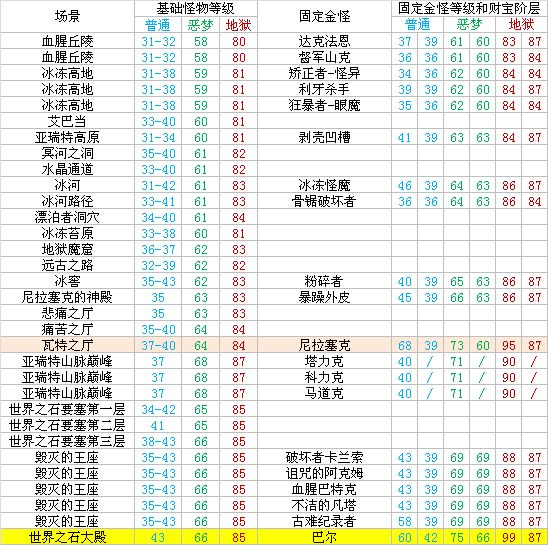

## 怪物等级

- 在普通难度上，怪物的等级由怪物的种类决定，不受场景等级的制约。

- 在噩梦和地狱的难度中，怪物的等级由场景等级决定。普通怪物的等级为场景等级，场景的蓝色精英怪物等级为场景等级加2，金色怪物等级为场景等级加3.例如:85级的场景中会出现普通怪物85级、boss怪物87级、精英金怪兽88级3种等级的怪物

- **关底boss等级固定**，与场景等级无太大关系。

  

  

  

  

### 怪物的分类

要研究暗黑2的物品掉落系统，首先要了解暗黑世界中的怪物。暗黑中怪物分为如下几个种类等级：\
1\.（eBoss）：中文中我们一般称之为.【关底BOSS】，如安达里尔、督瑞尔、墨菲斯托等\
2\.（Boss）：即【普通BOSS】，这些怪物有且仅有6个：\
☆血乌 格里斯瓦得 罗达门特 召唤者 衣卒尔 尼拉塞克\
3\.（Unique）：中文中我们一般称之为【精英怪】，游戏中表现为其名字为暗金色。分为固定精英怪（Super Unique）和随机精英怪（Random Unique）。固定精英怪拥有固定的名字和固定的出现地点，拥有固定属性以及可能出现的随机属性。如“毕须博须”、“暴躁外皮”等。随机精英怪则是在游戏中随机出现，名字由词缀“XXX之XXX的”的随机构成，并随机获得一些特殊属性。\
4\.（Minion）：中文中我们称之为【随从】，即精英怪身边的与其同类的喽啰怪物。在游戏中外观和普通怪一样，但隐藏有带领它的精英怪的部分特殊属性。\
5\.（Champion）：中文中我们称之为【头目】。游戏中表现为其名字为蓝色。有时候它们能从其名字的前缀（如果有的话）中获得特殊属性。\
6\.（Normal）：普通小怪。游戏中表现为其名字为白色。

### 财宝阶层

TC是一个包含了众多物品清单的多层目录，一个大TC目录中可能包含有多个子TC目录。 怪物死亡后掉落的物品就是从其TC目录的物品清单中按照一定规则随机取出物品。
但我们玩家在日常口头交流时，常常只讨论武器和防具的掉落，并将TC目录简化为一个数字等级，简称为怪物的TC。比如我们常说的墨菲斯托的TC=78，暴躁外皮的TC=87等等。

☆TC由3到87，按3递增（3、6、9…81、84、87），共有29个递增的TC阶层。

## 掉落规则

### 物品等级

物品等级常用术语为ilvl，注意这个等级不是使用装备需要的等级，而是一个内在的等级数据，一定程度上决定了装备可能的质量。

1. **打怪掉落  打怪刷到的装备等级=掉装备怪物的等级**

2. **翻箱子掉落 开箱子掉落的装备等级=场景等级**

3. **在NPC那里买到 商店买的装备等级=人物等级+5**

4. **在NPC那里通过赌博得到  赌博得的装备等级=人物等级+4或-5**

\*\*物品等级最大99。\*\*物品等级最大的作用有两个：

1. 决定了该物品的最大出孔数,比如，同样是灰幕寿衣，如果是25级以下怪物掉落的，它的物品等级就是25以下，它最大的打孔数就是3孔；如果是高于25级怪物掉落的，它的物品等级也就高于25，这件衣服最大孔数就是4孔。

2. 物品等级决定了装备的词缀，物品等级越高，可能出现的词缀就越好。

### 词缀等级

**物品的属性来源于物品所具有的词缀。游戏中每一种词缀都代表了某一种特定的属性，一旦物品拥有了某个词缀，那么就一定具有这个词缀所代表的属性。**

\
所有的词缀总共分为2类：前缀和后缀。前缀和后缀又分别按照所代表属性的不同分成组。


比如图中的绿框内是前缀，红框内是后缀，它们对应下面蓝色字体的“属性”，珠宝匠对应4孔，偏向对应格档速度和格档机率。

词缀种类非常多，蓝色装备最多可以从词缀中选择不同的两个，黄色最多选择6个。而不同词缀又是有不同等级的，**高等级词缀当然只能出现在物品等级和品质等级更高的装备上。**\
\
前缀共分为三个系26个小组：\
第一系是进攻型前缀共计14小组：\
编号110组加准确率；编号105组增强伤害；编号111组同时加准确和伤害 或者 按等级加准确；编号123组加对恶魔的准确和伤害；编号142组加对不死的准确和伤害；编号137组加冰伤害；编号138组加火伤害；编号139组加电伤害；编号140组加毒伤害；编号113组吓跑怪物；编号121组杀死敌人加法力；编号107组所受伤害转为法力；编号114组加mf；编号112组加照亮范围\
第二系是防御型前缀共计11小组：\
编号117组加抗冰；编号118组加抗火；编号119组加抗电；编号120组加抗毒；编号116组加全抗；编号115组加法力；编号101组加防御；编号108组加耐力；编号109组按百分比加耐力；编号122组增加凹槽；编号141组增加投掷物数量；\
第三系是技能前缀有1个小组：\
编号125小组：加人物技能；加亚马逊单系技能；加野蛮人单系技能；加圣骑士单系技能；加死灵法师单系技能；加法师单系技能；加德鲁伊单系技能；加刺客单系技能；\
\
后缀共分为四个系35个小组：\
第一系是进攻型后缀共计16小组：\
编号15组加最小伤害值；编号14组加最大伤害值；编号10组加冰伤害；编号12组加火伤害；编号13组加电伤害；编号16组加毒伤害；编号27组偷取生命；编号28组偷取法力；编号24组；编号20组阻止怪物；编号4组忽略目标防御；编号7组加攻击速度；编号9组加施法速度；编号21组加额外金币；编号22组加mf；编号25组同时加照亮范围和准确；\
第二系是防御型后缀共计11小组：\
编号1组物理伤害减少；编号2组魔法伤害减少；编号29组减少中毒时间；编号11组冰冻时间减半；编号35组加快速奔跑；编号18组加快速打击恢复；编号8组加格挡；编号6组反弹伤害；编号39组投掷物恢复数量；编号37组装备自动修复；编号39组永不磨损\
第三系是技能后缀有1个小组：\
编号44组：加亚马逊单个技能(包括聚气)；加野蛮人单个技能(包括聚气)；加德鲁伊单个技能(包括聚气)；加死灵法师单个技能(包括聚气)；加圣骑士单个技能(包括聚气)；加法师单个技能(包括聚气)；\
第四系是属性后缀共计7个小组：\
编号31组加力量；编号17组加敏捷；编号23组加能量；编号41组按等级加法力、按等级加生命或按等级同时加法力和生命(仅限蓝色装备)；编号26组加生命；编号19组自动恢复生命；编号30组减需求；\
\
**当装备从怪物身上掉落时，或是当人物离开城镇导致商店里的商品更新时，或是当人物把物品从商人那里买下来时，或是当你用赫拉迪克方块合成新的物品时，物品的属性就在那一瞬间随机生成了。生成时系统将会随机挑选一些词缀安排给这个物品，于是物品就有了变化莫测的属性**

1. 取最高 qlvl or ilvl 为X 当｛ X < (99-Q/2) ｝时，则该物品是低等物品,词缀等级（A）按照  { A = X - Q/2 } 计算词缀等级。


举个栗子：我有一件地狱A1冰冷之原掉的装备，由于它是68场景等级（M），所以怪物是68-71级之间，掉落的装备就是68级-71级物等。比如按最低的68白怪掉的一个战帽，他的品质等级（Q）是34级，那么，带入公式 68 < \[ (99-34/2) = 82 \]，满足公式一。词缀等级按照 {A= 68 - 34/2 = 51}计算，他的词缀就是51级。

1. 当｛ X > (99-Q/2) ｝时则是高等物品 按照 {A=2\*X-99} 计算词缀等级。


举个栗子：超市金怪出了一个君主盾（统盾），85+3，物等（I）88级，大于品质（Q）72级，带入公式 { A=2\*88-99 } = 77级词缀等级（A）

1. 以上情况之外，还有一种特殊情况，游戏内有7种自带 “魔法等级” （ML）的物品，按照 A= X + ML 计算


举个栗子：3c瘸子掉了一个头环，他的最低物等（I）至少是82级。他的魔法等级是3，那么公式计算，他的词缀等级应该是 A = 82 + 3，85级。那么问题来了，他会鉴定出+2职业技能么？答案是，不能。 因为+2全技能的词缀是90级的。

```
var x = math.max(qlvl,ilvl);
float result;

if(mlvl == 0)
{
    if( x > 99-(qlvl/2))
    {
        result = 2*x - 99; 
    }
    else
    {
        result = x - qlvl/2
    }
}
else
{
    result = x +i.mlvl;
}
```

### 品质等级

品质等级（qlvl）：**每个装备固有的一个品质等级**，对于非绿色非暗金装备，qlvl和其底材一样，比如一件执政官铠甲，无论是蓝色还是黄色，其qlvl都是84。

品质等级是玩家无法左右的，但是需要了解。因为它会与财宝等级（TC）一起决定掉落的。

**品质等级决定具体是哪件装备（是镰刀还是执政官甲）；**

### 财富等级

**财宝等级决定物品的品质等级**

怪物是否能掉落对应装备必须满足两个条件：

- 怪物的“财宝等级”（TC）大于或等于装备所在的“财宝等级”（TC），

- 同时怪物自身的等级要大于或等于装备自身的“品质等级”（qlvl）。

### 底材

首先我们要提前介绍“底材”这个概念。其实在之前的内容已经提到过很多次“底材”，不过基本上都局限于制作符文之语的白色物品。但严格地说，“底材”实际上是所有魔法装备的衍生基础。你可以简单地理解为，一件白色的“军帽”经过“上色”变成了带有1-2条额外属性的蓝色“军帽”，或者经过另一种“上色”就变成了暗金物品“谐角之冠”，但他们的底材都是“军帽”。

而底材也分为了普通级、扩展级和精英级三类，三类底材拥有同样的模型，后一级比前一级的基础属性更高，“军帽”就属于“精英级”底材：


同一底材的暗金/绿色物品还会有自己的专属qlvl，一般叫做“成品qlvl”，如果我们打到了一个白色“军帽”，那它的qlvl显然就是58，而暗金军帽“谐角之冠”还会有自己专属的成品qlvl：69(见上上图的左下角)。


### 掉落机制

**怪物会掉落特定的物品么?**

不,不过金色怪物和头目会有更高的概率掉落魔法物品,头目会掉落魔法物品或更多的黄金.不过,怪物的种类与掉落的物品没有关系.

**人物的等级与掉落的物品有关么?**

不,掉落的物品只与怪物等级与场景等级有关.

**锁住的箱子会掉更好的东西么?**

不,但它会掉出更多的东西,一般来说是没上锁的两倍.

#### 掉落过程

1. 底材判定过程（TC判定过程）\
   怪物的TC值代表了怪物能掉落的物品底材的最高Qlvl。\
   ☆也就是说，当怪物TC ≥ 物品底材Qlvl时，则怪物能掉落该物品底材。

2. 成色判定过程（Mlvl判定过程）\
   确定了物品的底材后，系统将按照暗金 - 绿色 - 黄色 - 蓝色 - 白色的顺序来判定成色。当判定为暗金或者绿色时，系统会检查怪物等级是否满足物品的成品Qlvl。\
   如果物品成色被判定为暗金，而怪物等级Mlvl不足以掉落该物品的暗金形态或者该物品暗金形态不存在，则会掉落该物品的黄色形态并拥有3倍的耐久度；如果物品成色被判定为绿色，而怪物等级Mlvl不足以掉落该物品的绿色形态或者该物品绿色形态不存在，则会掉落该物品的蓝色形态并拥有2倍的耐久度。

☆ 也就是说，当怪物等级Qlvl≥物品成品Qlvl时，怪物才能掉落该物品的暗金/绿色形态。\
☆ MF值会分别增加暗金、绿色、黄色、蓝色判定的几率，但不影响超强、普通、劣质的判定。

现在我们回过头来看看“谐角之冠”的掉落过程：

1、击杀怪物A，假设它的财宝等级(TC)为59，怪物等级(mlvl)为65，那么就可以掉落qlvl为58的底材“军帽”(因为此时TC>底材qlvl)

2、MF值开始介入(在这之前TC表还有一系列的pick过程，较为复杂，暂不介绍)，游戏进入“暗金 - 绿色 - 黄色 - 蓝色 - 白色”的掉落判定顺序，假设此时可以掉落该底材的暗金品质装备“谐角之冠”，但是由于怪物等级mlvl 65<“谐角之冠”的成品qlvl 69，则无法掉落，改为掉落黄色品质的“军帽”，且具有3倍耐久度。

3、如果怪物B的TC为57，那么根本不会掉落底材“军帽”，后续的“上色”流程无从谈起。

4、如果怪物C的TC为67，mlvl为70，其余流程与前面一致，那么可以成功掉落“谐角之冠”。(因为TC>底材qlvl，可以进入掉落判定阶段，当判定为“谐角之冠”时，检查怪物mlvl>“谐角之冠”的成品qlvl，符合要求)

前面已经提到过，MF只和“上色”有关，无法影响装备的品质等级qlvl，所以就算是把MF堆到10000，你在普通难度下也无法获得“统治者大盾”。