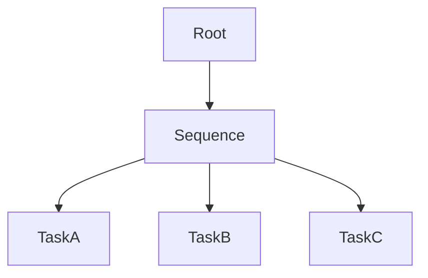
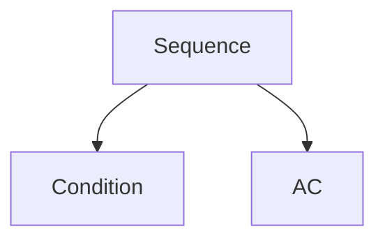
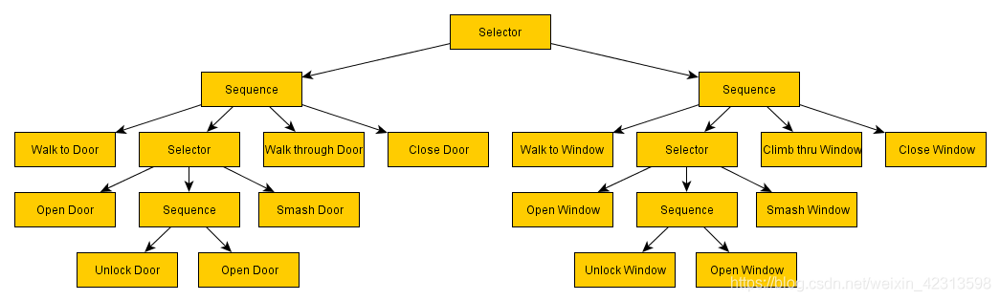
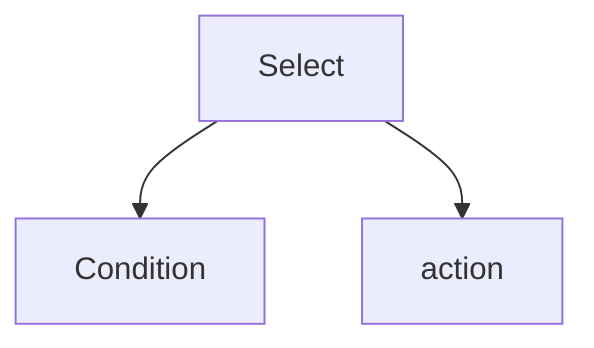
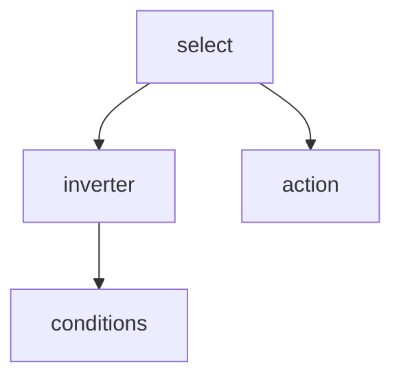

## 行为树的构建

首先行为树会有个根节点`TaskRoot` ,当构建行为树的时候,会将节点添加到该root下

行为树的构建如下:

```
//获取当前父节点..默认则为TaskRoot
private ITaskParent PointerCurrent {
    get {
        if (_pointers.Count == 0) return null;
        return _pointers[_pointers.Count - 1];
    }
}
//增加节点到当前父节点
public BehaviorTreeBuilder AddNode (ITask node) {
    _tree.AddNode(PointerCurrent, node);
    return this;
}
//增加节点,并将该节点设置为当前父节点
public BehaviorTreeBuilder AddNodeWithPointer (ITaskParent task) {
    AddNode(task);
    _pointers.Add(task);
    
    return this;
}
//退出当前父节点
public BehaviorTreeBuilder End () {
    _pointers.RemoveAt(_pointers.Count - 1);
    
    return this;
}
```

## 行为树的运行

- 每一帧都执行update(),且如果根节点返回的是成功或者失败,则清空所有任务并`End()`,累计tick(所有子节点都会执行Reset())

- 如果子节点中有`持续`的任务时,则该任务会被认为时激活的.添加到行为树中

```csharp
public TaskStatus Tick () {
    var status = Root.Update();
    if (status != TaskStatus.Continue) {
        Reset();
    }

    return status;
}

public void Reset () {
    foreach (var task in _tasks) {
        task.End();
    }

    _tasks.Clear();
    TickCount++;
}
```

让我们看看任务的子类有哪些:

- `TaskRoot` 一般来说只有一个子节点

- `TaskParentBase` ,会在每一次循环中同步tick,如果tick和行为树不一样,则会`Reset`,如果onUpdate()返回的时成功或者失败,也会`Reset`


* `TaskBase` 会在每一次循环中同步tick,如果tick和行为树不一样,则会`Reset`,如果GetUpdate()返回的时成功或者失败,则会`Exit` (Exit时会Reset)且如果自己的状态曾经为`Continue`会从行为树的激活任务中移除,否则会将自身添加到行为树的激活任务中.

### 持续的任务是怎么运行的



Sequence会记录自己循环过哪些task. 当taskb持续状态时,则会进入下一个循环,但不会进入下一tick,走到Sequence后,他不会执行已经执行过的任务,所以进入Sequence后会直接执行TaskB;

只有当有任务失败或者成功,才会执行下一个tick,下一个tick所有task都会reset

## 使用

### 并行

如果使用.,注意子节点,要么是持续的,要么是成功的..如果有任何失败了将会reset

- 并行需要等待子节点全部完成,再根据子节点的返回状态判断该并行节点的状态

- 并不是说并行,就是两个不想干的node不断的执行

- 同时执行下面所有子节点的start(),然后等待所有子节点的反馈是成功还是失败

### 序列

一般把Sequence-->Condition  当作if  就可以



### 选择

由下图可以看出..Selector --> Sequence--> Condition  相当于if else



把select,当成 if not来看



select-->Inverter -->Condition  可以当作if来看..



和Sequence的区别就是,select在执行b前返回的是true.

### 观察者模式

观察者装饰器...就是观察某个变量..然后决定低优先级节点,自身节点,的执行(重启等)方式

分为两种状况
1\.在当前节点未激活的时候,观察某个变量 生效的方式:Stops.LOWER_PRIORITY,Stops.BOTH,Stops.LOWER_PRIORITY_IMMEDIATE_RESTART,Stops.IMMEDIATE_RESTART
2\.在当前节点激活的时候,观察某个变量Stops.SELF Stops.BOTH Stops.IMMEDIATE_RESTART
所以会有三种节点出现

1. IsConditionMet()永远返回true,子节点永远返回false,保证该装饰器节点是inactive状态

2. IsConditionMet()永远返回false,子节点永远返回true,保证该装饰器节点是active状态

3. IsConditionMet()根据情况返回true和false,比如如果玩家在附近,则执行该装饰器下代码.如果玩家不在附近则stop,执行低优先级代码

Stops.NONE：装饰器只会在启动时检查一次它的状态，并且永远不会停止任何正在运行的节点。
Stops.SELF：装饰器将在启动时检查一次它的条件状态，如果满足，它将继续观察黑板的变化。一旦不再满足该条件，它将终止自身，并让父组合继续处理它的下一个节点。
Stops.LOWER_PRIORITY：装饰器将在启动时检查它的状态，如果不满足，它将观察黑板的变化。一旦条件满足，它将停止比此结点优先级较低的节点，允许父组合继续处理下一个节点
Stops.BOTH：装饰器将同时停止:self和优先级较低的节点。
Stops.LOWER_PRIORITY_IMMEDIATE_RESTART：一旦启动，装饰器将检查它的状态，如果不满足，它将观察黑板的变化。一旦条件满足，它将停止优先级较低的节点，并命令父组合立即重启此装饰器。
Stops.IMMEDIATE_RESTART：一旦启动，装饰器将检查它的状态，如果不满足，它将观察黑板的变化。一旦条件满足，它将停止优先级较低的节点，并命令父组合立即重启装饰器。正如在这两种情况下，一旦不再满足条件，它也将停止自己。

说人话..就是
在当前节点未激活的时候,观察某个变量
Stops.LOWER_PRIORITY_IMMEDIATE_RESTART和Stops.IMMEDIATE_RESTART这个会停止低优先级(就是该节点后面的)的节点,然后会立即重新开始当前节点
Stops.LOWER_PRIORITY和Stops.BOTH 会先停止优先级较低的节点,然后再停止父节点

在当前节点激活的时候,观察某个变量
Stops.SELF Stops.BOTH Stops.IMMEDIATE_RESTART 这三个,都会先停止子节点.然后停止自身,最后会影响到停止父节点

### 条件和装饰器

RepeatUntilSuccess --> ConditionBase 可以构成一个新动作

ConditionBase 在返回失败的时候被RepeatUntilSuccess 转换为持续