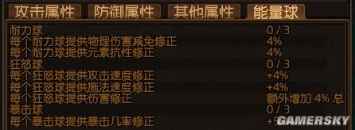
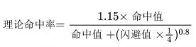

### 属性

**流放之路中，升级你能得到什么？**

所有人物升级所获得的都是一样的

A每级+12最大生命

B每级+2命中值

C每级+3闪避值

D每级+6最大魔力

E每级+1天赋点

**人物有三大基础属性：力量，敏捷，智慧**

每10力量=5生命

每5力量=1%近战攻击伤害

每10敏捷=1%闪避值

每1敏捷=2命中值

每5智力=1%增加最大能量护盾

每2智力=1魔力

a)基本属性

i.每秒1.75%最大魔力上限回复速度

ii.每秒20%最大能量护盾的充能速度

iii.拥有基础的53闪避值

iv.基础爆击伤害：150%

b)双持（双持的定义在于同时持有2把单手武器，仅限于单手剑，细剑，单手锤，单手斧，匕首，爪，魔杖。其中魔杖属于远程武器，无法跟其他武器同时持有）

i.10%更多攻击速度

ii.15%格挡

iii.20%更多物理攻击伤害

c)能量球（看图）

d)基础最大值（以下数值都可能被一些暗金装备，天赋，进阶所改变）

i.每秒20%最大生命偷取速率

ii.每秒20%最大魔力偷取速率

iii.75%最大格挡值

iv.75%最大混沌抗性上限

v.75%最大冰霜抗性上限

vi.75%最大火焰抗性上限

vii.75%最大闪电抗性上限

viii.最多叠加20层腐化之血状态

ix.最多5层爆炸箭矢

x.最多75%攻击躲避几率

xi.最多75%法术躲避几率

xii.闪避几率不会低于5%，也不会高于95%（闪避不同于躲避）

xiii.最大90%物理伤害减免

xiv.可拥有3个陷阱

xv.可拥有5个地雷

xvi.可召唤1个图腾

### 伤害公式

闪避是角色在受到攻击前的第一层防御形式，闪避会增加角色完全避免受到攻击的几率。与护甲和能量护盾一样，闪避是流放之路的三大基本防御形式之一。

所有人物的基础闪避将以53点为开始，每级额外获得3点闪避。人物在一级时，将具有56点闪避，在100级时有353点闪避的基础值。

敏捷也能够提供闪避奖励。每增加5点敏捷，闪避将提高1%。5的非整数将四舍五入到最接近的5的整数。

闪避除了可以规避伤害，也可以规避其他有害影响，比如异常状态和眩晕。但是只能闪避近战和远程攻击，而法术则会自动命中。而闪避攻击的几率是根据防御者的闪避与攻击者的命中相比得出的。

机制公式：命中率的范围：5%—95%。法术没有命中的机制，不受命中的影响，因为闪避不是对应法术对应的防御措施，也因为不会对法术产生影响，所以法术是默认必中的。（但也有办法: 躲避法术。请注意躲避和闪避的区别！）

公式一：

公式二：

实际命中率 = min{ max( 理论命中率 , 0.05) , 1 }。

---

- [流放之路伤害机制介绍 伤害怎么计算-《流放之路》s13新的诅咒机制有什么 s13新诅咒机制介绍 - DB游戏网 (](https://www.thisisdb.com/wd/172751.html)[thisisdb.com](http://thisisdb.com)[)](https://www.thisisdb.com/wd/172751.html)

- [流放之路技能伤害计算公式一览 流放之路技能伤害怎么计算 法术类-游侠网 (](https://gl.ali213.net/html/2017-8/187449.html)[ali213.net](http://ali213.net)[)](https://gl.ali213.net/html/2017-8/187449.html)

- [《流放之路》暴击和暴击伤害解析 - 哔哩哔哩 (](https://www.bilibili.com/read/cv14058447/)[bilibili.com](http://bilibili.com)[)](https://www.bilibili.com/read/cv14058447/)

- [流放之路POE丨各类防御机制，浅谈各类防御机制的作用 (](https://view.inews.qq.com/a/20220104A064SX00)[qq.com](http://qq.com)[)](https://view.inews.qq.com/a/20220104A064SX00)

- [流放之路伤害机制介绍\_18183.com](https://www.18183.com/zqnews/201909/2391993.html)

- [流放之路攻击伤害和物理伤害(流放之路伤害类型)-金芒果软件网 (](https://www.ahjmgzs.com/yxgl/692583.html)[ahjmgzs.com](http://ahjmgzs.com)[)](https://www.ahjmgzs.com/yxgl/692583.html)