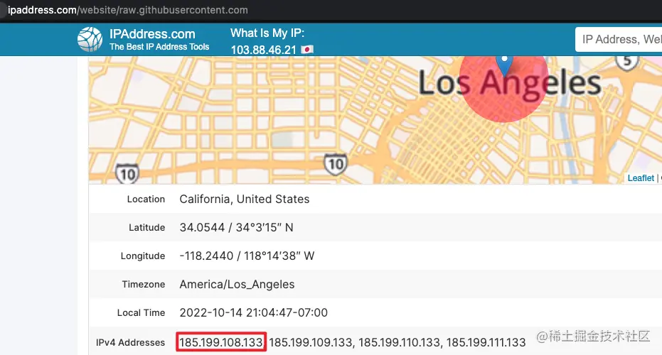

# 问题

执行`npx nuxi init nuxt-app`报错

# 解决方案

官方初始化链接：[v3.nuxtjs.org/getting-sta…](https://link.juejin.cn/?target=https%3A%2F%2Fv3.nuxtjs.org%2Fgetting-started%2Finstallation)

`npx nuxi init nuxt-app`

执行后报错

```
Failed to download template from registry: request to https://raw.githubusercontent.com/nuxt/starter/templates/templates/v3.json failed, reason: connect ECONNREFUSED 0.0.0.0:443

  at /Users/ming/.npm/_npx/a95e0f536cf9a537/node_modules/nuxi/dist/chunks/init.mjs:13269:11
  at processTicksAndRejections (node:internal/process/task_queues:96:5)
  at async downloadTemplate (/Users/ming/.npm/_npx/a95e0f536cf9a537/node_modules/nuxi/dist/chunks/init.mjs:13268:20)
  at async Object.invoke (/Users/ming/.npm/_npx/a95e0f536cf9a537/node_modules/nuxi/dist/chunks/init.mjs:13336:15)
  at async _main (/Users/ming/.npm/_npx/a95e0f536cf9a537/node_modules/nuxi/dist/cli.mjs:50:20)
```

解决：

先`ping raw.githubusercontent.com`是否连通

如果不通，访问`https://ipaddress.com/website/raw.githubusercontent.com`



然后添加host，mac下host配置路径：`/etc/hosts`

新增一行， `185.199.108.133 raw.githubusercontent.com`

添加完host后，再ping一下 `ping raw.githubusercontent.com` 是否连通

ping通后，再重新执行`npx nuxi init nuxt-app`

成功显示：

```
 Nuxt project is created with v3 template. Next steps:                                     12:07:07
 › cd nuxt-app                                                                               12:07:07
 › Install dependencies with npm install or yarn install or pnpm install --shamefully-hoist  12:07:07
 › Start development server with npm run dev or yarn dev or pnpm run dev
```