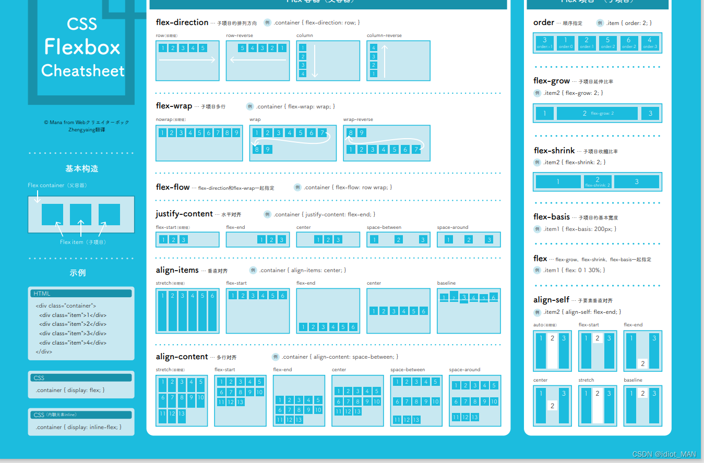

## 一、Flex 布局是什么？

Flex 是 Flexible Box 的缩写，意为"弹性布局"，用来为盒状模型提供最大的灵活性。

任何一个容器都可以指定为 Flex 布局。

> ```css
> 
> .box{
>  display: flex;
> }
> 
> ```

行内元素也可以使用 Flex 布局。

> ```css
> 
> .box{
>  display: inline-flex;
> }
> 
> ```

Webkit 内核的浏览器，必须加上`-webkit`前缀。

> ```css
> 
> .box{
>  display: -webkit-flex; /* Safari */
>  display: flex;
> }
> 
> ```

注意，设为 Flex 布局以后，子元素的`float`、`clear`和`vertical-align`属性将失效。

## 二、基本概念

采用 Flex 布局的元素，称为 Flex 容器（flex container），简称"容器"。它的所有子元素自动成为容器成员，称为 Flex 项目（flex item），简称"项目"。


容器默认存在两根轴：水平的主轴（main axis）和垂直的交叉轴（cross axis）。主轴的开始位置（与边框的交叉点）叫做`main start`，结束位置叫做`main end`；交叉轴的开始位置叫做`cross start`，结束位置叫做`cross end`。

项目默认沿主轴排列。单个项目占据的主轴空间叫做`main size`，占据的交叉轴空间叫做`cross size`。

