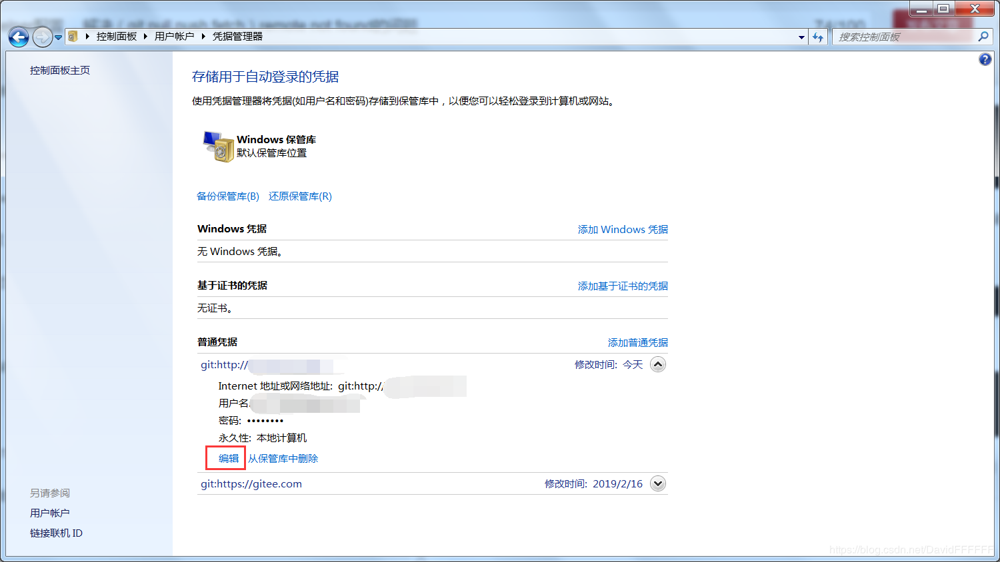

## Git密钥存储相关

幸运的是，Git 拥有一个凭证系统来处理这个事情。 下面有一些 Git 的选项：

-   默认所有都不缓存。 每一次连接都会询问你的用户名和密码。

-   “cache” 模式会将凭证存放在内存中一段时间。 密码永远不会被存储在磁盘中，并且在15分钟后从内存中清除。

-   “store” 模式会将凭证用明文的形式存放在磁盘中，并且永不过期。 这意味着除非你修改了你在 Git 服务器上的密码，否则你永远不需要再次输入你的凭证信息。 这种方式的缺点是你的密码是用明文的方式存放在你的 home 目录下。

-   如果你使用的是 Mac，Git 还有一种 “osxkeychain” 模式，它会将凭证缓存到你系统用户的钥匙串中。 这种方式将凭证存放在磁盘中，并且永不过期，但是是被加密的，这种加密方式与存放 HTTPS 凭证以及 Safari 的自动填写是相同的。

-   如果你使用的是 Windows，你可以安装一个叫做 “winstore” 的辅助工具。 这和上面说的 “osxkeychain” 十分类似，但是是使用 Windows Credential Store 来控制敏感信息。 可以在 [https://gitcredentialstore.codeplex.com](https://gitcredentialstore.codeplex.com/) 下载。

## 推荐使用凭证存储模式 "manager"

-   在这里对比 "wincred" 和 "manager"的区别

-

    -   **相同点：**

    -

        -   都会将用户信息存储到Windows凭据管理器中

-

    -   **不同点：**

    -

        -   Windows凭据管理器中**用户信息是否加密**

-

    -

        -   "wincred" 模式下的用户信息展示如下

```text
Internet 地址或网络地址：git:https://用户名@github.com； 
用户名：真实用户名 
```

-

    -

        -   "manager" 模式下的用户信息展示如下

```text
Internet 地址或网络地址：git:https://github.com； 
用户名：PersonalAccessToken
```

-   很明显，在**用户信息暴露**的情况下，其他人很容易通过 <https://用户名@[http://github.com](https://link.zhihu.com/?target=http%3A//github.com)> 访问到路径对应的项目，为了避免这种**风险**的存在，我们可以安装 “Git Credential Manager for Windows” 的辅助工具。

### store的使用

`git config --global credential.helper store `

“store” 模式可以接受一个 `--file <path>` 参数，可以自定义存放密码的文件路径（默认是 `~/.git-credentials` ）

### 微软特有的Git Credential Manager

WINDOS部分版本的GIT会提示

```
git: 'credential-cache' is not a git command. See 'get --help'.
```

实际上是缺少微软的 Git Credential Manager

#### 安裝 Git Credential Manager for Windows解决

最新的下载地址为：

<https://github.com/Microsoft/Git-Credential-Manager-for-Windows/releases/latest>

下载安装完后可以通过命令进行查看是否生效

```
git config --global credential.helper manager
```

#### 安裝 Git-Credential-Manager-Core解决

最新的下载地址为：

<https://github.com/microsoft/Git-Credential-Manager-Core>

下载安装完后可以通过命令进行查看是否生效

```
git config --global credential.helper manager-core
```

#### 检查验证工具是否在path中

```
git config --system --list

core.symlinks=false
core.autocrlf=true
core.fscache=true
color.diff=auto
color.status=auto
color.branch=auto
color.interactive=true
help.format=html
diff.astextplain.textconv=astextplain
rebase.autosquash=true
filter.lfs.clean=git-lfs clean -- %f
filter.lfs.smudge=git-lfs smudge -- %f
filter.lfs.process=git-lfs filter-process
filter.lfs.required=true
credential.helper=!"D:/Application/Scoop/apps/git/2.32.0.windows.1/mingw64/libexec/git-core/git-credential-manager-core.exe"

```

如果提交的时候仍有问题,提示xxxxcommad不可用.查看下你现在使用的credential.helper是否在path中.如果不在则进行手动添加

```
D:\Application\Scoop\apps\git\2.32.0.windows.1\mingw64\libexec\git-core
```

如果使用的是sourcetree 还得查看,他默认使用的git是不是全局的

# SourceTree删除GIT密码

## store

删除\~/.git-credentials

## manager

windows存储的初始密码账号不对，导致每次请求远程url都会报错，我们要到控制面板\用户帐户\凭据管理器中手动更改我们的credential凭证;如下，是我的凭证配置；只需要编辑下即可，当然你也可以删除你要请求的远程的凭证,我没试过，当你git pull，GIT会让你输入一次用户明和密码，以后每次请求，GIT会从windows凭证中查找；

## 其他

当GIT服务器修改密码后，sourcetree本地记住的密码，会导致提交代码失败。
本地删除当前用户目录下保存密码的文件，文件路径：
C:\Users\wuxiaoyuan\AppData\Local\Atlassian\SourceTree\passwd
清空文件内容即可

# 同网站多账号的问题

如果同一个网站有多个账号..查看->选项->验证

-   编辑那个网站的账号,就会新建一个用户名@xxx.com的账号

-   然后把那个公用的删除

## 相关链接

-   <https://git-scm.com/book/zh/v2/Git-%E5%B7%A5%E5%85%B7-%E5%87%AD%E8%AF%81%E5%AD%98%E5%82%A8>
