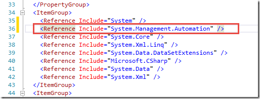

### 常用命令

- Get-PSDrive  Windows PowerShell 驱动器是一个数据存储位置，你可以像访问 Windows PowerShell 中的文件系统驱动器那样访问它。

- Get-Alias 和   ls Alias:(驱动器)     列出所有alias

- ls Env:(驱动器)    列出所有的环境变量

- ls Variable:(驱动器) 和 Get-Variable 列出所有的变量

- ls Function:(驱动器)  列出所有的函数

- get-command   查看命令信息 可以查看某个命令的path  get-command mysqldump

- invoke-item  向windows桌面双击操作一样打开某个文件或者目录

- $env -split ";"  以列表形式列出所有path

- ls env:    列出env驱动器中的内容

- 

```
```powershell
 $path = [environment]::GetEnvironmentvariable("path","user")
 [environment]::SetEnvironmentvariable("Path", $path+";c:\powershellscript", "User")
```
```

# Running PowerShell Scripts From C#

使用`-Command`参数，传递简单的字符串。 可以使用`-File`参数,传递一个ps脚本。 如果需要传递复杂（或者可能是换行符）的脚本文本，可以使用`-EncodedCommand`参数，它接受Base64编码的内容。

```
void NoError()
{
    var command = @"pwd";
    var startInfo = new ProcessStartInfo()
    {
        FileName = "powershell.exe",
        Arguments = $"-NoProfile -ExecutionPolicy unrestricted -Command \"{command}\"",
        UseShellExecute = false
    };
    Process.Start(startInfo);
}
```

执行一个ps文件:

```csharp
void NoError()
{
    var ps1File = @"C:\my script folder\script.ps1";
    var startInfo = new ProcessStartInfo()
    {
        FileName = "powershell.exe",
        Arguments = $"-NoProfile -ExecutionPolicy unrestricted -file \"{ps1File}\"",
        UseShellExecute = false
    };
    Process.Start(startInfo);
}
```

先编码执行一个复杂的命令:

```csharp
void Base64EncodedCommand()
{
    var psCommmand = @"echo ""quoted value"" 
    echo ""Second Line""
    pause";
    var psCommandBytes = System.Text.Encoding.Unicode.GetBytes(psCommmand);
    var psCommandBase64 = Convert.ToBase64String(psCommandBytes);

    var startInfo = new ProcessStartInfo()
    {
        FileName = "powershell.exe",
        Arguments = $"-NoProfile -ExecutionPolicy unrestricted -EncodedCommand {psCommandBase64}",
        UseShellExecute = false
    };
    Process.Start(startInfo);
}
```

### 使用c#类调用powershell 命令



接著我們在 Program.cs 檔案引用兩個命名空間如下：

```
using System.Management.Automation;
using System.Management.Automation.Runspaces;
```

大功告成，現在你可以將 PowerShell 指令整合到你的 C# 應用程式中了！

```
using (PowerShell powershell = PowerShell.Create())
{
    powershell.AddScript("Get-Service | Where-Object { $_.Status -eq 'Stopped' }");

    foreach (PSObject result in powershell.Invoke())
    {
        Console.WriteLine(result.Members["Name"].Value);
    }
}
```

返回字符窜:

```
using (PowerShell powershell = PowerShell.Create())
{
    powershell.AddScript("Get-Service | Out-String");

    foreach (string str in powershell.Invoke<string>())
    {
        Console.WriteLine(str);
    }
}
```

捕捉错误:

```
using (PowerShell powershell = PowerShell.Create())
{
    powershell.AddScript("Get-Service99");

    foreach (PSObject result in powershell.Invoke())
    {
        Console.WriteLine(result.Members["Name"].Value);
    }

    Console.WriteLine("執行過程中發生錯誤\n");
    PSDataCollection<ErrorRecord> errors = powershell.Streams.Error;
    if (errors != null && errors.Count > 0)
    {
        foreach (ErrorRecord err in errors)
        {
            System.Console.WriteLine("錯誤: {0}", err.ToString());
        }
    }
}
```