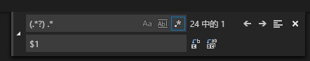

# 安装scoop前提

版本大于等于3的powershell

```
> $psversiontable.psversion.major
```

确保您已允许PowerShell执行本地脚本

```
> set-executionpolicy remotesigned -scope currentuser
```

# 常用命令

```
#打开powershell,win+r,然后输入powershell
#更改策略
Set-ExecutionPolicy RemoteSigned -scope CurrentUser

#安装
iex (new-object net.webclient).downloadstring('https://get.scoop.sh')

#安装git或者特定版本
scoop install git
scoop install shotcut@21.09.13 

#开启extras库
scoop bucket add extras

#开启java库
scoop bucket add java

#更新
scoop update

#查看安装软件列表
scoop list

#搜索某软件
scoop search xxx

#打开某软件官网
scoop home xxx

#查看某软件安装信息
scoop info xxx

#查看某软件执行命令位置
scoop which xxx

#查看某软件当前状态，是否有更新等信息
scoop status xxx

#更新某软件
scoop update xxx

#卸载某软件,以xxx为例
scoop uninstall xxx
```

这里是一个按照 Github score（由 Star 数量、Fork 数量和 App 数量综合决定的 Github score）排列的 bucket 列表：[Scoop buckets by Github score](https://github.com/rasa/scoop-directory/blob/master/by-score.md)。

# 安装scoop到自定义目录

如果重新安装系统.只需要将shime路径添加到环境变量path中`D:\Applications\Scoop\shims`

```powershell
set-executionpolicy remotesigned -scope currentuser

[environment]::setEnvironmentVariable('SCOOP','D:\Applications\Scoop','User')

[environment]::setEnvironmentVariable('Path',[System.Environment]::GetEnvironmentVariable('Path',[System.EnvironmentVariableTarget]::User)+";D:\Applications\Scoop\shims",'User')

$env:SCOOP='D:\Applications\Scoop'

[environment]::setEnvironmentVariable('SCOOP_GLOBAL','D:\Applications\ScoopGlobal','Machine')

[environment]::setEnvironmentVariable('Path',[System.Environment]::GetEnvironmentVariable('Path',[System.EnvironmentVariableTarget]::Machine)+";D:\Applications\ScoopGlobal\shims",'Machine')

$env:SCOOP_GLOBAL='D:\Applications\ScoopGlobal'
```

使用第二种方法:

```

[environment]::setEnvironmentVariable('Path',[System.Environment]::GetEnvironmentVariable('Path',[System.EnvironmentVariableTarget]::User)+";D:\Applications\Scoop\shims",'User')
# 然后关闭powershell 重新打开
scoop config root_path D:\Applications\Scoop
```

一个脚本

```
# 获取当前用户环境变量的"Path"
$currentPath = [Environment]::GetEnvironmentVariable('Path', 'User')

# 检查是否包含指定路径
$targetPath = 'D:\Applications\Scoop\shims'
$containsTargetPath = $currentPath -split ';' -contains $targetPath

if (-not $containsTargetPath) {
    # 如果不包含指定路径，则添加
    $newPath = $currentPath + ';' + $targetPath
    [Environment]::SetEnvironmentVariable('Path', $newPath, 'User')
    Write-Host "已成功添加路径: $targetPath"

    # 刷新环境变量（仅适用于当前会话）
    $env:Path = [Environment]::GetEnvironmentVariable('Path', 'User')

} else {
    Write-Host "路径已存在: $targetPath"
}

# 打印出所有的"Path"
$newPathList = [Environment]::GetEnvironmentVariable('Path', 'User') -split ';'
Write-Host "所有的Path:"
$newPathList


# 设置SCOOP的ROOT PATH
scoop config root_path D:\Applications\Scoop

# 打印所有配置
scoop config

# 添加git仓库都为 安全
git config --global --add safe.directory "*"
```

重置应用以解决冲突,会重置环境变量,快捷方式等..

```
scoop reset *
#检查潜在的问题..执行下看看使用scoop会有什么问题
scoop checkup
#如果使用了aria2感觉慢的话可以修改下参数或者关闭
scoop config aria2-max-connection-per-server 16
scoop config aria2-split 16
scoop config aria2-min-split-size 1M
scoop config aria2-enabled false  
#下面是日常更新软件命令
sudo scoop update * -g ; scoop update * ; sudo scoop cleanup * -g ; scoop cleanup *
# 查看 Scoop 还能直接识别哪些 bucket
scoop bucket known
```

### 快捷方式

```powershell
Invoke-Item "~\AppData\Roaming\Microsoft\Windows\Start Menu\Programs\Scoop Apps"
```

**将Scoop安装到自定义目录**
假设目标目录是`D:\Applications\Scoop`,在PowerShell命令控制台中运行：

```powershell
[environment]::setEnvironmentVariable('SCOOP','D:\Applications\Scoop','User')
$env:SCOOP='D:\Applications\Scoop'
iex (new-object net.webclient).downloadstring('https://get.scoop.sh')
```

将全局应用安装到自定义目录,假设目标目录是`D:\Applications\ScoopGlobal`,在PowerShell命令控制台中运行：

```powershell
[environment]::setEnvironmentVariable('SCOOP_GLOBAL','D:\Applications\ScoopGlobal','Machine')
$env:SCOOP_GLOBAL='D:\Applications\ScoopGlobal'
```

### 安装应用

以我常用应用为例(可作为脚本文件,后缀ps1)

```powershell
###安装scoop并自定义安装路径
[environment]::setEnvironmentVariable('SCOOP','D:\Applications\Scoop','User')
$env:SCOOP='D:\Applications\Scoop'
iex (new-object net.webclient).downloadstring('https://get.scoop.sh')
[environment]::setEnvironmentVariable('SCOOP_GLOBAL','D:\Applications\ScoopGlobal','Machine')
$env:SCOOP_GLOBAL='D:\Applications\ScoopGlobal'

#git,程序员必备,只有安装了git才能添加其他桶
scoop install git;
#arias2 scoop 下载会用到
scoop install aria2;
#7zip 一些app会用到
scoop install 7zip
#scoop checkup提示装的软件
scoop install wixtoolset

###添加桶
#scoop内置的桶
#scoop bucket known;

### D:\Applications\Scoop\buckets,如果发现bucket中有错误可以检查并删除
scoop bucket add extras;
scoop bucket add Java;
scoop bucket add versions;
 
# 自用的一个bucket
scoop bucket add Hass https://github.com/zhemima/Scoop-Hass


#一个还不错的
shovel bucket add 'ash258.ash258' 'https://github.com/Ash258/Shovel-Ash258.git'
#因为ash258的bucket对scoop做了改变,想要安装ash258,需要配置和安装以下
scoop install 7zip git
scoop config SCOOP_REPO 'https://github.com/Ash258/Scoop-Core'
scoop update
scoop status
scoop checkup


### 添加代理
scoop config proxy 127.0.0.1:1080
# 删除代理
scoop config rm proxy


###安装全局应用
scoop install apache -g;
scoop install redis -g;
scoop install mysql -g;
# jdk最好使用8,否则android-sdk会有问题
scoop install ojdkbuild8 -g; 
scoop install php -g;
#整合apache php
iex (new-object net.webclient).downloadstring('https://gist.githubusercontent.com/nilkesede/c98a275b80b6d373131df82eaba96c63/raw/apache-php-init.ps1')
# 或者手动修改apache配置
#LoadModule php7_module 'C:/Users/xxxxx/scoop/apps/php71/current/php7apache2_4.dll'
#AddHandler application/x-httpd-php .php
#PHPIniDir "C:\Users\xxxxx\scoop\apps\php71\current"

###安装APP
#使用nvm安装nodejs  https://www.sitepoint.com/quick-tip-multiple-versions-node-nvm/
scoop install nvm
nvm list available
nvm install 12.18.2
#效率启动神器
scoop install wox;
#文件检索
scoop install everything;
#解压
scoop install bandizip;
#远程终端
scoop install MobaXterm;
scoop install electerm;
#桌面控制
scoop install teamviewer;
#markdown编写
scoop install typora;
#编辑器 注意使用vscode-portable,这样data文件夹就会持久化在scoop,而不是c盘用户目录
#From "$env:USERPROFILE\.vscode\extensions" to "$env:USERPROFILE\scoop\persist\vscode-portable\data\extensions"
#From "$env:APPDATA\Code" to "$env:USERPROFILE\scoop\persist\vscode-portable\data\user-data"
#如果想添加右键菜单.执行下current文件夹下的vscode-install-context.reg
scoop install vscode-portable;
#ditto 剪贴板
scoop install ditto
#postman
scoop install postman
#heidisql
scoop install heidisql
#imageglass 图片浏览器
scoop install imageglass
#quick look
scoop install quicklook
#obs  录制视频或者直播
scoop install obs-studio
# 录像软件
scoop install captura
#switchhosts
scoop install switchhosts
# gradle
scoop install gradle
# android-sdk
scoop install android-sdk
# 安装ndk 老版本下载https://developer.android.com/ndk/downloads/older_releases.html
# sdkmanager ndk-bundle
# shadowsocksr-csharp
scoop install shadowsocksr-csharp
# 截图软件
scoop install picpick
scoop install snipaste
scoop install sharex 
scoop install lightshot
#xmind8
scoop install XMind2020
# android-studio
scoop install android-studio
#记住sourcetree的git最好使用内嵌版本
scoop install sourcetree
# php的包工具
scoop intstall composer
# 反向代理
scoop install frp
#网易云音乐
scoop install neteasemusic
# ftp工具
scoop install filezilla 
# pdf阅读工具
 scoop install foxit-reader
# 播放器
scoop install potplayer 
# draw工程图,uml工具
scoop install draw.io
# 定时提醒休息工具
scoop install wnr
# 投屏工具
scoop install scrcpy 
# 卸载工具
scoop install geekuninstaller
#浏览器
scoop install  firefox-developer-zh-cn
scoop install  googlechrome
#wechat
scoop install wechat
#steam
scoop install steam
# pwsh
scoop install pwsh
#windows teraminal
scoop install windows-terminal
# 反编译 ilspy  https://github.com/sailro/Reflexil下载Reflexil将Reflexil.ILSpy.Plugin.dll直接扔到ilspy目录下即行
scoop install ilspy
scoop install dnspy
#win+x菜单编辑
scoop install WinXMenuEditor   
#发送到菜单编辑
scoop install SendToMenuEditor
# 上下文菜单
scoop install EasyContextMenu
# 备份开始屏幕
scoop install BackupStartMenuLayout
#定时关机
scoop install kshutdown
# 创建可启动U盘的工具  https://www.ventoy.net/cn/index.html
scoop install ventoy
# 修改dns工具
scoop install dnsjumper
#space sniffer 查看硬盘被哪些大文件占用
scoop install spacesniffer
#shotcut 视频剪辑工具
scoop install shotcut
```

# apache

```
sudo httpd -k install -n apache  
start-service apache
remove-service apache
```

## 修改配置

文件路径`D:\Applications\ScoopGlobal\apps\apache\current\conf\httpd.conf`

```
Define SRVROOT "D:\Applications\ScoopGlobal\apps\apache\current"
ServerName localhost
```

# Redis

```
redis-server --service-install D:\Applications\ScoopGlobal\apps\redis\current\redis.windows-service.conf --loglevel verbose
```

# MySQL

注册MySQL服务,(因为scoop是低污染的,所以要自己做):

```
mysqld --install MySQL --defaults-file="D:\Applications\ScoopGlobal\apps\mysql\current\my.ini"
```

注意mysql8密码可能认证有错误my.ini中需要设置

```
default_authentication_plugin=mysql_native_password 
```

# pwsh

将pwsh添加到terminal中,配置默认路径:`C:\Users\zhepama\AppData\Local\Microsoft\Windows Terminal\settings.json`

```json
// This file was initially generated by Windows 终端(未打包) 1.0.200517002-release1.0
// It should still be usable in newer versions, but newer versions might have additional
// settings, help text, or changes that you will not see unless you clear this file
// and let us generate a new one for you.

// To view the default settings, hold "alt" while clicking on the "Settings" button.
// For documentation on these settings, see: https://aka.ms/terminal-documentation
{
  "$schema": "https://aka.ms/terminal-profiles-schema",

  "defaultProfile": "{90cbdc15-f4fe-49d2-a245-ec066b70845f}",

  // You can add more global application settings here.
  // To learn more about global settings, visit https://aka.ms/terminal-global-settings

  // If enabled, selections are automatically copied to your clipboard.
  "copyOnSelect": false,

  // If enabled, formatted data is also copied to your clipboard
  "copyFormatting": false,

  // A profile specifies a command to execute paired with information about how it should look and feel.
  // Each one of them will appear in the 'New Tab' dropdown,
  //   and can be invoked from the commandline with `wt.exe -p xxx`
  // To learn more about profiles, visit https://aka.ms/terminal-profile-settings
  "profiles": {
    "defaults": {
      // Put settings here that you want to apply to all profiles.
    },
    "list": [
      {
        // Make changes here to the powershell.exe profile.
        "guid": "{61c54bbd-c2c6-5271-96e7-009a87ff44bf}",
        "name": "Windows PowerShell",
        "commandline": "powershell.exe",
        "hidden": false
      },
      {
        // Make changes here to the cmd.exe profile.
        "guid": "{0caa0dad-35be-5f56-a8ff-afceeeaa6101}",
        "name": "命令提示符",
        "commandline": "cmd.exe",
        "hidden": false
      },
      {
        "guid": "{b453ae62-4e3d-5e58-b989-0a998ec441b8}",
        "hidden": false,
        "name": "Azure Cloud Shell",
        "source": "Windows.Terminal.Azure"
      },
      {
        "guid": "{90cbdc15-f4fe-49d2-a245-ec066b70845f}",
        "name": "pwsh",
        "commandline": "D:\\Application\\Scoop\\apps\\pwsh\\current\\pwsh.exe",
        "hidden": false,
        "startingDirectory": "%USERPROFILE%"
      }
    ]
  },

  // Add custom color schemes to this array.
  // To learn more about color schemes, visit https://aka.ms/terminal-color-schemes
  "schemes": [],

  // Add custom keybindings to this array.
  // To unbind a key combination from your defaults.json, set the command to "unbound".
  // To learn more about keybindings, visit https://aka.ms/terminal-keybindings
  "keybindings": [
    // Copy and paste are bound to Ctrl+Shift+C and Ctrl+Shift+V in your defaults.json.
    // These two lines additionally bind them to Ctrl+C and Ctrl+V.
    // To learn more about selection, visit https://aka.ms/terminal-selection
    {
      "command": {
        "action": "copy",
        "singleLine": false
      },
      "keys": "ctrl+c"
    },
    {
      "command": "paste",
      "keys": "ctrl+v"
    },

    // Press Ctrl+Shift+F to open the search box
    {
      "command": "find",
      "keys": "ctrl+shift+f"
    },

    // Press Alt+Shift+D to open a new pane.
    // - "split": "auto" makes this pane open in the direction that provides the most surface area.
    // - "splitMode": "duplicate" makes the new pane use the focused pane's profile.
    // To learn more about panes, visit https://aka.ms/terminal-panes
    {
      "command": {
        "action": "splitPane",
        "split": "auto",
        "splitMode": "duplicate"
      },
      "keys": "alt+shift+d"
    }
  ]
}
```

# 自制bucket

最佳方式是使用模板 <https://github.com/Ash258/GenericBucket>

### 如何解压exe的程序

首先下载的时候后面加上#/dl.7z类似的后缀..然后scoop保存的时候.会把他存在7z格式的文件夹

```
    "architecture": {
        "64bit": {
            "url": "https://github.com/RoderickQiu/wnr/releases/download/v1.17.1/wnr-1.17.1-Setup-64.exe#/dl.7z",
            "hash": "BE14DE68FDBFB3663F57B6B28E8B0CC90AE876DD06CA899839BEB9377FE21436"
        },
        "32bit": {
            "url": "https://github.com/RoderickQiu/wnr/releases/download/v1.17.1/wnr-1.17.1-Setup-32.exe#/dl.7z",
            "hash": "9C437170019E8AFC82B64A5475E349602E03A9493DD6AC6CACF58FDFD75762DD"
        }
    },
```

例如上面旧会被存在scoop/cache/wnr#1.17.1#https_github.com_RoderickQiu_wnr_releases_download_v1.17.1_wnr-1.17.1-Setup-64.exe_dl.7z

然后旧可以解压了

```
    "installer": {
        "script": [
            "Expand-7zipArchive -Path (Join-Path $dir '$PLUGINSDIR\\*.7z') -DestinationPath $dir",
            "Remove-Item -Path (Join-Path $dir '$PLUGINSDIR') -Recurse",
            "Remove-Item \"$dir\\Uninstall wnr.exe\""
        ]
    },
```

安装脚本都是执行在Scoop\\apps\\wnr\\11.XXX\\下面

### 导出 Scoop 软件列表

备份 Scoop 的方式为：

```
scoop export > scoop.txt
```

可以对 Scoop 的导出列表进行额外处理，以方便后续安装。使用 VSCode 打开 `scoop.txt` 文件，以正则表达式搜索：

```
(.*?) .*
```

并全部替换成：

```
$1
```

注意正则式中包含空格，请完整复制。

