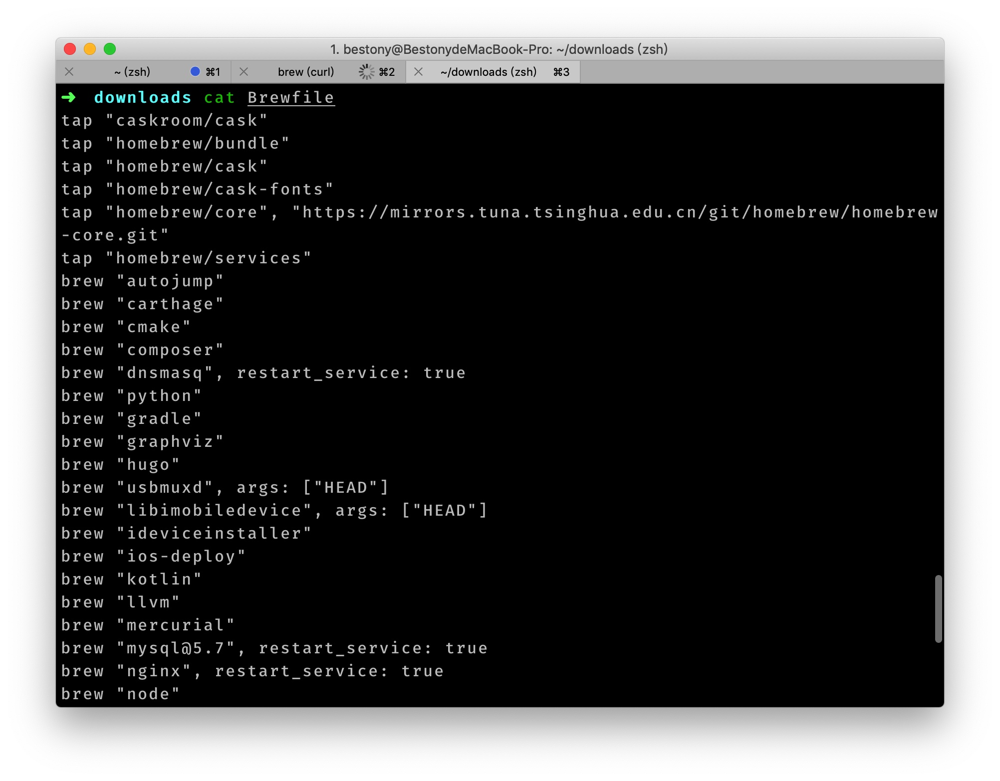

### 将brew装在非系统盘

- `Command-R` 重新安装您在 Mac 上安装过的最新 macOS，但不会升级到更高的版本。

- `Option-Command-R` 升级到与您的 Mac 兼容的最新 macOS。

- `Shift-Option-Command-R` 需要安装 [macOS Sierra 10.12.4](https://link.zhihu.com/?target=https%3A//support.apple.com/zh-cn/HT201260) 或更高版本重新安装 Mac 随附的 macOS 或仍有提供的最接近版本。

```shell
#禁用安全工具,使/usr/local可以挂载到非系统盘,需要进入安全模式执行
csrutil disable

# 挂载非系统盘到/usr/local
vi /etc/fstab
UUID=BA245166-9FB3-4D88-98E3-147559D0B531 /usr/local apfs rw,auto,nobrowse

#设置环境变量HOMEBREW_TEMP需要和brew在同一个硬盘
vi ~/.bash_profile
export PATH="/usr/local/bin:$PATH"
export HOMEBREW_TEMP=/usr/local/temp
```

### 切换国内的镜像源

Homebrew 默认使用的是国外的源，在下载时速度可能会比较慢。好在国内的清华大学和中科大提供了 Homebrew 的镜像源，我们可以很轻松的切换源，从而提升我们的下载速度。

#### 使用中科大的镜像

执行如下命令，即可切换为中科大的镜像

```bash
cd "$(brew --repo)"
git remote set-url origin git://mirrors.ustc.edu.cn/brew.git
cd "$(brew --repo)/Library/Taps/homebrew/homebrew-core"
git remote set-url origin git://mirrors.ustc.edu.cn/homebrew-core.git
```

#### 使用清华大学的镜像

执行如下命令，即可切换为清华大学的镜像

```bash
git -C "$(brew --repo)" remote set-url origin https://mirrors.tuna.tsinghua.edu.cn/git/homebrew/brew.git

git -C "$(brew --repo homebrew/core)" remote set-url origin https://mirrors.tuna.tsinghua.edu.cn/git/homebrew/homebrew-core.git
```

### 使用 Brewfile 完成环境迁移

设备永久了，我们的电脑中会有大量的软件，如果你需要迁移环境，重新安装会是一个大麻烦，好在 Homebrew 本身为我们提供了一个非常好用的环境迁移的工具 —— Homebrew Bundle

你首先需要在之前的电脑中执行 `brew bundle dump` 来完成当前环境的导出,导出完成后，你会得到一个 *Brewfile*。

然后将 *Brewfile* 复制到新的电脑中，并执行 `brew bundle` 来开始安装的过程。

### 常用软件


```
brew cask install launchrocket
```

### 常用链接

<https://github.com/Homebrew/homebrew-services>

<https://sspai.com/post/56009>