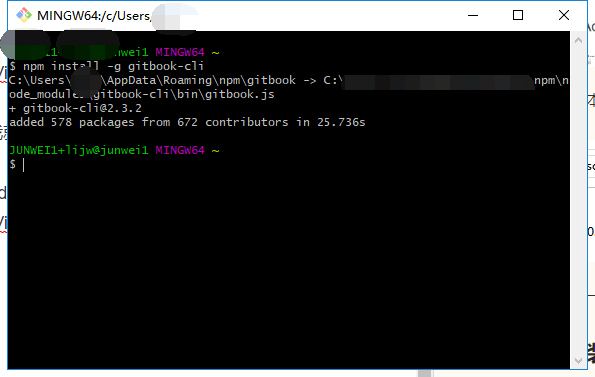
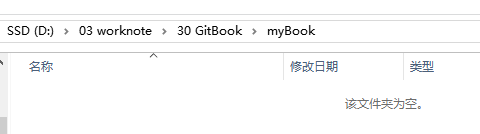
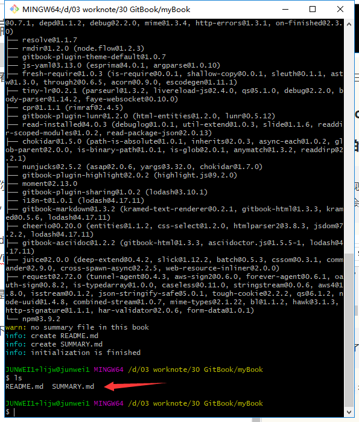
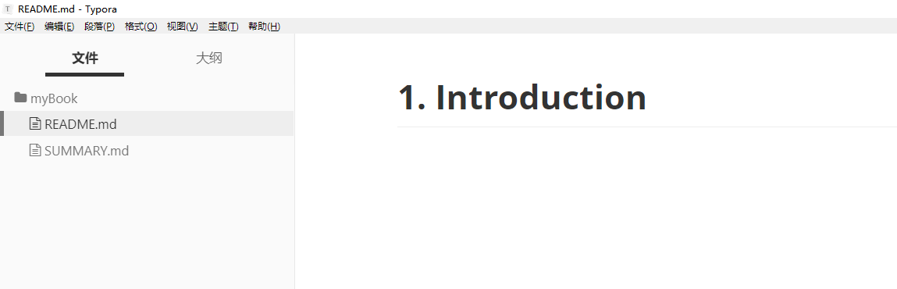
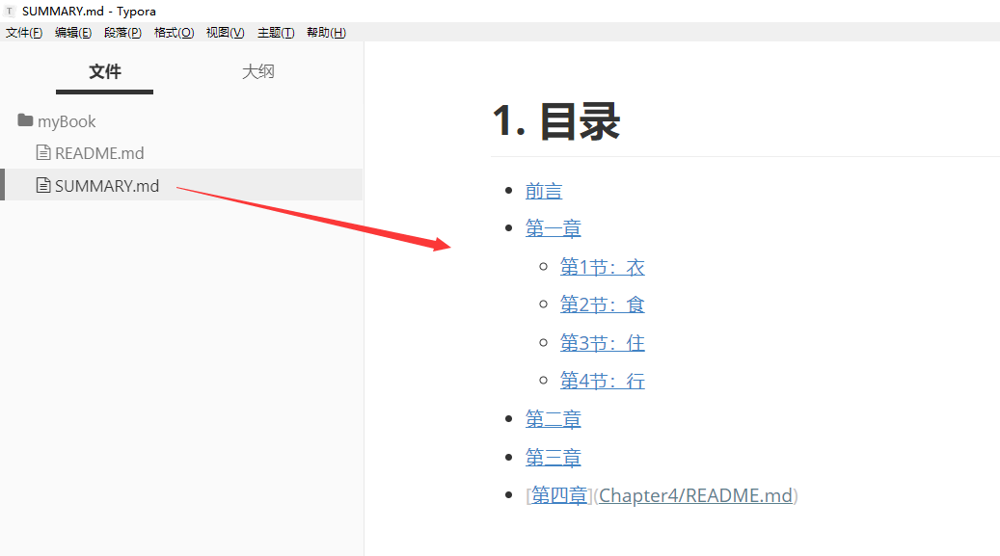
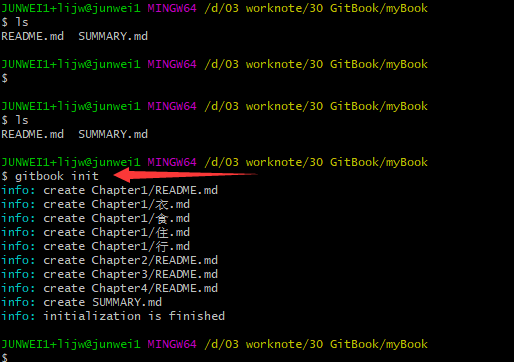
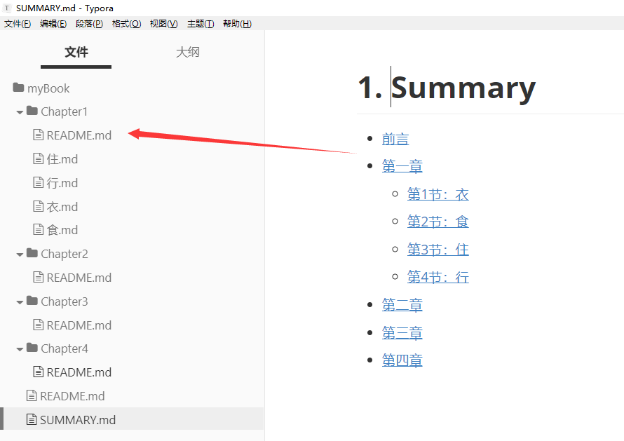
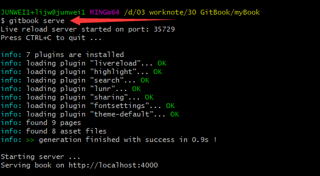
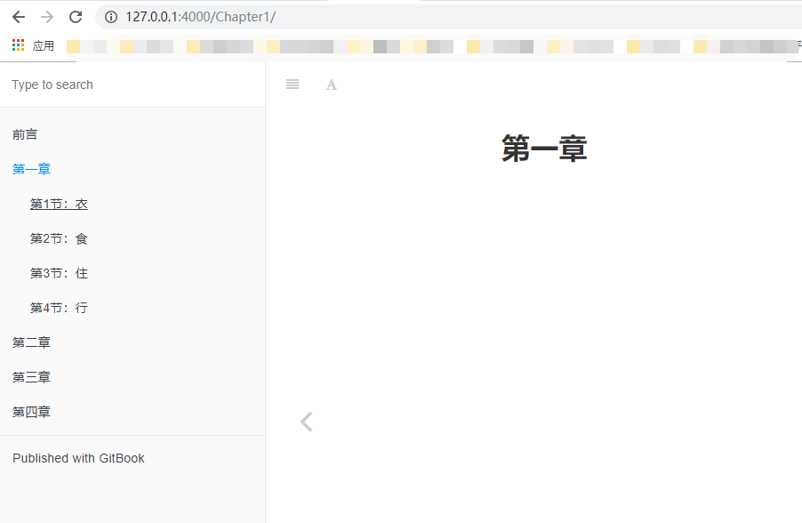
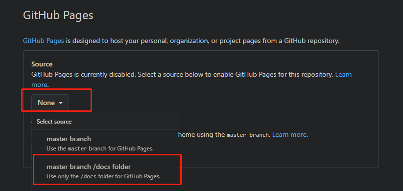

### 使用npm安装gitbook

现在安装 Node.js 都会默认安装 npm（node 包管理工具），所以我们不用单独安装 npm，打开命令行，执行以下命令安装 GitBook：

```undefined
npm install -g gitbook-cli
```

使用**Git Bash**操作如下图：



好了，准备好了三件套工具之后，就是来看看怎么编写**GitBook**了。

## 编写GitBook

### 创建电子书的文件夹目录

> 想象一下，现在你准备构建一本书籍，你在硬盘上新建了一个叫 mybook 的文件夹，按照以前的做法，你会新建一个 Word 文档，写上标题，然后开始巴滋巴滋地笔耕。



### 初始化Gitbook

> 但是现在有了 GitBook，你首先要做的是在 mybook 文件夹下执行以下命令：

使用`gitbook init`初始化gitbook，操作如下：



执行完后，你会看到多了两个文件 —— README.md 和 SUMMARY.md，它们的作用如下：

- README.md —— 书籍的介绍写在这个文件里

- SUMMARY.md —— 书籍的目录结构在这里配置

### 使用Typora来编写框架内容

这时候，我们启动恭候多时的 Typora 来编辑这两个文件了：



编辑 SUMMARY.md 文件，内容修改为：

```bash
# 目录

* [前言](README.md)
* [第一章](Chapter1/README.md)
  * [第1节：衣](Chapter1/衣.md)
  * [第2节：食](Chapter1/食.md)
  * [第3节：住](Chapter1/住.md)
  * [第4节：行](Chapter1/行.md)
* [第二章](Chapter2/README.md)
* [第三章](Chapter3/README.md)
* [第四章](Chapter4/README.md)
```

显示如下：



### 重新使用gitbook根据目录，初始化篇章

然后我们回到命令行，在 mybook 文件夹中再次执行 `gitbook init` 命令。GitBook 会查找 SUMMARY.md 文件中描述的目录和文件，如果没有则会将其创建。



Typora 是所见即所得（实时渲染）的 Markdown 编辑器，这时候它是这样的：



### 启动服务，预览书籍

接着我们执行 `gitbook serve` 来预览这本书籍，执行命令后会对 Markdown 格式的文档进行转换，默认转换为 html 格式，最后提示 “Serving book on [http://localhost:4000](https://links.jianshu.com/go?to=http%3A%2F%2Flocalhost%3A4000%2F)”。嗯，打开浏览器看一下吧：





## 结合 GitHub Pages

GitHub Pages 是 GitHub 提供的静态网站托管服务。

GitHub 上的每个仓库都可以拥有一个 GitHub Pages，对应的 URL 如下：

```xml
https://<username>.github.io/<repository>/
```

GitHub Pages 的静态资源支持下面 3 个来源：

- `master` 分支

- `master` 分支的 `/docs` 目录

- `gh-pages` 分支



执行下面命令，将 `_book` 目录推送到 GitHub 仓库的 `gh-pages` 分支。

```shell
$ git checkout --orphan gh-pages
$ code .nojekyll
```

或者在生成静态网页时，将保存的目录指定为 `./docs`

```shell
$ gitbook build ./ ./docs
```

然后直接推送到 GitHub 仓库的。

```shell
$ git push origin master
```