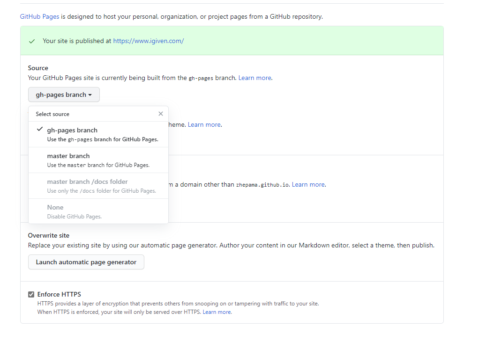

# 使用hexo

```
#安装hexo
npm install -g hexo-cli
hexo -v

# 初始化一个博客
cd igiven.github.io
hexo init

#添加主题
git submodule add https://github.com/theme-next/hexo-theme-next themes/next
git submodule add https://github.com/ppoffice/hexo-theme-icarus.git themes/icarus

#添加插件https://github.com/sisyphsu/hexo-enhancer#readme
#如果不能生成,则删除db.json  ..或者hexo clean
yarn add hexo-enhancer
yarn add hexo-excerpt
#本地服务器
hexo s  
```

## GITHUB ACTIONS

添加此action前记得先添加分支gh-pages,并设置github的pages为该分支

```
git checkout --orphan gh-pages
# .nojekyll 的空文件来禁用 Jekyll 构建过程，然后按照静态站点生成器的说明在 本地构建站点。
touch .nojekyll
```



```
# This workflow will do a clean install of node dependencies, build the source code and run tests across different versions of node
# For more information see: https://help.github.com/actions/language-and-framework-guides/using-nodejs-with-github-actions

name: Node.js CI

on:
  push:
    branches: [ master ]
  pull_request:
    branches: [ master ]

jobs:
  build:

    runs-on: ubuntu-latest

    strategy:
      matrix:
        node-version: [14.x]

    steps:
    - name: 迁出main
      uses: actions/checkout@v2
      with: 
        path: main
        submodules: 'recursive'

    - name: Use Node.js ${{ matrix.node-version }}
      uses: actions/setup-node@v1
      with:
        node-version: ${{ matrix.node-version }}
    
    - name: 安装hexo
      run : |
        npm install -g hexo
  
    - name: 生成博客
      run : |
        cd main
        npm install
        hexo clean
        hexo generate
        ls
      
    - name: 迁出gh-pages
      uses: actions/checkout@v2
      with:
        path: gh-pages
        ref: gh-pages
        
    - name: 部署到gh-pages
      env:
        TZ: Asia/Shanghai
      run: |
        cp -rf main/public/* gh-pages
        cd gh-pages
        git config --global user.name "zhepama"
        git config --global user.email "zhepama@gmail.com"
        git add .
        git commit -m "Auto Delopy at `date +"%Y-%m-%d %H:%M"`"
        git push origin gh-pages
```