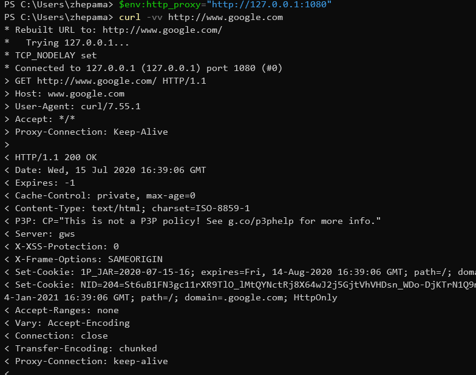

# cmd

```
cmd命令行:(不用socks5)(临时设置)(也可放置环境变量)
set http_proxy=http://127.0.0.1:1080
set https_proxy=http://127.0.0.1:1080

```

# powershell

```
$env:http_proxy="http://127.0.0.1:1080"
$env:https_proxy="http://127.0.0.1:1080"
curl -vv http://www.google.com
```



# linux

```
export http_proxy=127.0.0.1:1080
export ftp_proxy=127.0.0.1:1080
export https_proxy=127.0.0.1:1080
```

# GIT

```
git config --global https.proxy http://127.0.0.1:1080
git config --global https.proxy http://127.0.0.1:1080
```
