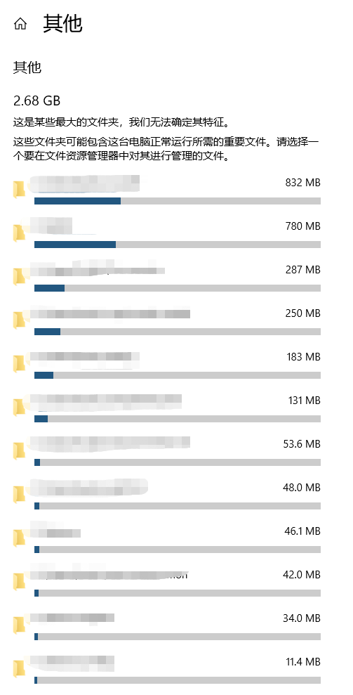

# 如何发现的？

#### 查看C盘存储

1.  打开所有设置->系统->存储->选择C盘
    

2.  查看C盘使用情况，可以查看“其他”中情况
    

3.  发现.nuget文件夹占用的空间很大，这是由于VS的默认nuget包路径：C:\Users{UserName}.nuget\packages

# 如何解决？

NuGet 的行为由一个或多个 NuGet.Config (XML) 文件（可存在于项目范围、用户范围和计算机范围的级别）中的累积设置驱动。

1.  在解决方案文件夹中，设置应用于子文件夹中的所有项目。 请注意，如果配置文件位于项目文件夹中，则对该项目没有任何影响

2.  设置应用于所有操作，但可被任何项目级的设置替代。
    Windows：`%appdata%\NuGet\NuGet.Config`
    Mac/Linux：`~/.config/NuGet/NuGet.Config` 或 `~/.nuget/NuGet/NuGet.Config`

3.  设置虽然适用于计算机上的所有操作，但会被任何用户级或项目级设置覆盖。
    Windows：`%ProgramFiles(x86)%\NuGet\Config`
    Mac/Linux：`$XDG_DATA_HOME`。 Mac/Linux: `$XDG_DATA_HOME`. 如果 `$XDG_DATA_HOME` 的值是 null 或为空，将使用 `~/.local/share` 或 `/usr/local/share`（因 OS 版本而异）

发现占用空间资源比较大的时用户级别的nuget包..我们只要把这个文件夹移动到其他驱动器就可以.

以下两种方法都行,建议第二种.因为nuget.exe还需要安装

1.可以直接使用命令行

```
nuget config -set repositoryPath=D:\Users\zhepama\.nuget\packages
```

2.直接修改配置文件`C:\Users\{user}\AppData\Roaming\NuGet\NuGet.Config`添加globalPackagesFolder节点

```
<?xml version="1.0" encoding="utf-8"?>
<configuration>
  <packageSources>
      <add key="nuget.org" value="https://api.nuget.org/v3/index.json" protocolVersion="3" />
  </packageSources>
  <config> 
      <add key="globalPackagesFolder" value="D:\Users\zhepama\.nuget\packages" />
  </config>
</configuration>
```

# 参考连接

-   [常见的 NuGet 配置 | Microsoft Docs](https://docs.microsoft.com/zh-cn/nuget/consume-packages/configuring-nuget-behavior)

-   [nuget.config 文件引用 | Microsoft Docs](https://docs.microsoft.com/zh-cn/nuget/reference/nuget-config-file)
