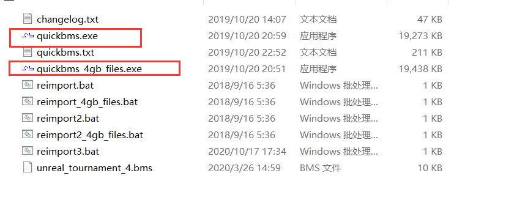
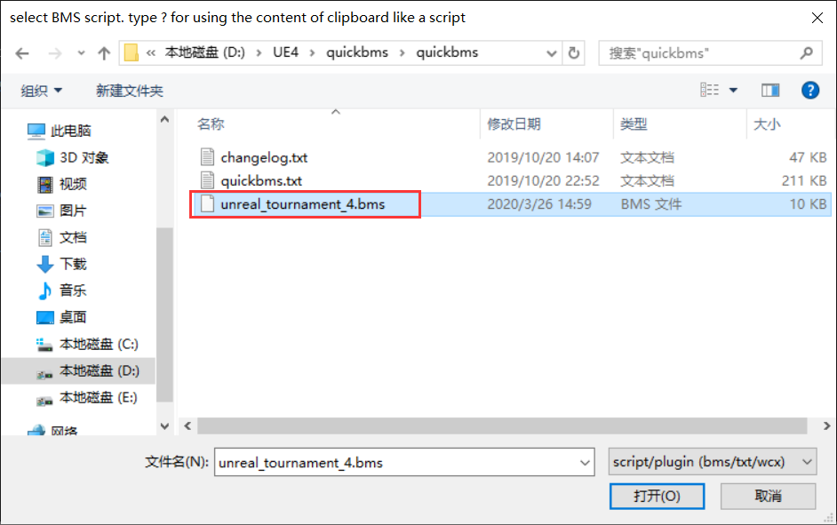
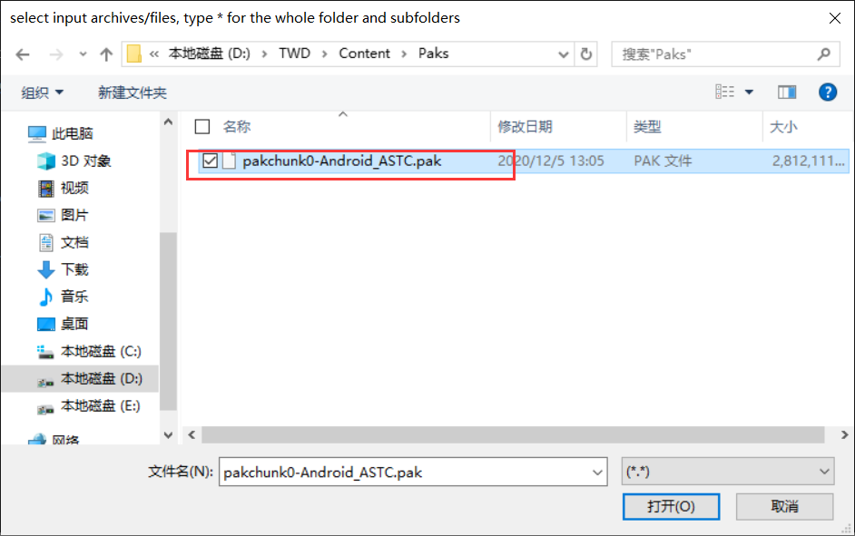
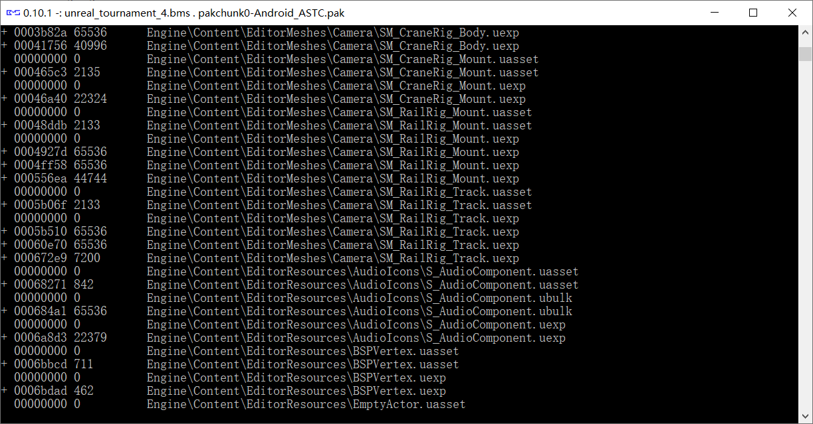
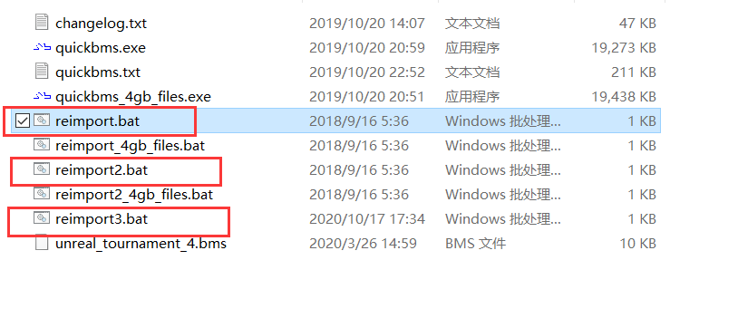
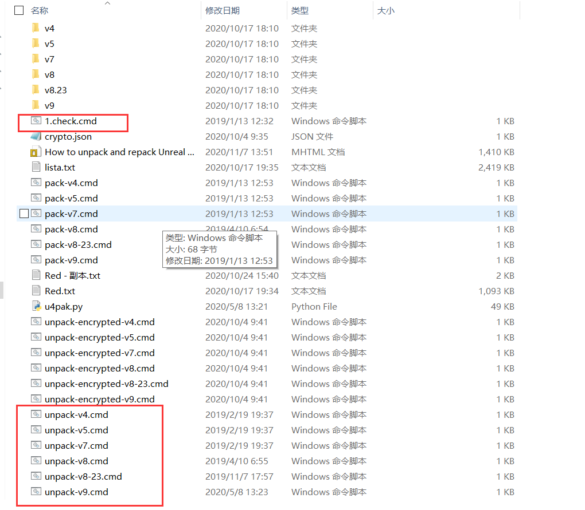
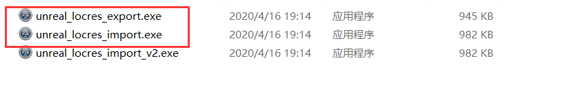
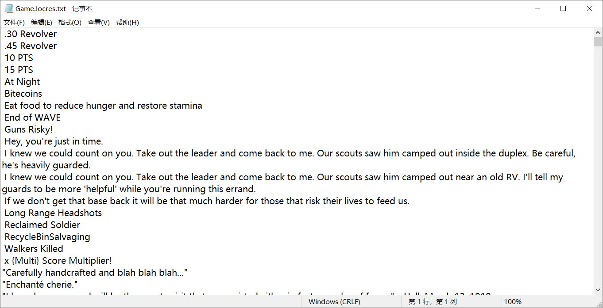

**Pak解包和打包**

Pak文件就是UE4游戏生成的数据包文件，PC游戏一般放在游戏路径下的Content\Paks，安卓则在obb解包后游戏路径下的Content\Paks中，一般汉化所需的文本都放在pakchunk0-WindowsNoEditor.pak（PC端）或者pakchunk0-Android\_ASTC.pak(移动端)中，如果不确定可以全部解包一下。

目前主流的解包和打包工具有两种，一种是quickbms，另一种是UnrealPakSwitch。

**使用quickbms解包**

首先介绍一下quickbms(开发者论坛网站:<https://zenhax.com/)的使用方法，quickbms并非UE4专用的解包打包工具，而是一个可以根据相应脚本插件来解包的工具，打开quickbms的目录，会看到这些文件，解包主要使用quickbms.exe和quickbms_4gb_files.exe，顾名思义quickbms_4gb_files.exe就是给超过4g的大文件解包使用的，没有超过的使用quickbms.exe解包即可。>

使用过程很简单，打开quickbms.exe会提示选择选择解包脚本，我们选择unreal\_tournament\_4.bms这个脚本

然后会再次提示选择pak，我们选择对应的pak包即可

如果是没有加密的pak此时就会正常解包，如果是加密的pak，则需要输入密钥(密钥获取方式后面教程会提到)，后面就等待解包完成即可

**使用quickbms打包**

quickbms打包实际上就是解包的反过程，这里不能再直接使用quickbms.exe打包，而是要用打包脚本，如下图的三个脚本，使用reimport.bat打包有个条件，修改后的文件不能比源文件大。reimport2.bat和reimport3.bat按作者说法已经解决了这个限制，但是在实际使用中仍有问题，所以如果修改后的文件变大了就不建议使用了；

quickbms打包有一个优点，就是不需要提供全部的文件，只需要将修改后的文件按pak包中的目录放置好就行(注: 一定要是完整目录)，比如修改了Pak包中TWD\Content\Localization\Game\en中的Game.locres文件，那么就要建立TWD\Content\Localization\Game\en这个路径将修改的Game.locres文件放入其中，然后双击reimport.bat脚本，同样的选择unreal\_tournament\_4.bms这个脚本，选择pak包，最后选择刚刚修改文件的目录即可

**使用UnrealPakSwitch解包和打包**

UnrealPakSwitch工具(作者详细教程链接:<https://gbatemp.net/threads/how-to-unpack-and-repack-unreal-engine-4-files.531784/> )实际使用的是虚幻4引擎中的UnrealPak.exe工具来进行解包和打包的，所以相对更加可靠，由于依赖的是u4pak.py脚本，所以需要先安装Python环境(可到官网下载，链接: <https://www.python.org/ftp/python/3.9.0/python-3.9.0-amd64.exe)。安装过程不在赘述注意建立Path环境变量。安装好后，首先需要使用1.check这个脚本检测版本，将pak包放入UnrealPakSwitch工具目录下，然后拖动到1.check.cmd上即可弹出版本，Unreal> Engine 4.19.2 (for v4 \*.pak), Unreal Engine 4.20.3 (for v5 \*.pak), Unreal Engine 4.21.2 (for v7 \*.pak), Unreal Engine 4.22.3 (for v8 \*.pak), Unreal Engine 4.24.1 (for v8.23 \*.pak), Unreal Engine 4.25.4 (for v9 \*.pak).，检测版本后根据对应的版本放入相应版本的UnrealPak.exe工具，作者教程中写的很详细，不在赘述。

然后就是解包，过程很简单，将pak包拖动到相应版本的unpack-vxx.cmd上，如果是加密包则拖动到unpack-encrypted-vxx.cmd上，即可自动进行解包，解包后目录会输出在UnrealPakSwitch工具目录下。同时会生成一个lista.txt文件，这个文件包含pak包中所有文件信息，后面打包需要用到。

当修改好后需要打包的时候，就要对lista.txt文件进行修改，详细修改方法见作者教程<https://gbatemp.net/threads/how-to-unpack-and-repack-unreal-engine-4-files.531784/中的Pack> files部分，修改好后拖动到pack-vxx.cmd上即可。

**简单导出并汉化文本文件**

对于多语言的游戏，游戏文本基本都是放在Content\Localization\下的，如果目录下的文件是文本文件，那么直接用记事本打开修改即可，如果是locres文件，则需要使用工具来导出文本

使用unreal\_locres\_export.exe是导出，unreal\_locres\_import.exe是导入，导出后的文本就是下面这样

将其修改成中文后(不要有任何换行动作，文件不要重命名)，使用导入工具生成locres文件即可。

必备工具：

1.  Umodel 下载网址：<http://www.gildor.org/en/projects/umodel>   国外大神作品，英文网站，有点英语基础就行。

    不想点开网站的下载链接：<http://www.gildor.org/down/43/umodel/umodel_win32.zip>

    之前只有32位系统可以用，现在更新后64位也可以用了（我的就是）

2.  ActorX Import 也是上个网站上的插件，用于3ds max导入pskx文件用。下载解压后把文件放到3ds max 安装路径里的stdplugs文件夹里面。

3.  3ds max 版本不限，但最好不要太低，我用的2019最新版，可以用。注意3ds max最好破解一下，不然30天用的不舒服。

4.  UE4
