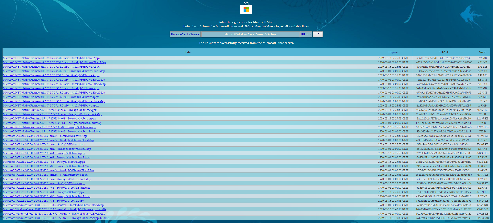
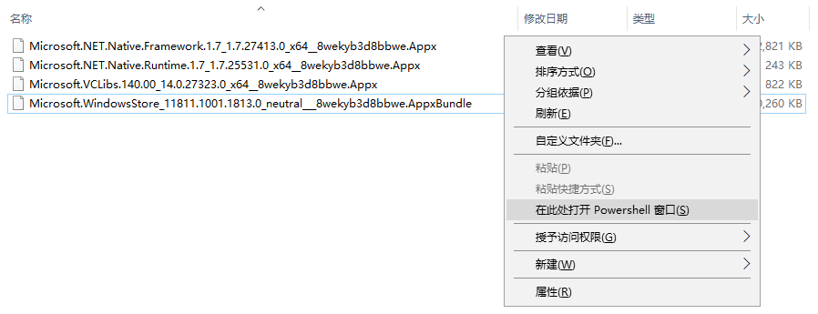
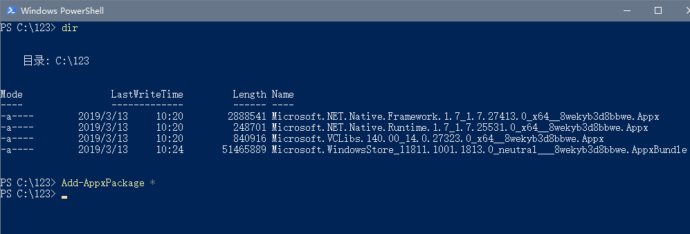
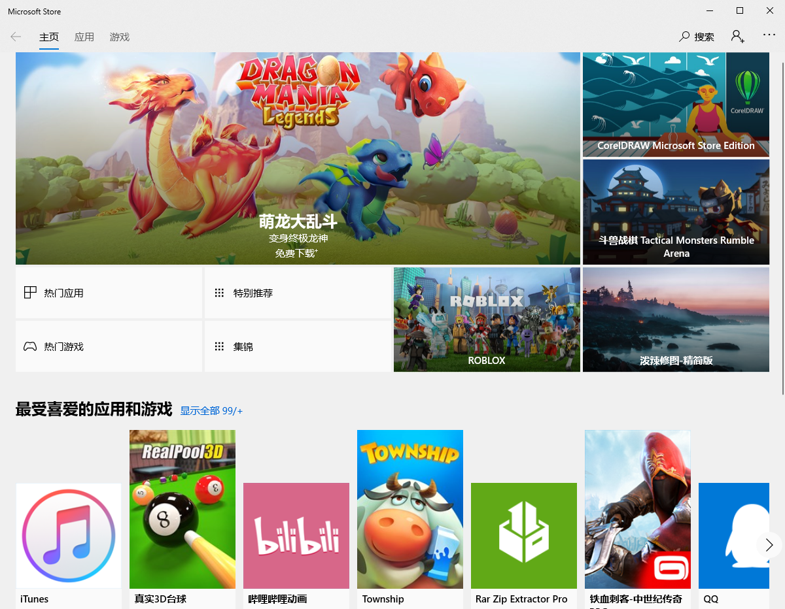

打开网址 <https://store.rg-adguard.net/>

以 PackageFamilyName 方式搜索 Microsoft.WindowsStore\_8wekyb3d8bbwe

根据系统选择对应的包，每一种都要下载



# 安装

在下载目录按住 shift 键，然后鼠标右键，打开 Powershell



执行安装命令，此处只安装了 64 位安装包，建议在安装时把 32 位也一并下载安装

```
# 安装该路径下所有包
Add-AppxPackage *
```



此时点击开始菜单应该就能看到应用商店了



清空应用商店缓存 WSReset.exe

应用商店 ID 为 9WZDNCRFJBMP

应用安装器 ID 为 9NBLGGH4NNS1

<https://github.com/dragonflylee/WimHelper>

<https://github.com/kkkgo/LTSB-Add-MicrosoftStore>

***

[**https://www.microsoft.com/zh-cn/store**](https://www.microsoft.com/zh-cn/store)
