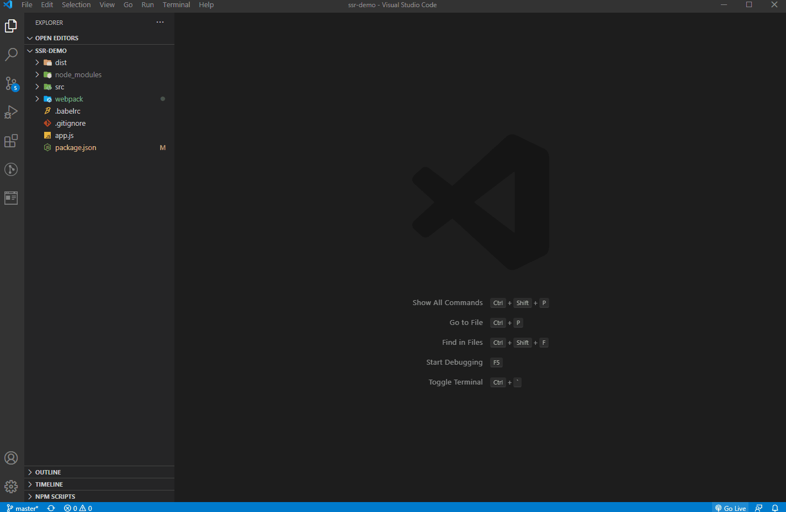
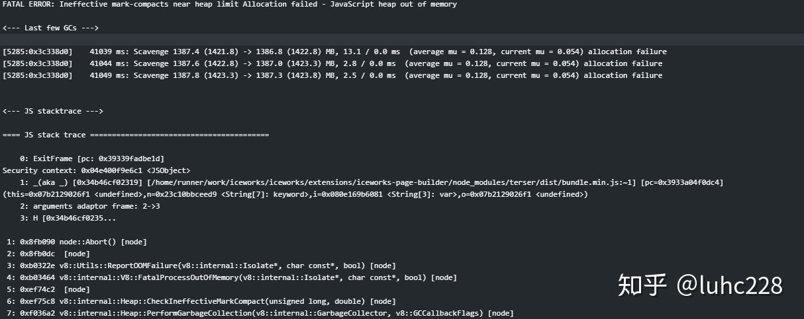
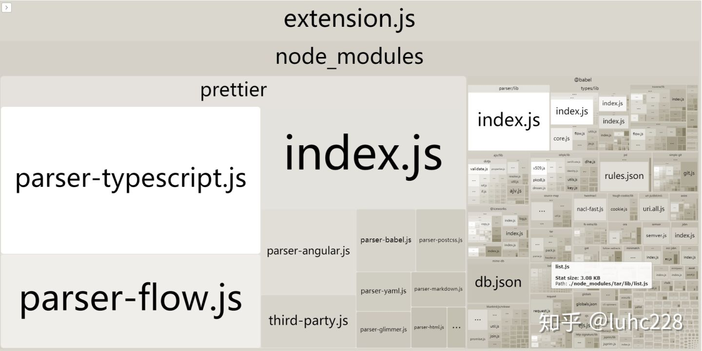
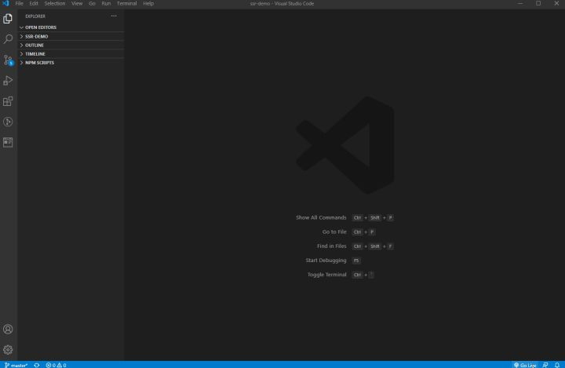

## 前言

最近在打包 VS Code 插件时，发现打包后的插件体积非常大，而且插件在 VS Code 中的启动速度非常慢，对用户的体验不太友好了。对此做了一些研究，并更改了打包策略，终于把插件的体积从 35M 减少到 3M，并提高了插件的启动速度。

本文将带你分析插件体积过大和启动速度过慢的原因，并讲解如何通过使用 webpack 进行打包来减少插件体积。最后将讲解如何配置 externals 剥离一些依赖模块，减少 bundle 的体积，避免出现打包失败的问题。

## 原始打包

首先，我们会以 iceworks-page-builder VS Code 插件为例子进行分析，具体的代码可以点击[此链接](https://link.zhihu.com/?target=https%3A//github.com/ice-lab/iceworks/tree/v0.1.6/extensions/iceworks-page-builder)查看。

其中，部分目录结构说明如下：

```
<code class="language-text">├── .vscodeignore            # 插件打包时需要忽略的文件
├── build                     # 构建产物目录
├── node_modules
├── package.json
├── src                       # 插件相关的源代码
|  ├── extension.ts
|  ├── services
|  └── types.d.ts
├── tsconfig.json
└── web                       # webview 相关代码 本质是一个 React 项目</code>
```

打包插件需要使用 [vsce](https://link.zhihu.com/?target=https%3A//github.com/microsoft/vscode-vsce) 这个工具。 首先确认已安装 `vsce` ；若未安装，则执行以下的命令安装 `vsce` ：

```
<code class="language-text">npm i vsce -g</code>
```

在项目的根目录下执行以下命令，即开始对插件进行打包：

```
<code class="language-text">vsce package</code>
```

它会先执行 scripts 中的 `vscode:prepublish` 命令。从上面可以看出，会先对 Webview 相关的代码进行构建（本质是 CLI 提供的构建能力），得到 js 、html 、css 代码，然后使用 `tsc` 对插件源代码（./src/\*\*）进行编译。

等待 `vscode:prepublish` 执行完成后， `vsce` 将执行剩下的插件打包操作，最后会在项目根目录下出现一个 .vsix 文件，也就是我们成功打包出来的插件。现在，整个插件的体积是 **35M**，在 VS Code 中启动速度大概为 **8s**。插件启动效果图如下：



那我们有办法知道究竟是哪些文件导致这个 .vsix 文件这么大的吗？答案是有的。我们只需要把 .vsix 的后缀改成 .zip，然后把这个 zip 文件进行解压，即可看到整个插件是由哪些文件构成了。

```
<code class="language-text">workspace/ice/iceworks/extensions/iceworks-page-builder/iceworks-page-builder-0.1.7
└── extension
   ├── CHANGELOG.md
   ├── README.en.md
   ├── README.md
   ├── assets
   ├── build                     # 1.86M
        ├── assets
      ├── css
        |   └── index.css
      ├── extension.js
      ├── favicon.png
      ├── index.html
      ├── js
      |  └── index.js
      └── services
         └── index.js
   ├── node_modules              # 69.6M
   ├── package.json
   ├── package.nls.json
   └── package.nls.zh-cn.json</code>
```

可以看出其中的 node_modules 目录的体积是最大的，这是导致插件体积过大的问题。另外，build 目录和node_modules 目录下有很多模块，正是如此，VS Code 在加载我们的插件的过程中，会加载很多小模块，这就是加载过慢的原因。

## 使用 webpack 进行打包

相信大部分的前端开发者都知道，现在的模块化的前端开发范式非常流行，与此同时出现了很多模块构建工具，比如 Rollup、webpack 等。这些模块构建工具的出发点之一是，把多个模块打包成一个模块，解决加载多个模块速度过慢的问题。那我们能不能用这些构建工具，把多个小的源文件打包成单个入口文件，从而解决上述的问题呢？答案是肯定的。

首先我们需要安装一下 `webpack` 和 `webpack-cli` ，其中， `webpack` 是 Webpack 的核心模块， `webpack-cli` 是 `webpack` 的 CLI 程序，用来在命令行中调用 `webpack` 。另外还需要安装 `ts-loader` ，用于加载 `ts` 代码并编译成 `js` 代码。

```
<code class="language-text">npm i --save-dev webpack webpack-cli ts-loader</code>
```

安装完成以后，我们需要在根目录下新建一个 `webpack.config.js` ，并增加以下的内容：

```
<code class="language-js">const path = require('path');

const tsConfigPath = path.join(__dirname, 'tsconfig.json');

const config = {
  target: 'node',
  entry: './src/extension.ts',
  output: {
    path: path.resolve(__dirname, 'build'),
    filename: 'extension.js',
    libraryTarget: 'commonjs2',
    devtoolModuleFilenameTemplate: '../[resource-path]',
  },
  externals: {
    vscode: 'commonjs vscode'
  },
  resolve: {
    extensions: ['.ts', '.js'],
  },
  module: {
    rules: [
      {
        test: /\.ts$/,
        use: [
          {
            loader: 'ts-loader',
            options: {
              configFile: tsConfigPath,
            },
          },
        ],
      },
    ],
  },
};

module.exports = (env, argv) => {
  if (argv.mode === 'development') {
    config.devtool = 'source-map';
  }

  return config;
};</code>
```

修改 `package.json` 中 `scripts` 的内容，以使用 `webpack` 进行打包：

```
<code class="language-json">{
    "scripts": {
    "vscode:prepublish": "rm -rf build && npm run build:web && webpack --mode production",
    "build:web": "cd web && npm run build",
    "watch:web": "cd web && npm run start",
    "webpack": "webpack --mode development",
    "webpack-dev": "webpack --mode development --watch"
  },
}</code>
```

由于经过 `webpack` 打包后， bundle 中都已经包括了需要的模块。我们可以修改 `.vscodeignore` 的内容，把插件打包中不需要的文件忽略掉，当然我们的 `node_modules` 也可以忽略掉：

```
<code class="language-text">.vscode
node_modules
src/
web/
tsconfig.json
webpack.config.js</code>
```

以上的相关配置可以点击[此链接](https://link.zhihu.com/?target=https%3A//github.com/ice-lab/iceworks/tree/v0.3.0/extensions/iceworks-page-builder)进行查看。

在官方文档中，有一个章节专门讲解了如何使用 webpack 对插件进行打包。更详细的步骤可以参考[文档](https://link.zhihu.com/?target=https%3A//code.visualstudio.com/api/working-with-extensions/bundling-extension)。\*\*

## 使用 externals 减少 bundle 体积

当配制好 webpack 相关配置，使用 webpack 打包构建插件时，出现以下的错误：



大概的问题是，使用 webpack 在生产环境下进行打包时，会使用 [terser](https://link.zhihu.com/?target=https%3A//github.com/terser/terser) 对源码进行压缩。但是我们的 bundle 太大了（预计 bundle 的大小超过10M的时候），导致在压缩的过程中出现内存溢出的问题。

我们使用 `webpack-bundle-analyzer` 来分析 bundle 的组成。 bundle 的依赖模块组成具体如下图：



可以看出我们项目依赖的 `prettier` 占用了 bundle 中非常大的体积。那我们现在需要借助 webpack 中的 externals，不要把该依赖打包到 bundle 中，而是作为一个外部扩展，在运行时再去从外部获取依赖。

我们可以先在 webpack.config.js 中配置 externals :

```
<code class="language-js">module.exports = {
  externals: {
    vscode: 'commonjs vscode',
  + prettier: 'commonjs prettier'
  },
}</code>
```

确保插件在打包的时候，相关依赖也存在于插件中，需要在 `.vscodeignore` 文件中加入以下内容（这里真的踩了坑了）：

```
<code class="language-text">!node_modules/prettier</code>
```

配置完成后，再进行打包，最后打包的插件体积为 **3.6M**，在 VS Code 中启动速度降到了 **1s** ，效果图如下：



## 总结

如果大家在打包 VS Code 插件时，如果打包出来的插件的体积过大，不妨可以考虑使用 webpack 对你的 VS Code 插件进行打包，会让你的插件有更小的体积，更快的启动速度，更好的用户体验。