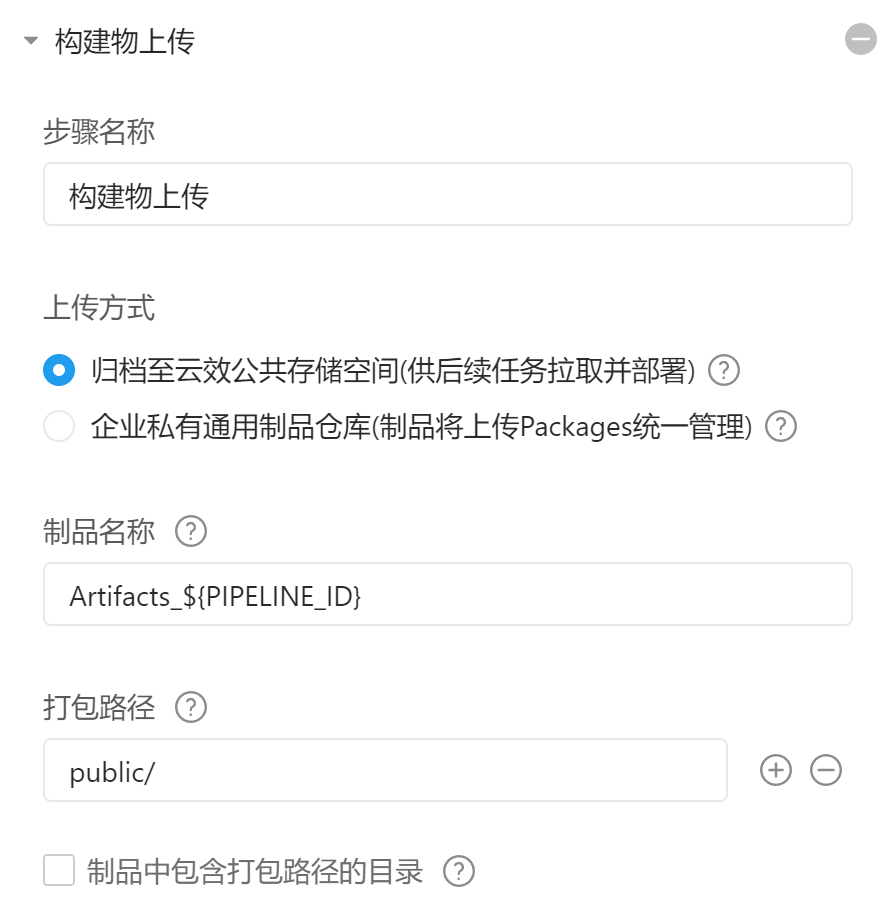
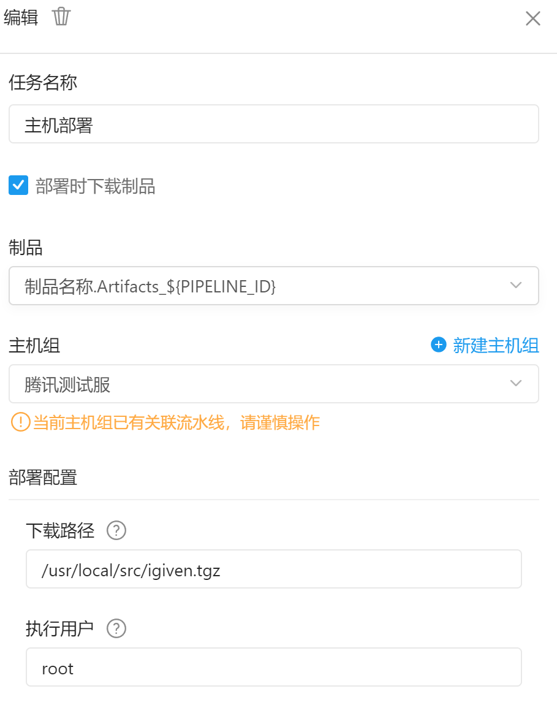

## 构建

设置构建命令

```
# input your command here
cnpm install -g hexo-cli
cnpm install
hexo clean
hexo generate
```

设置构建物


## 部署

设置下载路径



设置部署脚本

```
# 部署脚本会在部署组的每台机器上执行。
# 一个典型脚本逻辑如下：先将制品包（在下载路径中配置的下载路径）解压缩到指定目录中，再执行启动脚本（通常在代码中维护，如示例中deploy.sh）。
# 关于这个例子的详细解释见 https://help.aliyun.com/document_detail/153848.html 
mkdir /usr/local/src/igiven
tar -zxvf /usr/local/src/igiven.tgz -C /usr/local/src/igiven/
\cp -rf /usr/local/src/igiven/* /usr/share/nginx/html
rm -rf /usr/local/src/igiven.tgz
rm -rf /usr/local/src/igiven
```

## 注意点

- 仓库的名称不要例如igiven.github.io.不然部署时拉取仓库会失败

- 添加主机时必须使用python2.7

```
yum install -y nginx python2
whereis python
python -v
rm /usr/bin/python
ln -s /usr/bin/python2.7 /usr/bin/python
# 执行过命令可以把python删除再link回去

systemctl enable nginx
systemctl start nginx
```