由于升级了dots,致使vs使用的时候总是很卡.所以临时使用了rider,记录下使用过程中遇到的问题

- 禁用IntelliJ IDEA向Git自动添加、删除或更新文件的功能

  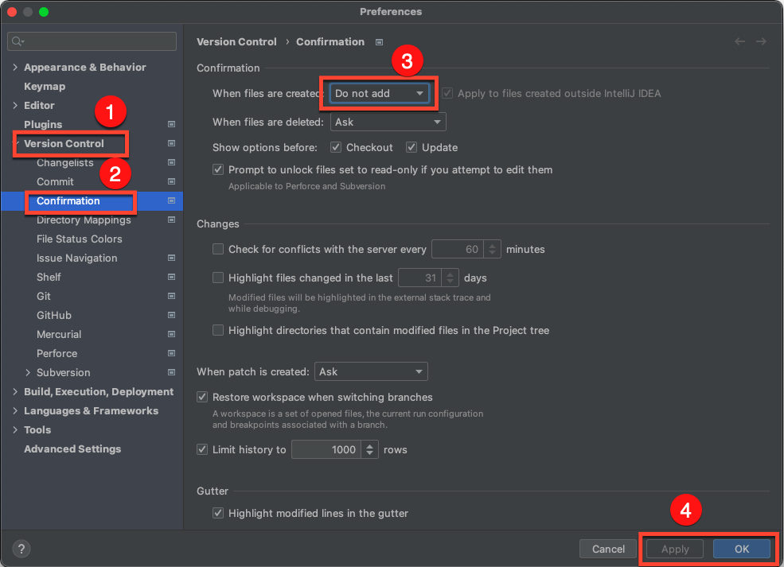

- keymap设置键位：

  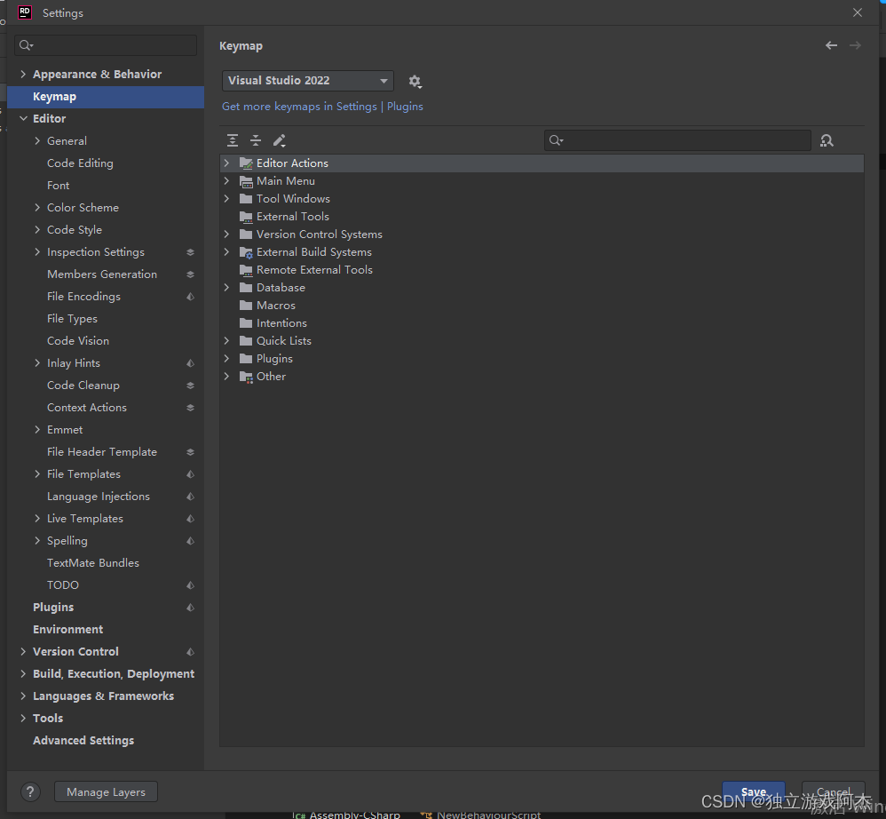

- 设置主题：Editor=》 color scheme

  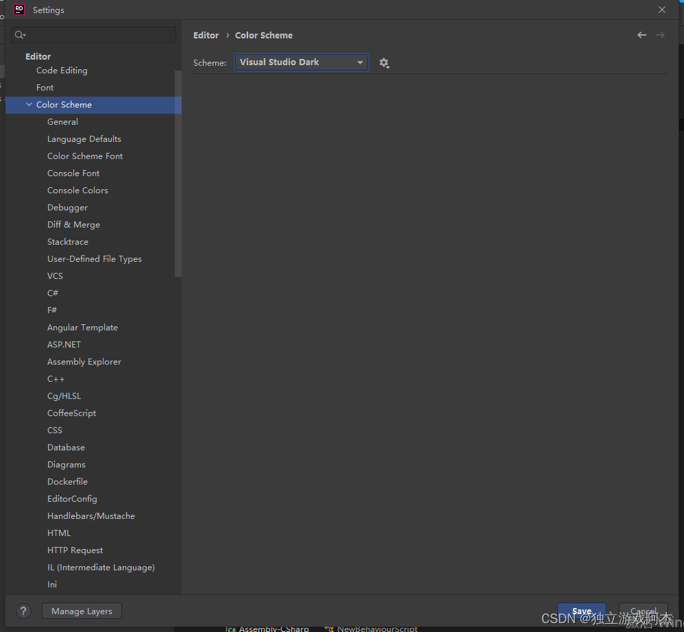

- 设置编辑器字体大小

  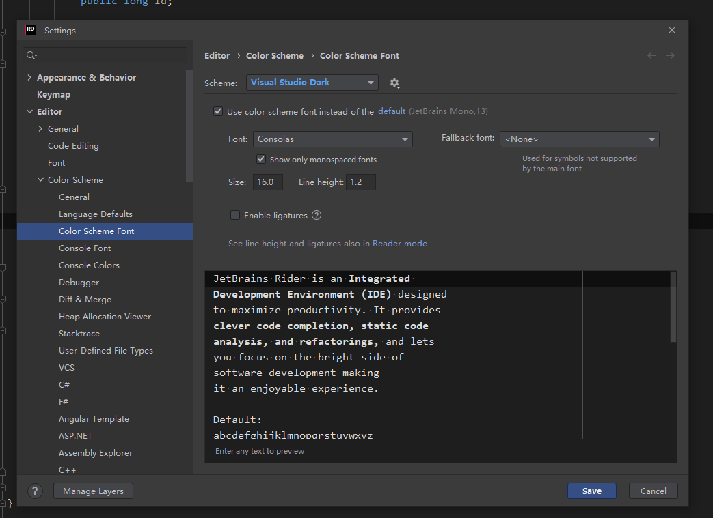

- 设置c#命名规范,去除前缀以及设置驼峰

  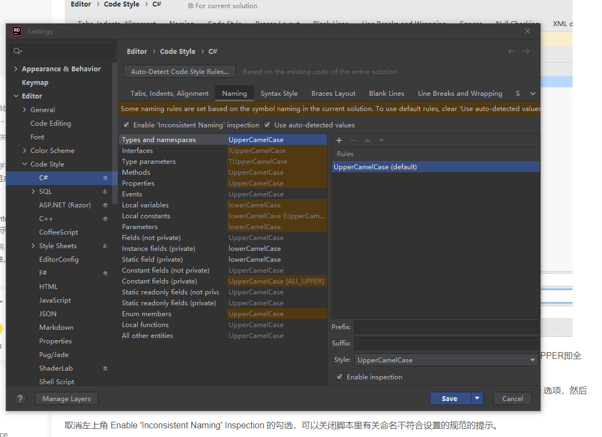

- 去出波浪线警告

  在 **Error and Warnings** 里有很多选项，你可以**选取任意一个，预览它的提示效果，并修改或者直接关闭它**，\
  关闭后是不是觉得整个世界清爽了好多\~

  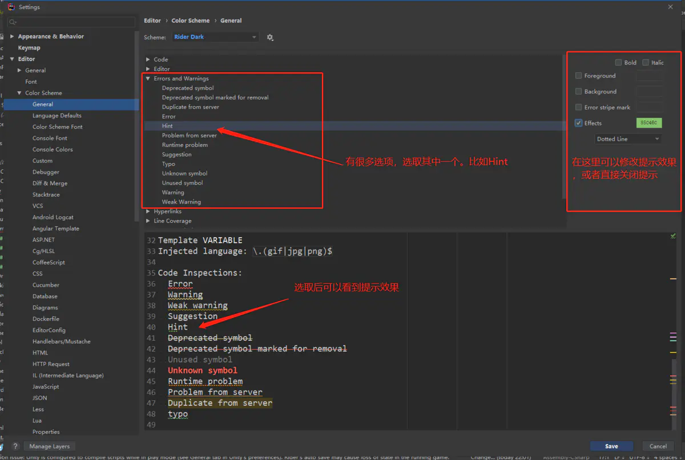

  点击下面出现颜色 选择去除绿色和黄色标志

- 推荐这种去除波浪线,可以通过`show Context Actions` => `inspection:"xxx"`

  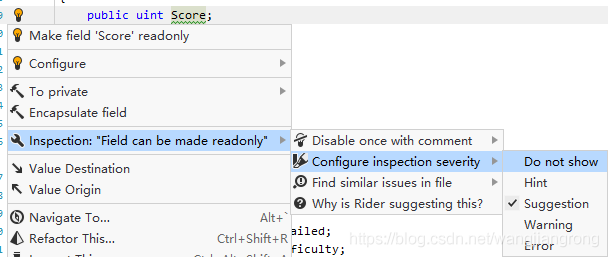

- 有关脚本修改了的标志符，可以在下列设置中开启

  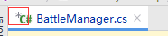

  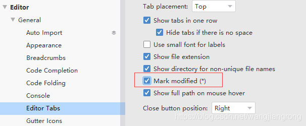

- 工具栏的显示隐藏

  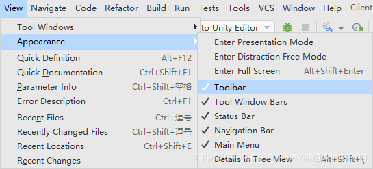

- **脚本保存后，Unity后台是否自动刷新**

  有时候我们修改了脚本，刚保存，就会发现后台的Unity已经开始编译了，会造成一定的卡顿。如果期望只有在切到Unity时才开始编译，可以关闭以下设置：

  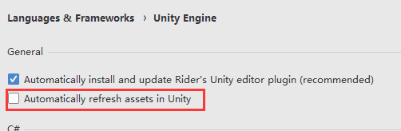

  当然unity得需要开启自动刷新才行,否则切换到unity需要按下`ctrl`+`r`

  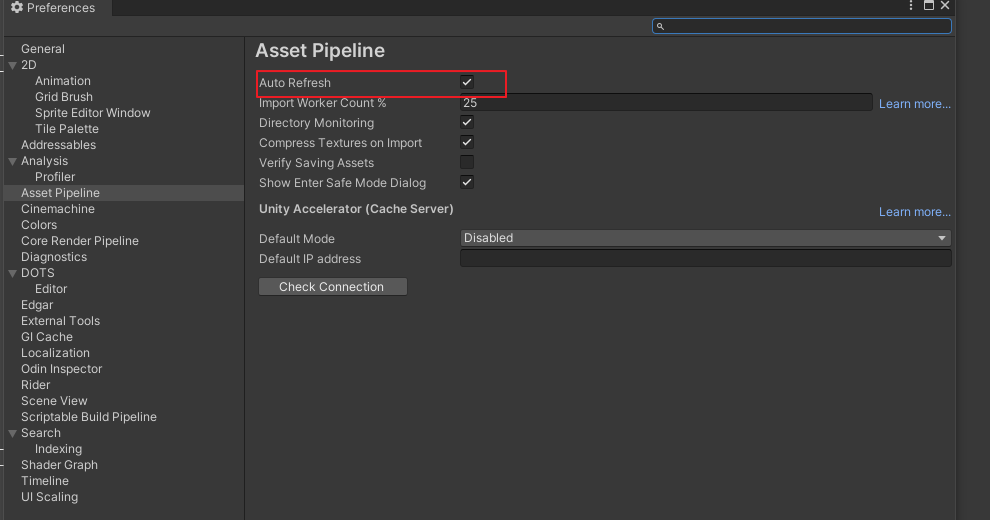

- 去除灰色参数提示

  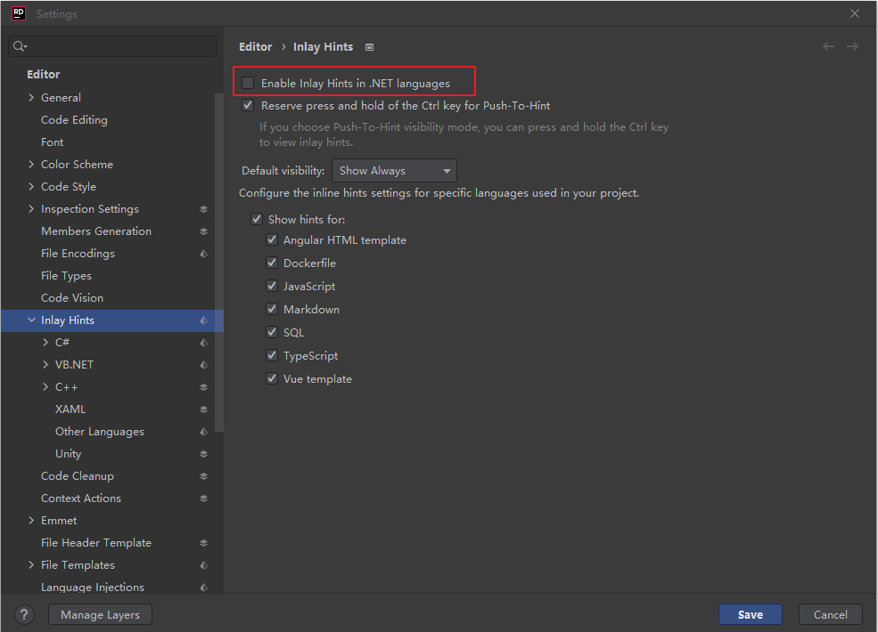