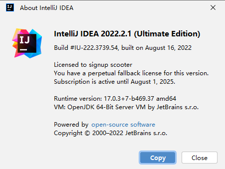
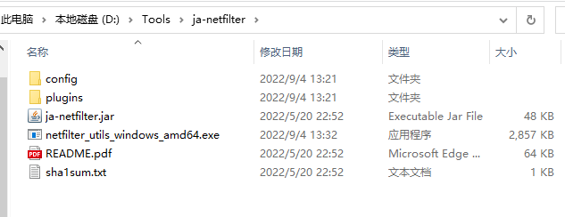
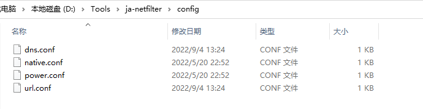
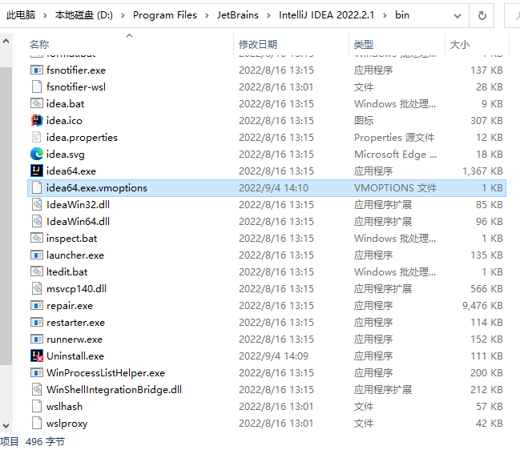
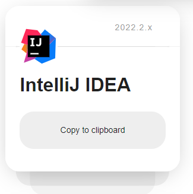

# 使用ja-netfilter激活IDEA 2022.2.1

## 背景

截止至2022年9月4日，最新的IDEA版本为2022.2.1，对于某些想体验最新版IDEA却暂时没法入正的开发者来说，不能体验新版非常遗憾。\
重置IDEA体验版的插件`IDE Eval Resetter`已经失效了，不过开发此插件的作者又开发出另一款工具[ja-netfilter](https://gitee.com/ja-netfilter/ja-netfilter)，但是文档中使用方法写的有些模糊，我就以我自己的使用经验分享给大家。



此方法目前适用于IDEA 2022.2.1，更高的版本不保证适用，请注意时效。

## 下载IDEA

**如果你已经安装了任意版本的IDEA，那么建议你先卸载并清除数据再安装，否则激活可能无效。**

[官网下载IDEA 2022.2.1](https://www.jetbrains.com/zh-cn/idea/download/#section=windows)

## 下载ja-netfilter

[作者博客](https://zhile.io/2021/11/29/ja-netfilter-javaagent-lib.html)

找最新版本的release下载即可

[下载地址](https://gitee.com/ja-netfilter/ja-netfilter/releases)

## 使用ja-netfilter

将下载好的`ja-netfilter`解压到磁盘，最好不要有空格，注意文件后期不能删除，所以请放在自己不会清理的位置。

解压后是这样：



解压后在ja-netfilter.jar同目录下应该会有一个`config`文件夹，找到里面的几个配置文件进行修改。



### 修改dns.conf

```ini
[DNS]
EQUAL,jetbrains.com
```

### 修改url.conf

```ini
[URL]
PREFIX,https://dbeaver.com/lmp/checkLicense
PREFIX,https://store.smartgit.com/check
PREFIX,https://account.jetbrains.com/lservice/rpc/validateKey.action
```

## 修改IDEA VMOPTION文件

找到IDEA安装目录,再进入bin目录，找到`idea64.exe.vmoptions`文件，在最后一行添加



```x86asm
-javaagent:D:\\Tools\\ja-netfilter\\ja-netfilter.jar=jetbrains
```

> 此处需要根据你自己解压的路径去修改，路径中的斜杠使用`\\`或者`/`，建议路径中不要包含空格。

完整的文件内容应该是这样的

```diff
-Xms128m
-Xmx750m
-XX:ReservedCodeCacheSize=512m
-XX:+UseG1GC
-XX:SoftRefLRUPolicyMSPerMB=50
-XX:CICompilerCount=2
-XX:+HeapDumpOnOutOfMemoryError
-XX:-OmitStackTraceInFastThrow
-XX:+IgnoreUnrecognizedVMOptions
-ea
-Dsun.io.useCanonCaches=false
-Dsun.java2d.metal=true
-Djdk.http.auth.tunneling.disabledSchemes=""
-Djdk.attach.allowAttachSelf=true
-Djdk.module.illegalAccess.silent=true
-Dkotlinx.coroutines.debug=off
-javaagent:D:\\Tools\\ja-netfilter\\ja-netfilter.jar=jetbrains
```

## 激活IDEA

打开IDEA，IDEA会提示你激活，选择输入激活码。

打开这个网站 <https://3.jetbra.in/> 等待片刻，选择一个可以访问的网站，然后找到IDEA的卡片选择复制激活码。



填入到IDEA中，点击激活就完成了，不需要关心激活到期时间。

## 常见问题

### IDEA提示激活码无效 Invalid key

如果有登录账号，可以先退出账号试试，再不行就重装IDEA，我就是这么做的。

### IDEA无法启动 运行无反应

看看任务管理器有没有`idea64.exe`这个进程，有就把它关了。