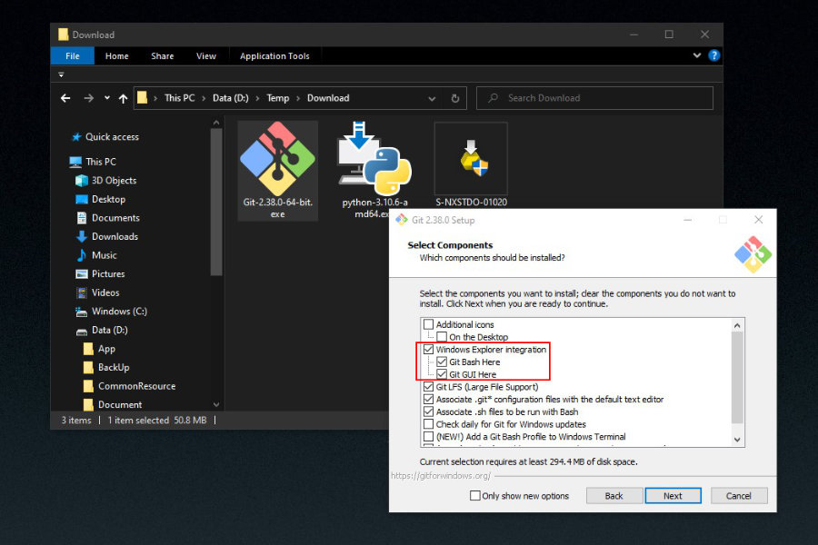
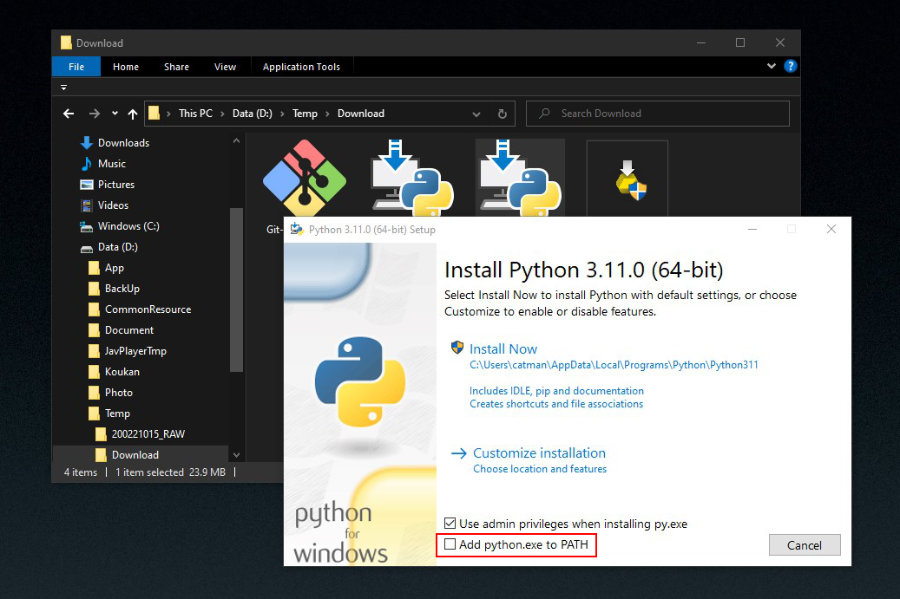
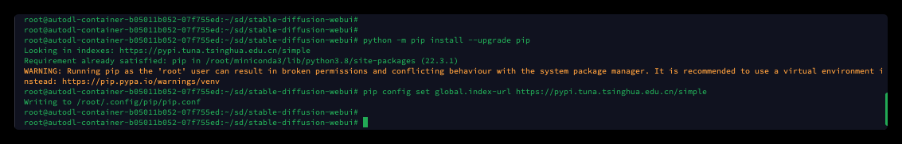
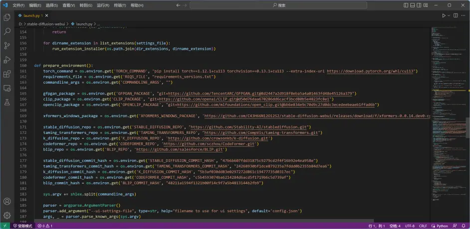
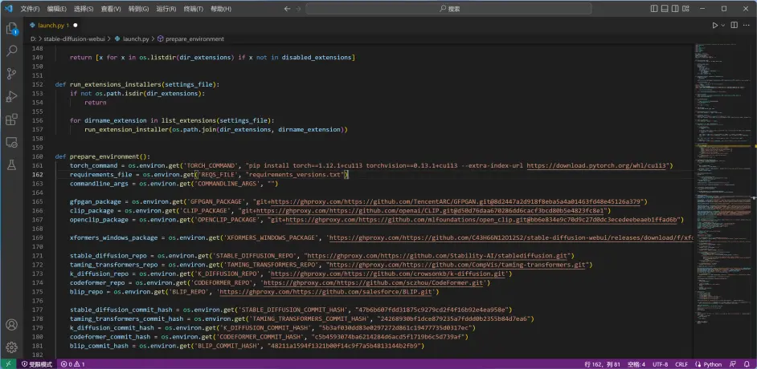
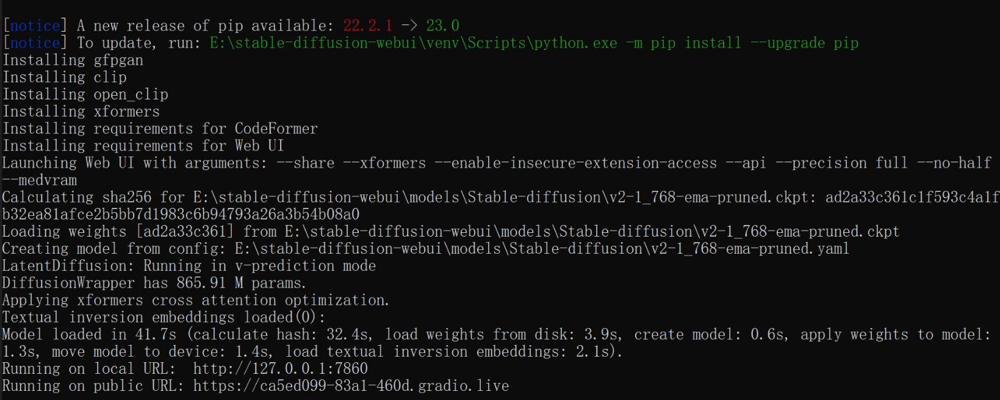

## 硬體需求

根據 [StableDiffusion 官網](https://stability.ai/faq) 所寫，只要有 6G 以上 RAM 的 NVidia 顯卡都可以跑。不過根據 jimmy 實測，4G 的 1050ti 就可以順利運行了。(在我們這次使用的網頁介面實作項目 [AUTOMATIC1111/stable-diffusion-webui](https://github.com/AUTOMATIC1111/stable-diffusion-webui) 裡提到，2G 也有成功運行的報告)

## 安裝步驟

### 1\. 下載並安裝 github for windows

這裡我們用 Windows 平台為範例來說明。\
首先到 [https://gitforwindows.org](https://gitforwindows.org/) 下載 git for windows，並安裝。 ( 安裝過程中可取消與 Windows Exploer 整合 )



安裝前可以取消 Windows Explorer integration

### 2\. 下載並安裝 Python

a. 到 <https://www.python.org/downloads/release/python-3106> 下載 Windows installer (64-bit) 版本\
**(這兩天 Python 的版本更新到了 3.11.0，但 AUTOMATIC1111 表示這個程式是基於 3.10.6 版開發的，除非你想給自己找麻煩，否則請不要使用其他版本 )**\
b. 安裝時記得勾選 Add Python.exe to PATH



記得要把 `Add python.exe to PATH` 打勾

设置pip源（一定要设置清华大学的，阿里的有点问题）

`pip config set global.index-url https://pypi.tuna.tsinghua.edu.cn/simple`

更新pip

`python -m pip install --upgrade pip`



### 3\. 下载模型

经过测试目前sd2.0只有以下两种模型可以用 ，其他模型加载都会报错，github上看了issue上大家都有遇到这个问题

**768-v-ema.ckpt**

这个模型需要生成的图片在768*768的时候效果比较好，如果是生成512*512的，图片有点拉垮；

```
# 768-v-ema.ckpt
https://huggingface.co/stabilityai/stable-diffusion-2/resolve/main/768-v-ema.ckpt
https://huggingface.co/stabilityai/stable-diffusion-2-1/resolve/main/v2-1_768-ema-pruned.ckpt
# 配置文件（下载以后注意把文件名修改为768-v-ema.yaml）
https://raw.githubusercontent.com/Stability-AI/stablediffusion/main/configs/stable-diffusion/v2-inference-v.yaml
```

**512-base-ema.ckpt**

如果显存不够的，比较小的，可以使用这个模型；比较推荐768，效果比512的好；

```
# 512-base-ema.ckpt
https://huggingface.co/stabilityai/stable-diffusion-2-base/resolve/main/512-base-ema.ckpt
https://huggingface.co/stabilityai/stable-diffusion-2-1-base/resolve/main/v2-1_512-ema-pruned.ckpt
# 配置文件（下载以后注意把文件名修改为512-base-ema.yaml）
https://raw.githubusercontent.com/Stability-AI/stablediffusion/main/configs/stable-diffusion/v2-inference.yaml
```

安装模型

```
git clone https://github.com/AUTOMATIC1111/stable-diffusion-webui.git
cd stable-diffusion-webui
./venv/Scripts/python.exe -m pip install --upgrade pip
cd models/Stable-diffusion/
Invoke-WebRequest -Uri https://raw.githubusercontent.com/Stability-AI/stablediffusion/main/configs/stable-diffusion/v2-inference-v.yaml -OutFile ./v2-1_768-ema-pruned.yaml
Invoke-WebRequest -Uri https://huggingface.co/stabilityai/stable-diffusion-2-1/resolve/main/v2-1_768-ema-pruned.ckpt -OutFile ./v2-1_768-ema-pruned.ckpt
```

### 4\. 正式安裝 Stable Diffusion

在国外，安装Stable Diffusion比较简单，但是由于国内的网络环境，安装过程中可能会遇上不少麻烦。

编辑“launch.py”（此处我是用的是Visual Studio Code，Linux则需要用到特定的文本编辑器）。

`code .\launch.py`

替换前

替换所有的“https://github.com”为“https://ghproxy.com/https://github.com”。这里也是利用Ghproxy进行代理，加速国内Git。

替换完成后注意保存。

```
cd ../../
//修改webui-user.bat 设置启动参数,会自动安装 xformers
set COMMANDLINE_ARGS=--share --xformers --enable-insecure-extension-access --api --precision full --no-half --medvram 
```



### 参数解释

- xformers：优化显存占用情况的插件

- precision full和no-half：完全精度和非半精度，也就是使用32位浮点运算而不是使用16位浮点运算，开启这两个参数会让显存占用增加，但图的质量会更好，但是cpu和16XX显卡必须开启，不然黑图或者绿图

- lowvram和medvram  低内存和中内存

- share 会生成一个供外部访问的链接

- api 启动api,主要是供插件使用

### 当前遇到的问题

> modules.devices.NansException: A tensor with all NaNs was produced in Unet. This could be either because there's not enough precision to represent the picture, or because your video card does not support half type. Try setting the "Upcast cross attention layer to float32" option in Settings > Stable Diffusion or using the --no-half commandline argument to fix this. Use --disable-nan-check commandline argument to disable this check.

if you plan to use SD 2.1 models, you go to Settings -> User Interface and set Quicksettings list to `sd_model_checkpoint, upcast_attn` then click Apply settings and Reload UI. This adds a checkbox (Upcast cross attention layer to float32) next to the model dropdown that should be checked whenever using SD 2.1 models. Uncheck it after you load a model that is not SD 2.1 based.