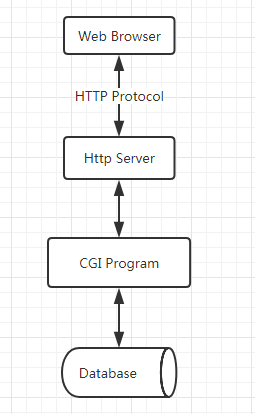
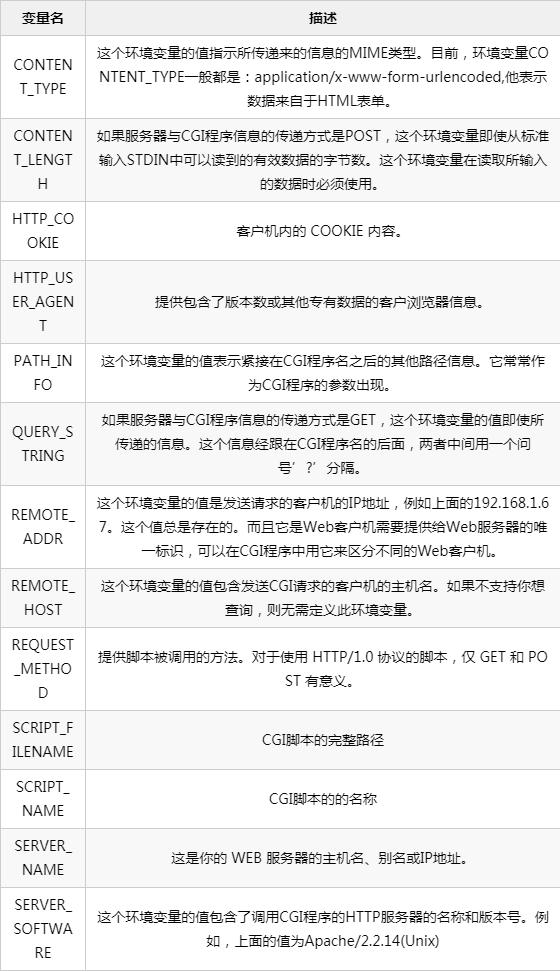
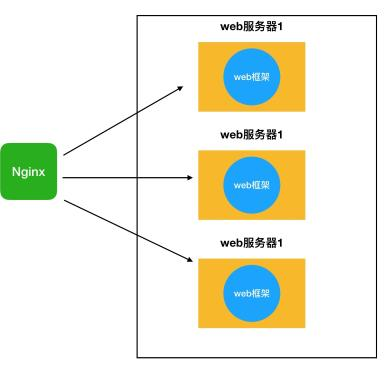

在学习 Python Web 开发时候，可能会遇到诸如 uwsgi、wsgi 等名词，下面通过梳理总结，探究它们之间的关系。

### CGI

CGI（Common Gateway Interface）通用网关接口，是一个协议，是外部应用程序（CGI 程序）与 Web 服务器之间的接口标准，该协议定义了 Web 服务器调用外部应用程序的时候需要输入的参数，和给 Web 服务器的返回结果。

通俗来说，它规定一个程序该如何与 Web 服务器程序之间通信，从而可以让这个程序跑在 Web 服务器上。

### 起源

最早的 Web 服务器简单地响应浏览器发来的 HTTP 请求，并将存储在服务器上的 HTML 文件返回给浏览器，也就是静态 HTML。这个场景下的服务器一般被称为 HTTP 服务器，常见的有 Apache 的 httpd 和 Nginx。

事物总是不 断发展，网站也越来越复杂，所以出现动态技术。但是服务器并不能直接运行 php、asp这样的文件，自己不能做，外包给别人吧，但是要与第三做个约定，我给你什么，然后你给我什么，就是握把请求参数发送给你，然后我接收你的处 理结果给客户端。

那这个约定就是 Common Gateway Interface，简称 CGI。这个协议可以用 VB、C、PHP、Python 来实现。CGI只是接口协议，根本不是什么语言。

引入 CGI 以便客户端请求能够触发 Web 服务器运行另一个外部程序，客户端所输入的数据也会传给这个外部程序，该程序运行结束后会将生成的 HTML 和其他数据通过 Web 服务器再返回给客户端（即动态请求，比如基于 PHP、Python、Java 实现的应用）。利用 CGI 可以针对用户请求，动态返回给客户端各种各样动态变化的信息。

### 工作原理

**Web 服务器与 CGI 程序的交互**

Web 服务器将根据 CGI 程序的类型决定数据向 CGI 程序的传送方式，一般是通过标准输入/输出流和环境变量来与 CGI 程序间传递数据。如下图所示：

CGI 程序通过标准输入（STDIN）和标准输出（STDOUT）来进行输入输出。此外 CGI 程序还通过环境变量来得到输入，操作系统提供了许多环境变量，它们定义了程序的执行环境，应用程序可以存取它们。Web 服务器和 CGI 接口又另外设置了一些环境变量，用来向 CGI 程序传递一些重要的参数。

**常用 CGI 环境变量：**

每当客户请求 CGI 的时候，WEB服务器就请求操作系统生成一个新的CGI解释器进程（如 php-cgi.exe），CGI 的一个进程则处理完一个请求后退出，下一个请求来时再创建新进程。

当然，这样在访问量很少没有并发的情况也行。但当访问量增大，并发存在，这种方式就不适合了，于是就有了FastCGI

### FastCGI

FASTCGI 是 Web 服务器（ex:Nginx）和语言解释器（ex:uWsgi）两者底层的通信协议的规范，是对CGI的开放的扩展。

CGI的一个扩展，像是一个常驻（long-live）型的CGI ，废除了 CGI fork-and-execute （来一个请求 fork 一个新进程处理，处理完再把进程 kill 掉）的工作方式，转而使用一种长生存期的方法，减少了进程消耗，提升了性能。

而FastCGI 则会先 fork 一个 master 进程，解析配置文件，初始化执行环境，然后再 fork 多个 worker 进程（与 Nginx 有点像），当 HTTP 请求过来时，master 进程将其会传递给一个 worker 进程，然后立即可以接受下一个请求，这样就避免了重复的初始化操作，效率自然也就提高了。

而且当 worker 进程不够用时，master 进程还可以根据配置预先启动几个 worker 进程等着；当空闲 worker 进程太多时，也会关掉一些，这样不仅提高了性能，还节约了系统资源

### php-fpm

FastCGI 只是一个协议规范，需要每个语言具体去实现，**PHP-FPM 就是 PHP 版本的 FastCGI 协议实现**，有了它，就是实现 PHP 脚本与 Web 服务器（通常是 Nginx）之间的通信，同时它也是一个 PHP SAPI，从而构建起 PHP 解释器与 Web 服务器之间的桥梁。

Php-fpm全称是php fastcgi process manager即php fastcgi进程管理器，相比fastcgi静态的唤起cgi，fpm能根据访问的压力动态的唤起cgi进程和销毁以到达动态的调整cgi数量，这样可以有效的使用内存。

除此之外还有其它的一些优点，比如，fpm还可以平滑的重载php配置；由于fpm是使用Unix-Socket来和服务器通讯，所以也不用再配置cgi端口；fpm有更好的状态输出和slowlog日志，502的时候能给出更多的错误细节。

PHP-FPM 负责管理一个进程池来处理来自 Web 服务器的 HTTP 动态请求，在 PHP-FPM 中，master 进程负责与 Web 服务器进行通信，接收 HTTP 请求，再将请求转发给 worker 进程进行处理，worker 进程主要负责动态执行 PHP 代码，处理完成后，将处理结果返回给 Web 服务器，再由 Web 服务器将结果发送给客户端。这就是 PHP-FPM 的基本工作原理

### WSGI / uwsgi / uWSGI

在 Python Web 开发中，我们经常使用 Uwsgi 配合 Nginx 部署一个 Web 框架，如 Django 或 flask。同时我们又会说，框架和 Web 服务器之间要符合 WSGI 协议。

那就来厘清一下这几个概念。

**Web 服务器和 Web框架**

在讲 uWSGI 和 WSGI 之前，先要弄清楚 Web 开发的两大块，Web服务器和Web框架。

Web服务器即用来接受客户端请求，建立连接，转发响应的程序。至于转发的内容是什么，交由Web框架来处理，即处理这些业务逻辑。如查询数据库、生成实时信息等。Nginx就是一个Web服务器，Django或flask就是Web框架。

那么如何实现uWSGI和WSGI的配合呢？如何做到任意一个Web服务器，都能搭配任意一个框架呢？这就产生了WSGI协议。只要Web服务器和Web框架满足WSGI协议，它们就能相互搭配。所以WSGI只是一个协议，一个约定。而不是Python的模块、框架等具体的功能。

而uWSGI，则是实现了WSGI协议的一个Web服务器。即用来接受客户端请求，转发响应的程序。实际上，一个uWSGI的Web服务器，再加上Django这样的Web框架，就已经可以实现网站的功能了。

### WSGI

WSGI，（WEB SERVER GATEWAY INTERFACE），Web服务器网关接口，是一种Web服务器网关接口，它是一个Web服务器（如Nginx，uWSGI等服务器）与Web应用（如Flask框架写的程序）通信的一种规范。**当前运行在WSGI协议之上的Web框架有Bottle，Flask，Django**

实现了Python Web程序与服务器之间交互的通用性。有了这个东西，web.py或者bottle或者django等等的Python Web开发框架，就可以轻松地部署在不同的Web server上了，不需要做任何特殊配置（也需要一些小小的配置调整）

WSGI协议其实是定义了一种server与application解耦的规范，即可以有多个实现WSGI server的服务器，也可以有多个实现WSGI application的框架，那么就可以选择任意的server和application组合实现自己的Web应用。

例如 uWSGI和 Gunicorn都是实现了WSGI server协议的服务器，Django，Flask是实现了WSGI application协议的Web框架，可以根据项目实际情况搭配使用。

像Django，Flask框架都有自己实现的简单的WSGI server，一般用于服务器调试，生产环境下建议用其他WSGI server，WSGI服务器的选择很多，包括uWSGI和gunicorn

### uwsgi

同WSGI一样是一种通信协议

uwsgi协议是一个uWSGI服务器自有的协议，它用于定义传输信息的类型（type of information），每一个uwsgi packet前4byte为传输信息类型描述，它与WSGI相比是两样东西。

### uWSGI (服务器)

它是一个Web服务器，它实现了WSGI协议、uwsgi、http等协议。用于接收前端服务器转发的动态请求并处理后发给 Web 应用程序。

因为apache也好，Nginx也罢，它们自己都没有解析动态语言如php的功能，而是分派给其他模块来做，比如apache就可以说内置了php模块，支持的非常爽，让人感觉好像apache就支持php一样。uwsgi实现了WSGI协议、uwsgi、http等协议。Nginx中HttpUwsgiModule的作用是与uWSGI服务器进行交换。

uWSGI是使用C编写的，显示了自有的uwsgi协议的Web服务器。它自带丰富的组件，其中核心组件包含进程管理、监控、IPC等功能，实现应用服务器接口的请求插件支持多种语言和平台，比如WSGI、Rack、Lua WSAPI，网管组件实现了负载均衡、代理和理由功能

uWSGI也可以当做中间件。

- 如果是Nginx+uWSGI+App，那uWSGI就是一个中间件

- 如果是uWSGI+App，那它就是服务器

### Nginx+uWGSI

假设我们使用 Python 的 Django 框架写了一个网站，现在要将它挂在网上运行，我们一般需要：

- Nginx 做为代理服务器：负责静态资源发送（js、css、图片等）、动态请求转发以及结果的回复。

- uWSGI 做为后端服务器：负责接收 Nginx 转发的请求并处理后发给 Django 应用以及接收 Django 应用返回信息转发给 Nginx。

- Django 应用收到请求后处理数据并渲染相应的返回页面给 uWSGI 服务器。

一个Django应用，通过WSGI协议连接uWSGI服务器，uWSGI服务器实现WSGI、http等协议，通过uwsgi协议和Nginx服务器实现http的动态请求和转发以及结果

**问题：有 uWGSI 了，Django 为什么还需要 Nginx？**

一个普通的个人网站，访问量不大的话，当然可以由 uWSGI 和 Django 构成。但是一旦访问量过大，客户端请求连接就要进行长时间的等待。这个时候就出来了分布式服务器，我们可以多来几台 Web 服务器，都能处理请求。

但是谁来分配客户端的请求连接和 Web 服务器呢？Nginx 就是这样一个管家的存在，由它来分配。这也就是由 Nginx 实现反向代理，即代理服务器。

Nginx 是一个 HTTP 和反向代理服务器

- 正向代理：正向的就是由浏览器主动的想代理服务器发出请求，经代理服务器做出处理后再转给目标服务器

- 反向代理：反向的就是不管浏览器同不同意，请求都会经过代理服务器处理再发给目标服务器

使用Nginx作为反向代理服务器的好处：

- 安全

不管什么请求都要经过代理服务器，可以避免外部程序直接攻击Web服务器

- 负载均衡

根据请求情况和服务器负载情况，将请求分配给不同的Web服务器，保证服务器性能

- 提高Web服务器的IO性能

请求从客户端传到Web服务器是需要时间的，传递多长时间就会让这个进程阻塞多长时间，而通过反向代理，就可以由反向代理完整接受该请求，然后再传给Web服务器，从而保证服务器性能，而且有的一些简单的事情（比如静态文件）可以直接由反向代理处理，不经过Web服务器

### 总结

- WSGI是一种通信协议

- uwsgi是一种通信协议，常用于在uWSGI服务器与其他网络服务器的数据通信

- 而uWSGI是实现了uwsgi和WSGI两种协议的Web服务器

百度百科上说uwsgi是一种线路协议而不是通信协议，个人更倾向于uwsgi是类似WSGI的通信协议的说法，uwsgi和WSGI都是基于CGI扩展出来的。

### ASGI

**异步网关协议接口**，一个介于网络协议服务和Python应用之间的标准接口，能够处理多种通用的协议类型，包括HTTP，HTTP2和WebSocket。

然而目前的常用的WSGI主要是针对HTTP风格的请求响应模型做的设计，并且越来越多的不遵循这种模式的协议逐渐成为Web变成的标准之一，例如WebSocket。

ASGI尝试保持在一个简单的应用接口的前提下，提供允许数据能够在任意的时候、被任意应用进程发送和接受的抽象。并且同样描述了一个新的，兼容HTTP请求响应以及WebSocket数据帧的序列格式。允许这些协议能通过网络或本地socket进行传输，以及让不同的协议被分配到不同的进程中。

### WSGI和ASGI的区别

WSGI是基于HTTP协议模式的，不支持WebSocket，而ASGI的诞生则是为了解决Python常用的WSGI不支持当前Web开发中的一些新的协议标准。同时，ASGI对于WSGI原有的模式的支持和WebSocket的扩展，即ASGI是WSGI的扩展。