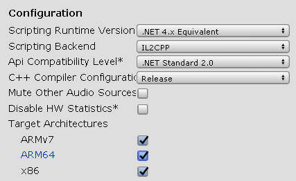
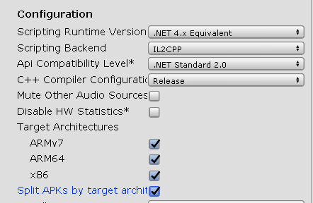

## 导出说明

Unity supports x64 since 2017 LTS. To enable it you can go to File > Build Settings > Player Settings.

There under "Other Settings" you have to change your Script Backend to IL2CPP, and you will have the ARM64 checkbox active. Check it.

And then you can either select to generate Split APKs by Target Architecture

or in your Build Settings dialog choose to Build App Bundle (Google Play)

Hope it helps, you will need to have the Android NDK for this.

如果选择Build ，Unity会生成AAB文件，该文件可以直接发布到Google Play。

如果选择Build and Run，Unity会生成AAB文件，该文件会为关联设备生成临时APK文件，然后安装APK文件到设备并运行应用程序。

如果选择Build 并希望手动安装应用程序到设备上，可以使用Google提供的bundletool utility ,你可在Unity安装目录中的`Editor/Data/PlaybackEngines/AndroidPlayer/Tools`目录下找到它。

请注意，当构建应用程序包时，菜单`Edit > Setting > Player`下的`Split APKs by target architecture` 会被禁用，因为生成的应用程序包应包含所有支持目标的库。

## 使用技巧

在开发期间，为了减少使用构建和运行时的迭代次数，可以禁用应用程序包的生成功能，并使用常规的APK文件，因为从应用程序包生成APK需要额外时间，之后才会部署到设备上。

应用程序包还可以从Android Studio生成，它使用从Unity导出的Gradle项目。为此，你需要使用Android Studio 3.2或更高版本，并选择`Build > Build Bundle(s) / APK(s) > Build Bundle(s)`。

如果目标商店不支持Android App Bundles，你可以使用Player settings中的`Split APKs by target architecture`选项，从而根据终端用户设备的CPU架构提供APK文件，或使用bundletool，该工具可以构建支持运行在任何环境的“通用APK”文件

## 相关链接

- <https://connect.unity.com/p/unity-2018-3-betazhong-de-android-app-bundle-aab-zhi-chi>