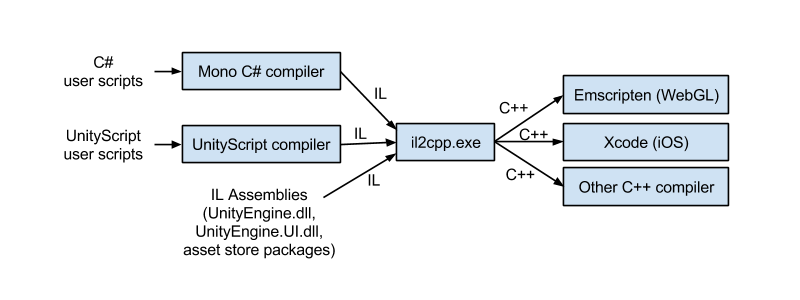

1. unity是运行在mono下的,il2cpp有自己的运行时,il2cpp不是运行在mono下的不是mono的aot

2. mono的gc和.net的gc是不同的,il2cpp运行时实现了自己的垃圾回收(Boehm-Demers-Weiser garbage collector)

3. 编译和运行时是两个阶段,可以用csc.exe编译然后运行在mono上, .NET 4.x可以使用就是这个原理

   Note that the **.rsp** file needs to match the compiler being invoked. For example:

   - when targeting the .NET 3.5 Equivalent (deprecated) scripting runtime version, **mcs** is used with `mcs.rsp`, and

   - when targeting the .NET 4.x Eqivalent scripting runtime version compiler, **csc** is used with `csc.rsp`.

大约在一年以前，我们写了一篇博客讨论Unity中脚本将来会是个什么样子，在那篇博客中我们提到了崭新的IL2CPP后端，并许诺其会为Unity带来更高效和更适合于各个平台的虚拟机。在2015年的一月份，我们正式发布了第一个使用IL2CPP的平台：iOS 64-bit。而随着Unity 5的发布，又带给大家另一个使用IL2CPP的平台：WebGL。感谢我们社区中用户的大量宝贵的反馈，我们在接下来的时间里根据这些反馈得以更新IL2CPP，发布补丁版本，从而持续的改进IL2CPP的编译器和运行时库。

我们没有停止改进IL2CPP的打算，但是在目前这个时间点上，我们觉得可以回过头来抽出点时间告诉大家一些IL2CPP的内部工作机制。在接下来的几个月的时间里，我们打算对以下话题（或者还有其他未列出的话题）进行讨论，来做一个IL2CPP深入讲解系列。目前准备讨论的话题有：

1\.基础 - 工具链和命令行参数（本篇博文）
2\.IL2CPP生成代码介绍
3\.IL2CPP生成代码调试小窍门
4\.方法调用介绍（一般方法调用和虚方法调用等）

1. 通用代码共享的实现
   6\.P/invoke(Platform Invocation Service)对于类型（types）和方法（methods）的封装
   7\.垃圾回收器的集成
   8\.测试框架（Testing frameworks）及其使用

为了能让这个系列的讨论成为可能，我们会涉及到一些将来肯定会进行改动的IL2CPP的实现细节。但这也没有关系，通过这些讨论，我们希望能给大家提供一些有用和有趣的信息。

## 什么是IL2CPP？

从技术层面上来说，我们说的IL2CPP包含了两部分：一个进行 预先编译（译注：ahead-of-time，又叫AOT，以下一律使用AOT缩写）的编译器。

## 一个支持虚拟机的运行时库

AOT编译器将由.NET 输出的中间语言(IL)代码生成为C++代码。运行时库则提供诸如垃圾回收，与平台无关的线程，IO以及内部调用（C++原生代码直接访问托管代码结构）这样的服务和抽象层。

## AOT编译器

IL2CPP AOT编译器实际的执行文件是il2cpp.exe。在Windows平台你可以在Unity安装路径的Editor\\Data\\il2cpp目录下找到。对于OSX平台，它位于Unity安装路径的Contents/Frameworks/il2cpp/build目录内。 il2cpp.exe这个工具是一个托管代码可执行文件，其完全由C#写成。在开发IL2CPP的过程中，我们同时使用.NET和Mono编译器对其进行编译。

il2cpp 接受来自Unity自带的或者由Mono编译器产生的托管程序集，将这些程序集转换成C++代码。这些转换出的C++代码最终由部署目标平台上的C++编译器进行编译。

你可以参照下图理解IL2CPP工具链的作用：



## 运行时库

IL2CPP的另外一个部分就是对虚拟机提供支持的运行时库。我们基本上是用C++代码来实现整个运行时库的（好吧，其实里面还是有一些和平台相关的代码使用了程序集，这个只要你知我知便好，不要告诉别人 ）。我们把运行时库称之为libli2cpp，它是作为一个静态库被连接到最终的游戏可执行文件中。这么做的一个主要的好处是可以使得整个IL2CPP技术是简单并且是可移植的。

你能通过查看随Unity一起发布的libil2cpp头文件来窥探其代码组织方式（Windows平台，头文件在Editor\\Data\\PlaybackEngines\\webglsupport\\BuildTools\\Libraries\\libil2cpp\\include目录中。OSX平台，头文件在Contents/Frameworks/il2cpp/libil2cpp目录中）。举个例子，由il2cpp产生的C++代码和libil2cpp之间的接口API，存在于codegen/il2cpp-codegen.h这个文件中。

运行时的另外一个重要的部分，就是垃圾收集器。在Unity 5中，我们使用libgc垃圾收集器。它是一个典型的贝姆垃圾收集器（Boehm-Demers-Weiser garbage collector）。（译注：相对使用保守垃圾回收策略）。然而我们的libil2cpp被设计成可以方便使用其他垃圾回收器。因此我们现在也在研究集成微软开源的垃圾回收器（Microsoft GC）。对于垃圾回收器这一点，我们会在后续的一篇中专门的讨论，这里就不多说了。

## il2cpp是如何执行的？

让我们从一个简单的例子入手。这里使用Unity的版本是5.0.1，在Windows环境并且建立一个全新的空项目。然后创建一个带MonoBehaviour的脚本文件，将其作为组件加入到Main Camera上。代码也是非常的简单，输出Hello World：

```cpp
using UnityEngine;

public class HelloWorld : MonoBehaviour {
  void Start () {
    Debug.Log("Hello, IL2CPP!");
  }
}
```

当我切换到WebGL平台进行项目生成的时候，我们可以用Process Explorer来对il2cpp的命令行进行观察，得到以下内容：

```

 "C:\Program Files\Unity\Editor\Data\MonoBleedingEdge\bin\mono.exe" "C:\Program Files\Unity\Editor\Data\il2cpp/il2cpp.exe" --copy-level=None --enable-generic-sharing --enable-unity-event-support --output-format=Compact --extra-types.file="C:\Program Files\Unity\Editor\Data\il2cpp\il2cpp_default_extra_types.txt" "C:\Users\Josh Peterson\Documents\IL2CPP Blog Example\Temp\StagingArea\Data\Managed\Assembly-CSharp.dll" "C:\Users\Josh Peterson\Documents\IL2CPP Blog Example\Temp\StagingArea\Data\Managed\UnityEngine.UI.dll" "C:\Users\Josh Peterson\Documents\IL2CPP Blog Example\Temp\StagingArea\Data\il2cppOutput"
```

嗯，这个真是老太太的裹脚布 - 又臭又长......，所以让我们把命令分拆一下，Unity运行的是这个可执行文件：

`"C:\Program Files\Unity\Editor\Data\MonoBleedingEdge\bin\mono.exe"`

下一个参数是il2cpp.exe工具本身：
`"C:\Program Files\Unity\Editor\Data\il2cpp/il2cpp.exe"`

请注意剩下的参数其实都是传递给il2cpp.exe的而不是mono.exe。上面的例子里传递了5个参数给il2cpp.exe：
`–copy-level=None`

指明il2cpp.exe不对生成的C++文件进行copy操作
` –enable-generic-sharing`
告诉IL2CPP如果可以，对通用方法进行共享。这个可以减少代码并降低最后二进制文件的尺寸

`–enable-unity-event-support`
确保和Unity events相关的，通过反射机制来运作的代码，能够正确生成。

`–output-format=Compact`
在生成C++代码时为里面的类型和方法使用更短的名字。这会使得C++代码难以阅读，因为原来在IL中的名字被更短的取代了。但好处是可以让C++编译器运行的更快。

`–extra-types.file=”C:\Program Files\Unity\Editor\Data\il2cpp\il2cpp_default_extra_types.txt”`

使用默认的（也是空的）额外类型文件。il2cpp.exe会将在这个文件中出现的基本类型或者数组类型看作是在运行时生成的而不是一开始出现在IL代码中来对待。

需要注意的是这些参数可能会在以后的Unity版本中有所变化。我们现在还没有稳定到把il2cpp.exe的命令行参数整理固定下来的阶段。

最后，我们有由两个文件组成的一个列表和一个目录在这个长长的命令行中：

```

“C:\Users\Josh Peterson\Documents\IL2CPP Blog Example\Temp\StagingArea\Data\Managed\Assembly-CSharp.dll”
“C:\Users\Josh Peterson\Documents\IL2CPP Blog Example\Temp\StagingArea\Data\Managed\UnityEngine.UI.dll”
“C:\Users\Josh Peterson\Documents\IL2CPP Blog Example\Temp\StagingArea\Data\il2cppOutput”
```

il2cpp.exe工具可以接收一个由IL程序集组成的列表。在上面这个例子中，程序集包含了项目中的简单脚本程序集：Assembly-CSharp.dll，和GUI程序集：UnityEngine.UI.dll。大家可能会注意到这里面明显少了什么：UnityEngine.dll到哪去了？系统底层的mscorlib.dll也不见了踪影。实际上，il2cpp.exe会在内部自动引用这些程序集。你当然也可以把这些放入列表中，但他们不是必须的。你只需要提及那些根程序集（那些没有被其他任何程序集引用到的程序集），剩下的il2cpp.exe会根据引用关系自动加入。

裹脚布的最后一块是一个目录，il2cpp.exe会将最终的C++代码生成到这里。如果你还保持着一颗好奇的心，可以看看这个目录中产生的文件。这些文件是我们下一个讨论的主题。在你审视这些代码前，可以考虑将WebGL构建设置中的“Development Player”选项勾上。这么做会移除–output-format=Compact命令行参数从而让C++代码中的类型和方法的名字更加可读。

尝试在WebGL或者iOS构建设置中进行些改变。这样你会发现传递给il2cpp.exe的参数也会相应的发生变化。例如，将“Enable Exceptions” 设置成“Full” 会将–emit-null-checks，–enable-stacktrace，和 –enable-array-bounds-check这三个参数加入il2cpp.exe命令行。

## IL2CPP没做的事情

我想指出IL2CPP有一向挑战我们没有接受,而且我们也高兴我们忽略了它。我们没有尝试重写整个C#标准库。当你使用IL2CPP后端构建Unity项目的时候，所有在mscorlib.dll，System.dll等中的C#标准库和原来使用Mono编译时候的一模一样。

我们可以依赖健壮的且久经考验的C#标准库，所以当处理有关IL2CPP的bug的时候，我们可以很肯定的说问题出在AOT编译器或者运行时库这两个地方而不是在其他地方。

## 我们如何开发，测试，发布IL2CPP

自从我们在一月份的4.6.1 p5版本中首次引入IL2CPP以来，我们已经连续发布了6个Unity版本和7个补丁（Unity版本号跨越4.6和5.0）。在这些发布中我们修正了超过100个bug。

为了确保持续的改进得以实施，我们内部只保留一份最新的开发代码在主干分之（trunk branch）上，在发布各个版本之前，我们会将IL2CPP的改动挂到一个特定的分之下，然后进行测试，确保所有的bug已经正确的修正了。我们的QA和维护工作组为此付出了惊人的努力才得以保证发布版本的快速迭代。（译注：感觉是版本管理的标准的开发流程）

提供高质量Bug的用户社区被证明是一个无价之宝。我们非常感谢用户的反馈来帮助我们改进IL2CPP，并且希望这类反馈越多越好。

我们的IL2CPP研发组有很强烈的“测试优先”意识。我们时常使用“Test Driven Design”方法，在没有进行足够全面的测试的情况下，几乎不会进行代码的合并工作。这个策略用在IL2CPP项目上非常的棒。我们现在所面对的大部分bug并不是意想不到的行为产生的，而是由意想不到的特殊情况产生的。（例如在一个32位的索引数组中使用了64位的指针从而导致C++编译器失败）面对这种类型的bug我们可以快速的并且很自信的进行修正。

有了社区的帮助，我们非常努力的让IL2CPP既快又稳定。顺便说一句，如果你对我刚才说的这些有兴趣，我们正在招人（嗯.....我只是这么一说）

## 好戏连台

关于IL2CPP我们还有很多可以说的。下一次我们会深入到il2cpp.exe代码生成的细节中。看看对于C++编译器来说，由il2cpp.exe生成的代码会是个什么样子。

# IL2CPP 脚本限制

## System.Reflection.Emit

AOT 平台无法实现 `System.Reflection.Emit` 命名空间中的任何方法。`System.Reflection` 的其余部分是可接受的，只要编译器可以推断通过反射使用的代码需要在运行时存在。

## 序列化

AOT 平台可能会由于使用了反射而遇到序列化和反序列化问题。如果仅通过反射将某个类型或方法作为序列化或反序列化的一部分使用，则 AOT 编译器无法检测到需要为该类型或方法生成代码。

这是我们常遇到的问题..一个是scriptobject的asset,一个是网络协议都是序列化数据

1. odin,最佳模式新建一个aot场景,将需要的scriptobject放在该场景.或者声明序列化字段

```
public class OdinAOTSetting : Sirenix.OdinInspector.SerializedMonoBehaviour
{

    public List<ScriptableObject> Configs;


    [NonSerialized, OdinSerialize]
    public UnityEngine.Color Color;

    [NonSerialized, OdinSerialize]
    public CityMapLandType CityMapLandType;

    [NonSerialized, OdinSerialize]
    Dictionary<int, InventoryItemConfig> InventoryItemConfigs;
    [NonSerialized, OdinSerialize]
    Dictionary<int, LootTableConfig> LootTableConfigs;
    [NonSerialized, OdinSerialize]
    Dictionary<int, MerchantConfig> MerchantConfigs;
    [NonSerialized, OdinSerialize]
    Dictionary<int, LandConfig> LandConfigs;
    [NonSerialized, OdinSerialize]
    Dictionary<int, MapConfig> MapConfigs;
    [NonSerialized, OdinSerialize]
    Dictionary<long, NPCConfig> NPCConfigs;
    [NonSerialized, OdinSerialize]
    Dictionary<long, QuestConfig> QuestConfigs;
    [NonSerialized, OdinSerialize]
    Dictionary<string, RedeemCodeConfig> RedeemCodeConfigs;
    [NonSerialized, OdinSerialize]
    Dictionary<int, BuffConfig> BuffConfigs;
    [NonSerialized, OdinSerialize]
    Dictionary<int, ProjectileConfig> ProjectileConfigs;
    [NonSerialized, OdinSerialize]
    Dictionary<int, SkillConfig> SkillConfigs;
    [NonSerialized, OdinSerialize]
    Dictionary<string, AttrAsset> AttrAssets;
    [NonSerialized, OdinSerialize]
    Dictionary<string, StatAsset> StatAssets;
    [NonSerialized, OdinSerialize]
    Dictionary<string, StatusEffectAsset> StatusEffectAssets;
}
```

1. 网络协议Json,使用字段,而不是使用属性(get,set),il2cpp 在运行时会剥离去除Get属性，

2. 网络协议protobuf,虽然protobuf本身是支持Dictionary的,但是aot就不能使用了..未找到解决办法 ,用class代替

## 泛型

每个泛型实例实际上都是一个独立的类型，`List<A>` 和 `List<B>`是两个完全没有关系的类型，这意味着，如果在运行时无法通过JIT来创建新类型的话，代码中没有直接使用过的泛型实例都会在运行时出现问题。

在ILRuntime中解决这个问题有两种方式，一个是使用CLR绑定，把用到的泛型实例都进行CLR绑定。另外一个方式是在Unity主工程中，建立一个类，然后在里面定义用到的那些泛型实例的public变量。这两种方式都可以告诉IL2CPP保留这个类型的代码供运行中使用。

因此建议大家在实际开发中，尽量使用热更DLL内部的类作为泛型参数，因为DLL内部的类型都是ILTypeInstance，只需处理一个就行了。此外如果泛型模版类就是在DLL里定义的的话，那就完全不需要进行任何处理。

### 泛型方法

跟泛型实例一样，`foo.Bar<TypeA>` 和`foo.Bar<TypeB>`是两个完全不同的方法，需要在主工程中显式调用过，IL2CPP才能够完整保留，因此需要尽量避免在热更DLL中调用Unity主工程的泛型方法。如果在iOS上实际运行遇到报错，可以尝试在Unity的主工程中随便写一个static的方法，然后对这个泛型方法调用一下即可，这个方法无需被调用，只是用来告诉IL2CPP我们需要这个方法

## AnimatorController 等

```
错误信息#
Could not produce class with ID #
Could not produce class with ID XXX.
This could be caused by a class being stripped from the build even though it is needed. Try disabling 'Strip Engine Code' in Player Settings.:<LoadWWWIEnumerator>c__Iterator99:MoveNext()
```

如果提示的ID的是Editor的，比如 AnimatorController(ID 91)属于Editor包里的，不能用link.xm加回来，可以在**Resource**下建一个空的prefab,在上面挂一个AnimatorController，打包时留下这个prefab就可以确保这个类不被strip掉了。

**参考 :**

- [Could not produce class with ID 91 - iOS - Unity Forum](https://forum.unity.com/threads/could-not-produce-class-with-id-91-ios.267548/)

- [YAML 类 ID 参考 - Unity 手册 (unity3d.com)](https://docs.unity3d.com/cn/2020.2/Manual/ClassIDReference.html)

## 其他

- 不要用dynamic关键字

- 没有使用的字段都不会被编译..

# 托管代码剥离

IL2CPP在打包时会自动对Unity工程的DLL进行裁剪，将代码中没有引用到的类型裁剪掉，以达到减小发布后ipa包的尺寸的目的。然而在实际使用过程中，很多类型有可能会被意外剪裁掉，造成运行时抛出找不到某个类型的异常。特别是通过反射等方式在编译时无法得知的函数调用，在运行时都很有可能遇到问题。

Unity提供了一个方式来告诉Unity引擎，哪些类型是不能够被剪裁掉的。具体做法就是在Unity工程的Assets目录中建立一个叫link.xml的XML文件，然后按照下面的格式指定你需要保留的类型：

```
<linker>
  <assembly fullname="UnityEngine" preserve="all"/>
  <assembly fullname="Assembly-CSharp">
    <namespace fullname="MyGame.Utils" preserve="all"/>
    <type fullname="MyGame.SomeClass" preserve="all"/>
  </assembly>  
</linker>
```

## IL2CPP限制

将游戏导出到 iOS 等平台时，Unity 将使用其 IL2CPP 引擎将 IL“转换”为 C++ 代码，然后使用目标平台的本机编译器进行编译。 在此方案中，有几个不支持的 .NET 功能，例如反射的部分内容和使用 `dynamic` 关键字。 虽然可在自己的代码中使用这些功能，但使用第三方 DLL 和 SDK 时可能会遇到问题，这些 DLL 和 SDK 并非使用 Unity 和 IL2CPP 编写。 有关此主题的详细信息，请参阅 Unity 站点上的[脚本限制](https://docs.unity3d.com/Manual/ScriptingRestrictions.html)文档。

此外，如之前 Json.NET 示例中所述，Unity 将尝试在 IL2CPP 导出过程中裁剪掉未使用的代码。 虽然这通常不是问题，但对于使用反射的库，它可能会意外地删除在导出时无法确定是否被调用而在运行时可能被调用的属性或方法。 若要解决这些问题，请添加一个 link.xml 文件到项目中，该文件中包含的程序集和命名空间列表不会执行裁剪过程。 有关完整详细信息，请参阅[有关字节码裁剪的 Unity 文档](https://docs.unity3d.com/Manual/IL2CPP-BytecodeStripping.html)。

## 编译速度优化

1. 增量编译

2. 关闭实时保护

3. 使用ssd

## 相关链接

- <https://docs.microsoft.com/en-us/visualstudio/cross-platform/unity-scripting-upgrade?view=vs-2019>

- <https://docs.unity3d.com/Manual/IL2CPP-OptimizingBuildTimes.html>

- <https://docs.unity3d.com/Manual/IL2CPP-BytecodeStripping.html>

- <https://docs.unity3d.com/Manual/ScriptingRestrictions.html>

- <https://www.jianshu.com/p/7cfcb7b0cfe7>

- <https://blogs.unity3d.com/cn/2015/05/06/an-introduction-to-ilcpp-internals/>