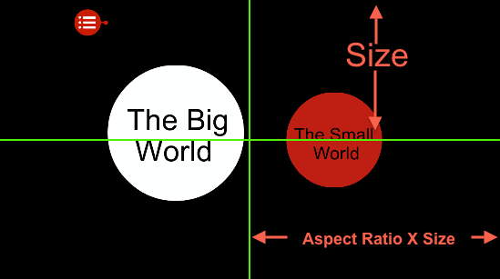
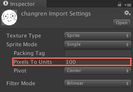
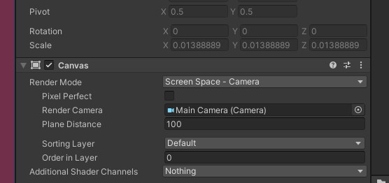
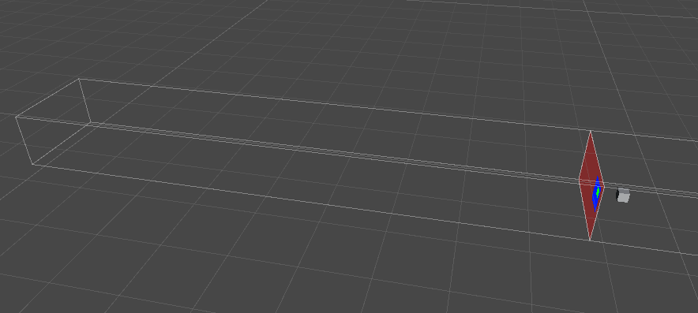
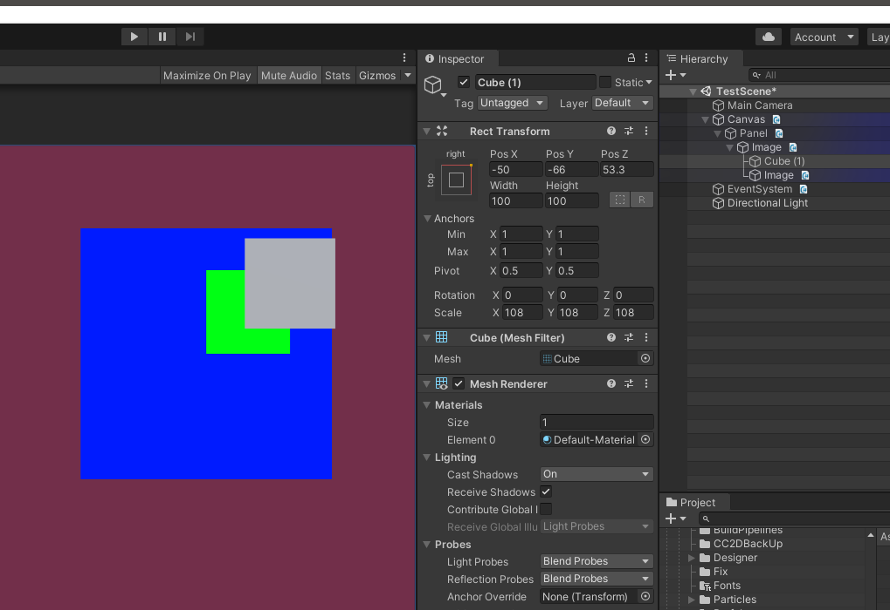
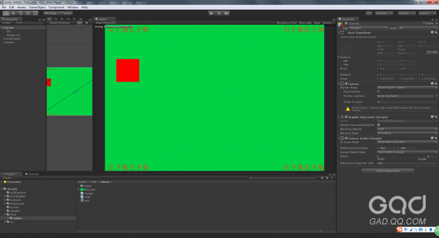
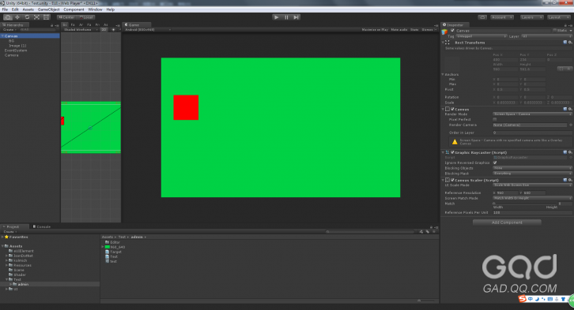

先说明一些基本的概念：

**1\.屏幕的宽高比Aspect Ratio = 屏幕宽度/屏幕高度**

**2\.Unity2D中摄像机镜头的尺寸决定了我们实际看到游戏内容的多少，在编辑器中我们可以通过调整摄像机Camera的orthographicSize属性值来调整摄像机的大小。**

如下图所示，当摄像机orthographicSize属性值等于当前屏幕高度单位的一半时，摄像机大小正好与屏幕大小相等。注意这里提到的是屏幕单位高度的一半，这个数值是经过像素到单位比即Pixels To Units换算的，Unity2D中这个比例的默认值是100，即100像素等于1单位。如果我们的游戏屏幕有640像素高，那么实际换算成单位高度则是6.4个单位，当我们摄像机的orthographicSize值是3.2时，摄像机大小刚好与屏幕大小相等。



可以通过此选项调整每张图片的像素单位比



### Unity编辑器中只能直接调整摄像机的高度，那摄像机的宽度是如何确定的呢？

答案就是我们最前面提到的屏幕宽高比。Unity会根据当前屏幕实际的宽高比和摄像机的orthographicSize值来计算出摄像机的宽度值，即：

**摄像机实际宽度 = 摄像机orthographicSize \* 2 \* 屏幕宽高比**

也即是

**摄像机实际宽度 = 摄像机高度 \* 屏幕宽高比**

我举个例子说明一下，iPhone4的屏幕像素为640\*960，宽高比为2:3，假设Pixels To Units值为100，那么如果设摄像机高度size值为4.8，那么摄像机实际宽度按照公式算出6.4，刚好就是屏幕的单位宽度。

# 场景适配

## 2d场景和3d摄像机的适配

1. 因为需要引入3d的内容所以 worldcamera,使用了透视摄像机

2. 透视摄像机旋转了15度使其可以看到地面..因为是透视相机,这就造成了2d角色在相机移动后会发生偏移的问题..这个时候需要将2d角色始终面向相机.所以2d单位的容器也需要旋转15度

3. 为什么不单独使用一个正交摄像机看角色?因为这样的画,地面和角色不是用一个相机,且其中一个使用的是透视,会造成人物移动后,地面和角色形成视差,造成其他角色看起来不像站在地面上一样

## 场景和ui位置的适配

### 3d形象如何展现在ui中

直接将3d物品拖到ui中然后添加rect transform属性,3d物品会根据ui的位置改变而改变

然后可能会出现看不到3d对象的问题.这个可能和canvas的plane distance有关,即摄像机和canvas的z的距离



用3d视图看下



这个时候是看不到cube的

注意: 想用canvas中的ui去遮挡3d物品是做不到的,sortingGroup也不会有用处..如下图想用绿色盖住cube,是做不到的.因为他们在摄像机的显示是按照z去排的



### 根据场景位置设置ui位置..

比如竖屏游戏.有一半是场景一半是ui,如何让ui去准确的盖住场景

```
        public static Vector3 WorldToCanvasPosition(Camera objectCamera, Vector3 objectTransformPosition, RectTransform CanvasRect)
        {
            // Get the position on the canvas
            Vector3 ViewportPosition = objectCamera.WorldToViewportPoint(objectTransformPosition);
            Vector3 result = new Vector3(
            ((ViewportPosition.x * CanvasRect.sizeDelta.x) - (CanvasRect.sizeDelta.x * 0.5f)),
            ((ViewportPosition.y * CanvasRect.sizeDelta.y) - (CanvasRect.sizeDelta.y * 0.5f)), 0);

            return CanvasRect.TransformPoint(result);
        }
```

```
       public static Vector3 WorldToCanvasPosition(Camera objectCamera, Vector3 objectTransformPosition, RectTransform CanvasRect, Canvas Canvas, Camera UICamera)
        {
            Vector3 screenPoint = RectTransformUtility.WorldToScreenPoint(objectCamera, objectTransformPosition);

            RectTransformUtility.ScreenPointToLocalPointInRectangle(CanvasRect, screenPoint, Canvas.renderMode == RenderMode.ScreenSpaceOverlay ? null : UICamera, out Vector2 result);

            return CanvasRect.TransformPoint(result);
        }
```

使用:

```
                    //0.3盖住半个单位的地形
                    var pos = CameraUtils.WorldToCanvasPosition(this.mainCamera, new Vector3(boardRoot.position.x, boardRoot.position.y, boardRoot.position.z), rect);
                    var perUnit = rect.sizeDelta.y / (2f * this.uiCamera.orthographicSize);
                    (notification.Body as RectTransform).offsetMax = new Vector2(0, -(this.uiCamera.orthographicSize - pos.y) * perUnit);
```

# UGUI的适配

锚点是解决ui控件在canvas里面位置的问题.而Canvas Scaler主要是设置canvas(ui控件)显示的大小(缩放)问题

## 锚点

锚点这个概念在Unity文档的多分辨率适配中被明确的提到其作用。简单的说，就是定位。如果一个物体相对于屏幕位置左上角，那么无论屏幕分辨率怎么变化，它始终位于左上角。同理，如果是在（0,0）原点，那么也始终在中心原点。我对锚点定义为，锚点，是相对于父节点的偏移量，这个偏移量随屏幕分辨率变化而按比例变化，如果将分辨率的宽，高，看做归一化的数值（即0\~1，实际UGUI就是这么做的），那么锚点是指一个偏移百分比。所以有了锚点，子节点在相对于父节点的位置上保持不变的。

如图，参考分辨率960*640，我改变GameView的分辨率为800*468，图中绿色背景大小960*640，红色Image大小100*100，红色图片的锚点为左上，轴点为左上，在参考分辨率下，红色正方形的左上顶点距离Canvas左上顶点距离（50，-150）





​    当我将屏幕分辨率切换为800\*468后，

​    因为我选的Screen Match Mode为Weight = 0，所以在800 \* 468分辨率下的实际屏幕高度为 960 \* （468/800）= 561.6。

​    又因为我的UI Scale Mode选的是Scale with Screen Size随屏幕尺寸变化，这个时候的缩放比是由宽度决定的，960/800 = 1.2 ,所以红色正方形此时的高度为100 / 1.2= 83.333

​    红色正方向锚点y轴坐标 = 参考锚点位置 \* 缩放比 = 150 \* 1.2 = 125，

## Canvas Scaler

看名字就知道..是设置canvas如何根据屏幕进行缩放

UGUI的屏幕自适应，是通过Canvas Scaler来做的，根据屏幕的分辨率，计算出canvas的大小，同时计算ScaleXY,通过Size + Scale来控制Canvas的变换，UI作为canvas的子物体，也会跟随着一起变化；为了保证UI的位置，需要在设计UI的时候，利用锚点来保证UI与边缘或角落的距离，

### 固定像素 (Constant Pixel Size)

忽略屏幕的大小根据UI元素的实际像素显示 ,像素大小始终不变，即一个100*100的图片在任何的分辨率下都占用100*100的像素。一般PC上会使用这种方式，因为PC端分辨率差异并不大。

### 根据屏幕大小进行缩放(Screen Match Mode)

此项会根据设备真实分辨率与设计分辨率来对Canvas进行缩放。有三种模式：

1. Match Width or Height

根据宽或者高来对Canvas进行缩放，比如设备分辨率为1920*900，设计分辨率为1280*720，此时，如果采用宽进行匹配那么可以通过公式计算出此时应该缩放多少倍，公式如下：

缩放因子：1920/1280 = 1.5

缩放后的Canvas的宽为：1920（刚好能够完全显示）

缩放后的Canvas的高为：720\*1.5 = 1080

由于设备的高为900所以会导致高度上的一部分不会被显示出来

2\.Expand

适配的计算公式同上，只是在此模式下会保证设计分辨率下的东西能够全部显示出来，及选择设备分辨率和设计分辨率的宽、高比中选择最小值作为缩放因子。

3\.Shrink

和Expand恰好相反，在此模式下不会留黑边但是会导致显示不完全。及选择设备分辨率和设计分辨率的宽、高比中选择最大值作为缩放因子。

UiScaleMode一般选择Scale With Screen Size，并设置好设计分辨率。其他两个选项都是固定像素大小。

Screen Match Mode中一般选择Expand，它可以保证ui中的所有元素都在屏幕内部。 相对比的一个选项是Shrink，它可以保证不留空白边。

3、多分辨率的思路是Scaler中选择Expand保证所有ui元素在屏幕内部。少部分界面，如主界面、战斗界面等根据需要设置Anchors中的全屏拉伸。注意，这里的拉伸的含义仅仅是设置Panel的宽、高，并不影响子控件的缩放，但是会影响其布局。

### 固定物理大小(Constant Physical Size)

忽略屏幕大小和分辨率根据UI的实际物理大小来显示。

# 刘海屏的适配

待续

# 参考链接

- [Unity记录-UGUI的屏幕自适应原理和应用\_shitangdejiaozi的博客-CSDN博客](https://blog.csdn.net/shitangdejiaozi/article/details/88964850)

- [Android刘海屏适配方案总结 - 简书 (jianshu.com)](https://www.jianshu.com/p/8ead0701d8ef)