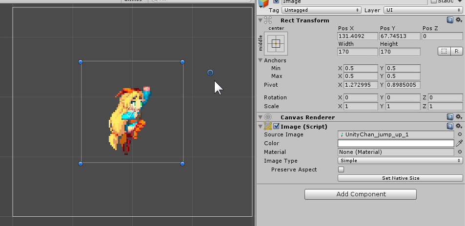
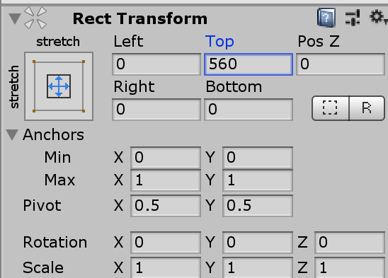

## 在編輯器中快速設定 RectTransform

快速控制器的基本操作我們就不在這裡贅述，基本上都可以在 Unity 網站裡找到很好的教學文件與影片。


## RectTransform 的控制精髓：錨點們 Anchor Points

在透過快速設定器修改 RectTransform 的過程中，你會發現右上區域會隨著不同的配置出現不同的屬性設定如下圖：


Pos X 與 Left、Pos Y 與 Top、Width 與 Right、Height 與 Bottom 這四對屬性個別不會同時出現，有 Pos X 就沒有 Left，有 Width 就沒有 Right，那麼他們出現的規則是什麼呢？

簡單來說其實就是：

「當兩個錨點的某一維度值相等時，該維度的尺寸則是固定的（跟 Parent 尺寸無關），反之該維度的尺寸則是相對於 Parent 的尺寸而變化。」

其實全部都取決於控制 *RectTransform* 型態最重要的屬性「最大與最小錨點們（Min / Max Anchors）」，而快速設定器其實也只是在幫你快速的調整這兩個錨點的值，所以只要了解這兩個設定值關係與行為，其實你已經完全掌握了 *RectTransform* ，而依照上述邏輯，透過兩個錨點所產生出的配置型態總共有四種：

A. 當兩錨點 x, y 維度的值都相等時。
B. 當兩錨點 x 維度的值不相等、y 維度值相等時。
C. 當兩錨點 x 維度的值相等、y 維度值不相等時。
D. 當兩錨點 x, y 維度的值都不相等時。

### A. 當兩錨點 x, y 維度的值都相等時：

當兩錨點 x, y 值都相等時，代表此物件的寬高尺寸都是固定值，所以我們會透過 PosX、PosY、Width 以及 Height 來定義此物件的顯示方式，PosX 與 PosY 則分別表示錨點到物件 Pivot 點的位移，而此物件的實際顯示區域則會受到 Pivot 的 x, y 值設定所影響。


### B. 當兩錨點 x 維度的值不相等、y 維度值相等時：

當兩錨點 x 維度的值不相等、y 維度值相等時，代表 x 維度的尺寸會受到 Parent 的尺寸影響，在 x 維度上則是使用間距（Padding）的概念來排版，所以會用到 Left、PosY、Right 以及 Height，實際的 Width 是由 Left 與 Right 來控制。


### C. 當兩錨點 x 維度的值相等、y 維度值不相等時：

當兩錨點 x 維度的值相等、y 維度值不相等時，代表 y 維度的尺寸會受到 Parent 的尺寸影響，在 y 維度上則是使用間距（Padding）的概念來排版，所以會用到 PosX、Top、Width 以及 Bottom，實際的 Height 是由 Top 與 Bottom 來控制。


### D. 當兩錨點 x, y 維度的值都不相等時：

當兩錨點 x, y 維度的值都不相等時，代表物件的寬高尺寸都會受到 Parent 的影響，完全是使用四個方向的間距來定義此物件的顯示區域 Left、Top、Right 以及 Bottom。


# 一些术语解释

### pivot

物體自身的支點，影響物體的旋轉、縮放、位置，改變 UI Pivot 必須先開啟控制面板的 Pivot 按鈕，如下圖

，

Pivot (0.5, 0.5)


Pivot (0, 1)


它是一个X,Y值范围是0到1的点，这个点的会在**Anchor**（锚点）计算位置的时候会使用到，下面用一张图来解释**Pivot**点的位置


pivot和text的填充


当pivot为0.5和0.5时数字的填充时以中心点向上下方向扩展rect


一般来讲,动态改变文本,为了使其按照从上到下,可以把pivot设置在左上角  0,1


点击上方的pivot可以切换pivot的所在位置

center 的中心点

pivot的点所在位置

这同样适用于layout,下图设置成0,1.在中间位置添加panel,他会向下扩充,加上verticallayoutgroup和contentsizefitter两个组件


设置成0.5,0.5.他会向上下扩充


### 位置

- `position`世界坐标是三维的全局坐标,一般作为基准坐标

- `localPosition` 相对于父级物体的相对位置

- `anchoredPosition` 相对位置，但是相对的是自身的Anchor

- `anchoredPosition3D`  相对位置，但是相对的是自身的Anchor

关于`position`和`localPosition`，它们的值根其所属的Canvas的渲染模式有关。

- 在Screen Space——Overlay的模式下，由于Canvas的世界尺寸与其像素尺寸在数值上相等，因此其rectTransform的position与其在屏幕空间的坐标在数值上也相等。这种模式下，要获取某个RectTransform的屏幕坐标，直接使用position就可以。

- 在Screen Space——Camera的模式和World Space下，RectTransform的渲染与摄像机有关，在获取其屏幕坐标时，需要利用canvas.worldCamera，或者transform.TransformPoint等坐标转换函数进行坐标转换。

关于`anchoredPosition`和`anchoredPositoin3D`都可以认为是以像素为单位。

- 当锚点全部重合时，`anchoredPosition`代表的就是自身Pivot到Anchor的向量。


- 当Anchor不重合时,Pivot相对于四个锚点**中点**的坐标


### offsetMin 和 offsetMax

`offsetMax`是**RectTransform右上角**相对于**右上Anchor**的距离；`offsetMin`是**RectTransform左下角**相对于**左下Anchor**的距离。*這就是為什麼 offsetMax 的值跟編輯器中 Top、Right 值剛好正負相反的原因。*


### rect

如果想要获取一个RectTransform的矩形信息，应该使用rectTransform.rect属性。

rect属性同样是一个计算出来的值，但是它表示的是该rectTransform对应的矩形的相关信息。

rect 的 x 和 y 返回左下角相对于pivot的距离,w 和 h 返回本身的宽高.

注意:**Awake中Rectangle还没有初始化出来,所以不要在awake中获取rect**

### anchorMin 和 anchorMax

这个是针对锚点的,锚点时相对于父容器定义的,所以这两个属性也是相对于父容器的.分别指锚点占父容器尺寸的百分比位置.

### sizeDelta

sizeDelta是个由引擎计算出来的值，这个值很容易被错误地使用。要正确地使用sizeDelta，就要先理解它是怎么算出来的。

> The size of this RectTransform relative to the distances between the anchors.
> If the anchors are together, sizeDelta is the same as size. If the anchors are in each of the four corners of the parent, the sizeDelta is how much bigger or smaller the rectangle is compared to its parent.

*sizeDelta*是`offsetMax-offsetMin`的结果。在锚点全部重合的情况下，它的值就是面板上的\*（Width，Height）\*。在锚点完全不重合的情况下，它是相对于父矩形的尺寸。

一个常见的错误是，当*RectTransform*的锚点并非全部重合时，使用*sizeDelta*作为这个*RectTransform*的尺寸。此时拿到的结果一般来说并非预期的结果。

所以 *RectTransform* 宽和高真正的計算方法是:

```
GUI.Label(new Rect(20, 20, 600, 40), "Rect : " + rect.rect);
var width =  (rect.anchorMax.x - rect.anchorMin.x) * parent.rect.width + rect.sizeDelta.x;
var height = (rect.anchorMax.y - rect.anchorMin.y) * parent.rect.height + rect.sizeDelta.y;
GUI.Label(new Rect(20, 60, 600, 40), $"width :{width} height:{height} ");
```

意思就是 sizeDelta 個別維度的值是跟兩錨點個別維度的差值相關，所以只有當兩錨點某的維度的值相等的時候，sizeDelta 在此維度的值才會剛好等於最後顯示的 size 大小。

# 代码修改坐标及大小

**1\.改变RectTransform的top** 注意offsetMax\`是**RectTransform右上角**相对于**右上Anchor**的距离,所以top的值应该是一个负值

```
GetComponent<RectTransform>().offsetMax = new Vector2(GetComponent<RectTransform>().offsetMax.x, top);
```

**2\.改变RectTransform的bottom**

```
GetComponent<RectTransform>().offsetMin = new Vector2(GetComponent<RectTransform>().offsetMin.x, bottom);
```

**3\.改变RectTransform的width，height** ,会根据上面的计算公式重新计算得出width和height,所以如果锚点不是在同一个点的情况下,你设置的值和实际的值是有很大区别的

```
GetComponent<RectTransform>().sizeDelta = new Vector2(width, height);
```

例如:




当使用脚本直接改变大小后

```
rect.sizeDelta = new Vector2(750, 200);
```


```
var width =  (rect.anchorMax.x - rect.anchorMin.x) * parent.rect.width + rect.sizeDelta.x;
var height = (rect.anchorMax.y - rect.anchorMin.y) * parent.rect.height + rect.sizeDelta.y;
```

他的宽和高经过了运算使其分别为1500,1534

**4\.改变RectTransform的pos** 注意anchoredPosition是相对于锚点的位置

```
GetComponent<RectTransform>().anchoredPosition3D = new Vector3(posx,posy,posz);
GetComponent<RectTransform>().anchoredPosition = new Vector2(posx,posy);
```

\*\*5.使用SetSizeWithCurrentAnchors函数来进行设定，其中Horizontal和Vertical分别对应宽和高。此函数受当前锚点和中心点的影响。\*\*由于会受到`povit`的影响设置的高度是根据povit进行上下缩小的

```
var rt = gameObject.GetComponent<RectTransform>();
rt.SetSizeWithCurrentAnchors(RectTransform.Axis.Horizontal, 100);
rt.SetSizeWithCurrentAnchors(RectTransform.Axis.Vertical, 30);
```

上面同样的示例:


```
rect.SetSizeWithCurrentAnchors(RectTransform.Axis.Vertical, 200);
```


可以看到它围绕着`pivot`上下都缩减了180

**6\.使用SetInsetAndSizeFromParentEdge函数来进行设定。此函数不受锚点和中心的影响，其中第一个参数代表对齐方式，第二个参数为距离边界的距离，第三个参数为宽度。**

```
var rt = gameObject.GetComponent<RectTransform>();
rt.SetInsetAndSizeFromParentEdge(RectTransform.Edge.Right, 0, 100);
rt.SetInsetAndSizeFromParentEdge(RectTransform.Edge.Bottom, 0, 30);
```

# recttransform的一些其他操做

### Blue Print Mode(藍圖模式) 、 Raw Edit Mode(原始编辑模式)

## 

#### Blue Print Mode (藍圖模式)

忽略了物體的 Local Rotation 和 Local Scale，方便以原來的旋轉與大小調整物體


#### Raw Edit Mode (原始编辑模式)

在 Inspector 中調整 Pivot 和 Anchor 時，物體會維持目前的位置與大小(Inspector 中數值部分)，調整情形如下，請注意數值部分

Inspector 中調整  Pivot


Inspector 中調整  Anchor


### 參考資料

- [Unity – Manual: Basic Layout](http://docs.unity3d.com/Manual/UIBasicLayout.html)

- [UnityのuGUIのレイアウト調整機能について解説してみる（RectTransform入門）](http://tsubakit1.hateblo.jp/entry/2014/12/19/033946)