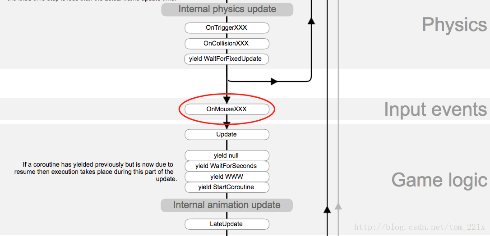
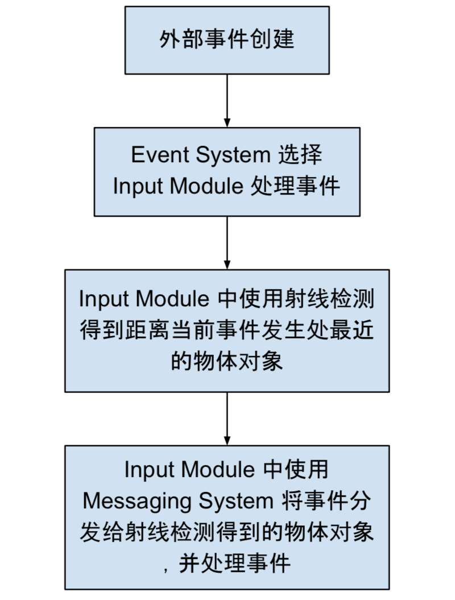
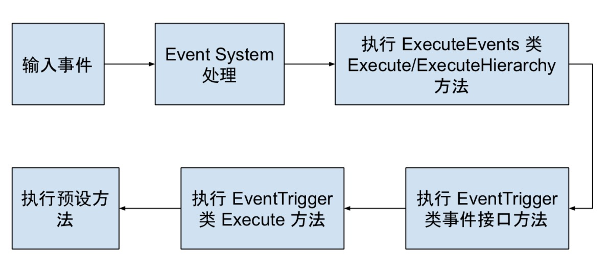
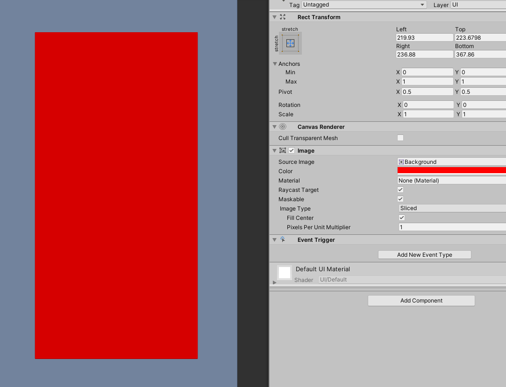
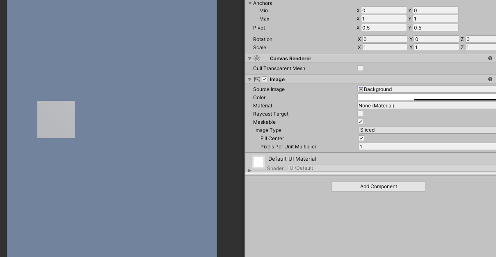
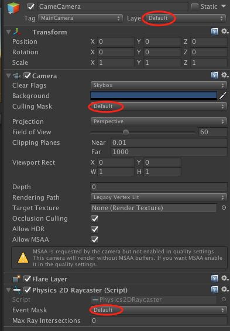
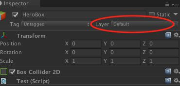

# OnMouse事件

我们先来看看eventmanager之前unity处理事件的方法,首当其冲的就是MonoBehavior上的事件回调，可以参看[MonoBehaviour](https://link.zhihu.com/?target=https%3A//docs.unity3d.com/ScriptReference/MonoBehaviour.html)文档。这是一系列的OnMouse开头的回调函数。

```
OnMouseDown
OnMouseDrag
OnMouseEnter
OnMouseExit
OnMouseOver
OnMouseUp
```

这个处理方式有以下几个特点：

- MonoBehavior所在的GameObject需要有Collider碰撞组件，并且Physics.queriesHitTriggers设置为True，这个在Edit -> Physics Settings -> Physics or Physics2D中设置。

- 或者MonoBehavior所在的GameObject存在GUIElement。

- OnMouse处理函数可以是协程。

- GameObject所有MonoBehavior实现OnMouse的函数都会调用。

- Collider或GUIElement的层级顺序，会遮挡事件的传递。

按照官方的解释，这是GUI事件的一部分，参看[EventFunctions](https://link.zhihu.com/?target=https%3A//docs.unity3d.com/Manual/EventFunctions.html)。设计的初衷也是为了GUI服务的。参看[ExecutionOrder](https://link.zhihu.com/?target=https%3A//docs.unity3d.com/Manual/ExecutionOrder.html)最后的unity执行流程图，会发现OnMouse事件是一个独立的Input Event。



可以看到，OnMouse事件在，Physics事件之后，Update之前，记住这个顺序，后面会用到。并且，这是引擎本身回调的，就引擎使用而言可以看成是，消息驱动。至于引擎的实现，可是轮询也可以是消息驱动。

#### 在Update中輪詢Input物件

```
public class ExampleClass : MonoBehaviour
{ 
    public void Update() 
    { 
       if (Input.GetButtonDown("Fire1")) 
       { 
            Debug.Log(Input.mousePosition); 
       } 
    }
}
```

这是官方的例子，Input拥有各种输入设备的数据信息。每一帧不断的检测，查看有没有需要处理的输入信息，利用GameObject本身的层级顺序来控制Update的调用顺序，从而控制了Input的处理顺序。

Input的信息由引擎自己设置的，明显Unity需要实现不同平台的事件处理，然后对Input进行设置。另外有一个InputManager面板用来配置Input相关属性的，在Edit -> Physics Settings -> Input中。

由前面的执行流程图可知，OnMouse事件会在Update之前调用，当然我们也可以在OnMouse中使用Input，这样就变成了消息驱动，而不是轮询了。但这样的缺点是，事件必须由touch或pointer碰撞触发，比如键盘或控制器按钮的事件就没有办法捕获了。

# EventSystem

EventSystem组件主要负责处理输入、射线投射以及发送事件。一个场景中只能有一个EventSystem组件，并且需要BaseInputModule类型组件的协助才能工作。EventSystem在一开始的时候会把自己所属对象下的BaseInputModule类型组件加到一个内部列表，并且在每个Update周期通过接口UpdateModules接口调用这些基本输入模块的UpdateModule接口，然后BaseInputModule会在UpdateModule接口中将自己的状态修改成'Updated'，之后BaseInputModule的Process接口才会被调用。

BaseInputModule是一个基类模块，负责发送输入事件（点击、拖拽、选中等）到具体对象。EventSystem下的所有输入模块都必须继承自BaseInputModule组件。StandaloneInputModule和TouchInputModule组件是系统提供的标准输入模块和触摸输入模块，我们可以通过继承BaseInputModule实现自己的输入模块。

BaseRaycaster也是一个基类，前面说的输入模块要检测到鼠标事件必须有射线投射组件才能确定目标对象。系统实现的射线投射类组件有PhysicsRaycaster, Physics2DRaycaster, GraphicRaycaster。这个模块也是可以自己继承BaseRaycaster实现个性化定制。

**总的来说，EventSystem负责管理，BaseInputModule负责输入，BaseRaycaster负责确定目标对象，目标对象负责接收事件并处理，然后一个完整的事件系统就有了。**

# EventSystem與OnMouse的區別

- OnMouse 会先于 EventSystem 触发。因为EventSystem的源码显示，其在Update中去轮询检测处理Input的输入。而OnMouse事件先于Update调用。

- OnMouse脚本需要在同一个GameObject上挂载Collider才能检测。EventSystem的脚本会根据子节点的Collider来触发(平行节点不行)。

- Rigidbody有个特点，会把子节点所有的Collider统一检测和处理。也就是说，OnMouse脚本与RigidBody在一起就可以检测所有的子节点Collider，而不再需要同级的Collider。而EventSystem的脚本则不依赖于Rigidbody，都可以检测子节点的Collider。

- OnMouse依赖于Tag为MainCamera相机的Culling Mask来过滤射线。EventSystem则是依赖挂载Physics Raycaster的相机。

另外，当在有Collider的子节点都挂载OnMouse或EventSystem事件的时候，只会触发一次事件。但在同一个GameObject上挂载多个脚本，就会触发多次。

# Unity Raycasters 和事件处理

Raycasters 用来检测当前事件发送给哪个对象，检测原理就是 Raycast。当给定一个屏幕坐标系中的位置，Raycasters 就会利用射线检测寻找潜在的对象，并返回一个离当前屏幕最近的对象。

在 Unity Raycasters 中有三种类型的 Raycasters:

- Graphic Raycaster - 存在于 Canvas 下，用于检测 Canvas 中所有的物体

- Physics 2D Raycaster - 用于检测 2D 物体

- Physics Raycaster - 用于检测 3D 物体

接下来，就来分析一下各个类型 Raycaster 的源码来看看其的工作流程。

Raycast 在 Event System 流程中所处的位置大致如下图:



### unity的事件处理

当 Event System 处理输入事件并找到合适的接收者，将该接收者作为参数执行 ExecuteEvents 类中的 `Execute` 或 `ExecuteHierarchy` 方法；如果此时该接收对象 GameObject 绑定了 EventTrigger 组件，由于 EventTrigger 类实现了所有常用的 UI 事件接口(即实现了 `IEventSystemHandler` 接口)，因此会执行 EventTrigger 类中相应事件接口对应的方法，转而执行 EventTrigger 类的 `Execute` 方法，最终回调在编辑器中设定的方法。

所以如果当一个点击事件被触发,首先会拿到射线检测返回的gameobject，然后搜索当前的**gameobejct以及其父节点**上面是否有实现了IPointerDownHandler的接口的控件，如果有实现了的就把newPressed赋值为这个控件的gameobject，如果没有，就去搜索实现了IPointerClickHandler这个接口的控件，如果没有在自身上找到的话，会依次地向父节点层层搜索，直到找到为止，然后依然是把newPressed赋值为这个控件的gameobject。接着会按照类似的方式去搜索自身以及父节点上是否有实现了IDragHandler的组件，如果有的话紧接着便会去触发OnPointerDown和OnDrag方法。

当鼠标按下并抬起的时候，首先会触发IPointerUpHandler接口中的函数OnPointerUp()，然后会再次搜索当前gameobject以及其父节点上是否有实现了IPointerClickHandler接口的控件，如果有的的话，会和之前存下来的newPressd进行比较，看两者是否为同一个gameobject。如果两者为同一个gameobject的话就会触发Click事件。

因此我们需要注意，如果一个物体没有父节点的话，那么只实现IPointerClickHandler接口便是可以接收到点击事件的。如果他有父节点，父节点挂载的脚本也是只实现IPointerClickHandler接口的话，点击事件也是可以接收到的。但是如果父节点实现了IPointerDownHandler和IPointerClickHandler接口，子节点只实现IPointerClickHandler接口的话，两者便会都接收不到点击事件，需要子节点也实现IPointerDownHandler这个接口才行。



**事件透传**

如果事件被接收后,就不会再被父节点的监听处理,如果需要,则得使用message手动触发

```
using UnityEngine;
using System.Collections;
using UnityEngine.EventSystems;
using UnityEngine.UI;
using System.Collections.Generic;
 
public class Test : MonoBehaviour,IPointerClickHandler ,IPointerDownHandler,IPointerUpHandler
{ 
 
    //监听按下
    public void OnPointerDown(PointerEventData eventData)
    {
        PassEvent(eventData,ExecuteEvents.pointerDownHandler);
    }
 
    //监听抬起
    public void OnPointerUp(PointerEventData eventData)
    {
        PassEvent(eventData,ExecuteEvents.pointerUpHandler);
    }
 
    //监听点击
    public void OnPointerClick(PointerEventData eventData)
    {
        PassEvent(eventData,ExecuteEvents.submitHandler);
        PassEvent(eventData,ExecuteEvents.pointerClickHandler);
    }
 
 
    //把事件透下去
    public void  PassEvent<T>(PointerEventData data,ExecuteEvents.EventFunction<T> function)
        where T : IEventSystemHandler
    {
        List<RaycastResult> results = new List<RaycastResult>();
        EventSystem.current.RaycastAll(data, results); 
        GameObject current = data.pointerCurrentRaycast.gameObject ;
        for(int i =0; i< results.Count;i++)
        {
            if(current!= results[i].gameObject)
            {
                ExecuteEvents.Execute(results[i].gameObject, data,function);
                //RaycastAll后ugui会自己排序，如果你只想响应透下去的最近的一个响应，这里ExecuteEvents.Execute后直接break就行。
            }
        }
    }
}
```

**事件忽略**

如果需要当前节点及子节点都不响应UI事件

- 勾选Raycast Targe

- 在当前节点上添加一个组件CanvasGroup，然后取消其Interactable和Blocks Raycasts的勾选

- 添加脚本

```
using UnityEngine;
using System.Collections;
public class TouchIgnore : MonoBehaviour, ICanvasRaycastFilter
{
	public bool IsRaycastLocationValid(Vector2 screenPoint, Camera eventCamera)
	{
		return false;
	}
}
```

**事件阻止**

父子之间阻止向父级传递事件,只要在该对象加上一个EventTrigger起就可以了,代表这个事件已经被处理了.

```
 this.GameObject.GetOrAddComponent<EventTrigger>()
```

比如一个案例,点击最顶级的遮罩(白色部分)窗口关闭,但是点击到窗口内部(红色部分)不做处理


**ugui事件和射线穿透的问题**

eventsystem也是向场景发送射线,然后找到**第一个**触碰的有**Raycast Target**的game object.然后在向这个gameobject的父级去找.

所有如果ui即使全屏了,但是没有设置Raycast Target,仍然会穿透ui.射线会检测到下面的立方体,如图:



**事件和handler的连接触发方式**

1. 对于某些ui组件，可以直接设置其对自己产生的事件的handler，如button的onpointerclick

2. 对于任何ui组件，都可以使用eventtrigger这个component，这个trigger放置在产生事件的UI组件上，里面包含了一个事件的类型，以及这个类型关联的处理函数，处理函数可以使用两种函数参数，一种是使用int string简单类型，一种是使用BaseEventData类型，因为当event发生时，会跟随者把这个事件包装成一个PointerEventData类型的参数送进来，里面包含ui事件的详细信息，包括鼠标在哪，而对于前一种简单类型，在编辑器上可以填写当事件发生时传什么参数，这就好比qt的signal和slot连接。

3. 强制让某个事件发生在某个handler上（也就是强制某个handler执行）：调用ExecuteEvents.Execute<**ICustomMessageTarget**\>(target, null, (x,y)=>x.Message1());

   这个调用将执行target身上所有继承 了ICustomMessageTarget接口的mono的Message1函数，个人认为这个和给target发送Message1 的sendmessage没什么区别，可能是我还没有立即好这个接口。

**自定义事件处理**

建立一個 Script，繼承 Event Interfaces，這裡是IPointerDownHandler(點下事件)，[看更多 Event 請點我](http://docs.unity3d.com/Manual/SupportedEvents.html)

```
using UnityEngine;
using UnityEngine.EventSystems;
 
public class EventTest : MonoBehaviour, IPointerDownHandler
{
    public void OnPointerDown(PointerEventData eventData)
    {
        print(gameObject.name);
    }
}
```

## 阻止手动发送射线穿透ugui问题

UGUI 提供了一个检测是否点击在UI上的方法
EventSystem.current.IsPointerOverGameObject();
在EventSystem的标准输入Standalone Input Model下是正常的，

但是在Touch Input Module输入模式下不正常

参考网络资料，解决办法(直接上[源码](http://blog.csdn.net/andyhebear/article/details/51433748)):

```csharp
 using System.Collections;
using System.Collections.Generic;
using UnityEngine;
using UnityEngine.UI;
using UnityEngine.EventSystems;

public class PointerCheck : MonoBehaviour
{
 //UGUI 提供了一个检测是否点击在UI上的方法
    //EventSystem.current.IsPointerOverGameObject();
    //但是该方法在PC上检测正常，结果拿到Android真机测试上，永远检测不到。
    //方法一， 使用该方法的另一个重载方法，使用时给该方法传递一个整形参数
    // 该参数即使触摸手势的 id
    // int id = Input.GetTouch(0).fingerId;
    //public static bool IsPointerOverGameObject(int fingerID) {
    //    return UnityEngine.EventSystems.EventSystem.current.IsPointerOverGameObject(fingerID);//移动输入模式下一样不行
 
    //}
    public static bool IsPointerOverGameObject() {
        //if (Input.touchCount > 0) {
                        
        //    int id = Input.GetTouch(0).fingerId;
        //    return UnityEngine.EventSystems.EventSystem.current.IsPointerOverGameObject(id);//安卓机上不行
        //}
        //else {
            //return UnityEngine.EventSystems.EventSystem.current.IsPointerOverGameObject();
            PointerEventData eventData = new PointerEventData(UnityEngine.EventSystems.EventSystem.current);
            eventData.pressPosition = Input.mousePosition;
            eventData.position = Input.mousePosition;
 
            List<RaycastResult> list = new List<RaycastResult>();
            UnityEngine.EventSystems.EventSystem.current.RaycastAll(eventData, list);
            //Debug.Log(list.Count);
            return list.Count > 0;
       // }
    }
    //方法二 通过UI事件发射射线
    //是 2D UI 的位置，非 3D 位置
    public static bool IsPointerOverGameObject(Vector2 screenPosition) {
        //实例化点击事件
        PointerEventData eventDataCurrentPosition = new PointerEventData(UnityEngine.EventSystems.EventSystem.current);
        //将点击位置的屏幕坐标赋值给点击事件
        eventDataCurrentPosition.position = new Vector2(screenPosition.x, screenPosition.y);
 
        List<RaycastResult> results = new List<RaycastResult>();
        //向点击处发射射线
        EventSystem.current.RaycastAll(eventDataCurrentPosition, results);
 
        return results.Count > 0;
    }
    //方法三 通过画布上的 GraphicRaycaster 组件发射射线
    public static bool IsPointerOverGameObject(Canvas canvas, Vector2 screenPosition) {
        //实例化点击事件
        PointerEventData eventDataCurrentPosition = new PointerEventData(EventSystem.current);
        //将点击位置的屏幕坐标赋值给点击事件
        eventDataCurrentPosition.position = screenPosition;
        //获取画布上的 GraphicRaycaster 组件
        GraphicRaycaster uiRaycaster = canvas.gameObject.GetComponent<GraphicRaycaster>();
 
        List<RaycastResult> results = new List<RaycastResult>();
        // GraphicRaycaster 发射射线
        uiRaycaster.Raycast(eventDataCurrentPosition, results);
 
        return results.Count > 0;
    }
// For Details => https://blog.csdn.net/andyhebear/article/details/51433748
}
```

网友解决办法：

```
      /// <summary>
     /// Cast a ray to test if Input.mousePosition is over any UI object in EventSystem.current. This is a replacement
     /// for IsPointerOverGameObject() which does not work on Android in 4.6.0f3
     /// </summary>
     private static bool IsPointerOverUIObject()
     {
         if (EventSystem.current == null)
             return false;
 
         // Referencing this code for GraphicRaycaster https://gist.github.com/stramit/ead7ca1f432f3c0f181f
         // the ray cast appears to require only eventData.position.
         PointerEventData eventDataCurrentPosition = new PointerEventData(EventSystem.current);
         eventDataCurrentPosition.position = new Vector2(Input.mousePosition.x, Input.mousePosition.y);
 
         List<RaycastResult> results = new List<RaycastResult>();
         EventSystem.current.RaycastAll(eventDataCurrentPosition, results);
 
         return results.Count > 0;
     }
 
     /// <summary>
     /// Cast a ray to test if screenPosition is over any UI object in canvas. This is a replacement
     /// for IsPointerOverGameObject() which does not work on Android in 4.6.0f3
     /// </summary>
     private bool IsPointerOverUIObject(Canvas canvas, Vector2 screenPosition)
     {
         if (EventSystem.current == null)
             return false;
 
         // Referencing this code for GraphicRaycaster https://gist.github.com/stramit/ead7ca1f432f3c0f181f
         // the ray cast appears to require only eventData.position.
         PointerEventData eventDataCurrentPosition = new PointerEventData(EventSystem.current);
         eventDataCurrentPosition.position = screenPosition;
 
         GraphicRaycaster uiRaycaster = canvas.gameObject.GetComponent<GraphicRaycaster>();
         List<RaycastResult> results = new List<RaycastResult>();
         uiRaycaster.Raycast(eventDataCurrentPosition, results);
         return results.Count > 0;
     }
```

# Message System（改进的消息系统）

### 传统方式进行 Message 通信

传统消息通信，通常我们会使用 GameObject 类中的 `SendMessage`、`SendMessageUpwards` 和 `BroadcastMessage` 方法

||SendMessage|SendMessageUpwards|BroadcastMessage|
|-|-|-|-|
|自身节点|√|√|√|
|兄弟节点|×|×|×|
|父/祖先节点|×|√|×|
|子/孙节点|×|×|√|

### Messaging System

在 UGUI 的 Event System 中，所有的事件通信都是用了 Messaging System 来实现，它也解决了传统方式进行 Message 通信中可能会遇到的一些问题。下面就来让我们好好看看这套 Messaging System。

首先，要想让 Component 能够从 Messaging System 接收消息，Component 要实现 `IEventSystemHandler` 这个接口。`IPointerDownHandler`等都继承了`IEventSystemHandler` 接口

```
public interface ICustomMessageTarget : IEventSystemHandler
{
    // functions that can be called via the messaging system
    void Message1();
    void Message2();
}
```

实现这个接口 , 把这个脚本挂在某个物体上，这里假设为物体AAA

```
public class CustomMessageTarget : MonoBehaviour, ICustomMessageTarget
{
    public void Message1()
    {
        Debug.Log ("Message 1 received");
    }

    public void Message2()
    {
        Debug.Log ("Message 2 received");
    }
}
```

在任何脚本中使用ExecuteEvents静态类发送Message，来执行接口中定义的方法

```
ExecuteEvents.Execute<ICustomMessageTarget>(target, null, (x,y)=>x.Message1());
```

Excute泛型方法，有3个参数，第一个参数是发送message的gameobject对象，只有当对象上有`IEventSystemHandler`实现类的时候才可以，这个例子中自然就是AAA物体。

ExecuteEvents静态类还有其他方法：

```
EventSystems.ExecuteEvents.CanHandleEvent    判断给定的gameobejct是否能处理这个事件
EventSystems.ExecuteEvents.Execute     执行事件
EventSystems.ExecuteEvents.ExecuteHierarchy  是递归寻找适合的gameobject，并执行事件 
EventSystems.ExecuteEvents.GetEventHandler   
EventSystems.ExecuteEvents.ValidateEventData   
```

# eventsystem 处理Physics

首先，我们看一个官方文档的说明 [Raycasters](https://link.zhihu.com/?target=https%3A//docs.unity3d.com/Manual/Raycasters.html)。

> If multiple Raycasters are used then they will all have casting happen against them and the results will be sorted based on distance to the elements.

当多个Raycaster被使用的时候，结果会按照元素之间的距离排序，然后事件就会按照这个顺序被传递。

## **第一步**



在相机上添加Physics2DRaycaster，我这里只需要对Physics2D检测，如果是3D就用Physics3DRaycaster。Physics Raycaster 依赖一个相机，如果没有会自动添加。我挂载在相机上，射线检测就会依赖这个相机。

这里我用在GameCamera上面，当然也可以放在UICamera上面，Physics Raycaster挂载在哪个相机上面，射线就依赖这个相机的Culling Mask。

另外需要注意的是，Physics Raycaster所在的相机层级，也就是Depth，会影响到事件传递的顺序。比如，UI Camera层级高于Game Camera，就会永远先出发UI上的事件。同样，OnMouse事件会默认依赖Main Camera的层级。

## **第二步**

给需要碰撞检测的GameObject，添加Collider和EventSystem的事件处理回调接口。注意GameObject的Layer也要与Camera和Raycaster一致，才能正确被检测到。



事件接口实现脚本(图中的Test)需要Collider，事件才能正确回调，并且GameObject和相机的距离决定了Collider的层级，也就是事件阻挡关系。

## **第三步**

这样一来，EventSystem的SupportEvents的接口全部被应用到了Physics上面。也就不再需要自己手动去调用射线去检测Physics碰撞了。那么，还隐含着一个事情就是，EventSystem的IsPointerOverGameObject()就无法在判断对UI的点击了。因为现在点击到Physics也会让这个函数返回True。