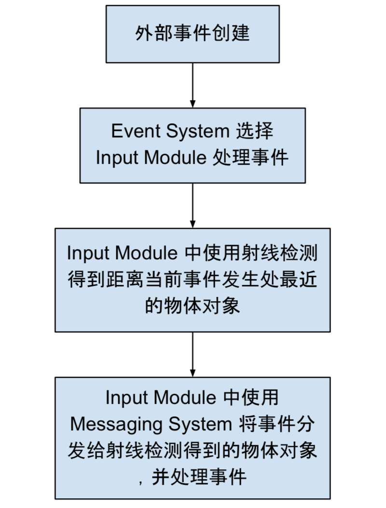

Raycasters 用来检测当前事件发送给哪个对象，检测原理就是 Raycast。当给定一个屏幕坐标系中的位置，Raycasters 就会利用射线检测寻找潜在的对象，并返回一个离当前屏幕最近的对象。

在 Unity Raycasters 中有三种类型的 Raycasters:

- Graphic Raycaster - 存在于 Canvas 下，用于检测 Canvas 中所有的物体

- Physics 2D Raycaster - 用于检测 2D 物体

- Physics Raycaster - 用于检测 3D 物体

接下来，就来分析一下各个类型 Raycaster 的源码来看看其的工作流程。

Raycast 在 Event System 流程中所处的位置大致如下图:



## BaseRaycaster 类

Unity Raycasters 中的三个 Raycaster 类都继承自 BaseRaycaster。首先就来看看 BaseRaycaster 类。

BaseRaycaster 类很简单，它包含一个抽象方法 `Raycast`，定义如下:

```
abstract void Raycast(PointerEventData eventData, List<RaycastResult> resultAppendList);
```

这个方法供子类覆写以实现对不同类别的物体进行射线检测。BaseRaycaster 类还继承自 UIBehaviour 类，因此它还覆写了 `OnEnable` 和 `OnDisable` 方法，在 `OnEnable` 方法中向 RaycasterManager 类注册了自己，在 `OnDisable` 方法中从 RaycasterManager 类移除了自己的注册。

另外该类中还包含了 eventCamera、sortOrderPriority、renderOrderPriority 等属性，在射线检测物体时会用到。

## Physics Raycaster

Physics Raycaster 用于检测场景中的 3D 物体对象。

PhysicsRaycaster 类继承自 BaseRaycaster，既然是射线检测那么最重要的方法莫过于 `Raycast`，接下来就一起看看这个方法。

在 `Raycast` 方法中，首先使用传入的 PointerEventData 参数调用 `ComputeRayAndDistance` 方法，计算得到从当前射线检测使用的 Camera 的近裁剪面处出发，穿过屏幕事件发生处位置的一条射线；这个方法还会计算一个射线检测使用的最大距离 `distanceToClipPlane`。

`ComputeRayAndDistance` 内部使用了 Camera 类的 `ScreenPointToRay` 方法将某点转换成一条射线，根据得到的射线的方向以及 Camera 的 farClipPlane 和 nearClipPlane 求得检测最大距离 `distanceToClipPlane`。具体代码如下:

```
void ComputeRayAndDistance(PointerEventData eventData, out Ray ray, out float distanceToClipPlane)
{
    ray = eventCamera.ScreenPointToRay(eventData.position);
    float projectionDirection = ray.direction.z;
    // 这里加了个保护，因为 projectionDirection 近似为 0 的时候不能被除，因此 distanceToClipPlane 取 Mathf.Infinity 无限大
    distanceToClipPlane = Mathf.Approximately(0.0f, projectionDirection) ? Mathf.Infinity : Mathf.Abs((eventCamera.farClipPlane - eventCamera.nearClipPlane) / projectionDirection);
}
```

接下来就是进行射线检测了，代码如下:

```
var hits = ReflectionMethodsCache.Singleton.raycast3DAll(ray, distanceToClipPlane, finalEventMask);
```

这里的 `ReflectionMethodsCache` 类里面缓存了一些通过反射得到的射线检测相关的类方法。在上面的代码中使用了 `raycast3DAll` 这个代理，最终执行的是 Physics 类的 `RaycastAll` 方法。传入的三个参数就是射线 ray，最大检测距离 distanceToClipPlane 以及需要检测的层 finalEventMask，返回结果就是检测成功得到的 RaycastHit 数组。第三个参数 finalEventMask 定义如下:

```
public int finalEventMask
{
    get { return (eventCamera != null) ? eventCamera.cullingMask & m_EventMask : kNoEventMaskSet; }
}
```

我们知道，射线检测的时候可以设置哪些 layer 可以接收检测碰撞。上面定义的 finalEventMask 就是需要检测的 layer，如果当前 raycaster 所在的对象有 Camera 组件，那么 finalEventMask 就是摄像机设置的渲染的所有层(`eventCamera.cullingMask & m_EventMask`)，否则就是默认所有的层(`int kNoEventMaskSet = -1`)都可以接收射线碰撞检测。

然后对检测得到的 RaycastHit 数组按照 distance 由小到大排序。最后将这些射线检测结果依次拼装成 RaycastResult 并返回给 Event System，这里的 RaycastResult 中的 distance 就是 RaycastHit 的 distance(射线起点到射线碰撞点的距离)。

## Physics2D Raycaster

Physics2DRaycaster 类继承自 PhysicsRaycaster，主要就是 `Raycast` 方法中的一点点细小的区别。

第一，在进行射线检测的时候，Physics2DRaycaster 中最后调用的是 Physics2D 的 `GetRayIntersectionAll` 方法。

第二处同 PhysicsRaycaster 的不同之处是在返回构造 RaycastResult 时，填充的部分值不一样，包括以下几个:

- distance，这个值是摄像机到射线检测碰撞点的距离，而在 PhysicsRaycaster 中是 RaycastHit 的 `distance` 值(射线起点在近裁剪面发出到碰撞点的距离)。

- sortingLayer，这个值是当前对象 SpriteRenderer 组件中的 `sortingLayerID` 值，在 PhysicsRaycaster 为 0。

- sortingOrder，这个同样为当前对象 SpriteRenderer 组件中的 `sortingOrder` 值，在 PhysicsRaycaster 为 0。

## Graphic Raycaster

Graphic Raycaster 用于射线检测 Canvas 中的 Graphic 对象物体，通常绑定在 Canvas 所在的对象身上。

### 属性或方法

GraphicRaycaster 类的成员属性很少，除了继承 BaseRaycaster 类的一些属性和方法外，它还拥有以下一些常用的属性或方法:

|属性|描述|
|-|-|
|`Ignore Reversed Graphics`|射线检测时是否忽略背向的 Graphics|
|`Blocked Objects`|哪些类型的对象会阻挡 Graphic raycasts|
|`Blocking Mask`|哪些 Layer 会阻挡 Graphic raycasts(对 `Blocked Objects` 指定的对象生效)|

不同于 PhysicsRaycaster 和 Physics2DRaycaster 类中直接使用父类的 `sortOrderPriority` 方法和 `renderOrderPriority`，GraphicRaycaster 覆写了这两个方法，并且当 Canvas 的 render mode 设置为 `RenderMode.ScreenSpaceOverlay` 时，上面两个方法分别返回 canvas 的 sortingOrder 以及 rootCanvas 的 renderOrder。

对于 eventCamera 的 get 方法，如果 Canvas 的 render mode 设置为 `RenderMode.ScreenSpaceOverlay` 或者 `enderMode.ScreenSpaceCamera` 并且 Canvas 的 worldCamera 未设置时，返回 null，否则返回 Canvas 的 worldCamera 或者 Main Camera。

### GraphicRaycaster.Raycast

接下来就来到最重要的覆写的 `Raycast` 方法。

首先调用 `GraphicRegistry.GetGraphicsForCanvas` 方法获取当前 Canvas 下所有的 Graphic(canvasGraphics，这些 Graphics 在进行射线检测的时候会用到)。

紧接着就是 MultiDisplay 的一些检测，代码如下:

```
int displayIndex;
var currentEventCamera = eventCamera;
if (canvas.renderMode == RenderMode.ScreenSpaceOverlay || currentEventCamera == null)
    displayIndex = canvas.targetDisplay;
else
    displayIndex = currentEventCamera.targetDisplay;
var eventPosition = Display.RelativeMouseAt(eventData.position);
if (eventPosition != Vector3.zero)
{
    // 当前平台支持 MultiDisplay
    int eventDisplayIndex = (int)eventPosition.z;
    if (eventDisplayIndex != displayIndex)
        return;
}
else
{
    // 当前平台不支持 MultiDiplay
    eventPosition = eventData.position;
}
```

可以看出，当平台支持 MultiDisplay 时，如果用户操作的不是当前的 Display，那么所有的其他 Display 上产生的事件都会被舍弃。

然后将屏幕坐标转换到 Camera 视窗坐标下。如果 eventCamera 不为空，则使用 `Camera.ScreenToViewportPoint` 方法转换坐标，否则直接使用当前 Display 的宽高除以 eventPosition 转换为视窗坐标(\[0,1\]之间)。转换后的坐标若超出 Cmera 的范围(0 - 1)，则舍弃该事件。

#### Blocked Objects 和 Blocked Mask 出场

前面讲到 GraphicRaycaster 可以设置 Blocked Objects 和 Blocked Mask 来指定射线检测阻挡，下面一步就到了使用这两个属性来阻断射线检测部分。

```
if (canvas.renderMode != RenderMode.ScreenSpaceOverlay && blockingObjects != BlockingObjects.None)
{
    float distanceToClipPlane
    // 计算 distanceToClipPlane...
    if (blockingObjects == BlockingObjects.ThreeD || blockingObjects == BlockingObjects.All)
    {
        if (ReflectionMethodsCache.Singleton.raycast3D != null)
        {
            var hits = ReflectionMethodsCache.Singleton.raycast3DAll(ray, distanceToClipPlane, (int)m_BlockingMask);
            if (hits.Length > 0)
                hitDistance = hits[0].distance;
        }    
    }
    //如果 blockingObjects 包含 BlockingObjects.TwoD，使用 ReflectionMethodsCache.Singleton.getRayIntersectionAll 方法再次计算 hitDistance
}
```

当 Canvas renderMode 不为 `RenderMode.ScreenSpaceOverlay` 并且设置了 blockingObjects，此时就会 Blocked Objects 和 Blocked Mask 就会生效。

- 如果 blockingObjects 包含了 `BlockingObjects.ThreeD` 那么则会使用 `ReflectionMethodsCache.Singleton.raycast3DAll` 方法计算 hitDistance(PhysicsRaycaster 中也使用的该方法进行射线检测)。

- 如果 blockingObjects 也包含了 `BlockingObjects.TwoD`，那么会使用 `ReflectionMethodsCache.Singleton.getRayIntersectionAll` 方法(Physics2DRaycaster 射线检测使用)再计算 hitDistance。

具体的计算过程大致是: 这上面的代码中 raycast3DAll 时指定了射线检测层 `m_BlockingMask`，这个参数就是自定义设定的 `Blocking Mask`，属于 block mask 的对象在这里就会就行射线检测，并得到最小的一个 hitDistance；**后面对所有的 Graphics 进行射线检测时，如果检测结果 distance 大于 hitDistance，那么那个结果会被舍弃**。如此一来，`Blocking Mask` 就起到了阻挡的作用，属于这个 layer 的所有对象的一旦被射线检测成功并得到 hitDistance，PhysicsRaycaster 最后的射线检测结果都只会包含这个 hitDistance 距离以内的对象。

#### GraphicRaycaster 类重载了 “真” Raycast 方法

终于可以进行真真切切的 Graphic Raycast 了。

```
private static void Raycast(Canvas canvas, Camera eventCamera, Vector2 pointerPosition, IList<Graphic> foundGraphics, List<Graphic> results)
{
    int totalCount = foundGraphics.Count;
    for (int i = 0; i < totalCount; ++i)
    {
        Graphic graphic = foundGraphics[i];
        // depth 为 -1 说明没有被 canvas 处理(未被绘制)
        // raycastTarget 为 false 说明当前 graphic 不需要被射线检测
        // graphic.canvasRenderer.cull 为 true，忽略当前 graphic 的 CanvasRender 渲染的物体
        if (graphic.depth == -1 || !graphic.raycastTarget || graphic.canvasRenderer.cull)
            continue;
        // 从指定的 eventCamera 计算 pointerPosition 是否在 graphic 的 Rectangle 区域内 
        if (!RectTransformUtility.RectangleContainsScreenPoint(graphic.rectTransform, pointerPosition, eventCamera))
            continue;
        if (graphic.Raycast(pointerPosition, eventCamera))
        {
            s_SortedGraphics.Add(graphic);
        }
    }
    s_SortedGraphics.Sort((g1, g2) => g2.depth.CompareTo(g1.depth));
    // return result
}
```

在循环中对每一个 Graphic 首先进行了初步的筛选，满足条件的 Graphic 才会调用其 `Raycast` 方法，这里的条件筛选包括 deth、raycastTarget 设置、位置信息是否满足等。

#### Graphic.Raycast

对 Canvas 下所有的 graphic 遍历，满足条件则进行射线检测。Graphic 射线检测过程如下:

整个检测过程是在一个循环中实现的，从当前 Graphic 节点开始不断向上**递归**，直至向上再没有节点或者节点绑定的组件中有被射线检测出来结果而返回。

对于节点对象，首先获取其绑定的所有组件，依次**遍历**判断组件:

- 当组件是 `Canvas` 并且其 overrideSorting 为 `true` 则指定: 若在当前节点绑定的一系列的组件中都未能成功唤起检测，则当前节点组件**遍历**结束后将跳出节点**递归**并默认返回 `true`。

- 如果组件是实现了 `ICanvasRaycastFilter` 接口，则判断组件是否是 `CanvasGroup`。若是 `CanvasGroup` 且设置了 ignoreParentGroups 为 `true`，那么对于接下来的所有 CanvasGroup 组件将不会调用 `IsRaycastLocationValid` 方法检测；若 CanvasGroup 都未设置 `ignoreParentGroups`或者不包含 CanvasGroup 组件，则直接调用组件实现的 `IsRaycastLocationValid` 方法计算是否射线检测成功。

从整个 Graphic.Raycast 检测过程可以看出，检测是自当前 graphic 节点开始，一旦检测到某个节点添加实现了 `ICanvasRaycastFilter` 接口且 `IsRaycastLocationValid` 方法返回 `false` 则此 graphic 检测失败并结束检测；否则还会继续向上递归检测父节点，当所有节点(绑定了 Canvas 组件并设置了 `Canvas.overrideSorting` 为 `true`的节点会截止此次检测)都射线检测成功或是不需要使用 `IsRaycastLocationValid` 方法进行检测，则此次 Graphic.Raycast 成功。

#### Graphic.Raycast 成功的对象深度排序

对所有射线检测成功的 graphics 按照深度 depth 从小到大排序。

#### Reversed Graphics 过滤

最后对检测结果再过滤。如果设置了 `Ignore Reversed Graphics` 为 true，则将背向 Camera 的对象过滤掉，这里面又分为两种情况:

- Camera 为空，直接判断当前 Graphic 方向与正方向 `Vector3.forward` 是否相交，如下:

  ```
  var dir = go.transform.rotation * Vector3.forward;
  appendGraphic = Vector3.Dot(Vector3.forward, dir) > 0;
  ```

  首先将 `Vector3.forward` 绕着当前 Graphic 的 rotation 旋转得到 Graphic 的正方向，然后通过点积判断 Graphic 正方向是否与默认正方向(没有 Camera 所以默认正方向为 `Vector3.forward`)相交。点积大于 0 则相交，说明当前 Graphic 可以加入射线加测结果中。

- 当 Camera 不为空，就使用 Camera 的正方向与 Graphic 的正方向比较是否相交。

#### distance 检测是最终一道坎

`Ignore Reversed Graphics` 检测完，对结果进行 distance 计算:

```
float distance = 0;
if (currentEventCamera == null || canvas.renderMode == RenderMode.ScreenSpaceOverlay)
    distance = 0;
else
{
    Transform trans = go.transform;
    Vector3 transForward = trans.forward;
    distance = (Vector3.Dot(transForward, trans.position - currentEventCamera.transform.position) / Vector3.Dot(transForward, ray.direction));
    if (distance < 0)
        continue;
}
```

Render Mode 为 `RenderMode.ScreenSpaceOverlay` 或者 Camera 为 null，distance 为 0；否则就计算 Graphic 和 Camera 之间的向量在 Graphic 正方向上的投影以及计算射线方向在 Graphic 正方向上的投影，两者相除就得到最终的 distance。

如果 distance 小于 hitDistance(设置的 Blocked Objects 和 Blocked Mask 产生)，则结果通过最终的测试可被用作事件的接收者之一。

### 射线检测前后的一些操作

首先来看看这些 Raycaster 被唤起的部分，也就是最开始的流程图中的第三步。Input Module 中使用 Raycaster 处理射线检测，真正的 Raycaster 实施代码又回到了 EventSystem 类中的 `RaycastAll` 方法，具体代码如下:

```
public void RaycastAll(PointerEventData eventData, List<RaycastResult> raycastResults)
{
    raycastResults.Clear();
    var modules = RaycasterManager.GetRaycasters();
    for (int i = 0; i < modules.Count; ++i)
    {
        var module = modules[i];
        if (module == null || !module.IsActive())
            continue;
        module.Raycast(eventData, raycastResults);
    }
    raycastResults.Sort(s_RaycastComparer);
}
```

场景中可以存在一个或多个 Raycaster。当存在多个时，如果需要发起射线检测，那么每个处于 Active 状态的 Raycaster 都会工作，所有 Raycaster 检测得到的结果都会存放在 `raycastResults` 中(这些 RaycastResult 都是在各自射线检测器中根据 distance 从小到大排过序的)。方法最后使用自定义 Comparer 对所有的 RaycastResult 排序。`s_RaycastComparer` 有以下几种比较流程:

- 两个 RaycastResult 检测所在的 Raycaster 不同

首先比较两个对象的 Camera 的 depth。在渲染中，Camera depth 越小会越先渲染，越大越往后渲染，因此对于射线检测来说，Camera 的 depth 越大，它对应的物体应该先于 Camera depth 小的物体进行射线检测，检测得到的结果也应排在前面。代码如下:

```
if (lhsEventCamera.depth < rhsEventCamera.depth)
    return 1;
if (lhsEventCamera.depth == rhsEventCamera.depth)
    return 0;
return -1;
```

当 Camera depth 相等的时候，使用 `sortOrderPriority` 进行比较。优先级数值越大，越先被射线检测选中，所以这里的 `CompareTo` 方法使用的是右边的参数去比较左边的参数，最终的结果就是按照从大到小(降序)的顺序排列。

```
return rhs.module.sortOrderPriority.CompareTo(lhs.module.sortOrderPriority);
```

在 PhysicsRaycaster 和 Physics2DRaycaster 类中没有覆写 `sortOrderPriority` 方法，因此都返回基类的 `int.MinValue`；但在 GraphicRaycaster 类中覆写了此方法，当对应的 Canvas 的 renderMode 设置为 `RenderMode.ScreenSpaceOverlay` 时，此时的 `sortOrderPriority` 返回 Canvas 的 sortingOrder(Sort Order越大越在上层)，否则同样也是返回基类设置的 `int.MinValue`，这是因为在 `RenderMode.ScreenSpaceOverlay` 模式下，所有的 distance 都将是 0。

当 sortOrderPriority 相同，再使用 renderOrderPriority 比较。

```
return rhs.module.renderOrderPriority.CompareTo(lhs.module.renderOrderPriority);
```

renderOrderPriority 和 sortOrderPriority 类似，仅在 GraphicRaycaster 类中被覆写，也只有在 Canvas 的 renderMode 设置为 `RenderMode.ScreenSpaceOverlay` 时才返回 `canvas.rootCanvas.renderOrder`，这是因为 Canvas 在其他几种 renderMode 下，渲染的先后顺序都和距离摄像机的距离有关。所以 renderOrderPriority 比较也是按照从大到小的顺序得到最终的结果。

- 同属于一个 Raycaster 检测得到，但是它们的 sortingLayer 不一样

对于 PhysicsRaycaster 检测得到的对象，sortingLayer 都为 0。

对于 Physics2DRaycaster 检测得到的对象，如果对象上挂载有 SpriteRenderer 组件，那么 sortingLayer 对应的 sortingLayerID，否则也为 0。

对于 GraphicRaycaster 检测所得，sortingLayer 就是所在 Canvas 的 sortingLayerID。

```
var rid = SortingLayer.GetLayerValueFromID(rhs.sortingLayer);
var lid = SortingLayer.GetLayerValueFromID(lhs.sortingLayer);
return rid.CompareTo(lid);
```

通过 `SortingLayer.GetLayerValueFromID` 方法计算 sortingLayer 最终的 sorting layer 值，同样是按照降序排列，因此计算得到的 sorting layer 值越大越先排在前面。

- sortingLayer 也相同，使用 sortingOrder 比较

sortingOrder 和 sortingLayer 类似，PhysicsRaycaster 检测得到的对象 sortingOrder 为 0；Physics2DRaycaster 检测得到的对象是 SpriteRenderer 中的 sortingOrder；GraphicRaycaster 检测所得是所在 Canvas 的 sortingOrder。最终 sortingOrder 越大的对象越排前面。代码如下:

```
return rhs.sortingOrder.CompareTo(lhs.sortingOrder);
```

- sortingOrder 相同，使用 depth 比较

PhysicsRaycaster 和 Physics2DRaycaster 中 depth 都被设置为了 0；GraphicRaycaster 检测所得的对象的 depth 就是继承自 Graphic 类的对象所在的 Graphic 的 depth，即 Canvas 下所有 Graphic 深度遍历的顺序。比较同样也是按照降序进行的，因此越嵌套在靠近 Canvas 的对象越排在前面。

- depth 相同，使用 distance 比较

PhysicsRaycaster 中的 distance 就是 RaycastHit 的 distance(射线起点到射线碰撞点的距离)。

Physics2DRaycaster 类中返回的是 Camera 的位置和射线碰撞点之间的距离。

GraphicRaycaster 类中 distance [计算](http://geomalgorithms.com/a06-_intersect-2.html)如下:

```
var go = m_RaycastResults[index].gameObject;
Transform trans = go.transform;
Vector3 transForward = trans.forward;
// TODO why user DOT to caculate distance?
distance = Vector3.Dot(transForward, trans.position - currentEventCamera.transform.position) / Vector3.Dot(transForward, ray.direction);
```

距离 distance 越小越靠前。

- 最后如果上述情况都不能满足，使用 index 比较。先被射线检测到的对象排在前面。

Raycaster 后段部分的流程: 取排过序的 RaycastResult 中第一个结果作为响应事件的输入事件的 pointerCurrentRaycast，根据它来在 Messaging System 中分发事件，大致代码如下:

```
// 获取 Raycast 结果中对应的 GameObject
var currentOverGo = pointerEvent.pointerCurrentRaycast.gameObject;
// 分发事件
ExecuteEvents.ExecuteHierarchy(currentOverGo, pointerEvent, ExecuteEvents.pointerDownHandler);
```

Raycaster 在 Event System 中的作用和流程基本就是上述的内容。