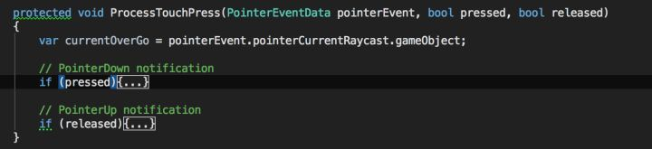

## **为什么想看看事件系统的实现**

很简单，策划又提奇奇怪怪的需求了！比如这些事件要穿透啦，那些事件要做特殊处理啦！之类的……

依旧先贴出源码地址：

[Unity-Technologies / UI - Bitbucketbitbucket.org](https://link.zhihu.com/?target=https%3A//bitbucket.org/Unity-Technologies/ui)

## **入手点**

好那么我们从何处入手呢？当然是我们的EventTrigger了！我们都知道，我们可以通过实现以下接口来实现事件捕捉：

大家都爱用的EventTrigger

具体怎么做我想大家已经明白了，也就是实现上线的接口中的函数，例如我要监听点击事件我就实现一下IPointerClickHandler然后挂在物体上就好了。这个技巧在很早的时候我在雨松的文章第一次看到，那时候也是4.6时期UGUI刚出来的时候发现的。由于和当初的NGUI很像所以被大家广泛使用，但是也会发现如果全部实现了接口但是不实现的话可能会影响上层例如ScrollView的监听，下面我们看下去也可以知道到底是为啥。

## **顺藤摸瓜**

既然我们已经找到了这个宝贝，那我们就可以通过查找引用大法，顺藤摸瓜看看到底是什么地方在调用我们实现的接口。

最后理出来所有事件的入口其实都是放在**EventSystem**当中，而具体处理则是放在了**InputModule**里面。在刚刚Enable的时候会更新输入模块列表，也就是我们可以看到的StandaloneInputModule以及TouchInputModule：

初始化InputModule

Unity自己提供的各种InputModule

在EventSystem的Update当中就会分别调用这些InputModule

EventSystem主循环

首先Tick所有的输入模块，然后选出一个当前在使用的输入模块中的Process进行处理。

EventSystem处理函数

最前面是判断是否处于聚焦状态，其实也就只是应用程序的聚焦状态。其中中间是针对Navigation也就是类似于通过键盘上下左右或者手柄进行UI位置切换的操作。最下面两句才是针对所有的Touch以及Mouse的操作的处理。

## **触摸事件处理**

处理输入事件

首先看看，首先获取Pointer数据，然后对该数据进行处理。

## **首先处理点击事件 ProcessTouchPress**

首先判断是为按下事件还是释放事件

处理点击事件

## 按下的情形

首先找到Raycast找到的对象如果为按下事件，如果按下的对象并不是之前Hover的对象，则触发进入事件。然后就处理PointerDown事件，如果找不到该事件的话就触发PointerClick事件。如果多次点击的话还会增加PointerEventData的clickTime，双击间隔是固定为0.3秒钟。同时保存下拖拽初始状态，如果有相对应的处理方法IInitializePotentialDragHandler的话就一起触发。

## 放开的情形

首先触发PointUp事件。之后寻找PointClick事件，并且触发。如果不存在的话那就查看是否存在Drag事件并且执行，最后再执行PointerExit事件。

## **之后处理Move以及Drag事件**

主要还是触发Enter、Exit以及BeginDrag还有Drag等逻辑，比较业务向也就不再写了。

## **点击事件处理**

写得比Touch更加紧凑，左键中建以及右键的处理都是分开的。而且实现方式与Touch也太像了，所以也就不再赘述了。

## **射线检测**

射线检测绝对是其中非常重要的一个东西，在NGUI中我们都知道事件触发靠射线检测，同样在UGUI中射线检测也是同样的存在。

我们在上面的Touch事件处理的地方会看到这么一段代码：

通过射线raycast来检测我们的射线数据中包含哪些东西。并且取其中的第一个并且进行事件触发。这个数据我们可以具体看RaycastResult这个类：

射线检测的结果

而具体cast的步骤则在下面这个函数中，其实是依次调用所有的Raycaster中的射线检测。

我们会去Raycaster Manager中寻找所有的Raycaster。所有Raycast在Enable的时候就会自动注册到Raycaster Manager中

现在就明白Graphic Raycaster是用来做什么的了吧。当然除了Graphic Raycaster以外还有各种各样的Raycaster:

Unity内部提供的各类Raycaster

我们这里就只着重看一下Graphic Raycaster

## **Graphic Raycaster**

核心方法就是经过重写的Raycaster，这个函数帮助我们检测画布上被射线触发的地方并且返回结果。

其实就是普通的射线检测，无非需要针对多屏幕、以及不同的Block模式进行判断，最终调用的是另外一个Raycast。

找到被射线穿过的Graphic

获得射线所穿过的Graphic，将这些结果逐一加入到Result当中。在放入到Result之前会将这些Graphic根据深度进行排序。当然最终结果的筛选规则会有更多，例如是否在摄像机后面、是否大于最大射线距离等等。最终得到的就是我们最终射线结果。

## **如何执行事件**

## **直接调用事件 ExecuteEvents.Execute**

核心方法为ExecuteEvents.Execute，如果需要触发事件就调用该方法吧！我们需要向其中传3个参数：

- 一个是传递的GameObject，也就是挂载事件的对象。

- 第二个参数则是PointEventData，这个参数最终会传给事件处理函数，通常是UGUI自己对输入进行处理并且输出的。

- 最后一个参数就是一个传入的delegate，用于接收各种EventData，最后经由一个验证函数来获得具体的EventData。

接下来我们就看一下具体是如何针对一个GameObject进行事件调用的：

首先调用GetEventList然后获得具体有哪些Handler，然后逐一进行调用。如果handler的数量大于0则返回true。

我们看一下获取EventList的规则：

其实也只是判断了一下是否为IEventSystemHandler这么简单。

## **向上查找**

在很多地方例如Click事件触发的时候往往不是在该射线检测到的GameObject上，而是会向上查找Handler:

其中核心方法就是**GetEventHandler**，我们看看其中的实现：

获得UGUI会从射线检测到的GameObject开始，不断向上查找，直到根为止，如果找到则返回，如果找不到可以处理的相应事件则直接返回Null。

## **事件链**

除了获取EventHandler这种情形之外，还有触发GameObject树结构中所有挂载事件的物体。这个时候就有了我们上面看到的**ExecuteHierarchy**，它的作用就是调用Hierarchy中所有挂载事件的GameObject。

我们看到，该函数首先获取事件链，然后逐个进行触发，比较重要的就是获取事件链的过程：

从下往上进行遍历，将所有拥有事件的对象通通都调用一遍就是这个事件链的本质。

## **事件触发机制总结**

不同的组件触发事件的方法都不一样，比如我们上面 看到的OnPointDown是用事件链，而PointClick则是使用的向上查找。我们要防止类似于PointClick这类事件，因为如果下层已经实现了该回调则上层回调则再也无法被调用到，因为已经被下层拦截，所以也不要一口气把所有的事件全给重载了，要用的时候再加呗。

## **总结**

总的来说UGUI的事件系统并不复杂，各个部分还是较为清晰的，如果我们的UI编写当中遇到了问题，或者我们要自己魔改一个组件出来都可以通过看源码来进行解决。

了解了其中原理之后就算是事件穿透之类的也完全可以通过源码实现来倒推解决方案，不用到处搜索解决方案了！