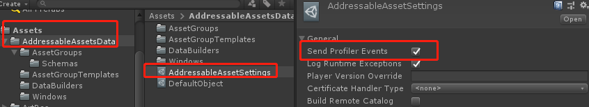
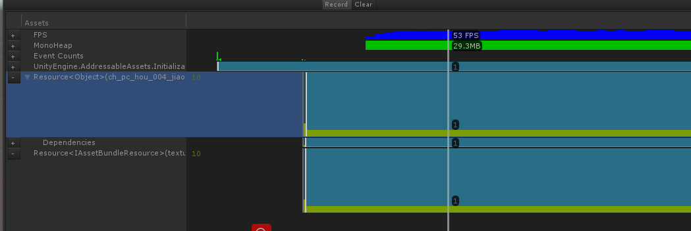

在本文中将详细的描述Addressable对于内存的管理，如果正确的卸载资源

## 镜像资源的加载与卸载

Addressables是否能够正确的清理内存主要的取决于是否正确的进行镜像资源的加载与卸载，而如何做到这点又取决于加载的资源的类型与使用加载的方法。`Addressables.Release`方法可以接受加载到的对象，也可以接受加载时返回的操作句柄(`AsyncOperationHandle`).比如，进行场景创建时，加载后返回一个`AsyncOperationHandle<SceneInstance>`，你可以通过返回的句柄或者`handle.Result`(在这种情况下返回的Result为`SceneInstance`对象)进行场景的的释放。

接下来将详细的描述一下不同资源的释放方式及规则。

## 资源加载

此处的资源指的是使用`Addressables.LoadAssetAsync` 或者 `Addressables.LoadAssetsAsync`加载的资源。
使用上述的两个方法会将资源加载到内存中，但是并不实例化它，每次调用后对应的资源的引用记数都会增加1。如果您使用`LoadAssetAsync`对同一个“地址”的资源调用了3次，您将会得到三个不同的`AsyncOperationHandle`的实例，同时这些实例均引用相同的底层操作，对就应的底层操作的引用记数会变成3。如果资源加载成功，加载到的资源将会被存储到`AsyncOperationHandle.Result`中，您可以使用Unity的方法进行实例化`Object.instantite`，但是这种操作方式不会造成Adressables的引用记数发生变化。

使用`Addressables.Release`方法可以进行卸载，调用后引用记数会减1，一旦资源的引用记数为0，那么它会被彻底的卸载掉。

## 场景加载

可以使用`Addressables.LoadSceneAsync`进行场景的加载，同时可以在参数中指定使用`Single`或者`Additive`模式，如果指定使用`Single`模式，那么当前所在打开的场景都会被关闭。

可以使用`Addressables.UnloadSceneAsync`进行场景的卸载，或者打开新场景时使用`Single`模式。

当想要打开一个新场景时可以使用上述Addressables提供的方法或者使用 `SceneManager.LoadScene`/`SceneManager.LoadSceneAsync`，一个新场景的打开会关闭当前的场景，那么对应的引用记数也会正确的减少。

## GameObject的实例化

GameObject的实例化相对其它的资源有些特殊，在Unity中使用`Resources.Load`其实只是将Prefab的数据加载到了内存中，并未真正的实例化，所以需要再次调用`Object.instantite`才能正确的得到需要的GameObject，在Addressables中也是这样的，不过Addressable提供了一些便利的方法`Addressables.InstantiateAsync`可以直接得到对应的GameObject。

当使用`Addressables.InstantiateAsync`加载一个Prefab时，Addressable会自动实例化，同时在加载的过程中Addressable在加载Prefab的同时也会加载其依赖，将所有的引用记数全部增加。对同一“地址”的资源调用`InstantiateAsync`三次，将会使其依赖的所有资源的引用记数均增加为3.但是与三次调用`LoadAssetAsync`不同的是每次调用`InstantiateAsync`将会得到一个指向同一个操作的`AsyncOperationHandle`,这是因为每一个`InstantiateAsync`都将得到一个唯一的实例。与其它调用方法的另外一个区别在于`InstantiateAsync`有一个可选参数`trackHandle`，如果将其设置为false，在`AsyncOperationHandle`释放前，您必须自己保管着此对象，在此期间您可以执行一些操作。这种方法可以提高效率但是需要更多格外的代码来实现。

关闭实例所在场景或者使用`Addressables.ReleaseInstance`可以卸载掉实例化的对象。

如果您在加载时将`trackHandle`设置为false,那么您只能通过调用`Addressables.ReleaseInstance`并将返回的句柄做为参数，而不能再使用真实的GameObject做为参数进行释放了。

关于`Addressables.ReleaseInstance`格外的说明：如果调用`Addressables.ReleaseInstance`方法来释放一个实例,但是此实例不是由Addressable创建或者说在使用Addressable创建时设置了`trackHandle=false`，此方法调用后将会返回false，以表示Addressable无法释放此实例

使用`Addressables.InstantiateAsync`方法本身会有一些格外的开销，如果您需要实例化同一个对象很多次，比如说一帧内实例化100个，使用此方法就不再合适，可以考虑使用`Addressables.LoadAssetAsync`进行资源的加载，同时自己保存返回的结果，然后再使用`GameObject.Instantiate()`进行实例化，同时当所有的GameObject不再使用后，再通过`Addessables.Release`方法将保存的结果进行释放。使用此种方法虽然可以提高部分性能，但是需要对其增加格外的管理。

使用`Addressables.InstantiateAsync`方法本身会有一些格外的开销，如果您需要实例化同一个对象很多次，比如说一帧内实例化100个，可以考虑使用Addressable进行资源的加载

## Addressable分析工具

通过*Window->Asset Management->Addressable Profiler*可以打开Addressable的分析工具，在使用此工具前需要将配置中的*Send Profiler Events*打开（默认情况下配置文件为Assets/AddressableAssetsData/AddressableAssetSettings)

窗口中显示了Addressable操作的引用记数，包括加载的AssetBundle及加载的资源等等。

-   白色的竖线表示选择的当前的帧

-   蓝色的背景当前加载的资源

-   绿色的部分表示引用记数

## 内存清理时机

即使一个资源的不再被引用也不代表此资源被卸载了，因为一个AssetBundle中可能包含有多个资源，比如：一个名称"stuff"的AssetBundle中包含有三个资源"tree",“tank”,“cow”，当资源"tree”被加载后，能够看到"tree"的引用记录会是1，同时"stuff"的引用记数也是1，接着如果加载了"tank"资源，此时"tree"与"tank"的引用记数均为1，同时"stuff"的记数会是2。接下来卸载资源"tree"，则"tree"的引用记数将会减少为0，在"Addressable Profiler"中对应于"tree"的记录将会被删除，但是此时由于AssetBundle对应的"stuff"并未被卸载，因为还有其它的在使用此AssetBundle。使用AssetBundle时可以从AssetBundle中加载部分内容，但是不能部分卸载AssetBundle，只有AssetBundle中的任何资源都不再被使用时，此AssetBundle才会被卸载

当使用Unity的`Resources.UnloadUnusedAssets` (查看<https://docs.unity3d.com/ScriptReference/Resources.UnloadUnusedAssets.html)时，上述描述中的"tree"将会被卸载掉，但是由于我们无法检测到此操作，所以我们只能反映引用记数的变化，而不是真正内存中内容的变化。>

需要注意的是：使用`Resources.UnloadUnusedAssets`是一个很费时的操作，一般情况下不建议频繁使用，只有在场景切换时进行调用

此段文字有些绕口，简单来说就是由于一个AssetBundle中包含有多个资源，其中的多个资源被加载出来后，只有所有的资源均不再使用时才会正确的卸载掉AssetBundle，同时对于加载出来的资源一般情况下，即使不再使用后也不是立即卸载的，依赖于引擎底层的实现。在Unity中通过使用`Resources.UnloadUnusedAssets`可以将不再使用的资源给卸载掉，但是由于此接口过于耗时，并不推荐频繁使用。可以使用的情况一般有：1 进行场景切换时，2 在某些大资源被销毁时，比如说：某此UI界面占用资源特别多，当此UI界面关闭时可以调用。

### 一些注意点

-   不要想着用异步加载ui..那会很卡..会出现莫名其妙的事情
