C#代码在编写后，是需要执行编译的，才能起效，这样如果在手机端，没有对应的编译环境，那么对应的c#代码就无法实现热更。ILRuntime实现的基础，也是基于AssetBundle的资源热更新方式，将需要热更新的c#代码打包成DLL，在每次完成资源打包后，对应的DLL会被作为资源热更新出去。这样就规避了编译相关的环节，实现了热更。

# AppDomain

我们运行一个.NET应用程序或者一个运行库宿主时，OS会首先建立一个进程，然后会在进程中加载CLR(这个加载一般是通过调用\_CorExeMain或者\_CorBindToRuntimeEx方法来实现)，在加载CLR时会创建一个默认的AppDomain，它是CLR的运行单元，程序的Main方法就是在这里执行，这个默认的AppDomain是唯一且不能被卸载的，当该进程消灭时，默认AppDomain才会随之消失。

一个进程中可以有多个AppDomain，且它们直接是相互隔离的，我们的Assembly是不能单独执行的，它必须被加载到某个AppDomain中，要想**卸载一个Assembly**就只能卸载其AppDomain。

> 无法删除WindowsApplication1: 访问被拒绝
> 请确定磁盘末被写保护
> 而且文件末被使用

除非你关掉作业管理服务器，然后再操作，显然这样做是很不合理的。

并且默认AppDomain是不能被卸载的，那么我们该怎么办呢，我想到的方法是动态的加载Assembly，新建一个AppDomain，让Assembly加载到这个新AppDomain中然后执行，当执行完后卸载这个新的AppDomain即可。核心思想就是：**如果程序集被加载到默认应用程序域中，则当进程运行时将无法从内存中卸载该程序集。但是，如果打开另一个应用程序域来加载和执行程序集，则卸载该应用程序域时也会同时卸载程序集。使用此技术最小化长时间运行的进程的工作集**。

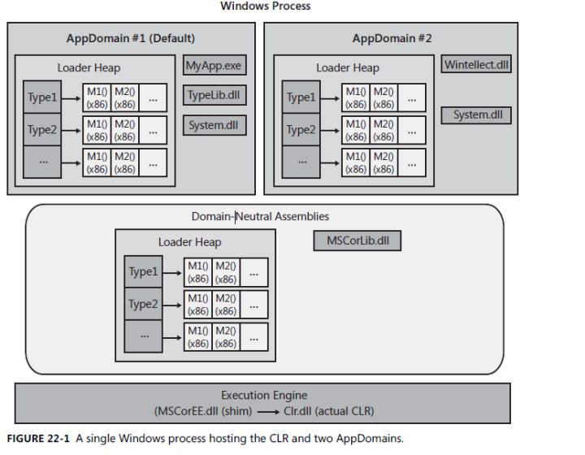

1. AppDomain vs 进程
   AppDomain被创建在进程中，一个进程内可以有多个AppDomain。一个AppDomain只能属于一个进程。

2. AppDomain vs 线程
   其实两者本来没什么好对比的。AppDomain是个静态概念，只是限定了对象的边界；线程是个动态概念，它可以运行在不同的AppDomain。一个AppDomain内可以创建多个线程，但是不能限定这些线程只能在本AppDomain内执行代码。CLR中的System.Threading.Thread对象其实是个soft thread，它并不能被操作系统识别；操作系统能识别的是hard thread。一个soft thread只属于一个AppDomain，穿越AppDomain的是hard thread。当hard thread访问到某个AppDomain时,一个AppDomain就会为之产生一个soft thread。
   hard thread有thread local storage(TLS)，这个存储区被CLR用来存储这个hard thread当前对应AppDomain引用以及softthread引用。当一个hard thread穿越到另外一个AppDomain时，TLS中的这些引用也会改变。
   当然这个说法很可能是和CLR的实现相关的。

3. AppDomain vs Assembly
   Assembly是.Net程序的基本部署单元，它可以为CLR提供用于识别类型的元数据等等。Assembly不能单独执行，它必须被加载到AppDomain中，然后由AppDomain创建程序集中的对象。一个Assembly可以被多个AppDomain加载，一个AppDomain可以加载多个Assembly。每个AppDomain引用到某个类型的时候需要把相应的assembly在各自的AppDomain中初始化。因此，每个AppDomain会单独保持一个类的静态变量。

4. AppDomain vs 对象
   任何对象只能属于一个AppDomain。AppDomain用来隔离对象，不同AppDomain之间的对象必须通过Proxy(reference type)或者Clone(value type)通信。引用类型需要继承System.MarshalByRefObject才能被Marshal/UnMarshal(Proxy)。值类型需要设置Serializable属性才能被Marshal/UnMarshal(Clone)。

5. AppDomain vs Assembly Code
   AppDomain和程序集的源代码是什么关系呢？每个程序集的代码会分别装载到各个AppDomain中？
   首先我们要把程序集分3类
   1\.mscorlib，这是每个.net程序都要引用到的程序集。
   2\.GAC，这个是强命名的公用程序集，可以被所有的.net程序引用。
   3\.Assembly not in GAC，这是普通的assembly，可以不是强命名，不放到GAC中。
   启动CLR，进入entry point时可以设置LoaderOptimization属性：

   ```
   [LoaderOptimization(LoaderOptimization.MultiDomain]
   static void Main()
   {...}
   ```

   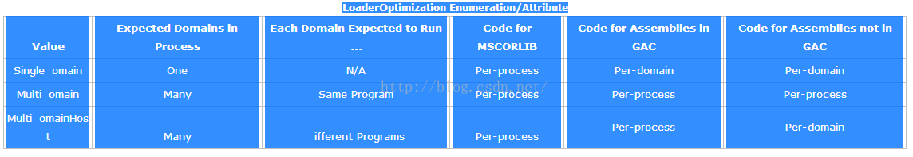

   LoaderOptimization属性可以设置三个不同的枚举值，来设置针对前面说的三种程序集的代码存放以及访问方式。

   - SingleDomain，由于只启动一个AppDomain，那么code就被直接装载到了AppDomain中，访问静态变量更快捷。

   - MultiDomain，所有的Assembly代码是进程级别的，因此所有的AppDomain只访问一份代码。这大大减少了程序占用的内存，但是由于程序集的静态变量仍然在各个AppDomain中，因此代码访问静态变量需要先得到AppDomain的引用再进行转换，速度会受到影响。

   - MultiDomainHost，只有GAC代码是共享的，非GAC的Assembly依然会加载到被使用的AppDomain中，这样提高了静态变量的访问速度，当然也增加了程序占用的内存。

     不管是哪种方式，mscorlib始终是process级别的，即只有一份mscorlib代码在内存中。

# 使用dll进行热更

文章并不是完全的实现热更新,实现的是windows和android平台下，对于dll文件的热更新。对于IOS为什么不能热更新，我们后续会讨论到，先看看安卓和windows下 dll的热更新步骤。

- 新建一个ClassLibrary（类库）的工程，在其中实现对应的类和方法；

- 将该工程导出为DLL；

- 将DLL改为bytes文件，存入Unity工程中的StreamingAssets文件夹下；

- 在工程运行的时候，读取StreamingAssets下的Dll文件，用Assembly.Load(byte\[\] bytes )的方法，将DLL文件读取出来，进而执行相关的操作。这一步的代码为：

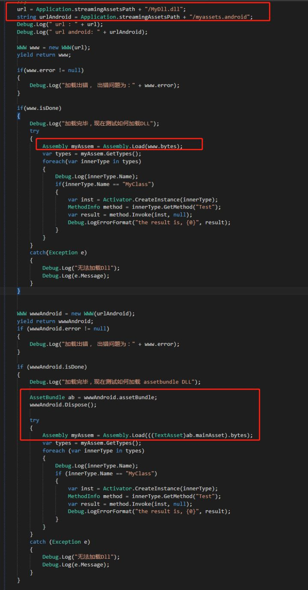

unity工程在执行的时候，会构建一个默认的appDomain，Assembly.Load，其实就是在这个程序域上加载Dll,所以相关的实质和前面一个部分相差不大，这就是c#热更新在unity中的应用(IOS不包括)。

### ios不能基于以上热更的原因

只要我们设定mono的编译模式为full-aot（比如打IOS安装包的时候），则在运行时试图使用JIT编译时，mono自身的JIT编译器就会禁止***生成新的代码***(不要混淆Reflection.Emit和反射)这种行为进而报告这个异常。JIT编译的过程根本还没开始，就被自己扼杀了。

**JIT——just in time，即时编译。**

> 一个程序在它运行的时候创建并且运行了全新的代码，而并非那些最初作为这个程序的一部分保存在硬盘上的固有的代码。就叫JIT。

IOS并非把JIT禁止了。或者换个句式讲，IOS封了内存（或者堆）的可执行权限，相当于变相的封锁了JIT这种编译方式。

# ILRuntime

> ILRuntime借助Mono.Cecil库来读取DLL的PE信息，以及当中类型的所有信息，最终得到方法的IL汇编码，然后通过内置的IL解译执行虚拟机来执行DLL中的代码

### 借助Mono.Ceil库来读取DLL的PE信息以及当中类型的所有信息

这一步是如何实现的，跟随源代码做一个详细的跟踪。

首先，是构建一个全局的appDomain(这儿不是程序域的意思，只是取其名字意思来表示)

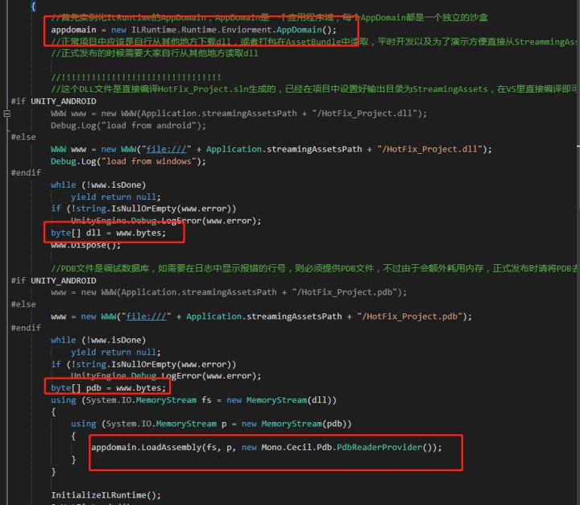

基于WWW的方式加载AssetBundle或者DLL/PDB后，接下来是将其封入到MemoryStream中，将dll和pdb的bytes都存入到内存流中后，执行其内部实现的LoadAssembly方法。

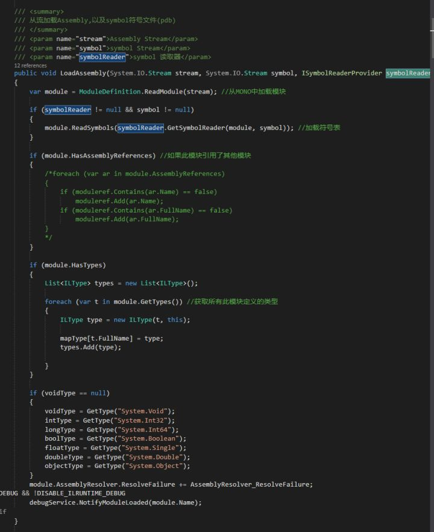

关键的是第一行，从Mono中加载模块：

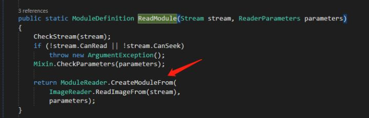

进一步跟踪：

ReadImageFrom的操作：

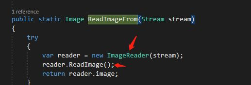

其中ImageReader最终来自BinaryReader:

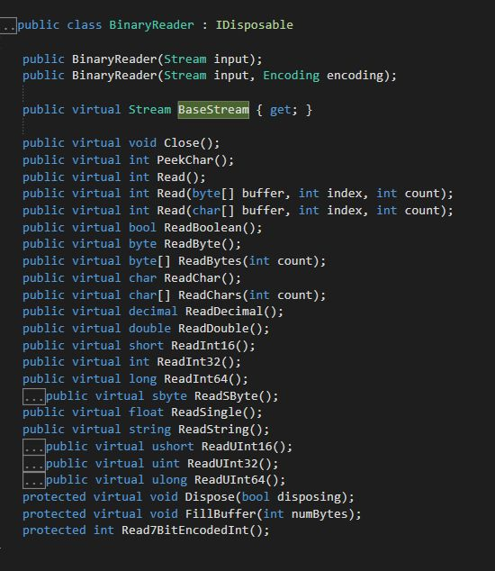

那么接下来的ReadImage操作：

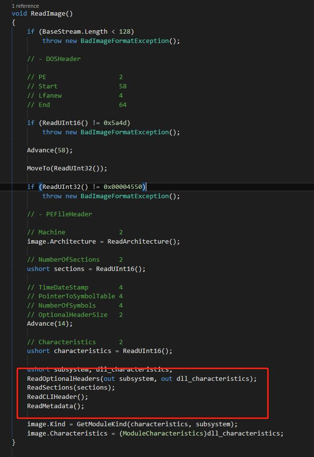

这四个操作，是最核心的操作，分别读取DLL的PE的各个信息，这样我们就进入下一个步骤。

### 最终得到方法的IL汇编码

让我们分拆来看看这几个读取函数的实现

1）ReadOptionalHeaders

主要读取PE的相关信息，不做过多解释，可以参看源码阅读理解；

2）ReadSections

读取分块数据

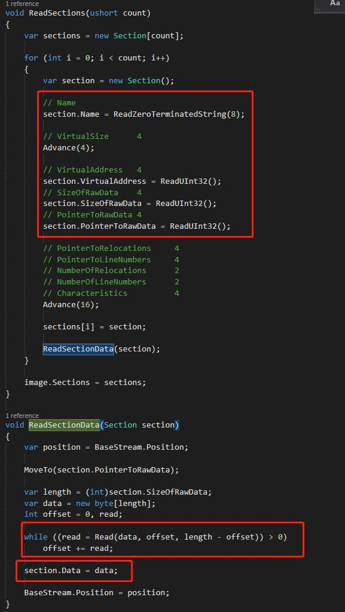

封装一个Section，然后去执行读取，然后赋值给section的Data，注意回退了Index

### ReadCLIHeader

这步比较简单

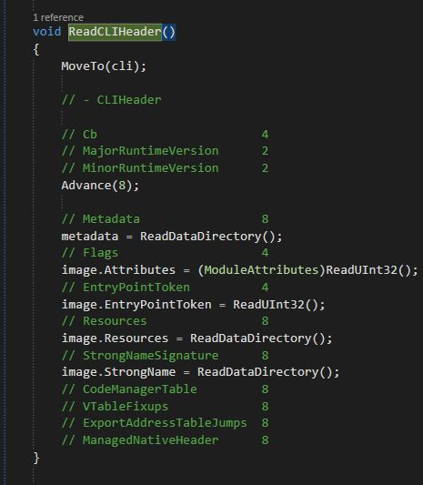

1. ReadMetadata

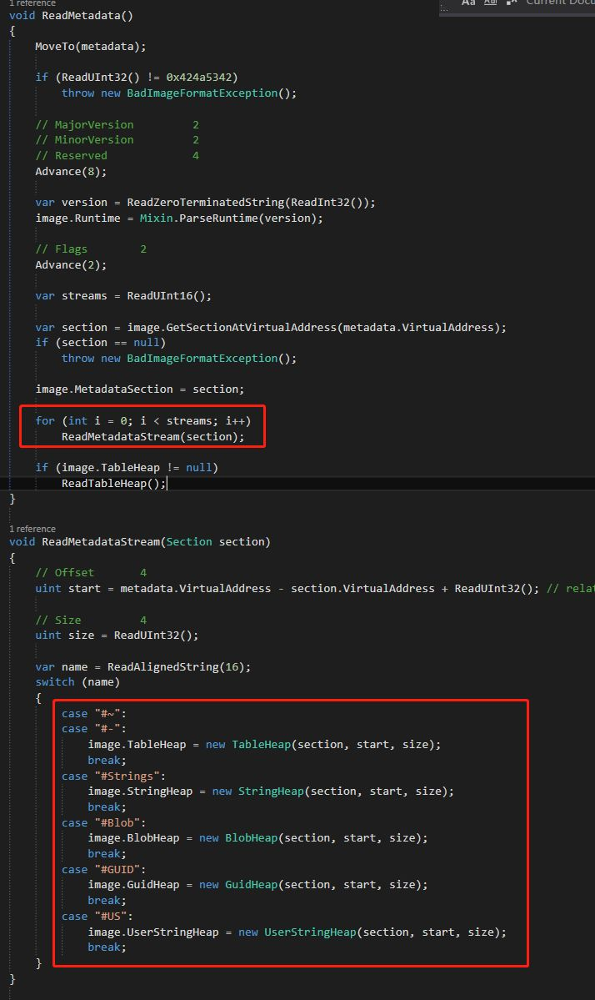

核心是两个操作，一个是ReadMetadataStream，就是根据不同的标识符来新建不同的存储结构；一个是ReadTableHeap:

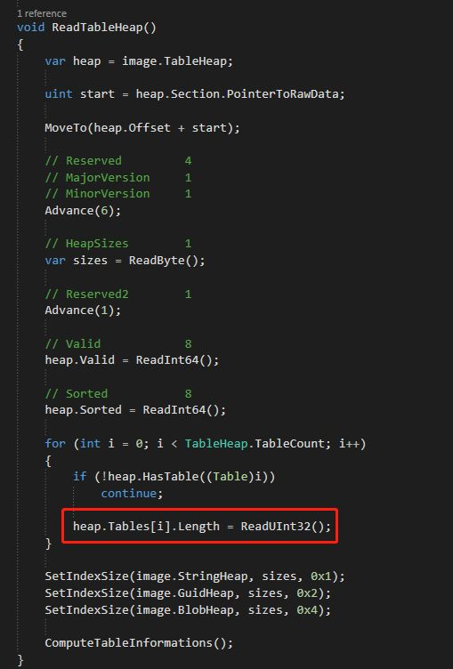

初始化heap中的Table后，进行一次Compute，获取size:

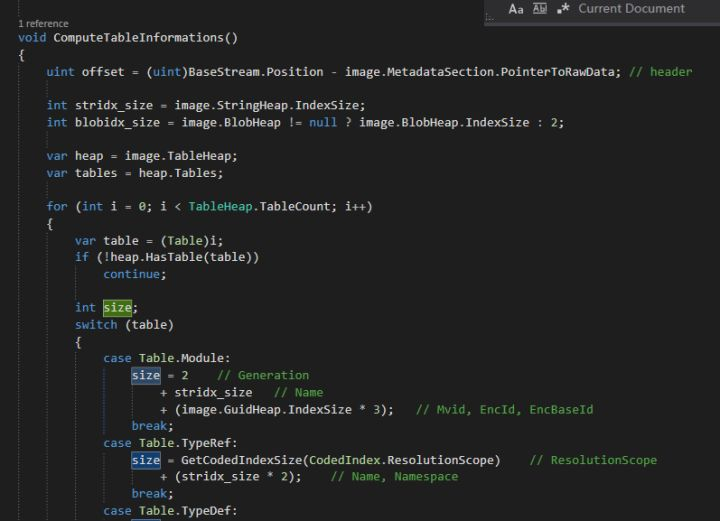

然后填充size:

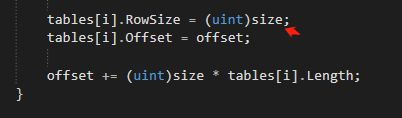

基于这四步操作，我们可以将IL的汇编码存储到Image中，然后进一步执行后续的CreateModule操作:

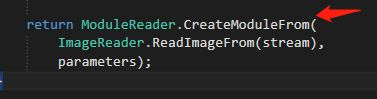

具体到，就是：

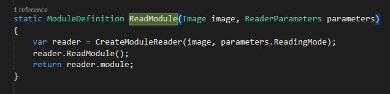

其中的ReadModule为：

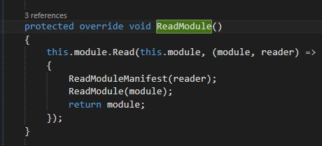

具体的读取manifest和Module内部数据，可以参看源码。

### 基于LoadedTypes来实现反射方法的调用

在ILRuntime中，不能基于System.Type来直接获取热更新DLL中的类，只有基于唯一的appDomain实例，基于LoadedTypes这种来获取热更新中的DLL，基于代码来分析，更为详细：

首先，加载获取该DLL中的指定类：

```
var it = appDomain.LoadedTypes["HotFix_Project.InstanceClass"]
```

跟踪LoadedTypes：

```
public Dictionary<string, IType> LoadedTypes{get{return mapType.InnerDictionary;}}
```

跟踪看mapType.InnerDictionary:

```
ThreadSafeDictionary<string, IType> mapType = new ThreadSafeDictionary<string, IType>();
```

这个mapType是什么时候装配的？

来自于文章二中的LoadAssembly的后续操作：

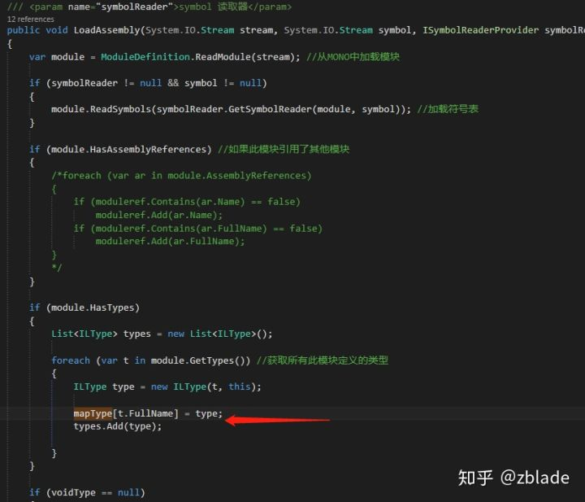

那么这个module.GetTypes是如何操作的？

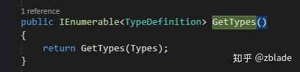

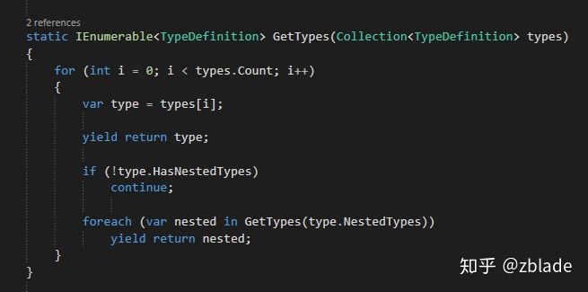

分别基于协程来return type以及其nestedTypes，关键是看Types是怎么获取的：

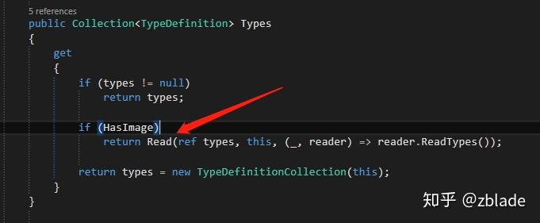

关键是read操作：

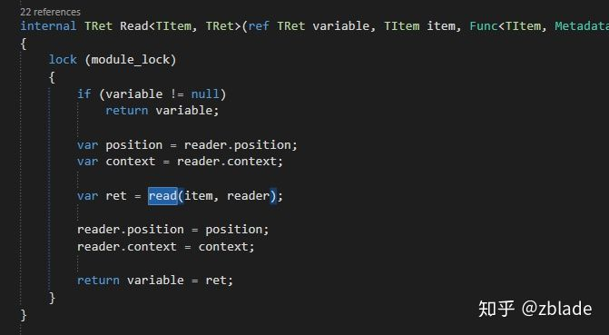

继续跟进Read操作：

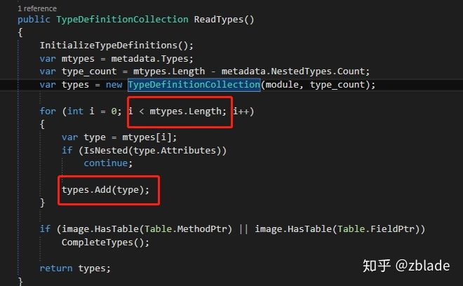

关键是：

```
var mtypes = metadata.Types
```

后续都是对其的封装和填充，对于metadata的填充，来自于InitializeTypeDefinitions这个操作：

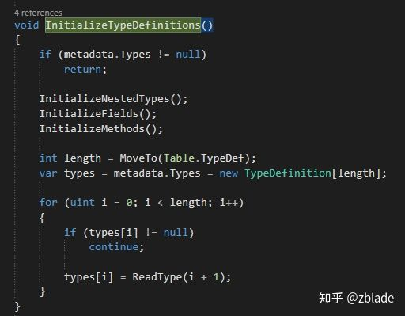

关键操作是ReadType这个操作：

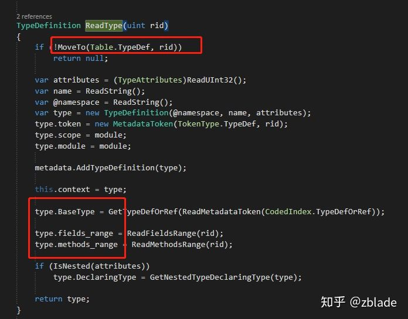

构建一个内部定义的类，然后做数据填充，看看关键的几个属性的设置：BaseType ,设置其父类型，fields*range/methods_range* 是对属性范围和方法范围的设置：

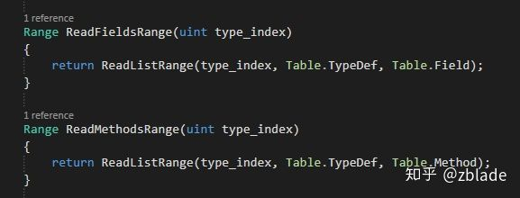

所以基本方法还是ReadListRange:

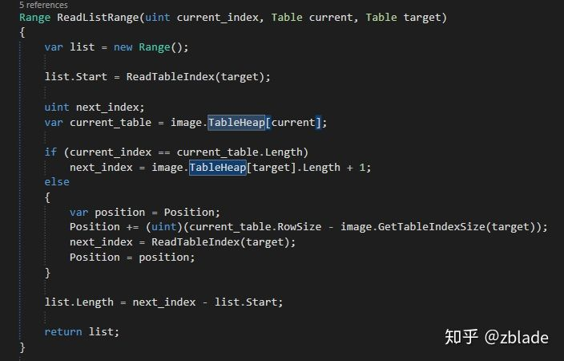

在这儿，我们最终回到了文章二中对于IL虚拟机中的tableHeap的引用，最后实现了和文章二的首尾呼应。

好了，收起思绪，回到最开始的，获取类，这样获得的一个类，这样得到的一个类，继承自IType，在Unity主工程中，则需要System.Type才能继续使用反射接口，其对于的封装来自昱这个ILType封装的ReflectionType， 其中的ILRuntimeType继承自Type类：

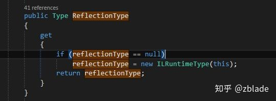

基于其，可以直接调用System.Type的GetConstructor方法，构建实例，归并几个代码，可以表示为（直接使用的实例源代码）：

```
var it = appDomain.LoadedTypes["HotFix_Project.InstanceClass"];
var type = it.ReflectionType;
var ctor = type.GetConstructor(new System.Type[0]);
var obj = ctor.Invoke(null);
```

对应可以得到DLL中该类的构造函数的调用：

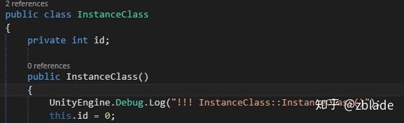

### 基于appDomain内嵌的Invoke来实现反射

在ILRuntime中，在appDomain中内嵌了一套Invoke的实现，可以在Unity工程中直接调用来实现对热更新DLL中类的方法的调用：

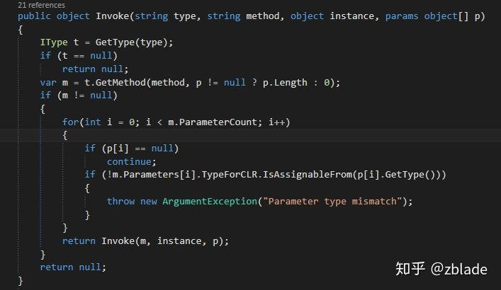

关键操作就是2步： GetType和 GetMethod，获取类型的过程，和前面有点类似，就是对mapType中存储的获取，如果没有，则进行查找和填充，这儿重点说说方法是如何获取的：

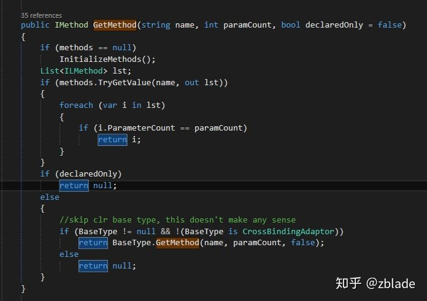

粗看就是从methods中取出来，做相应的检查，如果通过则返回，那么初始化操作看看：

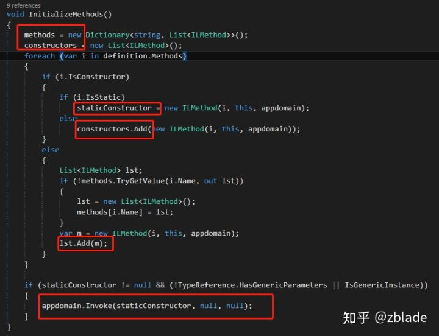

最后还是从definition.Methods中取出，逐个遍历其中的方法做一个分类存储，如果有静态构造函数，且满足对于的参数条件，则执行一次静态构造。

回到开始，在获取到类和方法的相关信息后，就可以执行对于的参数检验，然后执行反射：

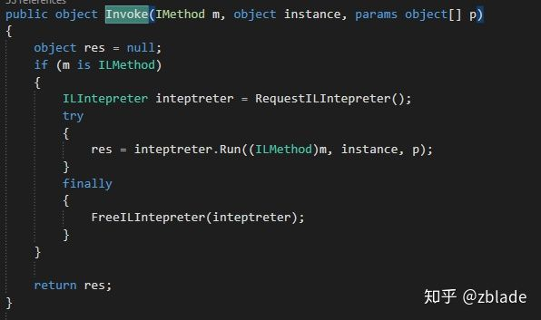

可见，就是获取到一个IL的解释器，然后执行相应的反射，具体Run怎么执行，就不继续深入贴图了，有兴趣的可以持续跟踪（基本思路就是对stack的操作，塞入各个参数，然后执行一次操作，塞入结果，然后退回）

对于ILRuntime的反射基本就先研究到这儿，如果要应用到自己的项目中，可以继续深入研究一下代码，看看实现的具体细节。这儿附上开源的相关文档：

[ILRuntime中的反射](https://link.zhihu.com/?target=https%3A//ourpalm.github.io/ILRuntime/public/v1/guide/reflection.html)

### 热更新DLL和Unity主工程的相互调用

基于前面的反射，我们可以基本理出热更DLL和unity主工程的交互本质: 基于IL虚拟机或者.net本身反射来实现交互，对于热更新DLL，其调用unity主工程，则主要是在热更新工程中添加对于unity工程的Assembly-CSharp的引用：

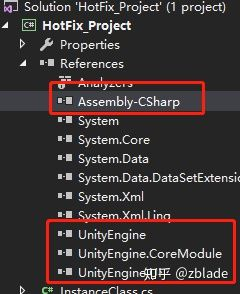

基于这个引用，可以调用其中类的各自方法，举两个类来测试：

一个不继承自MonoBehaviour：

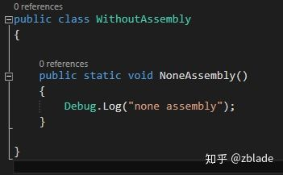

一个继承自MonoBehaviour:

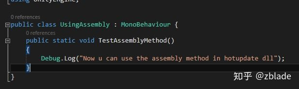

这两个Unity主工程中的类以及其中的方法，在热更新DLL中调用：

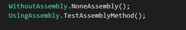

可以在Unity主工程中得到输出：

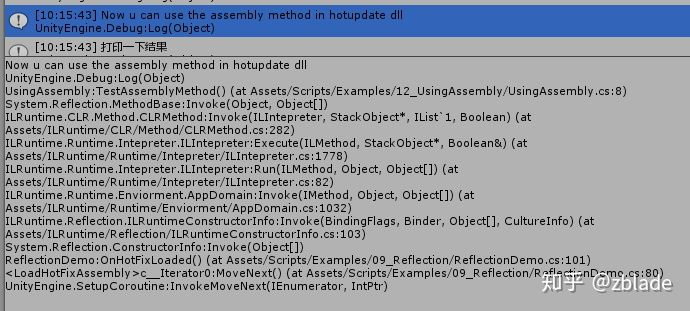

看一下track可以大概了解整个反射的执行过程。

对于Unity执行热更DLL中的调用，就是第一部分的反射实例。

# 热修复HOTFIX

腾讯开源的Unity热更解决方案xLua有一个非常吸引人的特性就是Hotfix，其原理是使用Mono.Cecil库对进行C#层编译出来的dll程序集进行IL代码注入。其作者也在知乎的回答中简单说明了原理：[如何评价腾讯在Unity下的xLua（开源）热更方案？ - 车雄生的回答 - 知乎](https://link.jianshu.com/?t=https://www.zhihu.com/question/54344452/answer/139413144)

> **Mono.Ceil**
>
> 一个可加载并浏览现有程序集并进行动态修改并保存的.NET框架。可以静态注入程序集（注入后生成新的程序集）和动态注入程序集（注入后不改变目标程序集，只在运行时改变程序集行为。可以通过其实现AOP等高级功能

Unity的代码在修改之后会自动编译到Library\\ScriptAssemblies下的两个Assembly中，所以我会尝试着将代码注入到其中。

```
public class Test : MonoBehaviour{

    void Start()
    {
       InjectMod();
    }

    void InjectMod () {
       Debug.Log("Heihei asdasd");
    }
}
```

将Test绑定到场景物体上，运行后我们会发现输出`Heihei asdasd`，就像我们预期的一样。 然后我们尝试着将代码注入到该函数中。

```
private static bool hasGen = false;
[PostProcessBuild(1000)]
private static void OnPostprocessBuildPlayer(BuildTarget buildTarget, string buildPath)
{
   hasGen = false;
}

[PostProcessScene]
public static void TestInjectMothodOnPost()
{
   if (hasGen == true) return;
   hasGen = true;

   TestInjectMothod();
}
[InitializeOnLoadMethod]
public static void TestInjectMothod()
{
   var assembly = AssemblyDefinition.ReadAssembly(@"D:\Documents\Unity5Projects\UnityDllInjector\Library\ScriptAssemblies\Assembly-CSharp.dll");
   var types = assembly.MainModule.GetTypes();
   foreach(var type in types)
   {
      foreach(var Method in type.Methods)
      {
         if(Method.Name == "InjectMod")
         {
            InjectMethod(Method, assembly);
         }
      }
   }
   var writerParameters = new WriterParameters { WriteSymbols = true };
   assembly.Write(@"D:\Documents\Unity5Projects\UnityDllInjector\Library\ScriptAssemblies\Assembly-CSharp.dll", new WriterParameters());
}
```

我们首先看`TestInjectMothod`,这是我们在编辑器下进行注入的函数，这里我们需要注意的是，每当我们修改代码之后我们注入的结果会被覆盖掉，所以我们在每次修改代码之后都需要进行注入，所以我们这里添加了标签：`InitializeOnLoadMethod `这个标签的意思是，当初始化的时候都进行执行，所以编译完成之后就会自动执行。

然后我们看前面两个函数，这两个函数是为了在打包时进行注入而存在的，其中hasGen是为了防止重复注入而定义的flag。

然后我们查看一下我们的注入方法`InjectMethod`,在这个函数中我们可以看到，我们首先将我们所需要的函数导入，然后插入到方法的最前端：

```
private static void InjectMethod(MethodDefinition method, AssemblyDefinition assembly)
{
   var firstIns = method.Body.Instructions.First();
   var worker = method.Body.GetILProcessor();

   //获取Debug.Log方法引用
   var hasPatchRef = assembly.MainModule.Import(
   typeof(Debug).GetMethod("Log", new Type[] { typeof(string) }));
   //插入函数
   var current = InsertBefore(worker, firstIns, worker.Create(OpCodes.Ldstr, "Inject"));
   current = InsertBefore(worker, firstIns, worker.Create(OpCodes.Call, hasPatchRef));
   //计算Offset
   ComputeOffsets(method.Body);
}
/// <summary>
/// 语句前插入Instruction, 并返回当前语句
/// </summary>
private static Instruction InsertBefore(ILProcessor worker, Instruction target, Instruction instruction)
{
   worker.InsertBefore(target, instruction);
   return instruction;
}

/// <summary>
/// 语句后插入Instruction, 并返回当前语句
/// </summary>
private static Instruction InsertAfter(ILProcessor worker, Instruction target, Instruction instruction)
{
   worker.InsertAfter(target, instruction);
   return instruction;
}
//计算注入后的函数偏移值
private static void ComputeOffsets(MethodBody body)
{
   var offset = 0;
   foreach (var instruction in body.Instructions)
   {
      instruction.Offset = offset;
      offset += instruction.GetSize();
   }
}
```

等待编译完成，并且运行程序，我们发现在输出原来的语句之前多了一句“Inject”
可是我们在查看代码的时候并没有发生任何改变，这是因为我们只修改了dll而并非修改源代码。

# 注意

- ILRuntime并没有创建一个Appdomain,只是取其名字意思.始终工作在默认的AppDomain

- ILRuntime中使用Unity项目的委托,需要创建**DelegateAdapter**

- ILRuntime中继承Unity项目中的类,需要实现**继承适配器**

- 通常情况下，如果要从热更DLL中调用Unity主工程或者Unity的接口，是需要通过反射接口来调用的，包括市面上不少其他热更方案，也是通过这种方式来对CLR方接口进行调用的。(反射一个类,然后创建对象,然后保存到runtime中,调用方法也是通过反射)

  但是这种方式有着明显的弊端，最突出的一点就是通过反射来调用接口调用效率会比直接调用低很多，再加上反射传递函数参数时需要使用`object[]`数组，这样不可避免的每次调用都会产生不少GC Alloc。众所周知GC Alloc高意味着在Unity中执行会存在较大的性能问题。

  ILRuntime通过CLR方法绑定机制，可以`选择性`的对经常使用的CLR接口进行直接调用，从而尽可能的消除反射调用开销以及额外的`GC Alloc`

  CLR绑定借助了ILRuntime的CLR重定向机制来实现，因为实质上也是将对CLR方法的反射调用重定向到我们自己定义的方法里面来。

# 相关链接

- <https://docs.microsoft.com/zh-cn/dotnet/framework/app-domains/use>

- <https://www.cnblogs.com/murongxiaopifu/p/4278947.html>

- <https://www.cnblogs.com/murongxiaopifu/p/4211964.html>

- <https://www.cnblogs.com/zblade/p/9100146.html>

- <http://ourpalm.github.io/ILRuntime/public/v1/guide/bind.html>

- <https://www.jianshu.com/p/4bef7f66aefd>